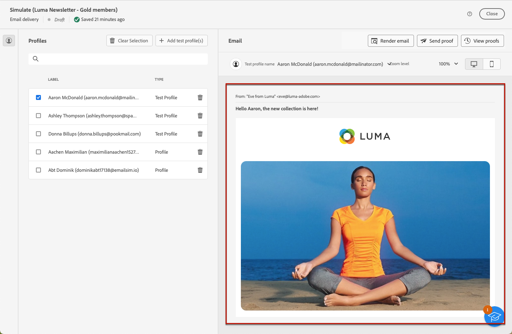

# Anteprima del contenuto della consegna {#preview-content}

Utilizza la funzionalità di simulazione dei contenuti di [!DNL Campaign] per visualizzare in anteprima il contenuto del messaggio prima di inviarlo. Questa consente di controllare la personalizzazione e di verificare come verrà presentata ai destinatari.

Per visualizzare l’anteprima del contenuto della consegna, segui i passaggi indicati di seguito.

1. Passa alla schermata per la modifica del contenuto della consegna.

   <!--email [Edit content](../content/edit-content.md) screen or to the [Email Designer](../content/get-started-email-designer.md).-->

1. Fai clic sul pulsante **[!UICONTROL Simula contenuto]**.

   

1. Per selezionare i profili da utilizzare per l’anteprima dei contenuti personalizzati, utilizza le seguenti opzioni:

   * **[!UICONTROL Aggiungi profili di test]** per visualizzare in anteprima le consegne e-mail e SMS

   * **[!UICONTROL Aggiungi iscritti]** per visualizzare in anteprima le notifiche push

1. Puoi combinare profili di test e profili per visualizzare l’anteprima del messaggio e-mail o SMS.

   * La scheda **[!UICONTROL Profili di test]** contiene tutti gli indirizzi seed, che sono destinatari aggiuntivi e fittizi nel database.

     >[!NOTE]
     >
     >I profili di test possono essere creati nella console [!DNL Campaign] nella cartella **[!UICONTROL Risorse]** > **[!UICONTROL Gestione delle campagne]** > **[!UICONTROL Indirizzi seed]**. Ulteriori informazioni sono disponibili nella [documentazione di Campaign v8 (console)](https://experienceleague.adobe.com/docs/campaign/campaign-v8/audience/add-profiles/test-profiles.html?lang=it){target="_blank"}.

   * La scheda **[!UICONTROL Profili]** elenca tutti i destinatari memorizzati nella cartella **[!UICONTROL Profili e destinazioni]** dalla console di [!DNL Campaign] Ulteriori informazioni sono disponibili nella [documentazione Campaign v8 (console)](https://experienceleague.adobe.com/docs/campaign/campaign-v8/audience/view-profiles.html?lang=it){target="_blank"}.

   

1. Fai clic su **[!UICONTROL Seleziona]** per confermare la selezione.

   Viene visualizzata un’anteprima del contenuto della consegna nel riquadro a destra della schermata **[!UICONTROL Simula]**. Gli elementi personalizzati vengono sostituiti dai dati del profilo selezionato nel riquadro a sinistra.

   

1. Se hai aggiunto più profili, puoi passare da un profilo all’altro nell’elenco per visualizzare in anteprima il contenuto della consegna corrispondente. Puoi anche aggiungere altri profili di test e cancellare la selezione utilizzando i pulsanti corrispondenti nel riquadro a sinistra.

1. Per le consegne e-mail, puoi regolare il **[!UICONTROL Livello zoom]** e visualizzare l’anteprima dei contenuti su un computer desktop o un dispositivo mobile utilizzando l’icona dedicata nell’angolo in alto a destra.

1. Dalla schermata **[!UICONTROL Simula]** puoi anche eseguire le seguenti operazioni:
   * Inviare consegne di test a destinatari specifici per la convalida - [Ulteriori informazioni](test-deliveries.md)
   * Accedere ai registri delle consegne di test inviate - [Ulteriori informazioni](test-deliveries.md#access-proofs)
   * Solo per le e-mail: controllare il rendering del contenuto dei messaggi nei client e-mail più diffusi - [Ulteriori informazioni](email-rendering.md)

