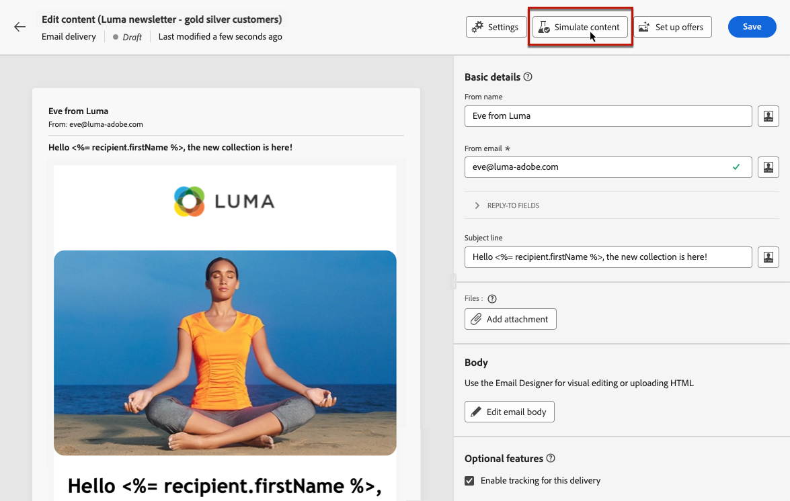

# Visualizzare in anteprima il contenuto del messaggio {#preview-content}

Utilizza la funzionalità di simulazione dei contenuti di [!DNL Campaign] per visualizzare in anteprima il contenuto del messaggio prima di inviarlo. Questa funzione ti consente di controllare la personalizzazione e controllare come il messaggio viene visualizzato ai destinatari.

Per visualizzare in anteprima il contenuto della consegna, segui questi passaggi:

1. Passa alla schermata Modifica contenuto della consegna o alla [E-mail Designer](../email/get-started-email-designer.md).

1. Fai clic sul pulsante **[!UICONTROL Simula contenuto]**.

   {zoomable="yes"}

1. Seleziona i profili da utilizzare per l’anteprima del contenuto. Per eseguire questa azione, fai clic sul pulsante **[!UICONTROL Aggiungi profili di test]** (per e-mail e SMS) o sul pulsante **[!UICONTROL Aggiungi abbonati]** (per le notifiche push).

1. Combina profili e profili di test per visualizzare in anteprima il messaggio e-mail o SMS.

   * La scheda **[!UICONTROL Profili di test]** elenca tutti i profili di test, che sono destinatari aggiuntivi e fittizi nel database. [Scopri come utilizzare i profili di test](../audience/test-profiles.md).

   * Nella scheda **[!UICONTROL Profili]** sono elencati tutti i profili memorizzati nel database. [Scopri come utilizzare i profili](../audience/about-recipients.md).

   {zoomable="yes"}

1. Quando sfoglia il profilo di test o gli elenchi di profili, utilizza i filtri per perfezionare la ricerca. Ad esempio, definisci una regola per trovare tutti i profili di test con lo stato **[!UICONTROL Prospect]**. [Scopri come aggiungere regole utilizzando Query Modeler](../query/query-modeler-overview.md).

   {zoomable="yes"}

1. Fai clic su **[!UICONTROL Seleziona]** per confermare la selezione.

   Nel riquadro a destra della schermata **[!UICONTROL Simula]** viene visualizzata un&#39;anteprima del contenuto della consegna. Gli elementi personalizzati vengono sostituiti dai dati del profilo selezionato nel riquadro a sinistra.

   {zoomable="yes"}

1. Se vengono aggiunti più profili, passa da un profilo all’altro nell’elenco per visualizzare in anteprima il contenuto di consegna corrispondente. Aggiungi altri profili di test o cancella la selezione utilizzando i pulsanti corrispondenti nel riquadro a sinistra.

1. Per le consegne e-mail, regola il **[!UICONTROL Livello di zoom]** e visualizza l&#39;anteprima del contenuto su un desktop o un dispositivo mobile utilizzando l&#39;icona dedicata nell&#39;angolo in alto a destra.

1. Dalla schermata **[!UICONTROL Simula]** è inoltre possibile:
   * Invia bozze a destinatari specifici per la convalida - [Ulteriori informazioni](test-deliveries.md).
   * Accedi ai registri delle bozze inviate - [Ulteriori informazioni](test-deliveries.md#access-test-deliveries).
   * Solo per e-mail, controlla il rendering del contenuto dei messaggi nei client e-mail più diffusi - [Ulteriori informazioni](email-rendering.md).