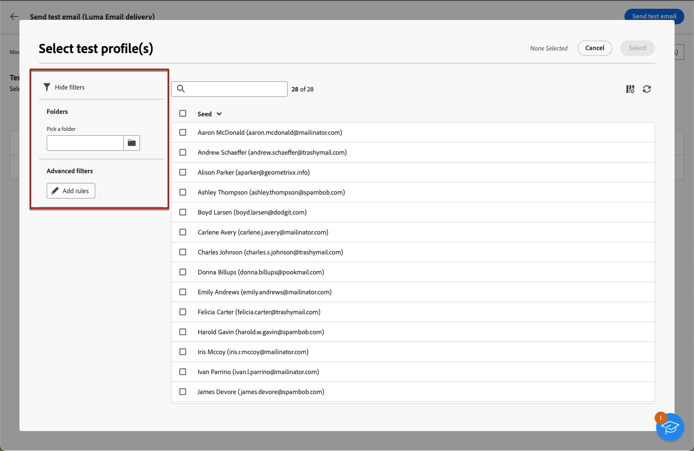

# Inviare consegne di test {#send-test-deliveries}

>[!CONTEXTUALHELP]
>id="acw_email_preview_mode"
>title="Modalità anteprima"
>abstract="Visualizza l’anteprima e verifica il messaggio includendo la popolazione di test nel target principale."

Una volta definito il contenuto del messaggio, puoi visualizzarlo in anteprima e testarlo inviando consegne di test ai profili di test. Se hai incluso contenuti personalizzati, puoi verificare come questi vengono visualizzati nel messaggio utilizzando i dati del profilo di test.

Per rilevare eventuali errori nel contenuto del messaggio o nelle impostazioni di personalizzazione, invia le consegne di test ai profili di test prima di inviarle al pubblico di destinazione. Per convalidare il contenuto più recente, deve essere inviata una consegna di test ogni volta che viene apportata una modifica. L’invio di consegne di test (note anche come &quot;bozze&quot;) è un passaggio importante per convalidare la campagna e identificare potenziali problemi. I destinatari della consegna di prova possono controllare vari elementi, ad esempio collegamenti, collegamenti di rinuncia, immagini o pagine mirror, nonché rilevare eventuali errori nel rendering, nel contenuto, nelle impostazioni di personalizzazione e nella configurazione della consegna.

## Simulare il contenuto con destinatari di test {#simulate-content-test-deliveries}

>[!CONTEXTUALHELP]
>id="acw_email_preview_option_test_target"
>title="Popolazione di test"
>abstract="Seleziona una modalità per la popolazione di test."

Prima di inviare un test, assicurati di definire un pubblico target per la consegna. [Ulteriori informazioni](../audience/add-audience.md)

Per iniziare a testare il contenuto del messaggio:

1. Modifica il contenuto della consegna.
1. Fai clic sul pulsante **[!UICONTROL Simula contenuto]**.
1. Fai clic su **[!UICONTROL Test]** per inviare le consegne di test.

   {zoomable=&quot;yes&quot;}

1. Seleziona i destinatari del test.

   A seconda del canale del messaggio, le consegne di prova possono essere inviate ai seguenti tipi di destinatari:

   * Per gli SMS e le e-mail, puoi utilizzare [profili di test](#test-profiles), che sono destinatari aggiuntivi specifici nel database. [Ulteriori informazioni](../audience/test-profiles.md)

   * Per gli SMS e le e-mail, puoi anche utilizzare [sostituzione dal target principale](#substitution-profiles) modalità, che invia le consegne di test a un indirizzo di test e-mail o a un numero di telefono e utilizza i dati di personalizzazione di un profilo esistente. Questo consente di vivere l’esperienza del messaggio così come verrà ricevuta dai destinatari, con una rappresentazione accurata del contenuto per quello specifico profilo.

   * Per i messaggi push, puoi utilizzare [iscritti](#subscribers), che sono iscritti fittizi aggiunti al database. Vengono creati dalla console di [!DNL Campaign]. Per ulteriori informazioni, consulta la [documentazione di Campaign v8 (console client)](https://experienceleague.adobe.com/docs/campaign/campaign-v8/audience/add-profiles/test-profiles.html?lang=it){target="_blank"}

   Di seguito sono disponibili informazioni dettagliate sulla configurazione di ciascuna modalità.

## Utilizza i profili di test {#test-profiles}

>[!CONTEXTUALHELP]
>id="acw_deliveries_simulate_test_mode"
>title="Target della bozza"
>abstract="Puoi caricare un secondo file come “target della bozza”, se desideri testare la consegna prima di inviarla al target principale."

>[!CONTEXTUALHELP]
>id="acw_deliveries_simulate_test_upload"
>title="Carica profili"
>abstract="Puoi caricare un secondo file con profili aggiuntivi se desideri testare la consegna con un set diverso da quello utilizzato per il target principale."

>[!CONTEXTUALHELP]
>id="acw_deliveries_simulate_test_sample"
>title="File modello"
>abstract="La formattazione del file deve essere uguale a quella del file originale. Formati di file supportati: txt, csv. Dimensione massima del file: 15 MB. Utilizza la prima riga come intestazione di colonna."

>[!CONTEXTUALHELP]
>id="acw_sms_preview_option_app_target"
>title="Includi i profili di test nel pubblico principale"
>abstract="Abilita questa opzione per inviare anche il messaggio finale ai destinatari della consegna di test."

I profili di test sono indirizzi seed, che sono destinatari aggiuntivi nel database. Possono essere create dalla **[!UICONTROL Gestione clienti]** > **[!UICONTROL Profili]** menu. [Ulteriori informazioni](../audience/test-profiles.md#create-test-profiles)

Di seguito sono riportati i passaggi per inviare le consegne di test agli indirizzi di seed.

1. Dal contenuto della consegna, fai clic sul pulsante **[!UICONTROL Simula contenuto]** e **[!UICONTROL Test]**.

1. Dall’elenco a discesa **[!UICONTROL Modalità]**, scegli **[!UICONTROL Profili di test]** per eseguire il targeting di destinatari fittizi che riceveranno la consegna e-mail o SMS di test.

   {zoomable=&quot;yes&quot;}

   >[!NOTE]
   >
   >I profili di test vengono creati da **[!UICONTROL Gestione clienti]** > **[!UICONTROL Profili]** menu. Scopri come crearli e gestirli in [questa sezione](../audience/test-profiles.md#create-test-profiles).

1. Se hai già selezionato dei profili per [visualizzare l’anteprima del messaggio](preview-content.md) nella schermata di simulazione del contenuto, questi vengono preselezionati come destinatari del test. Puoi cancellare la selezione e/o aggiungere altri destinatari utilizzando il pulsante **[!UICONTROL Aggiungi profili di test]**.

1. Quando esplori il profilo di test o gli elenchi di profili, puoi utilizzare i filtri per perfezionare la ricerca.

   {zoomable=&quot;yes&quot;}

   Ad esempio, puoi definire una regola per trovare tutti i profili di test con **[!UICONTROL Potenziale cliente]** stato. Scopri come aggiungere regole utilizzando [query modeler](../query/query-modeler-overview.md).

1. Per inviare il messaggio finale anche ai destinatari della consegna di test, seleziona l’opzione **[!UICONTROL Includi la popolazione di test nel target principale]**.

   {zoomable=&quot;yes&quot;}

1. Una volta selezionati i profili di test, puoi [inviare la consegna di test](#send-test).

## Sostituire i dati del profilo {#substitution-profiles}

Utilizza la sostituzione del profilo per inviare le consegne di test a un indirizzo e-mail o a un numero di telefono specifico, durante la visualizzazione dei dati da un profilo esistente di [!DNL Adobe Campaign] database. Puoi selezionare questa modalità solo se il pubblico della consegna è stato definito.

Per sostituire i dati di profilo dal target principale, segui i passaggi seguenti:

1. Dal contenuto della consegna, fai clic sul pulsante **[!UICONTROL Simula contenuto]** e sul pulsante **[!UICONTROL Test]**.

1. Dall’elenco a discesa **[!UICONTROL Modalità]**, scegli **[!UICONTROL Sostituisci dal target principale]** per inviare un test a un indirizzo e-mail o a un numero di telefono specifico durante la visualizzazione dei dati da un profilo esistente.

   >[!CAUTION]
   >
   >Se non hai selezionato un [pubblico](../audience/about-recipients.md) per la consegna, l’opzione **[!UICONTROL Sostituisci dal target principale]** sarà disattivata e non sarà possibile selezionare profili di sostituzione.

1. Fai clic sul pulsante **[!UICONTROL Aggiungi indirizzo]** e specifica l’indirizzo e-mail o il numero di telefono che riceverà la consegna di test.

   {zoomable=&quot;yes&quot;}

   >[!NOTE]
   >
   >Puoi inserire qualsiasi indirizzo e-mail o numero di telefono. Questo consente di inviare consegne di test a qualsiasi destinatario, anche se non è utente di [!DNL Adobe Campaign].

1. Seleziona il profilo dal target definito per la consegna da utilizzare come sostituto. Puoi anche consentire ad [!DNL Adobe Campaign] di selezionare un profilo casuale dal target. I dati del profilo dal profilo selezionato verranno visualizzati nella consegna di test.

1. Conferma il destinatario e ripeti l’operazione per aggiungere tutti gli indirizzi e-mail o i numeri di telefono necessari.

   {zoomable=&quot;yes&quot;}

1. Per inviare il messaggio finale anche ai destinatari della consegna di test, seleziona l’opzione **[!UICONTROL Includi la popolazione di test nel target principale]**.

1. Una volta selezionati i profili di sostituzione, puoi [inviare la consegna di test](#send-test).

## Inviare test agli abbonati all’app {#subscribers}

Quando si progettano le notifiche push, le consegne di test possono essere inviate solo agli utenti abbonati che usano l’app. Per selezionarli, segui questi passaggi.

1. Dal contenuto della consegna push, fai clic sul pulsante **[!UICONTROL Simula contenuto]** e sul pulsante **[!UICONTROL Test]**.

   {zoomable=&quot;yes&quot;}

1. Se hai già selezionato degli abbonati per [visualizzare l’anteprima della consegna](preview-content.md) nella schermata di simulazione del contenuto, questi profili vengono preselezionati come abbonati a scopo di test.

   Puoi cancellare la selezione e/o aggiungere altri abbonati utilizzando il pulsante dedicato.

   {zoomable=&quot;yes&quot;}

1. Per inviare la notifica push finale anche agli abbondati a scopo di test, seleziona l’opzione **[!UICONTROL Includi la popolazione di test nel target principale]**.

1. Una volta selezionati gli iscritti, puoi [inviare la consegna di test](#send-test).

## Inviare la consegna di test {#send-test}

Per inviare la consegna di test ai destinatari selezionati, segui i passaggi indicati di seguito.

1. Fai clic sul pulsante **[!UICONTROL Invia test]**

1. Conferma l’invio.

   {zoomable=&quot;yes&quot;}

1. Invia tutti i test necessari fino a quando non avrai finalizzato il contenuto della consegna.

Al termine, puoi preparare la consegna e inviarla al target principale. Scopri come nelle sezioni dedicate di seguito:

* [Inviare l’e-mail](../monitor/prepare-send.md)
* [Inviare la notifica push](../push/send-push.md#send-push)
* [Inviare la consegna SMS](../sms/send-sms.md#send-sms)

## Accedere alle consegne di test inviate {#access-test-deliveries}

Una volta inviate le consegne di test, puoi accedere ai registri dedicati mediante il pulsante **[!UICONTROL Visualizza registro di test]**.

Questi registri consentono di accedere a tutti i test inviati per la consegna selezionata e di visualizzare specifiche statistiche relative all’invio. [Scopri come monitorare i registri di consegna](../monitor/delivery-logs.md)

{zoomable=&quot;yes&quot;}

Puoi anche accedere ai test inviati da [elenco di consegna](../msg/gs-messages.md), come qualsiasi consegna.

{zoomable=&quot;yes&quot;}
