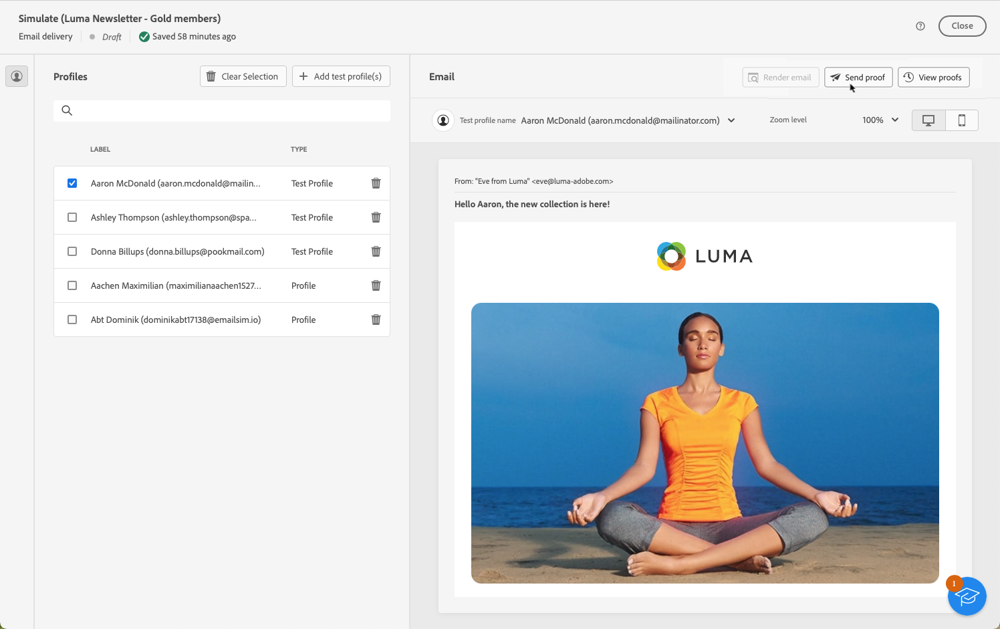
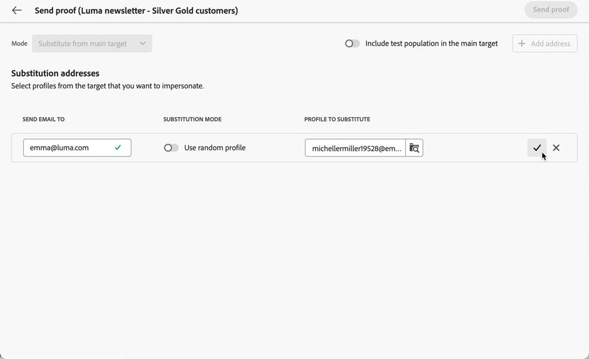

# Inviare consegne di prova {#send-test-deliveries}

>[!CONTEXTUALHELP]
>id="acw_email_preview_mode"
>title="Modalità anteprima"
>abstract="Visualizza l’anteprima e verifica il messaggio includendo la popolazione di test nel target principale."

**[!UICONTROL Adobe Campaign]** consente di testare un messaggio prima di inviarlo al pubblico principale.

L’invio di consegne di test (precedentemente note come &quot;bozze&quot;) è un passaggio importante per convalidare la campagna e identificare potenziali problemi.

I destinatari di un test possono controllare vari elementi come collegamenti, collegamenti di rinuncia, immagini o pagine mirror, nonché rilevare eventuali errori nel rendering, nel contenuto, nelle impostazioni di personalizzazione e nella configurazione della consegna.

## Selezionare i destinatari del test {#test-recipients}

>[!CONTEXTUALHELP]
>id="acw_email_preview_option_test_target"
>title="Popolazione di test"
>abstract="Seleziona una modalità per la popolazione di test."

In base al canale utilizzato, i messaggi di prova possono essere inviati a tre tipi di destinatari:

* [Profili di test](#test-profiles) - Invia **verifica e-mail e SMS** agli indirizzi seed, che sono destinatari aggiuntivi e fittizi nel database.

  Possono essere creati nella console [!DNL Campaign] nella cartella **[!UICONTROL Risorse]** > **[!UICONTROL Gestione delle campagne]** > **[!UICONTROL Indirizzi seed]**. Ulteriori informazioni sono disponibili nella documentazione[Campaign v8 (console)](https://experienceleague.adobe.com/docs/campaign/campaign-v8/audience/add-profiles/test-profiles.html?lang=it){target="_blank"}

* [Sostituisci dal target principale](#substitution-profiles) - Invia **verifica e-mail e SMS** a uno specifico indirizzo e-mail o numero di telefono mentre si impersona un profilo esistente.

  Questo consente di avere l’esperienza del messaggio come farebbero i destinatari, fornendo una rappresentazione accurata del contenuto che verrà ricevuto dal profilo.

* [Abbonati](#subscribers) - Invia **test delle notifiche push** agli abbonati fittizi aggiunti al database.

  Proprio come i profili di test, è possibile crearli in [!DNL Campaign] console in **[!UICONTROL Risorse]** > **[!UICONTROL Campaign Management]** > **[!UICONTROL Indirizzi seed]** cartella. Ulteriori informazioni sono disponibili nella documentazione[Campaign v8 (console)](https://experienceleague.adobe.com/docs/campaign/campaign-v8/audience/add-profiles/test-profiles.html?lang=it){target="_blank"}

Per selezionare i destinatari di una consegna di test, segui i passaggi seguenti in base al tipo di profili che desideri utilizzare.

### Profili di test {#test-profiles}

1. Passa alla schermata di modifica del contenuto dell’e-mail o dell’SMS di consegna, quindi fai clic su **[!UICONTROL Simula contenuto]** pulsante.

1. Fai clic sul pulsante **[!UICONTROL Test]**

   >[!NOTE]
   >
   >Se hai già selezionato i profili da [visualizzare l’anteprima della consegna](preview-content.md), sono elencati nel riquadro a sinistra.

   

1. Dalla sezione **[!UICONTROL Modalità]** elenco a discesa, scegliere **[!UICONTROL Profili di test]** per eseguire il targeting di destinatari fittizi che riceveranno l’e-mail di test o l’SMS di consegna.

   

1. Se hai già selezionato i profili da [visualizzare l’anteprima del messaggio](preview-content.md) nella schermata di simulazione del contenuto, tali profili vengono preselezionati come destinatari del test. Puoi cancellare la selezione e/o aggiungere altri destinatari utilizzando **[!UICONTROL Aggiungi profili di test]** pulsante.

   >[!NOTE]
   >
   >Per impostazione predefinita, viene selezionata la modalità **[!UICONTROL Utilizza profili di test]**.

1. Per inviare anche il messaggio finale ai destinatari della consegna di test, seleziona la **[!UICONTROL Includi la popolazione di test nel target principale]** opzione.

1. Una volta selezionati i profili di test, puoi [inviare la consegna del test](#send-test).

### Profili di sostituzione {#substitution-profiles}

Per inviare un messaggio e-mail o un SMS di prova a un indirizzo e-mail o a un numero di telefono specifico durante la visualizzazione dei dati da un profilo esistente di [!DNL Campaign] database, utilizzare profili di sostituzione.

1. Prima di inviare un test, assicurati di definire un pubblico per la consegna. [Ulteriori informazioni](../audience/about-audiences.md)

1. Passa alla schermata di modifica del contenuto dell’e-mail o dell’SMS di consegna, quindi fai clic su **[!UICONTROL Simula contenuto]** pulsante.

1. Fai clic sul pulsante **[!UICONTROL Test]**

   

1. Dalla sezione **[!UICONTROL Modalità]** elenco a discesa, scegliere **[!UICONTROL Sostituisci dal target principale]** per inviare un test a un indirizzo e-mail o a un numero di telefono specifico durante la visualizzazione dei dati da un profilo esistente.

   >[!CAUTION]
   >
   >Se non hai selezionato un’ [pubblico](../audience/about-audiences.md) per la consegna, **[!UICONTROL Sostituisci dal target principale]** L&#39;opzione sarà disattivata e non sarà possibile selezionare profili di sostituzione.

1. Fai clic su **[!UICONTROL Aggiungi indirizzo]** e specifica l’indirizzo e-mail o il numero di telefono che riceverà la consegna del test.

   

   >[!NOTE]
   >
   >Puoi immettere qualsiasi indirizzo e-mail o numero di telefono. Ciò ti consente di inviare consegne di test a qualsiasi destinatario, anche se non è utente di [!DNL Adobe Campaign].

1. Selezionare il profilo dal database da utilizzare come sostituto. Puoi anche consentire [!DNL Adobe Campaign] selezionare un profilo casuale. I dati del profilo dal profilo selezionato verranno visualizzati nella consegna del test.

1. Conferma il destinatario e ripeti l’operazione per aggiungere tutti gli indirizzi e-mail o i numeri di telefono necessari.

   

1. Per inviare anche il messaggio finale ai destinatari della consegna di test, seleziona la **[!UICONTROL Includi la popolazione di test nel target principale]** opzione.

1. Una volta selezionati i profili di sostituzione, puoi [inviare la consegna del test](#send-test).

### Abbonati {#subscribers}

Quando si utilizzano le notifiche push, le consegne di test possono essere inviate solo agli abbonati. Per selezionarli, attieniti alla procedura seguente.

1. Passa alla schermata di modifica del contenuto della consegna, quindi fai clic sul pulsante **[!UICONTROL Simula contenuto]** pulsante.

1. Fai clic sul pulsante **[!UICONTROL Test]**

   

1. Se hai già selezionato abbonati a [visualizzare in anteprima la consegna](preview-content.md) nella schermata di simulazione del contenuto, tali profili vengono preselezionati come abbonati al test.

   Puoi cancellare la selezione e/o aggiungere altri abbonati utilizzando il pulsante dedicato.

   

1. Per inviare anche la notifica push finale agli abbonati al test, seleziona la **[!UICONTROL Includi la popolazione di test nel target principale]** opzione.

1. Una volta selezionati gli abbonati, puoi [inviare la consegna del test](#send-test).

## Inviare la consegna del test {#send-test}

Per inviare la consegna del test ai destinatari selezionati, segui i passaggi seguenti.

1. Fai clic su **[!UICONTROL Invia test]** pulsante.

1. Conferma l’invio.

   

1. Invia tutti i test necessari fino a quando non avrai finalizzato il contenuto della consegna.

Al termine, puoi preparare e inviare la consegna al target principale. Scopri come nelle sezioni dedicate di seguito:

* [Inviare l’e-mail](../monitor/prepare-send.md)
* [Inviare una notifica push](../push/send-push.md#send-push)
* [Inviare la consegna SMS](../sms/send-sms.md#send-sms)

## Accedere alle consegne di test inviate {#access-proofs}

Una volta inviate le consegne di test, puoi accedere ai registri dedicati dall’ **[!UICONTROL Visualizza registro di test]** pulsante.

Questi registri ti consentono di accedere a tutti i test inviati per la consegna selezionata e di visualizzare statistiche specifiche relative al loro invio. [Scopri come monitorare i registri di consegna](../monitor/delivery-logs.md)

Puoi anche accedere ai test inviati da [elenco consegne](../msg/gs-messages.md), come qualsiasi consegna.

