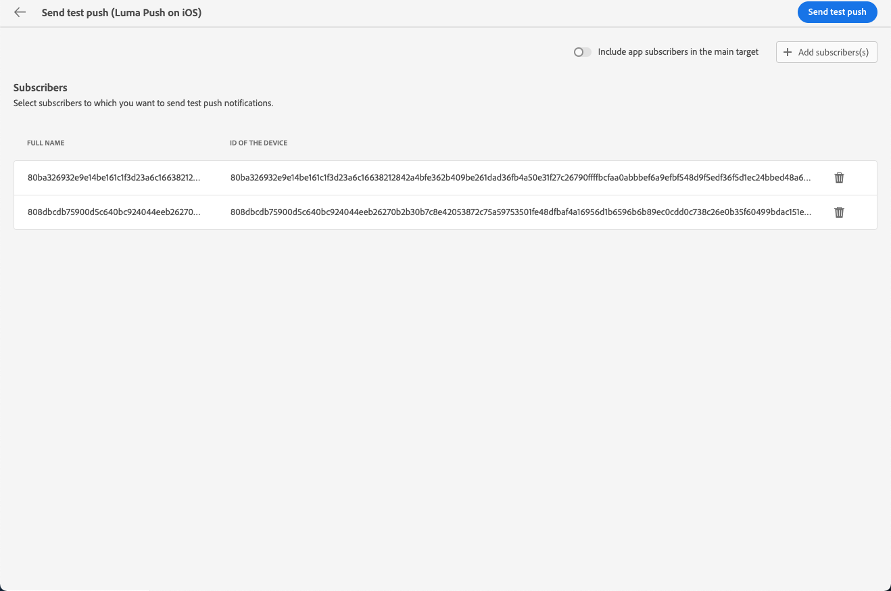

# Inviare bozze {#send-test-deliveries}

>[!CONTEXTUALHELP]
>id="acw_email_preview_mode"
>title="Modalità anteprima"
>abstract="Visualizza l’anteprima e verifica il messaggio includendo la popolazione di test nel target principale."

Una volta definito il contenuto del messaggio, puoi visualizzarne l’anteprima e il test inviando delle bozze ai profili di test. Se hai incluso contenuti personalizzati, puoi verificare come questi vengono visualizzati nel messaggio utilizzando i dati del profilo di test.

Per rilevare eventuali errori nel contenuto del messaggio o nelle impostazioni di personalizzazione, invia bozze ai profili di test prima di inviarli al pubblico di destinazione. Per convalidare il contenuto più recente, a ogni modifica deve essere inviata una bozza. L’invio di bozze è un passaggio importante per convalidare la campagna e identificare potenziali problemi. I destinatari della bozza possono controllare vari elementi, ad esempio collegamenti, collegamenti di rinuncia, immagini o pagine mirror, nonché rilevare eventuali errori nel rendering, nel contenuto, nelle impostazioni di personalizzazione e nella configurazione della consegna.

## Simulare il contenuto con profili di test {#simulate-content-test-deliveries}

>[!CONTEXTUALHELP]
>id="acw_email_preview_option_test_target"
>title="Popolazione di test"
>abstract="Seleziona una modalità per la popolazione di test."

Prima di inviare una bozza, assicurati di definire un pubblico target per la consegna. [Ulteriori informazioni](../audience/add-audience.md)

Per iniziare a testare il contenuto del messaggio:

1. Modifica il contenuto della consegna.
1. Fai clic sul pulsante **[!UICONTROL Simula contenuto]**.
1. Fai clic sul pulsante **[!UICONTROL Invia bozza]** per inviare le bozze.

   {zoomable="yes"}

1. Seleziona i destinatari della bozza.

   A seconda del canale del messaggio, le bozze possono essere inviate ai seguenti tipi di destinatari:

   * Per gli SMS e le e-mail, puoi utilizzare [profili di test](#test-profiles), che sono destinatari aggiuntivi specifici nel database. Puoi anche utilizzare la modalità [sostituzione dalla destinazione principale](#substitution-profiles), che invia la bozza a un indirizzo di prova e-mail o a un numero di telefono e utilizza i dati di personalizzazione di un profilo esistente. Questo consente di vivere l’esperienza del messaggio così come verrà ricevuta dai destinatari, con una rappresentazione accurata del contenuto per quello specifico profilo.

   * Per i messaggi push, puoi utilizzare [iscritti](#subscribers), che sono iscritti fittizi aggiunti al database. Vengono creati dalla console di [!DNL Campaign]. Ulteriori informazioni nella [documentazione di Campaign v8 (console client)](https://experienceleague.adobe.com/docs/campaign/campaign-v8/audience/add-profiles/test-profiles.html?lang=it){target="_blank"}

   Di seguito sono disponibili informazioni dettagliate sulla configurazione di ciascuna modalità.

## Utilizza i profili di test {#test-profiles}

>[!CONTEXTUALHELP]
>id="acw_deliveries_simulate_test_mode"
>title="Target della bozza"
>abstract="Puoi caricare un secondo file come “target della bozza”, se desideri testare la consegna prima di inviarla al target principale."

>[!CONTEXTUALHELP]
>id="acw_deliveries_simulate_test_upload"
>title="Carica profili"
>abstract="Puoi caricare un secondo file con profili aggiuntivi se desideri testare la consegna con un set diverso da quello utilizzato per il target principale."

>[!CONTEXTUALHELP]
>id="acw_deliveries_simulate_test_sample"
>title="File modello"
>abstract="La formattazione del file deve essere uguale a quella del file originale. Formati di file supportati: txt, csv. Dimensione massima del file: 15 MB. Utilizza la prima riga come intestazione di colonna."

>[!CONTEXTUALHELP]
>id="acw_sms_preview_option_app_target"
>title="Includi i profili di test nel pubblico principale"
>abstract="Abilita questa opzione per inviare anche il messaggio finale ai destinatari della bozza."

I profili di test sono destinatari aggiuntivi nel database. Vengono creati dal menu **[!UICONTROL Gestione clienti]** > **[!UICONTROL Profili]**. [Ulteriori informazioni](../audience/test-profiles.md#create-test-profiles)

I passaggi per inviare bozze ai profili di test sono descritti di seguito.

1. Dal contenuto della consegna, fai clic sul pulsante **[!UICONTROL Simula contenuto]** e sul pulsante **[!UICONTROL Invia bozza]**.

1. Dall&#39;elenco a discesa **[!UICONTROL Modalità]**, scegli **[!UICONTROL Profili di test]** per eseguire il targeting di destinatari fittizi che riceveranno la bozza o la consegna SMS.

   {zoomable="yes"}

1. Se hai già selezionato profili per [visualizzare l&#39;anteprima del messaggio](preview-content.md) nella schermata di simulazione del contenuto, tali profili vengono preselezionati come destinatari delle bozze. Puoi cancellare la selezione e/o aggiungere altri destinatari utilizzando il pulsante **[!UICONTROL Aggiungi profili di test]**.

1. Quando esplori il profilo di test o gli elenchi di profili, puoi utilizzare i filtri per perfezionare la ricerca. Ad esempio, puoi definire una regola per trovare tutti i profili di test con lo stato **[!UICONTROL Prospect]**. Scopri come aggiungere regole utilizzando [modeler query](../query/query-modeler-overview.md).

   {zoomable="yes"}

1. Per inviare il messaggio finale anche ai destinatari della bozza, selezionare l&#39;opzione **[!UICONTROL Includi gruppo di test nel target principale]**.

   {zoomable="yes"}

1. Una volta selezionati i profili di test, puoi [inviare la bozza](#send-test).

## Sostituire i dati del profilo {#substitution-profiles}

Utilizza la sostituzione del profilo per inviare bozze a un indirizzo e-mail o a un numero di telefono specifico, mentre i dati visualizzati nel messaggio corrispondono a quelli di un profilo esistente del database di [!DNL Adobe Campaign]. Puoi selezionare questa modalità solo se è definito il pubblico della consegna.

Per sostituire i dati di profilo dal target principale, segui i passaggi seguenti:

1. Dal contenuto della consegna, fai clic sul pulsante **[!UICONTROL Simula contenuto]** e sul pulsante **[!UICONTROL Invia bozza]**.

1. Dall&#39;elenco a discesa **[!UICONTROL Modalità]**, scegli **[!UICONTROL Sostituisci dalla destinazione principale]** per inviare una bozza a un indirizzo e-mail o a un numero di telefono specifico durante la visualizzazione dei dati da un profilo esistente.

   >[!CAUTION]
   >
   >Se non hai selezionato un [pubblico](../audience/about-recipients.md) per la consegna, l’opzione **[!UICONTROL Sostituisci dal target principale]** sarà disattivata e non sarà possibile selezionare profili di sostituzione.

1. Fai clic sul pulsante **[!UICONTROL Aggiungi indirizzo]** e specifica l&#39;indirizzo e-mail o il numero di telefono che riceverà la bozza.

   {zoomable="yes"}

   >[!NOTE]
   >
   >Puoi inserire qualsiasi indirizzo e-mail o numero di telefono. Ciò ti consente di inviare bozze a qualsiasi destinatario, anche se non è un utente di [!DNL Adobe Campaign].

1. Seleziona il profilo dal target definito per la consegna da utilizzare come sostituto. Puoi anche consentire ad [!DNL Adobe Campaign] di selezionare un profilo casuale dal target. I dati del profilo dal profilo selezionato verranno visualizzati nella bozza.

1. Conferma il destinatario e ripeti l’operazione per aggiungere tutti gli indirizzi e-mail o i numeri di telefono necessari.

   {zoomable="yes"}

1. Per inviare il messaggio finale anche ai destinatari della bozza, selezionare l&#39;opzione **[!UICONTROL Includi gruppo di test nel target principale]**.

1. Una volta selezionati i profili di sostituzione, puoi [inviare la bozza](#send-test).

## Inviare bozze agli abbonati all’app {#subscribers}

Durante la progettazione con notifiche push, le bozze possono essere inviate solo agli abbonati all’app. Per selezionarli, segui questi passaggi.

1. Dal contenuto della consegna push, fai clic sul pulsante **[!UICONTROL Simula contenuto]** e sul pulsante **[!UICONTROL Invia bozza]**.

   {zoomable="yes"}

1. Se hai già selezionato degli abbonati per [visualizzare l’anteprima della consegna](preview-content.md) nella schermata di simulazione del contenuto, questi profili vengono preselezionati come abbonati a scopo di test.

   Puoi cancellare la selezione e/o aggiungere altri abbonati utilizzando il pulsante dedicato.

   {zoomable="yes"}

1. Per inviare la notifica push finale anche agli abbondati a scopo di test, seleziona l’opzione **[!UICONTROL Includi la popolazione di test nel target principale]**.

1. Una volta selezionati gli abbonati, puoi [inviare la bozza](#send-test).

## Inviare la bozza {#send-test}

Per inviare la bozza ai destinatari selezionati, effettua le seguenti operazioni.

1. Fare clic sul pulsante **[!UICONTROL Invia bozza]**.

1. Conferma l’invio.

   {zoomable="yes"}

1. Invia tutte le bozze necessarie fino a quando non finalizzi il contenuto della consegna.

Al termine, puoi preparare la consegna e inviarla al target principale. Scopri come nelle sezioni dedicate di seguito:

* [Inviare l’e-mail](../monitor/prepare-send.md)
* [Inviare la notifica push](../push/send-push.md#send-push)
* [Inviare la consegna SMS](../sms/send-sms.md#send-sms)

## Accedere alle bozze inviate {#access-test-deliveries}

Una volta inviate le bozze, puoi accedere ai relativi registri dalla schermata **[!UICONTROL Simula contenuto]**.

Questi registri ti consentono di accedere a tutte le bozze inviate per la consegna selezionata e di visualizzare statistiche specifiche relative al loro invio. [Scopri come monitorare i registri di consegna](../monitor/delivery-logs.md)

{zoomable="yes"}

Puoi anche accedere alle bozze inviate dall&#39;[elenco di consegna](../msg/gs-messages.md), come qualsiasi consegna.

{zoomable="yes"}