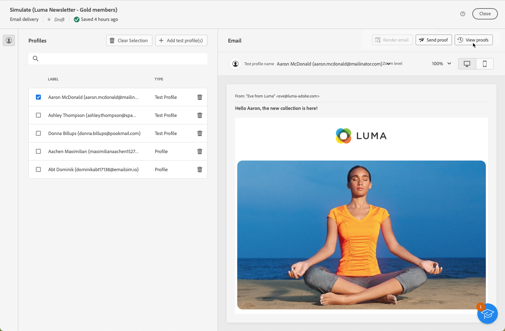

# Inviare consegne di test {#send-test-deliveries}

>[!CONTEXTUALHELP]
>id="acw_email_preview_mode"
>title="Modalità anteprima"
>abstract="Visualizza l’anteprima e verifica il messaggio includendo la popolazione di test nel target principale."

Una volta definito il contenuto del messaggio, puoi visualizzarlo in anteprima e testarlo inviando le consegne di prova (ovvero &quot;bozze&quot;) per testare i profili. Se hai inserito dei contenuti personalizzati, puoi verificare come vengono visualizzati nel messaggio, utilizzando i dati del profilo di test.

Per rilevare eventuali errori nel contenuto del messaggio o nelle impostazioni di personalizzazione, invia messaggi di test ai profili di test prima di inviarli al pubblico di destinazione. Per convalidare il contenuto più recente, a ogni modifica deve essere inviato un messaggio di prova. L’invio di consegne di test (precedentemente note come “bozze”) è un passaggio importante nella convalida della campagna e utile per individuare potenziali problemi. I destinatari di un messaggio di prova possono controllare vari elementi, ad esempio collegamenti, collegamenti di rinuncia, immagini o pagine mirror, nonché rilevare eventuali errori nel rendering, nel contenuto, nelle impostazioni di personalizzazione e nella configurazione della consegna.

## Simula contenuto con destinatari di test {#simulate-content-test-deliveries}

>[!CONTEXTUALHELP]
>id="acw_email_preview_option_test_target"
>title="Popolazione di test"
>abstract="Seleziona una modalità per la popolazione di test."

Prima di inviare un test, assicurati di definire un pubblico target per la consegna. [Ulteriori informazioni](../audience/about-recipients.md)

Per iniziare a testare il contenuto del messaggio:

1. Modifica il contenuto dell’e-mail o dell’SMS.
1. Fai clic sul pulsante **[!UICONTROL Simula contenuto]**.
1. Fai clic su **[!UICONTROL Test]** per inviare messaggi di prova.

   

1. Seleziona i destinatari del test.

   A seconda del canale del messaggio, i messaggi di prova possono essere inviati ai seguenti tipi di destinatari:

   * Per gli SMS e le e-mail, puoi utilizzare [profili di test](#test-profiles), che sono destinatari aggiuntivi specifici nel database. Questi destinatari vengono creati in [!DNL Campaign] console client. Ulteriori informazioni sono disponibili nella [documentazione di Campaign v8 (console client)](https://experienceleague.adobe.com/docs/campaign/campaign-v8/audience/add-profiles/test-profiles.html?lang=it){target="_blank"}

   * Per gli SMS e le e-mail, puoi anche utilizzare [sostituzione dal target principale](#substitution-profiles) modalità, che invia i messaggi di test all’indirizzo di test e-mail o al numero di telefono e utilizza i dati di personalizzazione di un profilo esistente. Questo consente di vivere l’esperienza del messaggio così come verrà ricevuta dai destinatari, con una rappresentazione accurata del contenuto per quello specifico profilo.

   * Per i messaggi push, puoi utilizzare [abbonati](#subscribers), che sono abbonati fittizi aggiunti al database. Vengono creati in [!DNL Campaign] console. Ulteriori informazioni sono disponibili nella [documentazione di Campaign v8 (console client)](https://experienceleague.adobe.com/docs/campaign/campaign-v8/audience/add-profiles/test-profiles.html?lang=it){target="_blank"}

   Di seguito sono disponibili informazioni dettagliate sulla configurazione di ciascuna modalità.

## Utilizza i profili di test {#test-profiles}

>[!CONTEXTUALHELP]
>id="acw_deliveries_simulate_test_mode"
>title="Target della bozza"
>abstract="Puoi caricare un secondo file come “target della bozza”, se desideri testare la consegna prima di inviarla al target principale."

>[!CONTEXTUALHELP]
>id="acw_deliveries_simulate_test_upload"
>title="Carica profili"
>abstract="Puoi caricare un secondo file con profili aggiuntivi se desideri testare la consegna con un set diverso da quello utilizzato per il target principale."

>[!CONTEXTUALHELP]
>id="acw_deliveries_simulate_test_sample"
>title="File modello"
>abstract="La formattazione del file deve essere uguale a quella del file originale. Formati di file supportati: txt, csv. Dimensione massima del file: 15 MB. Utilizza la prima riga come intestazione di colonna."

I profili di test sono indirizzi di seed, che sono destinatari aggiuntivi nel database. Possono essere create in [!DNL Adobe Campaign] console client. Di seguito sono riportati i passaggi per inviare messaggi di test agli indirizzi di seed.

1. Modifica il contenuto della consegna e fai clic su **[!UICONTROL Simula contenuto]** pulsante. Quindi fai clic su **[!UICONTROL Test]** pulsante.

   >[!NOTE]
   >
   >Se hai già selezionato i profili per [visualizzare l’anteprima della consegna](preview-content.md), sono elencati nel riquadro a sinistra.

   

1. Dall’elenco a discesa **[!UICONTROL Modalità]**, scegli **[!UICONTROL Profili di test]** per eseguire il targeting di destinatari fittizi che riceveranno la consegna e-mail o SMS di test.

   

1. Se hai già selezionato dei profili per [visualizzare l’anteprima del messaggio](preview-content.md) nella schermata di simulazione del contenuto, questi vengono preselezionati come destinatari del test. Puoi cancellare la selezione e/o aggiungere altri destinatari utilizzando il pulsante **[!UICONTROL Aggiungi profili di test]**.

   >[!NOTE]
   >
   >Per impostazione predefinita, viene selezionata la modalità **[!UICONTROL Utilizza profili di test]**.

1. Per inviare il messaggio finale anche ai destinatari della consegna di test, seleziona l’opzione **[!UICONTROL Includi la popolazione di test nel target principale]**.

1. Una volta selezionati i profili di test, puoi [inviare la consegna di test](#send-test).

## Sostituisci dati profilo {#substitution-profiles}

Utilizza la sostituzione del profilo per inviare messaggi di test a un indirizzo e-mail o a un numero di telefono specifico, durante la visualizzazione dei dati da un profilo esistente di [!DNL Adobe Campaign] database. Per farlo, segui la procedura indicata di seguito:

1. Modifica il contenuto della consegna e fai clic su **[!UICONTROL Simula contenuto]** pulsante. Quindi fai clic su **[!UICONTROL Test]** pulsante.

   

1. Dall’elenco a discesa **[!UICONTROL Modalità]**, scegli **[!UICONTROL Sostituisci dal target principale]** per inviare un test a un indirizzo e-mail o a un numero di telefono specifico durante la visualizzazione dei dati da un profilo esistente.

   >[!CAUTION]
   >
   >Se non hai selezionato un [pubblico](../audience/about-recipients.md) per la consegna, l’opzione **[!UICONTROL Sostituisci dal target principale]** sarà disattivata e non sarà possibile selezionare profili di sostituzione.

1. Fai clic sul pulsante **[!UICONTROL Aggiungi indirizzo]** e specifica l’indirizzo e-mail o il numero di telefono che riceverà la consegna di test.

   

   >[!NOTE]
   >
   >Puoi inserire qualsiasi indirizzo e-mail o numero di telefono. Questo consente di inviare consegne di test a qualsiasi destinatario, anche se non è utente di [!DNL Adobe Campaign].

1. Seleziona il profilo dal target definito per la consegna da utilizzare come sostituto. Puoi anche consentire ad [!DNL Adobe Campaign] di selezionare un profilo casuale dal target. I dati del profilo dal profilo selezionato verranno visualizzati nella consegna di test.

1. Conferma il destinatario e ripeti l’operazione per aggiungere tutti gli indirizzi e-mail o i numeri di telefono necessari.

   

1. Per inviare il messaggio finale anche ai destinatari della consegna di test, seleziona l’opzione **[!UICONTROL Includi la popolazione di test nel target principale]**.

1. Una volta selezionati i profili di sostituzione, puoi [inviare la consegna di test](#send-test).

## Inviare test agli abbonati {#subscribers}

Quando si lavora con le notifiche push, le consegne di test possono essere inviate solo agli abbonati all’app. Per selezionarli, segui i passaggi seguenti.

1. Modifica il contenuto della consegna e fai clic su **[!UICONTROL Simula contenuto]** pulsante. Quindi fai clic su **[!UICONTROL Test]** pulsante.

   

1. Se hai già selezionato degli abbonati per [visualizzare l’anteprima della consegna](preview-content.md) nella schermata di simulazione del contenuto, questi profili vengono preselezionati come abbonati a scopo di test.

   Puoi cancellare la selezione e/o aggiungere altri abbonati utilizzando il pulsante dedicato.

   

1. Per inviare la notifica push finale anche agli abbondati a scopo di test, seleziona l’opzione **[!UICONTROL Includi la popolazione di test nel target principale]**.

1. Una volta selezionati gli iscritti, puoi [inviare la consegna di test](#send-test).

## Inviare la consegna di test {#send-test}

Per inviare la consegna di test ai destinatari selezionati, segui i passaggi indicati di seguito.

1. Fai clic sul pulsante **[!UICONTROL Invia test]**

1. Conferma l’invio.

   

1. Invia tutti i test necessari fino a quando non avrai finalizzato il contenuto della consegna.

Al termine, puoi preparare la consegna e inviarla al target principale. Scopri come nelle sezioni dedicate di seguito:

* [Inviare l’e-mail](../monitor/prepare-send.md)
* [Inviare la notifica push](../push/send-push.md#send-push)
* [Inviare la consegna SMS](../sms/send-sms.md#send-sms)

## Accedere alle consegne di test inviate {#access-proofs}

Una volta inviate le consegne di test, puoi accedere ai registri dedicati mediante il pulsante **[!UICONTROL Visualizza registro di test]**.

Questi registri consentono di accedere a tutti i test inviati per la consegna selezionata e di visualizzare specifiche statistiche relative all’invio. [Scopri come monitorare i registri di consegna](../monitor/delivery-logs.md)

Puoi anche accedere ai test inviati dall’[elenco delle consegne](../msg/gs-messages.md), come qualsiasi altra consegna.

