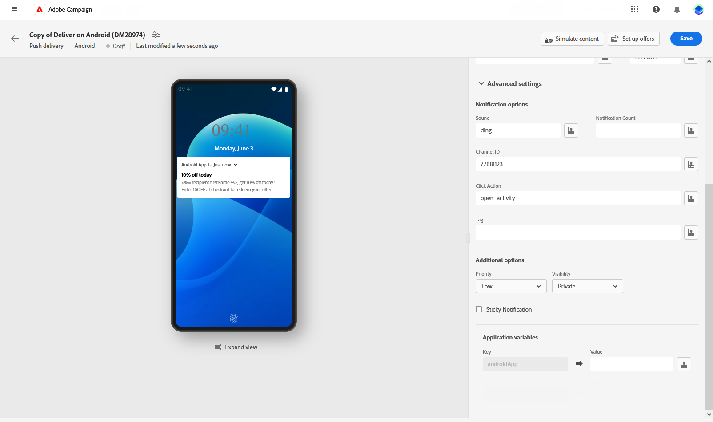

# Progettare una consegna di messaggistica push {#content-push}

>[!CONTEXTUALHELP]
>id="acw_deliveries_push_android_content"
>title="Contenuto push per Android"
>abstract="Definisci il contenuto della notifica push per i dispositivi Android. Per comporre il messaggio, fai clic sui campi **Titolo** e **Messaggio**. Utilizza l’editor espressioni per personalizzare i dati e aggiungere contenuto dinamico. Per personalizzare ulteriormente la notifica push, puoi scegliere un’immagine da aggiungere alla notifica push, l’icona della notifica da visualizzare sui dispositivi dei profili e il relativo colore. Per una configurazione più personalizzata, vai al **Impostazioni avanzate** sezione."

>[!CONTEXTUALHELP]
>id="acw_deliveries_push_ios_content"
>title="Contenuto push per iOS"
>abstract="Definisci il contenuto della notifica push per i dispositivi iOS. Per comporre il messaggio, fai clic sui campi **Titolo** e **Messaggio**. Utilizza l’editor espressioni per personalizzare i dati e aggiungere contenuto dinamico. Per una configurazione più personalizzata, vai al **Impostazioni avanzate** sezione."

## Definisci il contenuto della notifica {#push-message}

>[!CONTEXTUALHELP]
>id="acw_deliveries_push_ios_msg"
>title="Messaggio push iOS"
>abstract="Definisci il contenuto della notifica push per i dispositivi iOS. Per comporre il messaggio, fai clic sui campi **Titolo** e **Messaggio**. Utilizza l’editor espressioni per personalizzare i dati e aggiungere contenuto dinamico. Per una configurazione più personalizzata, vai al **Impostazioni avanzate** sezione."

>[!CONTEXTUALHELP]
>id="acw_deliveries_push_android_msg"
>title="Messaggio push iOS"
>abstract="Definisci il contenuto della notifica push per i dispositivi Android. Per comporre il messaggio, fai clic sui campi **Titolo** e **Messaggio**. Utilizza l’editor espressioni per personalizzare i dati e aggiungere contenuto dinamico. Per personalizzare ulteriormente la notifica push, puoi scegliere un’immagine da aggiungere alla notifica push, l’icona della notifica da visualizzare sui dispositivi dei profili e il relativo colore. Per una configurazione più personalizzata, vai al **Impostazioni avanzate** sezione."

>[!CONTEXTUALHELP]
>id="acw_deliveries_push_ios_silent"
>title="Notifica silenziosa per iOS"
>abstract="La modalità push silenziosa consente di inviare una notifica “silenziosa” a un’app mobile. L’utente non viene informato dell’arrivo della notifica. Viene trasferita direttamente all’applicazione."

Una volta creata la consegna push, puoi definirne il contenuto. I parametri e le impostazioni dipendono dal sistema operativo mobile: Android o iOS. Sfoglia le schede seguenti per scoprire come comporre il messaggio per ciascun sistema operativo.

>[!BEGINTABS]

>[!TAB Android]

Con Firebase Cloud Messaging puoi scegliere tra due tipi di messaggi:

* Il **[!UICONTROL Messaggio dati]** è gestito dall’app client. Questi messaggi vengono inviati direttamente all’app mobile, che genera e visualizza una notifica Android sul dispositivo. I messaggi di dati contengono solo variabili dell’applicazione personalizzate.

  Per definire il contenuto, personalizzare i dati e aggiungere contenuto dinamico, fai clic sul campo **[!UICONTROL Messaggio]** e utilizza l’editor di espressioni. Puoi accedere a questo editor per personalizzare i messaggi.
In **[!UICONTROL Variabili dell’applicazione]** , le variabili dell&#39;applicazione vengono aggiunte automaticamente. Queste variabili ti consentono di definire il comportamento di notifica. Ad esempio, puoi configurare una schermata dell’applicazione specifica da visualizzare quando l’utente attiva la notifica.

  

* Il **[!UICONTROL Messaggio di notifica]**, gestito automaticamente dall’SDK FCM. FCM mostra automaticamente il messaggio sui dispositivi degli utenti per conto dell’app client. I messaggi di notifica contengono un set preimpostato di parametri e opzioni, ma possono ancora essere personalizzati con variabili personalizzate dell’applicazione.

  Per comporre il messaggio, fai clic sui campi **[!UICONTROL Titolo]** e **[!UICONTROL Messaggio]**. Utilizza l’editor di espressioni per definire il contenuto, personalizzare i dati e aggiungere contenuti dinamici.

  Per personalizzare ulteriormente la notifica push, puoi scegliere un’immagine da aggiungere alla notifica push, l’icona della notifica da visualizzare sui dispositivi dei profili e il relativo colore.

  

>[!TAB iOS]

Per comporre il messaggio, fai clic sui campi **[!UICONTROL Titolo]** e **[!UICONTROL Messaggio]**. Utilizza l’editor di espressioni per definire il contenuto, personalizzare i dati e aggiungere contenuti dinamici.

Puoi aggiungere un **[!UICONTROL Sottotitolo]**, un valore del parametro dei sottotitoli del payload di notifica di iOS. Consulta questa sezione.

La modalità push silenziosa consente di inviare una notifica “silenziosa” a un’app mobile. L’utente non viene informato dell’arrivo della notifica. Viene trasferita direttamente all’applicazione.

>[!ENDTABS]

## Impostazioni avanzate della notifica push {#push-advanced}

>[!CONTEXTUALHELP]
>id="acw_deliveries_push_advanced_settings"
>title="Impostazioni avanzate per le notifiche push"
>abstract="Definisci le impostazioni avanzate per la notifica push, ad esempio la priorità, il conteggio delle notifiche associate, le variabili dell’applicazione e altro ancora."

>[!CONTEXTUALHELP]
>id="acw_deliveries_push_advanced_settings_critical"
>title="Modalità avviso critico"
>abstract="Abilita questa opzione per aggiungere un suono alla notifica, anche quando il telefono dell’utente è impostato sulla modalità Focus o se il dispositivo è silenzioso. In questo modo gli utenti vengono informati in ogni caso di avvisi importanti."

>[!CONTEXTUALHELP]
>id="acw_deliveries_push_advanced_settings_count"
>title="Conteggio notifiche"
>abstract="Utilizza questa opzione per impostare il numero di nuove informazioni non lette da visualizzare direttamente sull’icona dell’app. Questo consente all’utente di visualizzare rapidamente il numero di notifiche in sospeso."

>[!CONTEXTUALHELP]
>id="acw_deliveries_push_advanced_settings_mutable"
>title="Contenuto modificabile"
>abstract="Utilizzare questa opzione per consentire all’app mobile di scaricare il contenuto multimediale associato alla notifica."

>[!CONTEXTUALHELP]
>id="acw_deliveries_push_advanced_settings_score"
>title="Punteggio rilevanza"
>abstract="Imposta un punteggio di rilevanza da 0 a 100 per assegnare la priorità all’ordine delle notifiche nel relativo riepilogo. Punteggi più alti indicano notifiche più importanti."

>[!CONTEXTUALHELP]
>id="acw_deliveries_push_advanced_settings_app_variables"
>title="Variabili dell’applicazione"
>abstract="Utilizza le variabili dell’applicazione per definire il comportamento della notifica. Queste variabili sono completamente personalizzabili e sono incluse nel payload del messaggio inviato al dispositivo mobile."

>[!CONTEXTUALHELP]
>id="acw_deliveries_push_advanced_settings_category"
>title="ID categoria"
>abstract="Specifica il nome dell’ID categoria associato alla notifica. Questo abilita la visualizzazione dei pulsanti di azione, consentendo all’utente di eseguire varie attività direttamente dalla notifica senza aprire l’applicazione."

Le opzioni avanzate dipendono dal sistema operativo mobile: Android o iOS. Sfoglia le schede seguenti per scoprire come definire le opzioni per il messaggio per ciascun sistema operativo.

>[!BEGINTABS]

>[!TAB Android]

| Parametro | Descrizione |
|---------|---------|
| **[!UICONTROL Suono]** | Imposta l’audio da riprodurre quando il dispositivo riceve la notifica. |
| **[!UICONTROL Conteggio notifiche]** | Imposta il numero di nuove informazioni non lette da visualizzare direttamente sull’icona dell’applicazione. Questo consente all’utente di visualizzare rapidamente il numero di notifiche in sospeso. |
| **[!UICONTROL ID canale]** | Imposta l’ID canale della notifica. L’app deve creare un canale con questo ID canale prima di ricevere qualsiasi notifica con questo ID canale. |
| **[!UICONTROL Azione clic]** | Definisci l’azione associata a un utente che fa clic sulla notifica. Questo determina il comportamento quando l’utente interagisce con la notifica, ad esempio aprendo una schermata specifica o eseguendo un’azione specifica nell’app. |
| **[!UICONTROL Tag]** | Imposta un identificatore utilizzato per sostituire le notifiche esistenti nella barra delle notifiche. In questo modo si evita l’accumulo di notifiche multiple e si garantisce che venga visualizzata solo la notifica pertinente più recente. |
| **[!UICONTROL Priorità]** | Imposta il livello di priorità della notifica, che può essere predefinito, minimo, basso o alto. Il livello di priorità determina l’importanza e l’urgenza della notifica, influenzandone la modalità di visualizzazione e la possibilità di ignorare determinate impostazioni di sistema. Per ulteriori informazioni, consulta la [documentazione FCM ](https://firebase.google.com/docs/reference/fcm/rest/v1/projects.messages#notificationpriority). |
| **[!UICONTROL Visibilità]** | Imposta il livello di visibilità della notifica, che può essere pubblica, privata o segreta. Il livello di visibilità determina la quantità di contenuto della notifica viene visualizzata nella schermata di blocco e in altre aree sensibili. Per ulteriori informazioni, consulta la [documentazione FCM](https://firebase.google.com/docs/reference/fcm/rest/v1/projects.messages#visibility). |
| **[!UICONTROL Permanente]** | Quando è attivata, la notifica rimane visibile anche dopo che l’utente fa clic su di essa.  Se è disattivata, la notifica viene automaticamente ignorata quando l’utente interagisce con essa. Il comportamento permanente consente alle notifiche importanti di rimanere sullo schermo per periodi più lunghi. |
| **[!UICONTROL Variabili dell’applicazione]** | Consente di definire il comportamento di notifica. Queste variabili sono completamente personalizzabili e sono incluse nel payload del messaggio inviato al dispositivo mobile. |

>[!TAB iOS]

| Parametro | Descrizione |
|---------|---------|
| **[!UICONTROL Modalità avviso critico]** | Abilita questa opzione per aggiungere un suono alla notifica, anche quando il telefono dell’utente è impostato sulla modalità Focus o se il dispositivo è silenzioso. In questo modo l’utente noterà gli avvisi importanti. Se questa opzione è selezionata, è possibile regolare il volume della notifica utilizzando la barra del livello del volume. Un numero compreso tra 0 e 100 sopra la barra riflette le impostazioni. |
| **[!UICONTROL Pulisci badge]** | Abilita questa opzione per aggiornare il valore del badge visualizzato sull’icona dell’applicazione. In questo modo il badge riflette accuratamente il numero delle nuove informazioni non lette. |
| **[!UICONTROL Conteggio notifiche]** | Imposta un numero che verrà visualizzato direttamente sull’icona dell’applicazione, indicando il numero di nuove informazioni non lette. Questo fornisce un riferimento visivo rapido per l’utente. |
| **[!UICONTROL Volume]** | Volume del suono da 0 a 100. |
| **[!UICONTROL Contenuto modificabile]** | Abilita questa opzione per consentire all’app mobile di scaricare il contenuto multimediale associato alla notifica. Per ulteriori informazioni, consulta la [documentazione per sviluppatori di Apple](https://developer.apple.com/library/content/documentation/NetworkingInternet/Conceptual/RemoteNotificationsPG/ModifyingNotifications.html). |
| **[!UICONTROL Punteggio rilevanza]** | Imposta un punteggio di rilevanza da 0 a 100 per assegnare la priorità all’ordine delle notifiche nel relativo riepilogo. Punteggi più alti indicano notifiche più importanti. |
| **[!UICONTROL Livello di interruzione]** | <ul> <li>**[!UICONTROL Attivo]**: per impostazione predefinita, il sistema visualizza immediatamente la notifica, illumina lo schermo e può riprodurre un suono. Le notifiche non interrompono le modalità Focus.</li><li>**[!UICONTROL Passivo]**: il sistema aggiunge la notifica all’elenco delle notifiche senza accendere lo schermo o riprodurre un suono. Le notifiche non interrompono le modalità Focus.</li><li>**[!UICONTROL Urgente]**: il sistema presenta immediatamente la notifica, accende lo schermo, può riprodurre un suono e interrompere le modalità Focus. Questo livello non richiede un’autorizzazione speciale da Apple.</li> <li>**[!UICONTROL Critico]**: il sistema presenta immediatamente la notifica, accende lo schermo e ignora le modalità di disattivazione audio o di Focus. Tieni presente che questo livello richiede un’autorizzazione speciale da parte di Apple.</ul> |
| **[!UICONTROL ID thread]** | Identificatore utilizzato per raggruppare le notifiche correlate. Le notifiche con lo stesso ID thread sono organizzate come una singola conversazione o thread nell’elenco delle notifiche. |
| **[!UICONTROL Categoria]** | Specifica il nome dell’ID categoria associato alla notifica. Questo abilita la visualizzazione dei pulsanti di azione, consentendo all’utente di eseguire varie attività direttamente dalla notifica senza aprire l’applicazione. |
| **[!UICONTROL ID contenuto target]** | Identificatore utilizzato per individuare la finestra dell’applicazione da presentare quando viene aperta la notifica. |
| **[!UICONTROL Immagine di avvio]** | Specifica il nome del file dell’immagine di avvio da visualizzare quando l’utente sceglie di avviare l’applicazione dalla notifica. Viene visualizzata l’immagine selezionata al posto della normale schermata di avvio dell&#39;applicazione. |
| **[!UICONTROL Variabili dell’applicazione]** | Consente di definire il comportamento di notifica. Queste variabili sono completamente personalizzabili e sono incluse nel payload del messaggio inviato al dispositivo mobile. |

>[!ENDTABS]

<!--Sounds must be included in the application and defined when the service is created. Refer to this section.-->
