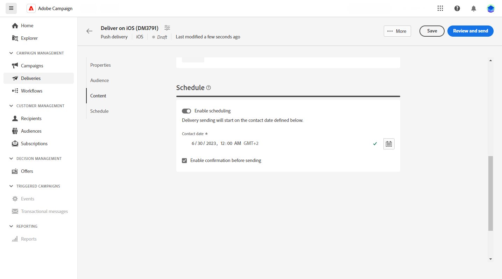

# Creare una consegna di notifica push {#create-push}

>[!CONTEXTUALHELP]
>id="acw_deliveries_push_audience"
>title="Definisci il pubblico push"
>abstract="Seleziona il pubblico migliore per il messaggio push."

>[!CONTEXTUALHELP]
>id="acw_push_notification_template"
>title="Modello di notifica push"
>abstract="Seleziona un modello di notifica push per avviare la consegna push."

>[!CONTEXTUALHELP]
>id="acw_deliveries_push_properties"
>title="Proprietà di consegna push"
>abstract="Gestisci le proprietà di consegna push."

1. Dalla pagina home delle **[!UICONTROL Consegne]**, fai clic su **[!UICONTROL Crea consegna]**.

1. Sotto la sezione **[!UICONTROL Canale]**, scegli Notifica push come canale e seleziona un modello a seconda del sistema operativo scelto: Android o iOS. [Ulteriori informazioni sui modelli](../msg/delivery-template.md)

1. Fai clic sul pulsante **[!UICONTROL Crea una consegna]** per confermare.

   

1. Immetti un’**[!UICONTROL etichetta]** per la consegna e accedi al menu a discesa **[!UICONTROL Opzioni aggiuntive]**.

   +++Configura le seguenti impostazioni in base alle tue esigenze.
   * **[!UICONTROL Nome interno]**: assegna un identificatore univoco alla consegna.
   * **[!UICONTROL Cartella]**: memorizza la consegna in una cartella specifica.
   * **[!UICONTROL Codice di consegna]**: organizza le consegne in base alla convenzione di denominazione.
   * **[!UICONTROL Descrizione]**: specifica una descrizione della consegna.
   * **[!UICONTROL Natura]**: specifica la natura dell’e-mail a scopo di classificazione.
+++

1. Dal menu **[!UICONTROL Pubblico]**, seleziona l’applicazione da utilizzare per questa consegna.

1. Fai clic sul pulsante **[!UICONTROL Seleziona pubblico]** per eseguire il targeting di un pubblico esistente o crearne uno tuo. [Ulteriori informazioni](../audience/about-audiences.md)

   Tieni presente che, per impostazione predefinita, la notifica push verrà inviata a tutti gli iscritti dell’applicazione.

   

1. Attiva l’opzione **[!UICONTROL Abilita gruppo di controllo]** per impostare un gruppo di controllo per misurare l’impatto della consegna che consente di confrontare il comportamento della popolazione che ha ricevuto il messaggio con quello dei contatti che non lo hanno fatto. [Ulteriori informazioni](../audience/control-group.md)

1. Fai clic su **[!UICONTROL Modifica contenuto]** per iniziare a progettare il contenuto della notifica push. [Ulteriori informazioni](content-push.md)

   

   Da questa schermata, è possibile anche [simulare i contenuti](../preview-test/preview-test.md) e [configurare le offerte](../content/offers.md).

1. Per pianificare la consegna a una data e un’ora specifiche, attiva l’opzione **[!UICONTROL Abilita pianificazione]**. Dopo aver avviato la consegna, il messaggio viene inviato automaticamente nella data e nell’ora esatte definite per il destinatario. Ulteriori informazioni sulla pianificazione delle consegne in [questa sezione](../msg/gs-messages.md#gs-schedule)

   

1. Fai clic su **[!UICONTROL Configura le impostazioni di consegna]** per accedere alle opzioni avanzate relative al modello di consegna. [Ulteriori informazioni](../advanced-settings/delivery-settings.md)

   
