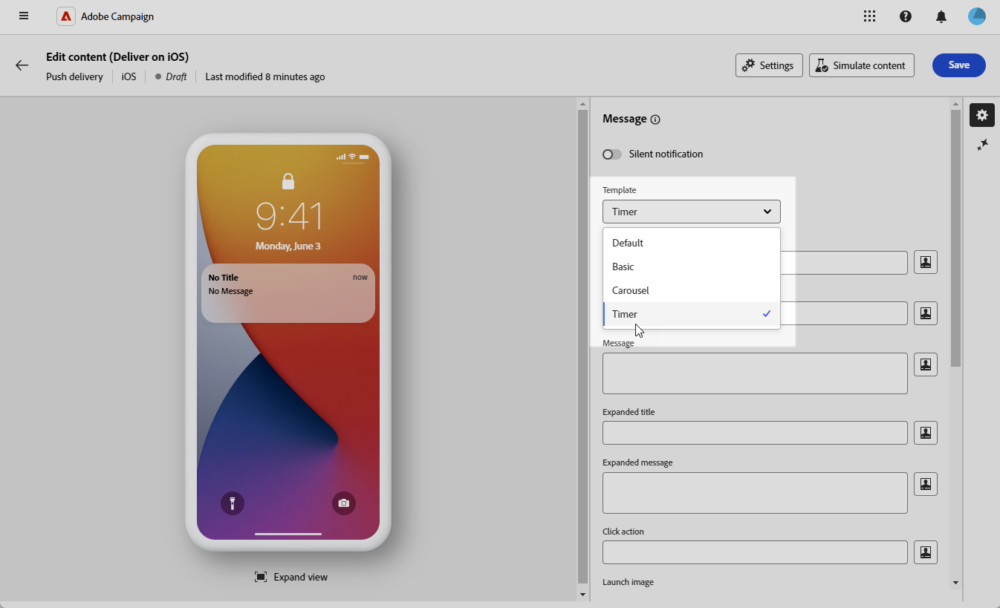
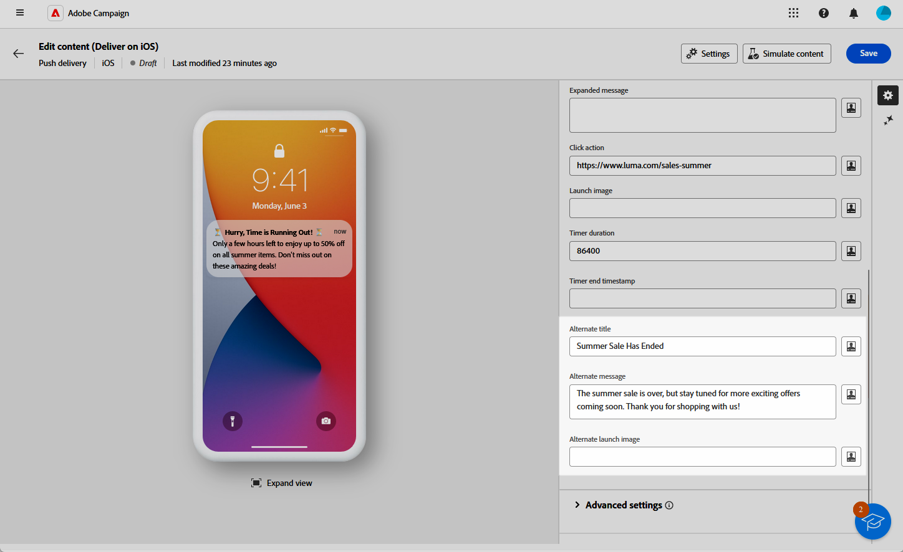

# Progettare una consegna push iOS avanzata {#rich-push}

>[!IMPORTANT]
>
>Prima di progettare una notifica push potenziata, è necessario configurare il connettore V2. Per la procedura dettagliata, consulta [questa pagina](https://experienceleague.adobe.com/en/docs/campaign-classic/using/sending-messages/sending-push-notifications/configure-the-mobile-app/configuring-the-mobile-application).

## Definisci il contenuto della notifica {#push-message}

Una volta creata la consegna push, puoi definirne il contenuto utilizzando uno dei seguenti modelli:

* **Predefinito** consente di inviare notifiche con una semplice icona e un&#39;immagine associata.

* **Basic** può includere testo, immagini e pulsanti nelle notifiche.

* **Carosello** consente di inviare notifiche con testo e più immagini che gli utenti possono scorrere.

* **Timer** include un timer di conto alla rovescia attivo nelle notifiche.

Per ulteriori informazioni su come personalizzare questi modelli, accedi alle schede seguenti.

>[!BEGINTABS]

>[!TAB Predefinito]

1. Dal menu a discesa **[!UICONTROL Modello]**, seleziona **[!UICONTROL Predefinito]**.

   

1. Nel campo **[!UICONTROL Titolo]** immettere l&#39;etichetta del titolo che si desidera visualizzare nell&#39;elenco delle notifiche disponibili nel centro notifiche.

   Questo campo consente di definire il valore del parametro **title** del payload di notifica iOS.

1. Facoltativamente, aggiungi un **[!UICONTROL Sottotitolo]**, che corrisponde al parametro **sottotitolo** del payload di notifica di iOS.

1. Immetti il contenuto del messaggio nel campo **[!UICONTROL Messaggio]**.

1. Utilizza l’editor espressioni per definire il contenuto, personalizzare i dati e aggiungere contenuto dinamico. [Ulteriori informazioni](../personalization/personalize.md)

   

1. Per personalizzare ulteriormente la notifica push, puoi scegliere un URL **[!UICONTROL Immagine lancio]** da aggiungere alla notifica push.

1. Dall&#39;elenco a discesa **[!UICONTROL Impostazioni avanzate]**, passare alla scheda **[!UICONTROL Audio e badge]** per personalizzare altre impostazioni, ad esempio le opzioni audio e di badge per le notifiche. [Ulteriori informazioni](#sound-badge)

   

1. Per ulteriori personalizzazioni, esplora le **[!UICONTROL opzioni aggiuntive]** disponibili per le notifiche push. [Ulteriori informazioni](#push-advanced)

   

1. Dal menu **[!UICONTROL Variabili applicazione]**, le **[!UICONTROL Variabili applicazione]** vengono aggiunte automaticamente. Consentono di definire il comportamento di notifica; ad esempio, puoi configurare una schermata di un’applicazione specifica da visualizzare quando l’utente attiva la notifica.

Dopo aver definito il contenuto del messaggio, puoi utilizzare gli abbonati di prova per visualizzare in anteprima e verificare il messaggio.

>[!TAB Base]

1. Dal menu a discesa **[!UICONTROL Modello]**, selezionare **[!UICONTROL Base]**.

   

1. Per comporre il messaggio, immetti il testo nei campi **[!UICONTROL Titolo]**, **[!UICONTROL Titolo esteso]**, **[!UICONTROL Messaggio]** e **[!UICONTROL Messaggio esteso]**.

   Il testo del **[!UICONTROL Messaggio]** viene visualizzato nella visualizzazione compressa mentre il **[!UICONTROL Messaggio espanso]** viene visualizzato quando la notifica viene espansa.

   

1. Utilizza l’editor espressioni per definire il contenuto, personalizzare i dati e aggiungere contenuto dinamico. [Ulteriori informazioni](../personalization/personalize.md)

1. Facoltativamente, aggiungi un **[!UICONTROL Sottotitolo]**, che corrisponde al parametro **sottotitolo** del payload di notifica di iOS.

1. Aggiungi l&#39;URL che definisce l&#39;**[!UICONTROL azione clic]** associata a un utente che fa clic sulla notifica. Questo determina il comportamento quando l’utente interagisce con la notifica, ad esempio aprendo una schermata specifica o eseguendo un’azione specifica nell’app.

1. Per personalizzare ulteriormente la notifica push, puoi scegliere un URL **[!UICONTROL Immagine lancio]** da aggiungere alla notifica push.

1. Dall&#39;elenco a discesa **[!UICONTROL Impostazioni avanzate]**, passare alla scheda **[!UICONTROL Audio e badge]** per personalizzare altre impostazioni, ad esempio le opzioni audio e di badge per le notifiche. [Ulteriori informazioni](#sound-badge)

   

1. Nel menu **[!UICONTROL Opzioni colore]**, immettere codici colore esadecimali per il **[!UICONTROL colore di sfondo notifica]**, il **[!UICONTROL colore di sfondo notifica]** e il **[!UICONTROL colore testo messaggio]**.

   

1. Per ulteriori personalizzazioni, esplora le **[!UICONTROL opzioni aggiuntive]** disponibili per le notifiche push. [Ulteriori informazioni](#push-advanced)

1. Dal menu **[!UICONTROL Variabili applicazione]**, le **[!UICONTROL Variabili applicazione]** vengono aggiunte automaticamente. Consentono di definire il comportamento di notifica; ad esempio, puoi configurare una schermata di un’applicazione specifica da visualizzare quando l’utente attiva la notifica.

Dopo aver definito il contenuto del messaggio, puoi utilizzare gli abbonati di prova per visualizzare in anteprima e verificare il messaggio.

>[!TAB Carosello]

1. Dal menu a discesa **[!UICONTROL Modello]**, seleziona **[!UICONTROL Carosello]**.

   

1. Per comporre il messaggio, immetti il testo nei campi **[!UICONTROL Titolo]**, **[!UICONTROL Titolo esteso]**, **[!UICONTROL Messaggio]** e **[!UICONTROL Messaggio esteso]**.

   Il testo del **[!UICONTROL Messaggio]** viene visualizzato nella visualizzazione compressa mentre il **[!UICONTROL Messaggio espanso]** viene visualizzato quando la notifica viene espansa.

   

1. Utilizza l’editor espressioni per definire il contenuto, personalizzare i dati e aggiungere contenuto dinamico. [Ulteriori informazioni](../personalization/personalize.md)

1. Facoltativamente, aggiungi un **[!UICONTROL Sottotitolo]**, che corrisponde al parametro **sottotitolo** del payload di notifica di iOS.

1. Aggiungi l&#39;URL che definisce l&#39;**[!UICONTROL azione clic]** associata a un utente che fa clic sulla notifica. Questo determina il comportamento quando l’utente interagisce con la notifica, ad esempio aprendo una schermata specifica o eseguendo un’azione specifica nell’app.

1. Scegli come funziona il **[!UICONTROL carosello]**:

   * **[!UICONTROL Automatico]**: scorre automaticamente le immagini come diapositive, passando a intervalli predefiniti.
   * **[!UICONTROL Manuale]**: consente agli utenti di scorrere manualmente tra le diapositive per spostarsi tra le immagini.

1. Fai clic su **[!UICONTROL Aggiungi immagine]** e immetti l&#39;URL **[!UICONTROL Immagine]**, **[!UICONTROL Testo]** e **[!UICONTROL Azione URI]**.

   Assicurati di includere un minimo di tre immagini e un massimo di cinque.

   

1. Gestire l&#39;ordine delle immagini con le frecce Giù e Su.

1. Dall&#39;elenco a discesa **[!UICONTROL Impostazioni avanzate]**, passare alla scheda **[!UICONTROL Audio e badge]** per personalizzare altre impostazioni, ad esempio le opzioni audio e di badge per le notifiche. [Ulteriori informazioni](#sound-badge)

1. Nel menu **[!UICONTROL Opzioni colore]**, immettere codici colore esadecimali per il **[!UICONTROL colore di sfondo notifica]**, il **[!UICONTROL colore di sfondo notifica]** e il **[!UICONTROL colore testo messaggio]**.

   

1. Per ulteriori personalizzazioni, esplora le **[!UICONTROL opzioni aggiuntive]** disponibili per le notifiche push. [Ulteriori informazioni](#push-advanced)

1. Dal menu **[!UICONTROL Variabili applicazione]**, le **[!UICONTROL Variabili applicazione]** vengono aggiunte automaticamente. Consentono di definire il comportamento di notifica; ad esempio, puoi configurare una schermata di un’applicazione specifica da visualizzare quando l’utente attiva la notifica.

Dopo aver definito il contenuto del messaggio, puoi utilizzare gli abbonati di prova per visualizzare in anteprima e verificare il messaggio.

>[!TAB Timer]

1. Dall&#39;elenco a discesa **[!UICONTROL Tipo di notifica]**, selezionare **[!UICONTROL Timer]**.

   

1. Per comporre il messaggio, immetti il testo nei campi **[!UICONTROL Titolo]**, **[!UICONTROL Titolo esteso]**, **[!UICONTROL Messaggio]** e **[!UICONTROL Messaggio esteso]**.

   Il testo del **[!UICONTROL Messaggio]** viene visualizzato nella visualizzazione compressa mentre il **[!UICONTROL Messaggio espanso]** viene visualizzato quando la notifica viene espansa.

   

1. Utilizza l’editor espressioni per definire il contenuto, personalizzare i dati e aggiungere contenuto dinamico. [Ulteriori informazioni](../personalization/personalize.md)

1. Facoltativamente, aggiungi un **[!UICONTROL Sottotitolo]**, che corrisponde al parametro **sottotitolo** del payload di notifica di iOS.

1. Aggiungi l&#39;URL che definisce l&#39;**[!UICONTROL azione clic]** associata a un utente che fa clic sulla notifica. Questo determina il comportamento quando l’utente interagisce con la notifica, ad esempio aprendo una schermata specifica o eseguendo un’azione specifica nell’app.

1. Per personalizzare ulteriormente la notifica push, puoi scegliere un URL **[!UICONTROL Immagine lancio]** da aggiungere alla notifica push.

1. Imposta la **[!UICONTROL durata timer]** in secondi o la **[!UICONTROL marca temporale fine timer]** su un&#39;epoca specifica.

   

1. Immettere il testo e l&#39;immagine che verranno visualizzati dopo la scadenza del timer nei campi **[!UICONTROL Titolo alternativo]**, **[!UICONTROL Messaggio alternativo]** e **[!UICONTROL Immagine di avvio alternativa]**.

   

1. Dall&#39;elenco a discesa **[!UICONTROL Impostazioni avanzate]**, passare alla scheda **[!UICONTROL Audio e badge]** per personalizzare altre impostazioni, ad esempio le opzioni audio e di badge per le notifiche. [Ulteriori informazioni](#sound-badge)

1. Nel menu **[!UICONTROL Opzioni colore]**, immettere codici colore esadecimali per il **[!UICONTROL colore di sfondo notifica]**, il **[!UICONTROL colore di sfondo notifica]** e il **[!UICONTROL colore testo messaggio]**.

1. Per ulteriori personalizzazioni, esplora le **[!UICONTROL opzioni aggiuntive]** disponibili per le notifiche push. [Ulteriori informazioni](#push-advanced)

1. Dal menu **[!UICONTROL Variabili applicazione]**, le **[!UICONTROL Variabili applicazione]** vengono aggiunte automaticamente. Consentono di definire il comportamento di notifica; ad esempio, puoi configurare una schermata di un’applicazione specifica da visualizzare quando l’utente attiva la notifica.

Dopo aver definito il contenuto del messaggio, puoi utilizzare gli abbonati di prova per visualizzare in anteprima e verificare il messaggio.

>[!ENDTABS]

## Impostazioni avanzate della notifica push {#push-advanced}

### Opzioni audio e badge {#sound-badge}

| Parametro | Descrizione |
|---------|---------|
| **[!UICONTROL Modalità avviso critico]** | Abilita questa opzione per aggiungere un suono alla notifica anche se il telefono dell’utente è impostato sulla modalità di attivazione o se l’iPhone è disattivato. |
| **[!UICONTROL Pulisci badge]** | Abilita queste opzioni per aggiornare il valore del badge. |
| **[!UICONTROL Suono]** | Imposta l’audio da riprodurre quando il dispositivo riceve la notifica. |
| **[!UICONTROL Conteggio notifiche]** | Impostare un numero che verrà utilizzato per visualizzare direttamente sull&#39;icona dell&#39;applicazione il numero di nuove informazioni non lette. |
| **[!UICONTROL Volume]** | Impostare il volume dell&#39;audio da 0 a 100. I suoni devono essere inclusi nell&#39;applicazione e definiti al momento della creazione del servizio. |

### Opzioni colore {#color}

| Parametro | Descrizione |
|---------|---------|
| **[!UICONTROL Colore di sfondo notifica]** | Imposta il colore dello sfondo della notifica con i codici di colore esadecimali. |
| **[!UICONTROL Colore titolo]** | Imposta il colore del Titolo con i codici colore Esadecimali. |
| **[!UICONTROL Colore testo messaggio]** | Impostare il colore del testo con i codici colore esadecimali. |

### Opzioni avanzate {#notification-options}

| Parametro | Descrizione |
|---------|---------|
| **[!UICONTROL Contenuto modificabile]** | Abilita questa opzione per consentire all’app mobile di scaricare contenuti multimediali. |
| **[!UICONTROL Punteggio rilevanza]** | Imposta un punteggio di rilevanza da 0 a 100. Il sistema utilizza questa funzione per ordinare le notifiche nel riepilogo delle notifiche. |
| **[!UICONTROL Livello di interruzione]** | <ul><li>Attivo: per impostazione predefinita, il sistema presenta immediatamente la notifica, illumina lo schermo e può riprodurre un suono. Le notifiche non interrompono le modalità di attivazione.</li><li>Passivo: il sistema aggiunge la notifica all’elenco delle notifiche senza accendere lo schermo o riprodurre un suono. Le notifiche non interrompono le modalità Focus.</li><li> Sensibile al tempo: il sistema presenta immediatamente la notifica, accende lo schermo, può riprodurre un suono e interrompere le modalità di messa a fuoco. Questo livello non richiede un’autorizzazione speciale da Apple.</li><li>Critico: il sistema presenta immediatamente la notifica, illumina lo schermo e ignora le modalità di disattivazione audio o di messa a fuoco. Tieni presente che questo livello richiede un’autorizzazione speciale da parte di Apple.</li></ul> |
| **[!UICONTROL ID thread]** | Imposta l’identificatore utilizzato per raggruppare le notifiche correlate. |
| **[!UICONTROL Categoria]** | Imposta il nome dell&#39;ID categoria che visualizzerà i pulsanti di azione. Queste notifiche forniscono all’utente un modo più rapido per eseguire diverse attività in risposta a una notifica senza aprire o esplorare l’applicazione. |
| **[!UICONTROL ID contenuto target]** | Impostare un identificatore utilizzato per impostare la finestra dell&#39;applicazione da portare avanti quando viene aperta la notifica. |
