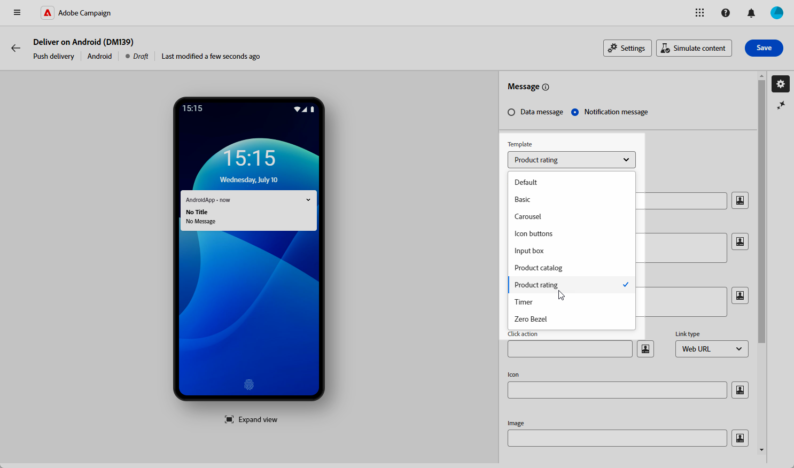
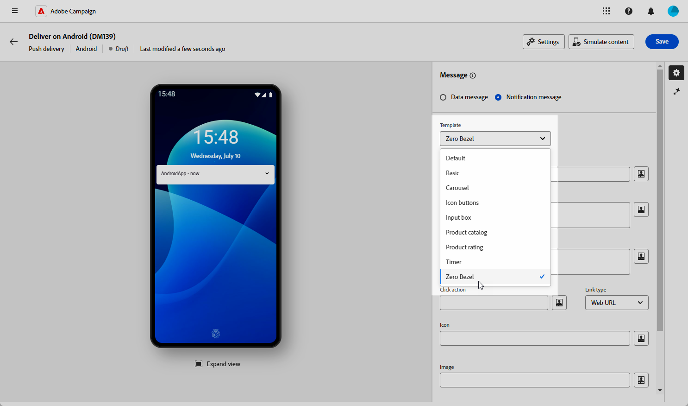

# Progettare una consegna push avanzata per Android {#rich-push}

>[!CONTEXTUALHELP]
>id="acw_deliveries_push_remind_later"
>title="Pulsante Ricorda più tardi"
>abstract="Il pulsante **Ricorda più tardi** conente di pianificare un promemoria. Il campo Timestamp richiede un valore che rappresenti il passaggio del tempo in secondi."

>[!IMPORTANT]
>
>* Questa funzionalità richiede un aggiornamento a Campaign v8.6.3 <!--or v8.7.2-->. Per ulteriori informazioni, consulta le [note sulla versione](https://experienceleague.adobe.com/it/docs/campaign/campaign-v8/releases/release-notes){target="_blank"} della console client di Campaign v8.
>
>* Prima di progettare una notifica push potenziata, è necessario configurare il connettore V2. Per la procedura dettagliata, consulta [questa pagina](https://experienceleague.adobe.com/en/docs/campaign-classic/using/sending-messages/sending-push-notifications/configure-the-mobile-app/configuring-the-mobile-application-android#configuring-external-account-android){target="_blank"}.

Con Firebase Cloud Messaging puoi scegliere tra due tipi di messaggi:

* Il **[!UICONTROL Messaggio dati]** è gestito dall’app client. Questi messaggi vengono inviati direttamente all’app mobile, che genera e visualizza una notifica Android sul dispositivo. I messaggi di dati contengono solo variabili dell’applicazione personalizzate.

* Il **[!UICONTROL Messaggio di notifica]**, gestito automaticamente dall’SDK FCM. FCM mostra automaticamente il messaggio sui dispositivi degli utenti per conto dell’app client. I messaggi di notifica contengono un set preimpostato di parametri e opzioni, ma possono ancora essere personalizzati con variabili personalizzate dell’applicazione.

{zoomable="yes"}

## Definisci il contenuto della notifica {#push-message}

Una volta creata la consegna push, puoi definirne il contenuto utilizzando uno dei seguenti modelli:

* **Predefinito** consente di inviare notifiche con una semplice icona e un&#39;immagine associata.

* **Basic** può includere testo, immagini e pulsanti nelle notifiche.

* **Carosello** consente di inviare notifiche con testo e più immagini che gli utenti possono scorrere.

* **Pulsanti icona** consente di inviare notifiche con un&#39;icona e un&#39;immagine corrispondente.

* **La casella di input** raccoglie l&#39;input e il feedback dell&#39;utente direttamente tramite la notifica.

* **Nel catalogo prodotti** sono visualizzate diverse immagini dei prodotti.

* **Valutazione del prodotto** consente agli utenti di fornire feedback e valutare i prodotti.

* **Timer** include un timer di conto alla rovescia attivo nelle notifiche.

* **Frontale zero** utilizza l&#39;intera superficie di sfondo per un&#39;immagine, con testo sovrapposto senza problemi.

Per ulteriori informazioni su come personalizzare questi modelli, accedi alle schede seguenti.

>[!BEGINTABS]

>[!TAB Predefinito]

1. Dal menu a discesa **[!UICONTROL Modello]**, seleziona **[!UICONTROL Predefinito]**.

   

1. Per comporre il messaggio, immetti il testo nei campi **[!UICONTROL Titolo]** e **[!UICONTROL Messaggio]**.

   

1. Utilizza l’editor espressioni per definire il contenuto, personalizzare i dati e aggiungere contenuto dinamico. [Ulteriori informazioni](../personalization/personalize.md)

1. Definisci l&#39;**[!UICONTROL azione clic]** associata a un utente che fa clic sulla notifica. Questo determina il comportamento quando l’utente interagisce con la notifica, ad esempio aprendo una schermata specifica o eseguendo un’azione specifica nell’app.

1. Per personalizzare ulteriormente la notifica push, puoi scegliere un URL **[!UICONTROL Immagine]** da aggiungere alla notifica push e l&#39;**[!UICONTROL icona]** della notifica da visualizzare sui dispositivi dei profili.

   

1. Configura le **[!UICONTROL Impostazioni avanzate]** della notifica push. [Ulteriori informazioni](#push-advanced)

Dopo aver definito il contenuto del messaggio, puoi utilizzare gli abbonati di prova per visualizzare in anteprima e verificare il messaggio.

>[!TAB Base]

1. Dal menu a discesa **[!UICONTROL Modello]**, selezionare **[!UICONTROL Base]**.

   

1. Per comporre il messaggio, immetti il testo nei campi **[!UICONTROL Titolo]**, **[!UICONTROL Messaggio]** e **[!UICONTROL Messaggio espanso]**.

   Il testo del **[!UICONTROL Messaggio]** viene visualizzato nella visualizzazione compressa mentre il **[!UICONTROL Messaggio espanso]** viene visualizzato quando la notifica viene espansa.

   

1. Utilizza l’editor espressioni per definire il contenuto, personalizzare i dati e aggiungere contenuto dinamico. [Ulteriori informazioni](../personalization/personalize.md)

1. Aggiungi l&#39;URL che definisce l&#39;**[!UICONTROL azione clic]** associata a un utente che fa clic sulla notifica. Questo determina il comportamento quando l’utente interagisce con la notifica, ad esempio aprendo una schermata specifica o eseguendo un’azione specifica nell’app.

1. Seleziona il **[!UICONTROL tipo di collegamento]** dell&#39;URL aggiunto al campo **[!UICONTROL Azione clic]**:

   * **[!UICONTROL URL Web]**: gli URL Web indirizzano gli utenti al contenuto online. Facendo clic su, viene richiesto al browser Web predefinito del dispositivo di aprire e passare all&#39;URL designato.

   * **[!UICONTROL Deeplink]**: i collegamenti profondi sono URL che indirizzano gli utenti a sezioni specifiche all&#39;interno di un&#39;app, anche se l&#39;app è chiusa. Facendo clic su di esso, può essere visualizzata una finestra di dialogo che consente agli utenti di scegliere tra varie app in grado di gestire il collegamento.

   * **[!UICONTROL Apri app]**: gli URL aperti dell&#39;app consentono di connettersi direttamente al contenuto di un&#39;applicazione. Consente all’applicazione di impostarsi come gestore predefinito per un tipo specifico di collegamento, ignorando la finestra di dialogo per la disambiguazione.

   Per ulteriori informazioni su come gestire i collegamenti alle app Android, consulta la [documentazione per sviluppatori di Android](https://developer.android.com/training/app-links).

   

1. Per personalizzare ulteriormente la notifica push, puoi scegliere un URL **[!UICONTROL Immagine]** da aggiungere alla notifica push e l&#39;**[!UICONTROL icona]** della notifica da visualizzare sui dispositivi dei profili.

1. Fai clic su **[!UICONTROL Aggiungi pulsante]** e compila i campi seguenti:

   * **[!UICONTROL Etichetta]**: testo visualizzato sul pulsante.
   * **[!UICONTROL URI collegamento]**: specificare l&#39;URI da eseguire facendo clic sul pulsante.
   * **[!UICONTROL Tipo di collegamento]**: tipo di collegamento **[!UICONTROL URL Web]**, **[!UICONTROL Deeplink]** o **[!UICONTROL Apri app]**.

   È possibile includere fino a tre pulsanti nella notifica push. Se si sceglie il pulsante **[!UICONTROL Ricordare più tardi]**, è possibile includere solo un massimo di due pulsanti.

   

1. Fai clic sul pulsante **[!UICONTROL Aggiungi promemoria più tardi]** per aggiungere un&#39;opzione Ricordami più tardi alla notifica push. Immetti un **[!UICONTROL Etichetta]** e un **[!UICONTROL Timestamp]**.

   Il campo Timestamp prevede un valore che rappresenti l’epoca in secondi.

   

1. Configura le **[!UICONTROL Impostazioni avanzate]** della notifica push. [Ulteriori informazioni](#push-advanced)

Dopo aver definito il contenuto del messaggio, puoi utilizzare gli abbonati di prova per visualizzare in anteprima e verificare il messaggio.

>[!TAB Carosello]

1. Dal menu a discesa **[!UICONTROL Modello]**, seleziona **[!UICONTROL Carosello]**.

   

1. Per comporre il messaggio, immetti il testo nei campi **[!UICONTROL Titolo]**, **[!UICONTROL Messaggio]** e **[!UICONTROL Messaggio espanso]**.

   Il testo del **[!UICONTROL Messaggio]** viene visualizzato nella visualizzazione compressa mentre il **[!UICONTROL Messaggio espanso]** viene visualizzato quando la notifica viene espansa.

   

1. Utilizza l’editor espressioni per definire il contenuto, personalizzare i dati e aggiungere contenuto dinamico. [Ulteriori informazioni](../personalization/personalize.md)

1. Aggiungi l&#39;URL che definisce l&#39;**[!UICONTROL azione clic]** associata a un utente che fa clic sulla notifica. Questo determina il comportamento quando l’utente interagisce con la notifica, ad esempio aprendo una schermata specifica o eseguendo un’azione specifica nell’app.

1. Seleziona il **[!UICONTROL tipo di collegamento]** dell&#39;URL aggiunto al campo **[!UICONTROL Azione clic]**:

   * **[!UICONTROL URL Web]**L: gli URL Web indirizzano gli utenti al contenuto online. Facendo clic su, viene richiesto al browser Web predefinito del dispositivo di aprire e passare all&#39;URL designato.

   * **[!UICONTROL Deeplink]**: i collegamenti profondi sono URL che indirizzano gli utenti a sezioni specifiche all&#39;interno di un&#39;app, anche se l&#39;app è chiusa. Facendo clic su di esso, può essere visualizzata una finestra di dialogo che consente agli utenti di scegliere tra varie app in grado di gestire il collegamento.

   * **[!UICONTROL Apri app]**: gli URL aperti dell&#39;app consentono di connettersi direttamente al contenuto di un&#39;applicazione. Consente all’applicazione di impostarsi come gestore predefinito per un tipo specifico di collegamento, ignorando la finestra di dialogo per la disambiguazione.

   Per ulteriori informazioni su come gestire i collegamenti alle app Android, consulta la [documentazione per sviluppatori di Android](https://developer.android.com/training/app-links).

   

1. Per personalizzare ulteriormente la notifica push, puoi scegliere l&#39;**[!UICONTROL icona]** della notifica da visualizzare sui dispositivi dei profili.

1. Scegli come funziona il **[!UICONTROL carosello]**:

   * **[!UICONTROL Automatico]**: scorre automaticamente le immagini come diapositive, passando a intervalli predefiniti.
   * **[!UICONTROL Manuale]**: consente agli utenti di scorrere manualmente tra le diapositive per spostarsi tra le immagini.

     Abilita l&#39;opzione **[!UICONTROL Filmstrip]** per includere anteprime delle immagini precedenti e successive accanto alla diapositiva principale.

1. Fai clic su **[!UICONTROL Aggiungi immagine]** e immetti l&#39;URL e il testo dell&#39;immagine.

   Assicurati di includere un minimo di tre immagini e un massimo di cinque.

   

1. Gestire l&#39;ordine delle immagini con le frecce Giù e Su.

1. Configura le **[!UICONTROL Impostazioni avanzate]** della notifica push. [Ulteriori informazioni](#push-advanced)

Dopo aver definito il contenuto del messaggio, puoi utilizzare gli abbonati di prova per visualizzare in anteprima e verificare il messaggio.

>[!TAB Pulsanti icona]

1. Dal menu a discesa **[!UICONTROL Modello]**, selezionare **[!UICONTROL Pulsanti icona]**.

   

1. Aggiungi l&#39;URL che definisce l&#39;**[!UICONTROL azione clic]** associata a un utente che fa clic sulla notifica. Questo determina il comportamento quando l’utente interagisce con la notifica, ad esempio aprendo una schermata specifica o eseguendo un’azione specifica nell’app.

1. Seleziona il **[!UICONTROL tipo di collegamento]** dell&#39;URL aggiunto al campo **[!UICONTROL Azione clic]**:

   * **[!UICONTROL URL Web]**: gli URL Web indirizzano gli utenti al contenuto online. Facendo clic su, viene richiesto al browser Web predefinito del dispositivo di aprire e passare all&#39;URL designato.

   * **[!UICONTROL Deeplink]**: i collegamenti profondi sono URL che indirizzano gli utenti a sezioni specifiche all&#39;interno di un&#39;app, anche se l&#39;app è chiusa. Facendo clic su di esso, può essere visualizzata una finestra di dialogo che consente agli utenti di scegliere tra varie app in grado di gestire il collegamento.

   * **[!UICONTROL Apri app]**: gli URL aperti dell&#39;app consentono di connettersi direttamente al contenuto di un&#39;applicazione. Consente all’applicazione di impostarsi come gestore predefinito per un tipo specifico di collegamento, ignorando la finestra di dialogo per la disambiguazione.

   Per ulteriori informazioni su come gestire i collegamenti alle app Android, consulta la [documentazione per sviluppatori di Android](https://developer.android.com/training/app-links).

   

1. Per personalizzare ulteriormente la notifica push, puoi scegliere l&#39;**[!UICONTROL icona]** della notifica da visualizzare sui dispositivi dei profili.

1. Aggiungi l&#39;URL dell&#39;immagine del pulsante **[!UICONTROL Annulla]**.

1. Fai clic su **[!UICONTROL Aggiungi icona]** e immetti il **URL immagine**, **[!UICONTROL URI collegamento]** e scegli il **[!UICONTROL tipo collegamento]**.

   Assicurati di includere un minimo di tre icone e un massimo di cinque icone.

   

1. Gestire l&#39;ordine delle immagini con le frecce Giù e Su.

1. Configura le **[!UICONTROL Impostazioni avanzate]** della notifica push. [Ulteriori informazioni](#push-advanced)

   

Dopo aver definito il contenuto del messaggio, puoi utilizzare gli abbonati di prova per visualizzare in anteprima e verificare il messaggio.

>[!TAB Casella di input]

1. Dall&#39;elenco a discesa **[!UICONTROL Tipo di notifica]**, selezionare **[!UICONTROL Casella di input]**.

   

1. Per comporre il messaggio, immetti il testo nei campi **[!UICONTROL Titolo]**, **[!UICONTROL Messaggio]** e **[!UICONTROL Messaggio espanso]**.

   Il testo del **[!UICONTROL Messaggio]** viene visualizzato nella visualizzazione compressa mentre il **[!UICONTROL Messaggio espanso]** viene visualizzato quando la notifica viene espansa.

   

1. Utilizza i campi di personalizzazione dinamica per definire il contenuto, personalizzare i dati e aggiungere contenuto dinamico. [Ulteriori informazioni](../personalization/personalize.md)

1. Aggiungi l&#39;URL che definisce l&#39;**[!UICONTROL azione clic]** associata a un utente che fa clic sulla notifica. Questo determina il comportamento quando l’utente interagisce con la notifica, ad esempio aprendo una schermata specifica o eseguendo un’azione specifica nell’app.

1. Seleziona il **[!UICONTROL tipo di collegamento]** dell&#39;URL aggiunto al campo **[!UICONTROL Azione clic]**:

   * **[!UICONTROL URL Web]**: gli URL Web indirizzano gli utenti al contenuto online. Facendo clic su, viene richiesto al browser Web predefinito del dispositivo di aprire e passare all&#39;URL designato.

   * **[!UICONTROL Deeplink]**: i collegamenti profondi sono URL che indirizzano gli utenti a sezioni specifiche all&#39;interno di un&#39;app, anche se l&#39;app è chiusa. Facendo clic su di esso, può essere visualizzata una finestra di dialogo che consente agli utenti di scegliere tra varie app in grado di gestire il collegamento.

   * **[!UICONTROL Apri app]**: gli URL aperti dell&#39;app consentono di connettersi direttamente al contenuto di un&#39;applicazione. Consente all’applicazione di impostarsi come gestore predefinito per un tipo specifico di collegamento, ignorando la finestra di dialogo per la disambiguazione.

   Per ulteriori informazioni su come gestire i collegamenti alle app Android, consulta la [documentazione per sviluppatori di Android](https://developer.android.com/training/app-links).

1. Per personalizzare ulteriormente la notifica push, puoi scegliere un URL **[!UICONTROL Immagine]** da aggiungere alla notifica push e l&#39;**[!UICONTROL icona]** della notifica da visualizzare sui dispositivi dei profili.

1. Compila le seguenti opzioni per la **casella di input**:

   * **[!UICONTROL Nome destinatario input]**: immettere il nome o l&#39;identificatore del destinatario dell&#39;input.
   * **[!UICONTROL Testo di input]**: immettere il testo per la **casella di input**.
   * **[!UICONTROL Testo feedback]**: immetti il testo da visualizzare dopo una risposta.
   * **[!UICONTROL Immagine feedback]**: aggiungi l&#39;URL per l&#39;immagine visualizzata dopo una risposta.

   

1. Configura le **[!UICONTROL Impostazioni avanzate]** della notifica push. [Ulteriori informazioni](#push-advanced)

Dopo aver definito il contenuto del messaggio, puoi utilizzare gli abbonati di prova per visualizzare in anteprima e verificare il messaggio.

>[!TAB Catalogo prodotti]

1. Dall&#39;elenco a discesa **[!UICONTROL Tipo di notifica]**, selezionare **[!UICONTROL Catalogo prodotti]**.

   

1. Per comporre il messaggio, immetti il testo nei campi **[!UICONTROL Titolo]** e **[!UICONTROL Messaggio]**.

   

1. Utilizza i campi di personalizzazione dinamica per definire il contenuto, personalizzare i dati e aggiungere contenuto dinamico. [Ulteriori informazioni](../personalization/personalize.md)

1. Aggiungi l&#39;URL che definisce l&#39;**[!UICONTROL azione clic]** associata a un utente che fa clic sulla notifica. Questo determina il comportamento quando l’utente interagisce con la notifica, ad esempio aprendo una schermata specifica o eseguendo un’azione specifica nell’app.

1. Seleziona il **[!UICONTROL tipo di collegamento]** dell&#39;URL aggiunto al campo **[!UICONTROL Azione clic]**:

   * **[!UICONTROL URL Web]**: gli URL Web indirizzano gli utenti al contenuto online. Facendo clic su, viene richiesto al browser Web predefinito del dispositivo di aprire e passare all&#39;URL designato.

   * **[!UICONTROL Deeplink]**: i collegamenti profondi sono URL che indirizzano gli utenti a sezioni specifiche all&#39;interno di un&#39;app, anche se l&#39;app è chiusa. Facendo clic su di esso, può essere visualizzata una finestra di dialogo che consente agli utenti di scegliere tra varie app in grado di gestire il collegamento.

   * **[!UICONTROL Apri app]**: gli URL aperti dell&#39;app consentono di connettersi direttamente al contenuto di un&#39;applicazione. Consente all’applicazione di impostarsi come gestore predefinito per un tipo specifico di collegamento, ignorando la finestra di dialogo per la disambiguazione.

   Per ulteriori informazioni su come gestire i collegamenti alle app Android, consulta la [documentazione per sviluppatori di Android](https://developer.android.com/training/app-links).

1. Per personalizzare ulteriormente la notifica push, puoi scegliere l&#39;**[!UICONTROL icona]** della notifica da visualizzare sui dispositivi dei profili.

1. Immetti il **testo per azione** e **immagine**.

1. Scegli il **[!UICONTROL tipo di visualizzazione]** tra Orizzontale o Verticale.

1. Compila le informazioni sugli elementi del **[!UICONTROL Catalogo]**.

   Assicurati di includere un minimo di tre elementi e un massimo di cinque elementi.

   

1. Gestire l&#39;ordine delle immagini con le frecce Giù e Su.

1. Configura le **[!UICONTROL Impostazioni avanzate]** della notifica push. [Ulteriori informazioni](#push-advanced)

Dopo aver definito il contenuto del messaggio, puoi utilizzare gli abbonati di prova per visualizzare in anteprima e verificare il messaggio.

>[!TAB Valutazione del prodotto]

1. Dall&#39;elenco a discesa **[!UICONTROL Tipo di notifica]**, selezionare **[!UICONTROL Valutazione prodotto]**.

   

1. Per comporre il messaggio, immetti il testo nei campi **[!UICONTROL Titolo]**, **[!UICONTROL Messaggio]** e **[!UICONTROL Messaggio espanso]**.

   Il testo del **[!UICONTROL Messaggio]** viene visualizzato nella visualizzazione compressa mentre il **[!UICONTROL Messaggio espanso]** viene visualizzato quando la notifica viene espansa.

   

1. Aggiungi l&#39;URL che definisce l&#39;**[!UICONTROL azione clic]** associata a un utente che fa clic sulla notifica. Questo determina il comportamento quando l’utente interagisce con la notifica, ad esempio aprendo una schermata specifica o eseguendo un’azione specifica nell’app.

1. Seleziona il **[!UICONTROL tipo di collegamento]** dell&#39;URL aggiunto al campo **[!UICONTROL Azione clic]**:

   * **[!UICONTROL URL Web]**: gli URL Web indirizzano gli utenti al contenuto online. Facendo clic su, viene richiesto al browser Web predefinito del dispositivo di aprire e passare all&#39;URL designato.

   * **[!UICONTROL Deeplink]**: i collegamenti profondi sono URL che indirizzano gli utenti a sezioni specifiche all&#39;interno di un&#39;app, anche se l&#39;app è chiusa. Facendo clic su di esso, può essere visualizzata una finestra di dialogo che consente agli utenti di scegliere tra varie app in grado di gestire il collegamento.

   * **[!UICONTROL Apri app]**: gli URL aperti dell&#39;app consentono di connettersi direttamente al contenuto di un&#39;applicazione. Consente all’applicazione di impostarsi come gestore predefinito per un tipo specifico di collegamento, ignorando la finestra di dialogo per la disambiguazione.

   Per ulteriori informazioni su come gestire i collegamenti alle app Android, consulta la [documentazione per sviluppatori di Android](https://developer.android.com/training/app-links).

1. Per personalizzare ulteriormente la notifica push, puoi scegliere un URL **[!UICONTROL Immagine]** da aggiungere alla notifica push e l&#39;**[!UICONTROL icona]** della notifica da visualizzare sui dispositivi dei profili.

1. Aggiungi l&#39;icona **[!UICONTROL Valutazione nello stato non selezionato]** e l&#39;icona **[!UICONTROL Valutazione nello stato selezionato]** URL.

   

1. Fai clic su **[!UICONTROL Aggiungi valutazione]** e immetti il **[!UICONTROL URI collegamento]** e il **[!UICONTROL tipo collegamento]**.

   Assicurati di includere un minimo di tre valutazioni e un massimo di cinque.

   

1. Gestire l&#39;ordine delle immagini con le frecce Giù e Su.

1. Configura le **[!UICONTROL Impostazioni avanzate]** della notifica push. [Ulteriori informazioni](#push-advanced)

Dopo aver definito il contenuto del messaggio, puoi utilizzare gli abbonati di prova per visualizzare in anteprima e verificare il messaggio.

>[!TAB Timer]

1. Dall&#39;elenco a discesa **[!UICONTROL Tipo di notifica]**, selezionare **[!UICONTROL Timer]**.

   

1. Per comporre il messaggio, immetti il testo nei campi **[!UICONTROL Titolo]** e **[!UICONTROL Messaggio]**.

   Utilizza i campi di personalizzazione dinamica per definire il contenuto, personalizzare i dati e aggiungere contenuto dinamico. [Ulteriori informazioni](../personalization/personalize.md)

   

1. Aggiungi l&#39;URL che definisce l&#39;**[!UICONTROL azione clic]** associata a un utente che fa clic sulla notifica. Questo determina il comportamento quando l’utente interagisce con la notifica, ad esempio aprendo una schermata specifica o eseguendo un’azione specifica nell’app.

1. Seleziona il **[!UICONTROL tipo di collegamento]** dell&#39;URL aggiunto al campo **[!UICONTROL Azione clic]**:

   * **[!UICONTROL URL Web]**: gli URL Web indirizzano gli utenti al contenuto online. Facendo clic su, viene richiesto al browser Web predefinito del dispositivo di aprire e passare all&#39;URL designato.

   * **[!UICONTROL Deeplink]**: i collegamenti profondi sono URL che indirizzano gli utenti a sezioni specifiche all&#39;interno di un&#39;app, anche se l&#39;app è chiusa. Facendo clic su di esso, può essere visualizzata una finestra di dialogo che consente agli utenti di scegliere tra varie app in grado di gestire il collegamento.

   * **[!UICONTROL Apri app]**: gli URL aperti dell&#39;app consentono di connettersi direttamente al contenuto di un&#39;applicazione. Consente all’applicazione di impostarsi come gestore predefinito per un tipo specifico di collegamento, ignorando la finestra di dialogo per la disambiguazione.

   Per ulteriori informazioni su come gestire i collegamenti alle app Android, consulta la [documentazione per sviluppatori di Android](https://developer.android.com/training/app-links).

   

1. Per personalizzare ulteriormente la notifica push, puoi scegliere un URL **[!UICONTROL Immagine]** da aggiungere alla notifica push e l&#39;**[!UICONTROL icona]** della notifica da visualizzare sui dispositivi dei profili.

1. Imposta la **[!UICONTROL durata timer]** in secondi o la **[!UICONTROL marca temporale fine timer]** su un&#39;epoca specifica.

   

1. Immettere il testo e l&#39;immagine da visualizzare dopo la scadenza del timer nei campi **[!UICONTROL Titolo alternativo]**, **[!UICONTROL Messaggio alternativo]**, **[!UICONTROL Messaggio espanso alternativo]** e **[!UICONTROL Immagine lancio alternativa]**.

   

1. Configura le **[!UICONTROL Impostazioni avanzate]** della notifica push. [Ulteriori informazioni](#push-advanced)

Dopo aver definito il contenuto del messaggio, puoi utilizzare gli abbonati di prova per visualizzare in anteprima e verificare il messaggio.

>[!TAB Frontale zero]

1. Dall&#39;elenco a discesa **[!UICONTROL Tipo di notifica]**, selezionare **[!UICONTROL Frontale zero]**.

   

1. Per comporre il messaggio, immetti il testo nei campi **[!UICONTROL Titolo]**, **[!UICONTROL Messaggio]** e **[!UICONTROL Messaggio espanso]**.

   Il testo del **[!UICONTROL Messaggio]** viene visualizzato nella visualizzazione compressa mentre il **[!UICONTROL Messaggio espanso]** viene visualizzato quando la notifica viene espansa.

   

1. Utilizza i campi di personalizzazione dinamica per definire il contenuto, personalizzare i dati e aggiungere contenuto dinamico. [Ulteriori informazioni](../personalization/personalize.md)

1. Aggiungi l&#39;URL che definisce l&#39;**[!UICONTROL azione clic]** associata a un utente che fa clic sulla notifica. Questo determina il comportamento quando l’utente interagisce con la notifica, ad esempio aprendo una schermata specifica o eseguendo un’azione specifica nell’app.

1. Seleziona il **[!UICONTROL tipo di collegamento]** dell&#39;URL aggiunto al campo **[!UICONTROL Azione clic]**:

   * **[!UICONTROL URL Web]**: gli URL Web indirizzano gli utenti al contenuto online. Facendo clic su, viene richiesto al browser Web predefinito del dispositivo di aprire e passare all&#39;URL designato.

   * **[!UICONTROL Deeplink]**: i collegamenti profondi sono URL che indirizzano gli utenti a sezioni specifiche all&#39;interno di un&#39;app, anche se l&#39;app è chiusa. Facendo clic su di esso, può essere visualizzata una finestra di dialogo che consente agli utenti di scegliere tra varie app in grado di gestire il collegamento.

   * **[!UICONTROL Apri app]**: gli URL aperti dell&#39;app consentono di connettersi direttamente al contenuto di un&#39;applicazione. Consente all’applicazione di impostarsi come gestore predefinito per un tipo specifico di collegamento, ignorando la finestra di dialogo per la disambiguazione.

   Per ulteriori informazioni su come gestire i collegamenti alle app Android, consulta la [documentazione per sviluppatori di Android](https://developer.android.com/training/app-links).

1. Per personalizzare ulteriormente la notifica push, puoi scegliere un URL **[!UICONTROL Immagine]** da aggiungere alla notifica push e l&#39;**[!UICONTROL icona]** della notifica da visualizzare sui dispositivi dei profili.

   

1. Scegliere lo stile di notifica **[!UICONTROL Compresso]** per la notifica, indipendentemente dal fatto che la notifica visualizzi principalmente un&#39;immagine o un testo.

1. Configura le **[!UICONTROL Impostazioni avanzate]** della notifica push. [Ulteriori informazioni](#push-advanced)

Dopo aver definito il contenuto del messaggio, puoi utilizzare gli abbonati di prova per visualizzare in anteprima e verificare il messaggio.

>[!ENDTABS]

## Impostazioni avanzate della notifica push {#push-advanced}

{zoomable="yes"}

| Parametro | Descrizione |
|---------|---------|
| **[!UICONTROL Colore icona]** | Impostare il colore dell&#39;icona con i codici colore esadecimali. |
| **[!UICONTROL Colore titolo]** | Imposta il colore del Titolo con i codici colore Esadecimali. |
| **[!UICONTROL Colore testo messaggio]** | Impostare il colore del testo del messaggio con i codici colore esadecimali. |
| **[!UICONTROL Colore timer]** | Impostare il colore del timer con i codici colore esadecimali. |
| **[!UICONTROL Colore di sfondo notifica]** | Imposta il colore dello sfondo della notifica con i codici di colore esadecimali. |
| **[!UICONTROL Suono]** | Imposta l’audio da riprodurre quando il dispositivo riceve la notifica. |
| **[!UICONTROL Conteggio notifiche]** | Imposta il numero di nuove informazioni non lette da visualizzare direttamente sull’icona dell’applicazione. Questo consente all’utente di visualizzare rapidamente il numero di notifiche in sospeso. |
| **[!UICONTROL ID canale]** | Imposta l’ID canale della notifica. L’app deve creare un canale con questo ID canale prima di ricevere qualsiasi notifica con questo ID canale. |
| **[!UICONTROL Tag]** | Imposta un identificatore utilizzato per sostituire le notifiche esistenti nella barra delle notifiche. In questo modo si evita l’accumulo di notifiche multiple e si garantisce che venga visualizzata solo la notifica pertinente più recente. |
| **[!UICONTROL Priorità]** | Imposta il livello di priorità della notifica, che può essere predefinito, minimo, basso o alto. Il livello di priorità determina l’importanza e l’urgenza della notifica, influenzandone la modalità di visualizzazione e la possibilità di ignorare determinate impostazioni di sistema. Per ulteriori informazioni, consulta la [documentazione FCM ](https://firebase.google.com/docs/reference/fcm/rest/v1/projects.messages#notificationpriority). |
| **[!UICONTROL Visibilità]** | Imposta il livello di visibilità della notifica, che può essere pubblica, privata o segreta. Il livello di visibilità determina la quantità di contenuto della notifica viene visualizzata nella schermata di blocco e in altre aree sensibili. Per ulteriori informazioni, consulta la [documentazione FCM](https://firebase.google.com/docs/reference/fcm/rest/v1/projects.messages#visibility). |
| **[!UICONTROL Notifica fissa]** | Quando è attivata, la notifica rimane visibile anche dopo che l’utente fa clic su di essa.  Se è disattivata, la notifica viene automaticamente ignorata quando l’utente interagisce con essa. Il comportamento permanente consente alle notifiche importanti di rimanere sullo schermo per periodi più lunghi. |
| **[!UICONTROL Variabili dell’applicazione]** | Consente di definire il comportamento di notifica. Queste variabili sono completamente personalizzabili e sono incluse nel payload del messaggio inviato al dispositivo mobile. |