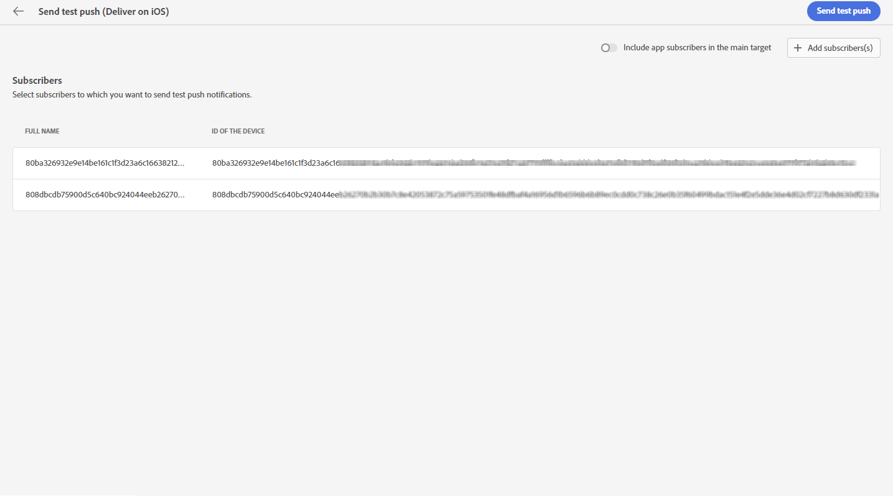

# Anteprima e invio di una consegna push {#send-push-delivery}

## Anteprima della consegna di notifiche push {#preview-push}

Dopo aver definito il contenuto del messaggio, puoi utilizzare iscritti a scopo di test per visualizzarlo in anteprima e testarlo. Se hai incluso contenuti personalizzati, puoi esaminare come questi vengono visualizzati nel messaggio utilizzando i dati del profilo di test. Potrai così assicurarti che il messaggio venga riprodotto correttamente e che gli elementi personalizzati vengano incorporati in modo appropriato.

I passaggi principali per visualizzare in anteprima la notifica push sono i seguenti. Per ulteriori dettagli su come visualizzare in anteprima le consegne, consulta [questa sezione](../preview-test/preview-content.md).

1. Dalla pagina dei contenuti della consegna, puoi utilizzare **[!UICONTROL Simula contenuto]** per visualizzare in anteprima i contenuti personalizzati.

   {zoomable=&quot;yes&quot;}

1. Fai clic su **[!UICONTROL Aggiungi iscritti]** per selezionare uno o più profili in modo da visualizzarne in anteprima i dati nel contenuto della notifica push.

   <!--Once your test subscribers are selected, click **[!UICONTROL Select]**.
    {zoomable="yes"}-->

1. Nel riquadro a destra è disponibile un’anteprima della notifica push, in cui gli elementi personalizzati vengono sostituiti dinamicamente con i dati del profilo selezionato.

   {zoomable=&quot;yes&quot;}

Ora puoi rivedere e inviare le notifiche push al pubblico.

## Test della consegna di notifiche push {#test-push}

Utilizzo di **Adobe Campaign**, puoi inviare le bozze prima di inviarle al pubblico principale. Questo passaggio è importante per convalidare la consegna e individuare eventuali problemi.
I destinatari del test possono rivedere elementi quali collegamenti, immagini e impostazioni di personalizzazione, al fine di garantire prestazioni ottimali e rilevare eventuali errori. Questo processo ti aiuta a perfezionare e ottimizzare le notifiche push prima di raggiungere il pubblico principale. [Scopri come inviare bozze](../preview-test/test-deliveries.md#subscribers)

{zoomable=&quot;yes&quot;}

## Inviare la consegna di notifiche push {#send-push}

1. Dopo aver personalizzato il contenuto della notifica push, fai clic su **[!UICONTROL Rivedi e invia]** nella pagina **[!UICONTROL Consegna]**.

   {zoomable=&quot;yes&quot;}

1. Fai clic su **[!UICONTROL Prepara]** e monitora l’avanzamento e le statistiche fornite.

   Se si verificano degli errori, fai riferimento al menu Registri per informazioni dettagliate sull’errore.

   {zoomable=&quot;yes&quot;}

1. Per inviare i messaggi, fai clic su **[!UICONTROL Invia]** per procedere con il processo di invio finale.

1. Conferma l’azione di invio facendo clic su **[!UICONTROL Invia]**.

   Se la consegna push è stata pianificata, fai clic sul pulsante **[!UICONTROL Invia come pianificato]**. Per ulteriori informazioni sulla pianificazione della consegna, consulta [questa sezione](../msg/gs-messages.md#schedule-the-delivery-sending).

   {zoomable=&quot;yes&quot;}

Una volta inviata la consegna, puoi tenere traccia dei tuoi KPI (indicatori chiave di prestazioni) dalla pagina della consegna e dei dati dal menu **[!UICONTROL Registri]**.

Ora puoi iniziare a misurare l’impatto del messaggio utilizzando i rapporti incorporati. [Ulteriori informazioni](../reporting/push-report.md)
