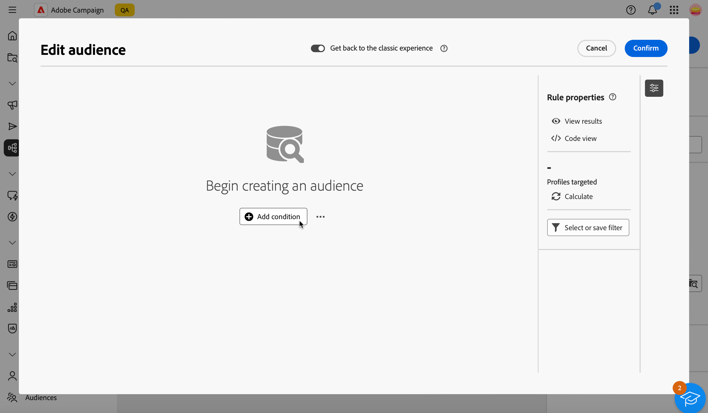

# Creare la prima query {#build-query}

Per iniziare a creare una query, accedi al query modeler dalla posizione desiderata, a seconda dell’azione da eseguire. Il modellatore di query si apre con un’area di lavoro vuota. Fai clic sul pulsante **+** per configurare il primo nodo della query.

>[!IMPORTANT]
>
>È disponibile una nuova interfaccia per Query Modeler. Il nuovo generatore di regole consente di creare la query con maggiore facilità grazie alla sua interfaccia semplificata. Per passare a questa esperienza, premi il pulsante di attivazione nell’angolo in alto a destra. Per tornare al modellatore di query classico in qualsiasi momento, è sufficiente premere nuovamente il pulsante per disattivare la nuova interfaccia. In questa nuova interfaccia è possibile applicare gli stessi principi del modellatore di query.
>{zoomable="yes"}

Puoi aggiungere due tipi di elementi:

* **I componenti filtro** (condizione personalizzata, Seleziona pubblico, filtro predefinito) ti consentono di creare regole personalizzate, selezionare un pubblico o utilizzare un filtro predefinito per perfezionare la query. Vengono aggiunte all’inizio della query e nelle transizioni punteggiate. [Scopri come utilizzare i componenti per il filtro](#filtering)

  Esempio: *Destinatari abbonati alla newsletter &quot;Sport&quot;*, *Destinatari residenti a New York*, *Destinatari residenti a San Francisco*

>[!BEGINTABS]

>[!TAB Modellatore di query classico]

{zoomable="yes"}

>[!TAB Nuovo generatore di regole]

{zoomable="yes"}

>[!ENDTABS]

* **Gli operatori di gruppo** (AND, OR, EXCEPT) consentono di raggruppare i componenti di filtro nel diagramma. Vengono aggiunte alle transizioni esistenti prima di un componente di filtro. [Scopri come utilizzare gli operatori](#filtering)

  Esempio: *Destinatari che sono VIP Super VIP **AND** per premiare **OR** Demo VIP, **ECCETTO** destinatari di età inferiore a 21 anni e superiore a 45.

>[!BEGINTABS]

>[!TAB Modellatore di query classico]

{zoomable="yes"}

>[!TAB Nuovo generatore di regole]

{zoomable="yes"}

>[!ENDTABS]

## Distribuzione dei valori in una query {#distribution-values-query}

La distribuzione dei valori mostra la percentuale di ciascun valore di un campo all’interno di una tabella, in base ai parametri di query correnti. Conoscere la distribuzione dei valori all’interno di una query aiuta a perfezionare la segmentazione.

Per accedere a questa opzione, nella query fai clic sul pulsante di selezione dell’attributo come mostrato di seguito. Quindi, fai clic sull&#39;icona **[!UICONTROL Informazioni]** accanto all&#39;attributo selezionato. Puoi accedere al pulsante **[!UICONTROL Distribuzione di valori]**.

{zoomable="yes"}

>[!NOTE]
>
>* Per i campi con molti valori, vengono visualizzati solo i primi venti valori. In questi casi, un avviso di notifica **[!UICONTROL Carico parziale]** ti avvisa.
>* L&#39;opzione **[!UICONTROL Distribuzione dei valori]** è accessibile in ogni selettore di attributi. [Scopri come selezionare gli attributi](../get-started/attributes.md)
>* Puoi aggiungere condizioni ai risultati utilizzando **[!Afiltri avanzati]**. [Ulteriori informazioni](../get-started/work-with-folders.md#filter-the-values).

## Aggiungere i componenti per il filtro {#filtering}

I componenti per il filtro consentono di perfezionare la query utilizzando:

* **[Condizioni personalizzate](#custom-condition)**: per filtrare la query creando la tua condizione personalizzata con gli attributi dal database e le espressioni avanzate.
* **[Tipi di pubblico](#audiences)**: per filtrare la query utilizzando un pubblico esistente.
* **[Filtro predefinito](#predefined-filters)**: per filtrare la query utilizzando filtri preimpostati esistenti.

### Configurare una condizione personalizzata {#custom-condition}

>[!CONTEXTUALHELP]
>id="acw_orchestration_querymodeler_customcondition"
>title="Condizione personalizzata"
>abstract="Le condizioni personalizzate sono componenti di filtraggio che consentono di filtrare la query creando la propria condizione con attributi provenienti dal database ed espressioni avanzate."

Per filtrare la query utilizzando una condizione personalizzata, effettua le seguenti operazioni:

1. Fai clic sul pulsante **+** sul nodo desiderato e seleziona **[!UICONTROL Condizione personalizzata]**. Il riquadro delle proprietà della condizione personalizzata viene visualizzato sul lato destro.

1. Nel campo **Attributo** selezionare l&#39;attributo dal database che si desidera utilizzare per creare la condizione. L’elenco degli attributi include tutti gli attributi del database di Campaign, inclusi quelli delle tabelle collegate. [Scopri come selezionare gli attributi e aggiungerli ai preferiti](../get-started/attributes.md)

   {zoomable="yes"}

   >[!NOTE]
   >
   >Il pulsante **Modifica espressione** consente di utilizzare l&#39;editor espressioni Web di Campaign per definire manualmente un&#39;espressione utilizzando i campi delle funzioni di supporto e del database. [Scopri come modificare le espressioni](expression-editor.md)

1. Seleziona l’operatore da applicare dall’elenco a discesa. Sono disponibili diversi operatori da utilizzare. Gli operatori disponibili nell’elenco a discesa dipendono dal tipo di dati dell’attributo.

   +++Elenco degli operatori disponibili

   | Operatore | Scopo | Esempio |
   |---|---|---|
   | Uguale a | Restituisce un risultato identico ai dati immessi nella seconda colonna Valore. | Il cognome (@lastName) uguale a &quot;Jones&quot; restituirà solo i destinatari il cui cognome è Jones. |
   | Non uguale a | Restituisce tutti i valori non identici al valore inserito. | Lingua (@language) non uguale a &#39;Inglese&#39;. |
   | Maggiore di | Restituisce un valore maggiore del valore immesso. | L&#39;età (@age) maggiore di 50 restituirà tutti i valori maggiori di &#39;50&#39;, ad esempio &#39;51&#39;, &#39;52&#39;. |
   | Minore di | Restituisce un valore minore del valore immesso. | La data di creazione (@created) prima di &#39;DaysAgo(100)&#39; restituirà tutti i destinatari creati meno di 100 giorni fa. |
   | Maggiore o uguale a | Restituisce tutti i valori uguali o maggiori del valore immesso. | L’età (@age) maggiore o uguale a &quot;30&quot; restituirà tutti i destinatari di età pari o superiore a 30 anni. |
   | Minore o uguale a | Restituisce tutti i valori uguali o inferiori al valore immesso. | L’età (@age) inferiore o uguale a &quot;60&quot; restituirà tutti i destinatari di età pari o inferiore a 60 anni. |
   | Incluso in | Restituisce i risultati inclusi nei valori indicati. Questi valori devono essere separati da una virgola. | La data di nascita (@birthDate) è inclusa in &quot;12/10/1979,12/10/1984&quot; per restituire i destinatari nati tra queste date. |
   | Non in | Funziona come l’operatore Incluso in. In questo caso, i destinatari vengono esclusi in base ai valori immessi. | La data di nascita (@birthDate) non è inclusa in “10/12/1979,10/12/1984”. I destinatari nati in queste date non verranno restituiti. |
   | È vuoto | Restituisce risultati che corrispondono a un valore vuoto nella seconda colonna Valore. | Cellulare (@mobilePhone) è vuoto restituisce tutti i destinatari che non hanno un numero di cellulare. |
   | Non è vuoto | Funziona in modo inverso rispetto all’operatore È vuoto. Non è necessario immettere dati nella seconda colonna Valore. | Il campo E-mail (@email) non è vuoto. |
   | Inizia con | Restituisce i risultati che iniziano con il valore inserito. | Account # (@account) inizia con “32010”. |
   | Non inizia con | Restituisce i risultati che non iniziano con il valore inserito. | Il numero account (@account) non inizia con &quot;20&quot;. |
   | Contiene | Restituisce risultati contenenti almeno il valore inserito. | Il dominio e-mail (@domain) contiene &#39;mail&#39; restituirà tutti i nomi di dominio che contengono &#39;mail&#39;, ad esempio &#39;gmail.com&#39;. |
   | Non contiene | Restituisce risultati che non contengono il valore immesso. | Il dominio e-mail (@domain) non contiene &#39;vo&#39;. I nomi di dominio contenenti &#39;vo&#39;, ad esempio &#39;voilà.fr&#39;, non verranno visualizzati nei risultati. |
   | Simile a | Simile all&#39;operatore Contains, consente di inserire un carattere jolly % nel valore. | Cognome (@lastName) simile a “Jon%s”. Il carattere jolly funge da &quot;jolly&quot; per trovare nomi come &quot;Jones&quot;. |
   | Diverso da | Simile all&#39;operatore Contains, consente di inserire un carattere jolly % nel valore. | Cognome (@lastName) diverso da “Smi%h”. I destinatari il cui cognome è &quot;Smith&quot; non verranno restituiti. |

   +++

1. Nel campo **Valore**, definisci il valore previsto. È inoltre possibile utilizzare l’editor di espressioni web di Campaign per definire manualmente un’espressione utilizzando i campi delle funzioni di supporto e di database. A tale scopo, fare clic sul pulsante **Modifica espressione**. [Scopri come modificare le espressioni](expression-editor.md)

   *Esempio di query che restituisce tutti i profili di età pari o superiore a 21 anni:*

>[!BEGINTABS]

>[!TAB Modellatore di query classico]

{zoomable="yes"}

>[!TAB Nuovo generatore di regole]

{zoomable="yes"}

>[!ENDTABS]

Per gli attributi di tipo data, i valori predefiniti sono disponibili utilizzando l&#39;opzione **[!UICONTROL Predefiniti]**.

>[!BEGINTABS]

>[!TAB Modellatore di query classico]

{zoomable="yes"}

>[!TAB Nuovo generatore di regole]

{zoomable="yes"}

>[!ENDTABS]

#### Condizioni personalizzate sulle tabelle collegate (collegamenti 1-1 e 1-N){#links}

Le condizioni personalizzate consentono di eseguire query sulle tabelle collegate alla tabella attualmente utilizzata dalla regola. Questo include tabelle con un collegamento di cardinalità 1-1 o tabelle di raccolta (collegamento 1-N).

Per un collegamento **1-1**, passare alla tabella collegata, selezionare l&#39;attributo desiderato e definire il valore previsto.

Puoi anche selezionare direttamente un collegamento alla tabella nel selettore **Valore** e confermare. In tal caso, i valori disponibili per la tabella selezionata devono essere selezionati utilizzando un selettore dedicato, come illustrato nell’esempio seguente.

+++Esempio di query

In questo caso, la query esegue il targeting dei brand la cui etichetta è &quot;in esecuzione&quot;.

1. Naviga nella tabella **Brand** e seleziona l&#39;attributo **Label**.

   {zoomable="yes"}{width="85%" align="center"}

1. Definisci il valore previsto per l’attributo.

   {zoomable="yes"}{width="85%" align="center"}

Di seguito è riportato un esempio di query in cui è stato selezionato direttamente un collegamento di tabella. I valori disponibili per questa tabella devono essere selezionati da un selettore dedicato.

{zoomable="yes"}{width="85%" align="center"}

+++ 

Per un collegamento **1-N**, puoi definire le condizioni secondarie per perfezionare la query, come illustrato nell&#39;esempio seguente.

+++Esempio di query

In questo caso, la query ha come targeting destinatari che hanno effettuato acquisti relativi al prodotto BrewMaster, per un importo totale di almeno 100 $.

1. Seleziona la tabella **Acquisti** e conferma.

   {zoomable="yes"}{width="50%" align="center"}

1. Viene aggiunta una transizione in uscita che consente di creare condizioni secondarie.

   {zoomable="yes"}{width="85%" align="center"}

1. Seleziona l&#39;attributo **Prezzo** e esegui acquisti target di almeno 1000$

   {zoomable="yes"}{width="85%" align="center"}

1. Aggiungi condizioni secondarie in base alle tue esigenze. Qui abbiamo aggiunto una condizione per eseguire il targeting dei profili che hanno acquistato un prodotto BrewMaster.

   {zoomable="yes"}{width="85%" align="center"}

+++ 

#### Utilizzare i dati aggregati {#aggregate}

Le condizioni personalizzate consentono di eseguire operazioni di aggregazione. A questo scopo, devi selezionare direttamente un attributo da una tabella di raccolta:

1. Spostarsi all&#39;interno della tabella di raccolta desiderata e selezionare l&#39;attributo sul quale si desidera eseguire un&#39;operazione di aggregazione.

   {zoomable="yes"}{width="85%" align="center"}

1. Nel riquadro delle proprietà, attivare l&#39;opzione **Aggregate data** e selezionare la funzione di aggregazione desiderata.

>[!BEGINTABS]

>[!TAB Modellatore di query classico]

{zoomable="yes"}{width="85%" align="center"}

>[!TAB Nuovo generatore di regole]

{zoomable="yes"}{width="85%" align="center"}

>[!ENDTABS]

### Selezionare un pubblico {#audiences}

>[!CONTEXTUALHELP]
>id="acw_orchestration_querymodeler_selectaudience"
>title="Selezionare il tipo di pubblico"
>abstract="Utilizzando l’opzione **Seleziona pubblico**, puoi scegliere il pubblico da utilizzare per filtrare la query."

Per filtrare la query utilizzando un pubblico esistente, effettua le seguenti operazioni:

>[!BEGINTABS]

>[!TAB Modellatore di query classico]

1. Fai clic sul pulsante **+** sul nodo desiderato e scegli **[!UICONTROL Seleziona pubblico]**.

1. Il pannello delle proprietà **Seleziona pubblico** si apre sul lato destro. Scegli il pubblico che desideri utilizzare per filtrare la query.

   *Esempio di query che restituisce tutti i profili appartenenti al pubblico “Partecipanti al festival”:*

   {zoomable="yes"}

>[!TAB Nuovo generatore di regole]

1. Fai clic sul pulsante **Espandi** accanto al pulsante **[!UICONTROL Aggiungi condizione]** e scegli **[!UICONTROL Seleziona pubblico]**.

1. Il pannello delle proprietà **Seleziona pubblico** si apre sul lato destro. Scegli il pubblico che desideri utilizzare per filtrare la query.

   *Esempio di query che restituisce tutti i profili appartenenti al pubblico &quot;Coffee Works&quot;:*

   {zoomable="yes"}

>[!ENDTABS]

### Utilizzare un filtro preimpostato {#predefined-filters}

>[!CONTEXTUALHELP]
>id="acw_orchestration_querymodeler_predefinedfilter"
>title="Filtro preimpostato"
>abstract="Con l’opzione **Filtro preimpostato** puoi selezionare un filtro preimpostato dall’elenco dei filtri personalizzati o dai preferiti."

Per filtrare la query utilizzando un filtro preimpostato, effettua le seguenti operazioni:

>[!BEGINTABS]

>[!TAB Modellatore di query classico]

1. Fai clic sul pulsante **+** sul nodo desiderato e seleziona **[!UICONTROL Filtro preimpostato]**.

1. Il pannello delle proprietà **Filtro preimpostato** si apre sul lato destro. Seleziona un filtro preimpostato dall’elenco dei filtri personalizzati o dai preferiti.

   *Esempio di query che restituisce tutti i profili corrispondenti al filtro preimpostato “Clienti inattivi”:*

   {zoomable="yes"}

>[!TAB Nuovo generatore di regole]

1. Fai clic sul pulsante **Espandi** accanto al pulsante **[!UICONTROL Aggiungi condizione]** e seleziona **[!UICONTROL Filtro predefinito]**.

1. Il pannello delle proprietà **Filtro preimpostato** si apre sul lato destro. Seleziona un filtro preimpostato dall’elenco dei filtri personalizzati o dai preferiti.

   *Esempio di query che restituisce tutti i profili corrispondenti al filtro preimpostato “Clienti inattivi”:*

   {zoomable="yes"}

>[!ENDTABS]

### Copiare e incollare componenti {#copy}

Query Modeler consente di copiare uno o più componenti di filtro e incollarli al termine di una transizione. Questa operazione può essere eseguita nell’area di lavoro query corrente o in qualsiasi area di lavoro all’interno dell’istanza.

>[!NOTE]
>
>La selezione copiata viene mantenuta per tutto il tempo in cui si lavora nell’istanza. Se si disconnette e si effettua nuovamente l&#39;accesso, la selezione non sarà più disponibile per l&#39;incollamento.

>[!IMPORTANT]
>
>Al momento è impossibile copiare e incollare componenti nell’esperienza del nuovo generatore di regole. Per eseguire i passaggi successivi, fare clic sull&#39;interruttore **[!UICONTROL Torna all&#39;esperienza classica]** nella parte superiore per utilizzare il modello di query classico.

Per copiare e incollare i componenti di filtro, effettua le seguenti operazioni:

1. Seleziona il componente filtro da copiare facendo clic su di esso nell’area di lavoro della query. Per selezionare più componenti, utilizza lo strumento per la selezione multipla disponibile nella barra degli strumenti situata nell’angolo superiore destro dell’area di lavoro.

1. Se hai selezionato più componenti, fai clic sul pulsante **[!UICONTROL Copia]** nel riquadro delle proprietà del componente o sulla barra multifunzione blu nella parte inferiore dello schermo.

   | Copiare un singolo componente | Copiare più componenti |
   |  ---  |  ---  |
   | {zoomable="yes"}{width="200" align="center" zoomable="yes"} | {zoomable="yes"}{width="200" align="center" zoomable="yes"} |

1. Per incollare i componenti, fai clic sul pulsante + alla fine della transizione desiderata e seleziona **Incolla n elementi**.

   {zoomable="yes"}

## Trascinare i componenti {#drag-and-drop}

>[!IMPORTANT]
>
>Questa funzione è disponibile solo per la nuova esperienza di generatore di regole.

Quando aggiungi componenti alla query, puoi spostarli verso l’alto o il basso utilizzando la funzione di trascinamento della selezione.

A sinistra di ogni componente, puoi fare clic sui punti e tenerli premuti per trascinare il componente verso l’alto o il basso, a seconda di dove desideri inserire e raggruppare i componenti.

{zoomable="yes"}

## Combinare componenti di filtraggio con operatori {#operators}

>[!CONTEXTUALHELP]
>id="acw_orchestration_querymodeler_group"
>title="Gruppo"
>abstract="In questo riquadro, puoi modificare l’operatore utilizzato per collegare insieme più condizioni di filtro."

Ogni volta che si aggiunge un nuovo componente di filtro alla query, questo viene automaticamente collegato all&#39;altro componente da un operatore **AND**. Ciò significa che i risultati dei due componenti di filtraggio sono combinati.

In questo esempio, è stato aggiunto un nuovo componente di filtraggio per il tipo di pubblico alla seconda transizione. Il componente è collegato alla condizione di filtro predefinita con un operatore **AND**, il che significa che i risultati della query includono i destinatari interessati dal filtro predefinito &quot;Abbonati newsletter - MADRID&quot; E appartenenti al pubblico &quot;Acquirenti (in qualsiasi momento)&quot;.

>[!BEGINTABS]

>[!TAB Modellatore di query classico]

{zoomable="yes"}

Per modificare l&#39;operatore utilizzato per collegare insieme le condizioni di filtro, fare clic su di esso e selezionare l&#39;operatore desiderato nel riquadro **Gruppo** visualizzato sul lato destro.

Gli operatori disponibili sono:

* **AND (intersezione)**: combina i risultati che corrispondono a tutti i componenti di filtraggio nelle transizioni in uscita.
* **OR (Unione)**: include i risultati che corrispondono ad almeno uno dei componenti di filtraggio nelle transizioni in uscita.
* **ECCETTO (esclusione)**: esclude i risultati che corrispondono a tutti i componenti di filtraggio nella transizione in uscita.

{zoomable="yes"}

È inoltre possibile creare gruppi intermedi di componenti raggruppando i componenti in uno stesso gruppo e collegandoli tra loro. In questo modo, l’operatore AND viene inserito per impostazione predefinita e puoi quindi modificarlo nell’operatore desiderato.

>[!TAB Nuovo generatore di regole]

{zoomable="yes"}

Per cambiare l’operatore utilizzato per collegare insieme le condizioni di filtro, fai clic su di esso, cambierà in O, ECCETTO, quindi di nuovo in E, e seleziona l’operatore desiderato.

Gli operatori disponibili sono:

* **AND (intersezione)**: combina i risultati che corrispondono a tutti i componenti di filtraggio nelle transizioni in uscita.
* **OR (Unione)**: include i risultati che corrispondono ad almeno uno dei componenti di filtraggio nelle transizioni in uscita.
* **ECCETTO (esclusione)**: esclude i risultati che corrispondono a tutti i componenti di filtraggio nella transizione in uscita.

{zoomable="yes"}

>[!ENDTABS]

Nell’esempio seguente, abbiamo creato un gruppo intermedio per includere i risultati del pubblico &quot;VIP to reward&quot; (Da a ricompensare) o &quot;Super VIP&quot; (Super).

>[!BEGINTABS]

>[!TAB Modellatore di query classico]

{zoomable="yes"}

>[!TAB Nuovo generatore di regole]

{zoomable="yes"}

>[!ENDTABS]

## Controllare e convalidare la query

>[!CONTEXTUALHELP]
>id="acw_orchestration_querymodeler_ruleproperties"
>title="Proprietà delle regole"
>abstract="Dopo aver creato la query nell’area di lavoro, puoi verificarla utilizzando il riquadro **Proprietà delle regole** sul lato destro. Questo riquadro consente di visualizzare i dati risultanti, recuperare una versione del codice SQL della query e verificare il numero di record target. Utilizza il pulsante **Seleziona o salva il filtro** per salvare la query come filtro preimpostato o sostituisci il contenuto dell’area di lavoro con un filtro esistente."

Dopo aver creato la query nell&#39;area di lavoro, puoi controllarla utilizzando il riquadro **Proprietà regola** situato sul lato destro. Questo riquadro viene visualizzato quando si crea una query per creare un pubblico. Le operazioni disponibili sono:

* **Visualizza risultati:** visualizza i dati risultanti dalla query.
* **Vista codice**: visualizza una versione della query basata su codice in SQL.
* **Calcola**: aggiorna e visualizza il numero di record interessati dalla query.
* **Selezionare o salvare il filtro**: scegli un filtro preimpostato esistente da utilizzare nell’area di lavoro oppure salva la query come filtro preimpostato per riutilizzarla in futuro. [Scopri come utilizzare i filtri preimpostati](../get-started/predefined-filters.md)

  >[!IMPORTANT]
  >
  >La selezione di un filtro preimpostato dal pannello Proprietà regole sostituisce la query creata nell’area di lavoro con il filtro selezionato.

Quando utilizzi la nuova esperienza di Generatore di regole, puoi visualizzare la popolazione target direttamente su ogni condizione e gruppo:

* Fai clic sull&#39;icona **Calcola la condizione** sulla condizione o sul gruppo desiderato per calcolare e visualizzare il numero di record interessati dalla query.
* Fare clic sul numero di risultati per visualizzare l&#39;elenco dettagliato dei record.

{zoomable="yes"}

Quando la query è pronta, fai clic sul pulsante **[!UICONTROL Conferma]** nell&#39;angolo superiore destro per salvarla.

>[!BEGINTABS]

>[!TAB Modellatore di query classico]

Puoi modificare la query in qualsiasi momento aprendola. Tenere presente che all&#39;apertura di una query esistente, questa viene visualizzata in una visualizzazione semplificata senza la visibilità di **+** pulsanti. Per aggiungere nuovi elementi alla query, selezionare un componente o un operatore nell&#39;area di lavoro per visualizzare i pulsanti **+**.

{zoomable="yes"}

>[!TAB Nuovo generatore di regole]

Puoi modificare la query in qualsiasi momento aprendola e facendo clic sul pulsante **[!UICONTROL Aggiungi condizione]** nell&#39;angolo in alto a sinistra.

{zoomable="yes"}

>[!ENDTABS]
