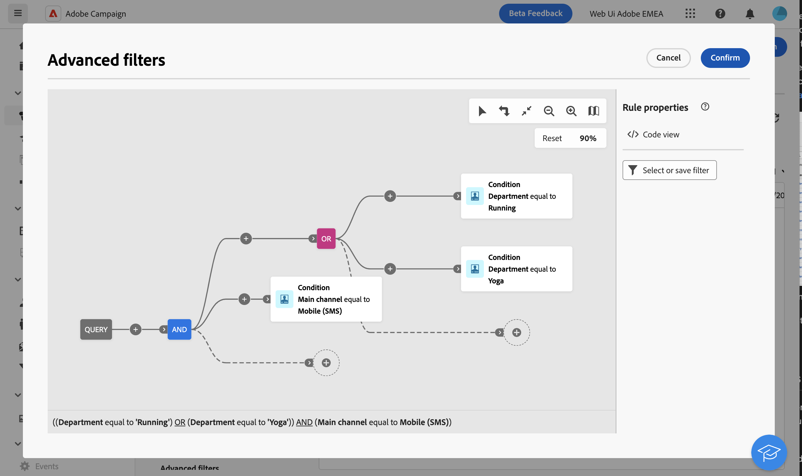

# Filtrare elenchi {#filter-lists}

Adobe Campaign Web fornisce filtri all’interno di ogni elenco di oggetti, consentendo di filtrare le informazioni in base a criteri contestuali specifici. Ad esempio, puoi filtrare le consegne in base al loro stato, canale, data di contatto o cartella. È inoltre possibile nascondere le bozze.

>[!IMPORTANT]
>
>È disponibile una nuova interfaccia per Query Modeler. Il nuovo generatore di regole consente di creare la query con maggiore facilità grazie alla sua interfaccia semplificata. Per passare a questa esperienza, premi il pulsante di attivazione nell’angolo in alto a destra. Per tornare al modellatore di query classico in qualsiasi momento, è sufficiente premere nuovamente il pulsante per disattivare la nuova interfaccia. In questa nuova interfaccia è possibile applicare gli stessi principi del modellatore di query.
>&#x200B;>{zoomable="yes"}

## Applicare i filtri {#apply}

Per applicare i filtri a un elenco, fare clic sul pulsante **[!UICONTROL Mostra filtri]** nell&#39;angolo superiore sinistro dell&#39;elenco, accanto alla barra di ricerca.

Viene visualizzato il riquadro Filtri, in cui sono visualizzati i filtri disponibili per l’elenco selezionato. Ad esempio, puoi filtrare le campagne in base al loro stato, alle date di inizio e fine o alla cartella di archiviazione, mentre l’elenco dei servizi di abbonamento può essere filtrato in base al loro canale e alla loro cartella di archiviazione.

{zoomable="yes"}{width="70%" align="left" zoomable="yes"}

Per filtrare un elenco in base a criteri personalizzati, crea un filtro personalizzato. A tale scopo, spostarsi nella parte inferiore del riquadro dei filtri e fare clic sul pulsante **Aggiungi regole**. [Scopri come creare filtri personalizzati](#custom).

Una volta applicati a un elenco, i filtri sono visibili sotto la barra di ricerca. È possibile rimuovere un singolo filtro in qualsiasi momento oppure rimuovere tutti i filtri facendo clic sul pulsante **Cancella tutto**.

## Creare filtri personalizzati {#custom}

I filtri personalizzati ti consentono di perfezionare gli elenchi in base a criteri specifici. Sono progettate utilizzando il modellatore di query di Campaign. Per creare un filtro personalizzato, effettua le seguenti operazioni:

1. Apri il riquadro Filtri e fai clic sul pulsante **Aggiungi regole** situato nella parte inferiore del riquadro.

1. Viene aperto Query Modeler. Definisci e combina i criteri di filtro in base alle tue esigenze. Informazioni dettagliate sull&#39;utilizzo di Query Modeler sono disponibili in [questa sezione](../query/query-modeler-overview.md).

   L’esempio seguente mostra un filtro personalizzato progettato per visualizzare nell’elenco delle campagne le campagne SMS eseguite dagli operatori dei dipartimenti in esecuzione o Yoga.

   {zoomable="yes"}{width="70%" align="left" zoomable="yes"}

1. Una volta configurato il filtro personalizzato, fai clic su **[!UICONTROL Conferma]** per applicarlo all&#39;elenco.