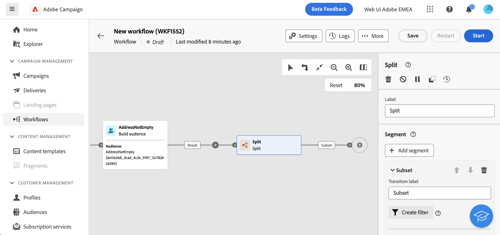
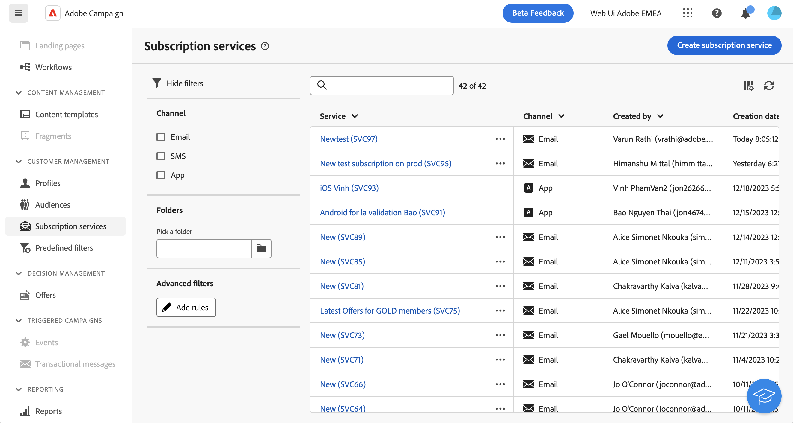

# Utilizzo del query modeler {#segment-builder}

>[!CONTEXTUALHELP]
>id="acw_homepage_learning_card5"
>title="Nuovo query modeler"
>abstract="Adobe Campaign Web dispone di un query modeler che semplifica il processo di filtraggio dei database per selezionare destinazioni specifiche in base a vari criteri. Tra i criteri figurano l’utilizzo di espressioni avanzate e operatori. Il query modeler è disponibile in ogni contesto in cui è necessario definire regole per filtrare i dati."

>[!CONTEXTUALHELP]
>id="acw_orchestration_querymodeler_querymessage"
>title="Query modeler"
>abstract="Definisci i criteri di filtro per i destinatari o qualsiasi altra dimensione targeting dal database. Approfitta del pubblico di Adobe Experience Platform per migliorare ulteriormente il pubblico target e massimizzare l’impatto della campagna."

>[!CONTEXTUALHELP]
>id="acw_deliveries_refine_target"
>title="Perfezionare la destinazione"
>abstract="Questi regole possono essere modificate solo nella console client."

L’interfaccia utente web di Adobe Campaign dispone di un modellatore di query che semplifica il processo di filtraggio del database in base a vari criteri. Garantisce la piena compatibilità con le query create nella console client, semplificando la transizione all’interfaccia utente web.

Inoltre, Query Modeler è in grado di gestire in modo efficiente query molto complesse e lunghe, offrendo maggiore flessibilità e precisione. Inoltre, supporta filtri predefiniti all’interno di condizioni, consentendoti di perfezionare le query con facilità e allo stesso tempo di utilizzare espressioni avanzate e operatori per strategie complete di targeting del pubblico e segmentazione.

## Accedere al query modeler

Il query modeler è disponibile in ogni contesto in cui è necessario definire regole per filtrare i dati.

| Utilizzo | Esempio |
|  ---  |  ---  |
| **Definisci i tipi di pubblico**: specifica la popolazione di cui desideri eseguire il targeting nei messaggi o nei flussi di lavoro e crea facilmente nuovi tipi di pubblico personalizzati in base alle tue esigenze. [Scopri come creare tipi di pubblico](../audience/one-time-audience.md) |  |
| **Personalizza attività flusso di lavoro**: applica regole all&#39;interno delle attività del flusso di lavoro, ad esempio **Dividi** e **Riconciliazione**, per allinearle ai requisiti specifici. [Ulteriori informazioni sulle attività del flusso di lavoro](../workflows/activities/about-activities.md) |  |
| **Filtri predefiniti**: crea filtri predefiniti da usare come scelte rapide durante varie operazioni di filtro, sia che si utilizzino elenchi di dati che che si formi il pubblico per una consegna. [Scopri come utilizzare i filtri preimpostati](../get-started/predefined-filters.md) |  |
| **Filtrare i dati dei rapporti**: aggiungi una regola per filtrare i dati visualizzati nei rapporti. [Scopri come utilizzare i report](../reporting/gs-reports.md) |  |
| **Personalizza elenchi**: crea regole personalizzate per filtrare i dati visualizzati in elenchi come destinatari, elenchi di consegne, ecc. [Scopri come filtrare gli elenchi](../get-started/list-filters.md#list-built-in-filters) |  |
| **Crea contenuto condizionale**: rendi dinamico il contenuto delle e-mail creando condizioni che definiscono quale contenuto deve essere visualizzato a destinatari diversi, garantendo messaggi personalizzati e pertinenti. [Scopri come creare contenuti condizionali](../personalization/conditions.md) |  |

>[!NOTE]
>
>Quando si accede a un oggetto creato nella console client in cui sono state applicate regole quali un pubblico o un filtro predefinito, è possibile che venga visualizzata la sezione **[!UICONTROL Perfeziona destinazione]**. Ciò significa che sono stati configurati parametri aggiuntivi per perfezionare il target della regola. Questi parametri possono essere modificati solo nella console.
>
>

## Interfaccia del query modeler {#interface}

>[!CONTEXTUALHELP]
>id="acw_rule_builder_switch_button"
>title="Nuova esperienza utente"
>abstract="Utilizza questa opzione per passare dal modellatore di query classico alla nuova esperienza di generatore di regole."

Il modellatore di query fornisce un’area di lavoro centrale in cui creare la query e un riquadro a destra che fornisce informazioni sulla query.

### Area di lavoro centrale {#canvas}

L’area di lavoro centrale di Query Modeler è il luogo in cui puoi aggiungere e combinare i diversi componenti che creano la query. [Scopri come creare una query](build-query.md)

La barra degli strumenti situata nell’angolo superiore destro dell’area di lavoro offre opzioni per manipolare facilmente i componenti della query e navigare nell’area di lavoro:

* **Modalità di selezione multipla**: selezionare più componenti filtro per copiarli e incollarli nel percorso desiderato.
* **Ruota**: cambia l&#39;area di lavoro verticalmente.
* **Adatta allo schermo**: adatta il livello di zoom dell&#39;area di lavoro allo schermo.
* **Zoom indietro** / **Zoom avanti**: Zoom indietro o nell&#39;area di lavoro.
* **Mappa di visualizzazione**: apre uno snapshot dell&#39;area di lavoro che mostra che ci si trova.

### Riquadro delle proprietà della regola {#rule-properties}

Sul lato destro, il riquadro **[!UICONTROL Proprietà regola]** fornisce informazioni sulla query. Consente di eseguire varie operazioni per verificare la query e assicurarsi che sia adatta alle tue esigenze. Questo riquadro viene visualizzato quando si crea una query per creare un pubblico. [Scopri come controllare e convalidare la query](build-query.md#check-and-validate-your-query)
