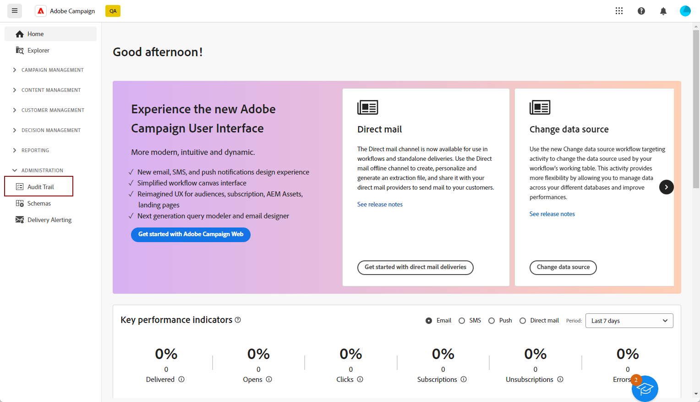

# Audit trail {#audit-trail}

Nell&#39;interfaccia utente di Adobe Campaign Web, la funzione **[!UICONTROL Audit trail]** fornisce agli utenti la piena visibilità di tutte le modifiche apportate a entità importanti all&#39;interno dell&#39;istanza, in genere quelle che influiscono in modo significativo sul corretto funzionamento dell&#39;istanza.

>[!IMPORTANT]
>
>* L’interfaccia utente web di Adobe Campaign non controlla le modifiche apportate all’interno di diritti utente, modelli, personalizzazioni o campagne.
>* Solo gli amministratori dell’istanza possono gestire l’audit trail.

La funzione **[!UICONTROL Audit trail]** registra costantemente in tempo reale un registro dettagliato delle azioni e degli eventi che si verificano all&#39;interno dell&#39;istanza di Adobe Campaign. Offre un metodo comodo per accedere a un record cronologico di dati, che tratta query quali lo stato dei flussi di lavoro, gli utenti più recenti per modificarli o le attività eseguite dagli utenti all’interno dell’istanza.

+++ Ulteriori informazioni sulle entità disponibili in Audit Trail

* **Audit trail dello schema Source** consente di monitorare le attività e le modifiche recenti apportate agli schemi nella console client di Campaign v8.

  Per informazioni dettagliate sugli schemi, consulta [Documentazione di Campaign v8](https://experienceleague.adobe.com/en/docs/campaign/campaign-v8/developer/shemas-forms/schemas).

* **Audit trail del flusso di lavoro** consente di tenere traccia delle attività e delle modifiche recenti apportate ai flussi di lavoro, inclusi i relativi stati correnti, ad esempio:

   * Inizio
   * Pausa
   * Interruzione
   * Riavvio
   * Pulizia, che è uguale all’azione Cancella cronologia
   * Simula, che è uguale all’azione Avvia in modalità simulazione
   * Riattivazione, che è uguale all’azione Esegui subito le attività in sospeso
   * Arresto totale

  Per ulteriori informazioni sui flussi di lavoro, consulta questa [pagina](../workflows/gs-workflows.md).

* **Option audit trail** consente di monitorare le attività e le modifiche recenti apportate alle opzioni in Campaign v8.

  Per ulteriori informazioni sulle opzioni, consulta questa [pagina](https://experienceleague.adobe.com/en/docs/campaign-classic/using/installing-campaign-classic/appendices/configuring-campaign-options).

* **Audit trail consegna** consente di controllare le attività e le ultime modifiche apportate alle consegne.

  Per ulteriori informazioni sulle consegne, consulta questa [pagina](../msg/gs-deliveries.md).

* **Account esterno** consente di controllare le modifiche apportate agli account esterni in Campaign v8, utilizzate da processi tecnici quali flussi di lavoro tecnici o flussi di lavoro per campagne.

  Per ulteriori informazioni sugli account esterni, consulta questa [pagina](../administration/external-account.md).

* **Mappatura consegna** consente di monitorare le attività e le modifiche recenti apportate alla mappatura consegna in Campaign v8.

  Per ulteriori informazioni sulla mappatura della consegna, consulta questa [pagina](https://experienceleague.adobe.com/en/docs/campaign/campaign-v8/audience/add-profiles/target-mappings).

* **Applicazione Web** consente di verificare le modifiche apportate ai moduli Web in Campaign v8, utilizzati per creare pagine con campi di input e di selezione e che possono includere dati dal database.

  Per ulteriori informazioni sulle applicazioni Web, consulta questa [pagina](https://experienceleague.adobe.com/en/docs/campaign/campaign-v8/content/webapps).

* **Offerta** ti consente di controllare le attività e le ultime modifiche apportate alle offerte.

  Per ulteriori informazioni sulle offerte, consulta questa [pagina](../msg/offers.md).

* **Operatore** consente di monitorare le attività e le modifiche recenti apportate agli operatori in Campaign v8.

  Per ulteriori informazioni sugli operatori, consulta questa [pagina](https://experienceleague.adobe.com/en/docs/campaign/campaign-v8/offers/interaction-settings/interaction-operators).

+++

## Accesso a Audit trail {#accessing-audit-trail}

Per accedere al **[!UICONTROL riepilogo di controllo]** dell&#39;istanza:

1. Nel menu **[!UICONTROL Amministrazione]**, seleziona **[!UICONTROL Audit trail]**.

   

1. Viene visualizzata la finestra **[!UICONTROL Audit trail]** con l&#39;elenco delle entità. L’interfaccia utente web di Adobe Campaign controlla le azioni di creazione, modifica ed eliminazione per flussi di lavoro, opzioni, consegne e schemi.

   Selezionate una delle entità per ulteriori informazioni sulle ultime modifiche.

1. La finestra **[!UICONTROL Entità di controllo]** fornisce informazioni dettagliate sull&#39;entità selezionata, ad esempio:

   * **[!UICONTROL Tipo]**: flusso di lavoro, opzioni, consegne o schemi.
   * **[!UICONTROL Entità]**: nome interno delle attività.
   * **[!UICONTROL Modificato da]**: nome utente dell&#39;ultima persona che ha modificato questa entità.
   * **[!UICONTROL Azione]**: ultima azione eseguita sull&#39;entità, Creata, Modificata o Eliminata.
   * **[!UICONTROL Data di modifica]**: data dell&#39;ultima azione eseguita su questa entità.

   Il blocco di codice fornisce ulteriori informazioni su ciò che è stato modificato esattamente nell’entità.

   