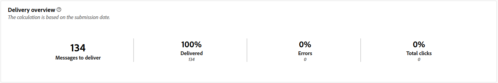

# Rapporti sulle campagne per il canale Direct mail {#campaign-reports-direct-mail}

Ogni rapporto di una campagna è suddiviso in diversi widget che ne descrivono il successo e gli errori. Di seguito sono riportati i rapporti e le metriche per il canale direct mailing. Scopri come accedere ai rapporti sulle campagne in [questa pagina](campaign-reports.md).

## Riepilogo della consegna {#delivery-summary-direct}

### Panoramica della consegna {#delivery-overview-direct}

>[!CONTEXTUALHELP]
>id="acw_campaign_reporting_delivery_overview_direct_mail"
>title="Panoramica della consegna"
>abstract="La **Panoramica della consegna** presenta le metriche delle prestazioni chiave (KPI) che offrono informazioni approfondite sull’interazione dei visitatori con ogni consegna di direct maili. Le metriche sono descritte di seguito."

La **[!UICONTROL Panoramica della consegna]** presenta le metriche delle prestazioni chiave (KPI, Key Performance Metrics) e offre informazioni approfondite sull&#39;interazione dei visitatori con ogni consegna direct mailing. Le metriche sono descritte di seguito.

{zoomable="yes"}{align="center"}

+++Ulteriori informazioni sulle metriche di panoramica della consegna.

* **[!UICONTROL Messaggi da consegnare]**: numero totale di messaggi elaborati durante la preparazione della consegna.

* **[!UICONTROL Consegnato]**: numero di messaggi inviati correttamente rispetto al numero totale di messaggi inviati.

* **[!UICONTROL Errori]**: totale degli errori accumulati durante la consegna e l&#39;elaborazione automatica della restituzione, in relazione al numero totale di messaggi inviati.

* **[!UICONTROL Clic totali]**: numero totale di destinatari distinti che hanno fatto clic almeno una volta in una consegna.

+++

### Statistiche iniziali sul pubblico target {#delivery-summary-direct-initial-target}

>[!CONTEXTUALHELP]
>id="acw_campaign_reporting_target_audience_direct_mail"
>title="Statistiche iniziali sul pubblico target"
>abstract="I dati del destinatario e le informazioni sul messaggio vengono visualizzati nella tabella **Statistiche iniziali sul pubblico target** che riflette l’analisi della preparazione della consegna."

Nella tabella **[!UICONTROL Statistiche del pubblico di destinazione iniziale]** sono visualizzati i dati relativi ai destinatari. Le metriche vengono calcolate durante la preparazione della consegna e mostrano il pubblico iniziale, il numero di messaggi da inviare e il numero di destinatari esclusi.

{zoomable="yes"}

+++Ulteriori informazioni sulle metriche delle statistiche sul pubblico di destinazione iniziale.

* **[!UICONTROL Pubblico iniziale]**: numero totale di destinatari target.

* **[!UICONTROL Messaggio da consegnare]**: numero totale di messaggi da consegnare dopo la preparazione della consegna.

* **[!UICONTROL Rifiutato dalle regole]**: numero totale di indirizzi ignorati durante l&#39;analisi durante l&#39;applicazione di regole, ad esempio indirizzi mancanti, indirizzi messi in quarantena o indirizzi in un inserisco nell&#39;elenco Bloccati di.

+++

### Statistiche di esecuzione {#delivery-summary-direct-exec-stats}

>[!CONTEXTUALHELP]
>id="acw_campaign_reporting_execution_statistics_direct_mail"
>title="Statistiche consegna"
>abstract="La tabella **Statistiche di esecuzione** descrive il successo della consegna direct mail e gli errori che si sono verificati."

La tabella **[!UICONTROL Statistiche di esecuzione]** fornisce una suddivisione del completamento di ogni consegna direct mailing, con le metriche dettagliate descritte di seguito.

+++Ulteriori informazioni sulle metriche delle statistiche di consegna.

* **[!UICONTROL Messaggio da consegnare]**: numero totale di messaggi da consegnare dopo la preparazione della consegna.

* **[!UICONTROL Operazione completata]**: numero di messaggi elaborati correttamente, in relazione al numero di messaggi da recapitare.

* **[!UICONTROL Errori]**: totale degli errori accumulati durante le consegne e l&#39;elaborazione automatica del rebound, in relazione al numero di messaggi da consegnare.

* **[!UICONTROL Nuove quarantene]**: numero totale di indirizzi messi in quarantena in seguito a una consegna non riuscita (ad esempio, utente sconosciuto, dominio non valido), in relazione al numero di messaggi da recapitare.

+++

### Flussi di clic generati {#click-streams}

>[!CONTEXTUALHELP]
>id="acw_campaign_reporting_clicks_direct_mail"
>title="Flussi di clic generati"
>abstract="La tabella **Flussi di clic generati** mostra i dati disponibili relativi al modo in cui i destinatari hanno interagito con la consegna."

{zoomable="yes"}{align="center"}

La tabella **Flussi di clic generati** illustra i motivi che hanno impedito ai profili utente, esclusi dai profili target, di ricevere il messaggio.

+++Ulteriori informazioni sulle metriche dei flussi di clic generati.

* **[!UICONTROL Clic univoci]**: numero totale di destinatari distinti che hanno fatto clic almeno una volta in una consegna.

* **[!UICONTROL Clic totali]**: numero totale di clic sui collegamenti nelle consegne.

* **[!UICONTROL Reattività]**: rapporto tra il numero di destinatari di destinazione che hanno fatto clic in una consegna e il numero stimato di destinatari di destinazione che hanno aperto una consegna.

+++