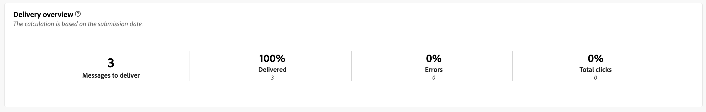

# Rapporti sulla campagna per il canale push {#campaign-reports-push-channel}

Ogni rapporto di una campagna è suddiviso in diversi widget che ne descrivono il successo e gli errori. Per il canale push, i rapporti e le metriche sono descritti di seguito. Scopri come accedere ai rapporti delle campagne in [questa pagina](campaign-reports.md).

## Riepilogo della consegna {#delivery-summary-push}

>[!CONTEXTUALHELP]
>id="acw_campaign_reporting_push_deliveries_overview"
>title="Panoramica della consegna"
>abstract="Il rapporto **Panoramica della consegna** offre indicatori chiave di prestazioni (KPI) che forniscono informazioni dettagliate sul modo in cui i visitatori interagiscono con la consegna delle notifiche push."

Il rapporto **[!UICONTROL Panoramica della consegna]** offre indicatori chiave di prestazioni (KPI) che forniscono informazioni dettagliate sul modo in cui i visitatori interagiscono con la consegna delle notifiche push. Le metriche sono descritte di seguito.

{zoomable="yes"}

+++Ulteriori informazioni sulle metriche dei rapporti delle campagne push.

* **[!UICONTROL Messaggi da consegnare]**: numero totale di messaggi elaborati durante la preparazione della consegna.

* **[!UICONTROL Consegnato]**: numero di messaggi inviati correttamente rispetto al numero totale di messaggi inviati.

* **[!UICONTROL Errori]**: numero totale di errori accumulati durante la consegna e l&#39;elaborazione automatica della restituzione, in relazione al numero totale di messaggi inviati.

* **[!UICONTROL Clic totali]**: numero totale di destinatari distinti che hanno fatto clic almeno una volta in una consegna.

+++

### Statistiche iniziali sul pubblico target {#delivery-summary-push-initial-target}

>[!CONTEXTUALHELP]
>id="acw_campaign_reporting_push_target"
>title="Statistiche iniziali sul pubblico target"
>abstract="La tabella delle **statistiche iniziali del pubblico di destinazione** visualizza i dati relativi ai destinatari."

La tabella **[!UICONTROL Statistiche iniziali sul pubblico target]** mostra i dati relativi ai destinatari. Le metriche sono descritte di seguito.

{zoomable="yes"}

+++Ulteriori informazioni sulle metriche dei rapporti delle campagne push.

* **[!UICONTROL Pubblico iniziale]**: numero totale di destinatari target.

* **[!UICONTROL Messaggio da consegnare]**: numero totale di messaggi da consegnare dopo la preparazione della consegna.

* **[!UICONTROL Rifiutato dalle regole]**: numero totale di indirizzi ignorati durante l&#39;analisi durante l&#39;applicazione di regole, ad esempio indirizzo mancante, in quarantena o in fase di inserisce nell&#39;elenco Bloccati di.

+++

### Statistiche di esecuzione {#delivery-summary-push-exec-stats}

>[!CONTEXTUALHELP]
>id="acw_campaign_reporting_push_exec_stats"
>title="Statistiche di esecuzione"
>abstract="La tabella **Statistiche di esecuzione** descrive il successo della consegna: messaggi da consegnare, consegne riuscite, errori e nuove quarantene."

La tabella **[!UICONTROL Statistiche di esecuzione]** descrive il successo della consegna. Le metriche sono descritte di seguito.

{zoomable="yes"}

+++Ulteriori informazioni sulle metriche dei rapporti delle campagne push.

* **[!UICONTROL Messaggio da consegnare]**: numero totale di messaggi da consegnare dopo la preparazione della consegna.

* **[!UICONTROL Operazione completata]**: numero di messaggi elaborati correttamente, in relazione al numero di messaggi da recapitare.

* **[!UICONTROL Errori]**: numero totale di errori accumulati durante le consegne e l&#39;elaborazione automatica del rebound, in relazione al numero di messaggi da consegnare.

* **[!UICONTROL Nuove quarantene]**: numero totale di indirizzi messi in quarantena a seguito di una consegna non riuscita (ad esempio, registrazione non valida, rifiuto di un messaggio o errore di payload), in relazione al numero di messaggi da recapitare.

  I tipi di errore per le notifiche push sono elencati nella [Documentazione di Adobe Campaign v8 (console client)](https://experienceleague.adobe.com/docs/campaign/campaign-v8/send/failures/delivery-failures.html?lang=it#push-error-types){target="_blank"}.

+++

### Flussi di clic generati {#delivery-summary-push-click-streams}

>[!CONTEXTUALHELP]
>id="acw_campaign_reporting_push_click_streams"
>title="Flussi di clic generati"
>abstract="La tabella **Flussi di clic generati** mostra i dati disponibili relativi al modo in cui i destinatari hanno interagito con la consegna."

La tabella **[!UICONTROL Flussi di clic generati]** mostra i dati relativi al modo in cui i destinatari hanno interagito con la consegna. Le metriche sono descritte di seguito.

{zoomable="yes"}

+++Ulteriori informazioni sulle metriche dei rapporti delle campagne push.

* **[!UICONTROL Clic univoci]**: numero totale di destinatari distinti che hanno fatto clic almeno una volta in una consegna.

* **[!UICONTROL Clic totali]**: numero totale di clic sui collegamenti nelle consegne.

* **[!UICONTROL Reattività]**: rapporto tra il numero di destinatari di destinazione che hanno fatto clic in una consegna e il numero stimato di destinatari di destinazione che hanno aperto una consegna.

+++