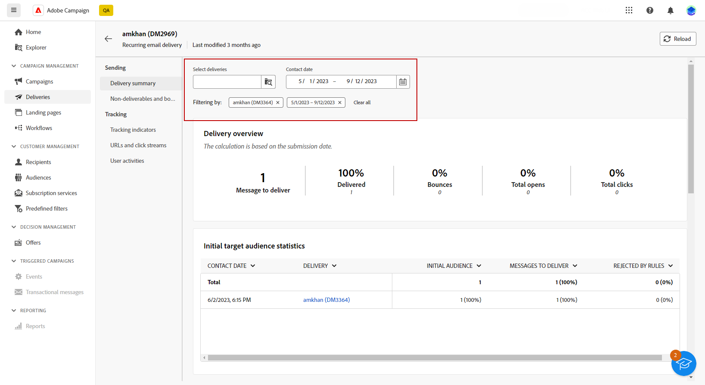

# Accedere ai rapporti sulle consegne {#reports}

>[!CONTEXTUALHELP]
>id="acw_campaign_reporting_deliveries_selection"
>title="Reportistica aggregata per le consegne"
>abstract="Seleziona almeno due consegne per visualizzare un rapporto di dati aggregati."

Adobe Campaign offre diversi tipi di rapporti, accessibili per ogni consegna. Questi rapporti consentono di misurare e visualizzare l’impatto e le prestazioni dei messaggi in una dashboard integrata.

Per visualizzare i rapporti, effettua le seguenti operazioni:

1. Per generare un rapporto per una consegna specifica, passa al menu **[!UICONTROL Consegne]** e seleziona la consegna di cui desideri generare il rapporto.

1. Dalla dashboard **[!UICONTROL Consegna]**, fai clic su **[!UICONTROL Rapporti]**.

   

1. Dal menu a sinistra, seleziona un rapporto dall’elenco.

   

1. Se la consegna è ricorrente, puoi selezionare una consegna specifica su cui generare il rapporto facendo clic su **[!UICONTROL Seleziona consegne]**.

   Puoi anche applicare un periodo di tempo al rapporto selezionando la **[!UICONTROL Data di contatto]**.

   
