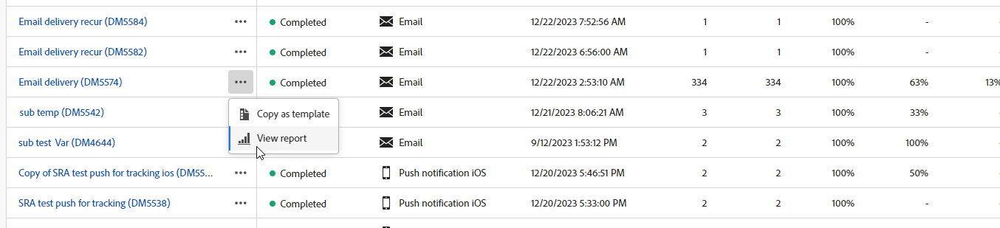

# Introduzione ai rapporti sulle consegne {#reports}

>[!CONTEXTUALHELP]
>id="acw_campaign_reporting_deliveries_selection"
>title="Reportistica aggregata per le consegne"
>abstract="Seleziona almeno due consegne per visualizzare un rapporto di dati aggregati."

I **Rapporti sulle consegne** forniscono informazioni approfondite e dati incentrati esclusivamente sulle **consegne** attraverso ciascun canale. Questi report offrono informazioni dettagliate sulle prestazioni, l&#39;efficacia e i risultati delle singole consegne, fornendo una panoramica completa.

L&#39;elenco completo dei report e delle metriche associate per ciascun canale è disponibile nelle pagine seguenti:

* [Rapporti sulle consegne e-mail](email-report.md)
* [Rapporti sulle consegne SMS](sms-report.md)
* [Rapporti sulle consegne push](push-report.md)
* [Rapporti sul recapito della posta diretta](direct-mail.md)

## Gestione della dashboard dei report {#manage-reports}

Adobe Campaign offre diversi tipi di rapporti, accessibili per ogni consegna. Questi report misurare e visualizzano l&#39;impatto e le prestazioni dei messaggi in una dashboard integrata.

Per visualizzare e gestire i rapporti, seguire questi passaggi:

1. Per generare un rapporto per una consegna specifica, vai al **[!UICONTROL menu Consegne]** e seleziona la consegna su cui desideri creare un rapporto.

1. Dalla dashboard **[!UICONTROL Consegna]**, fai clic su **[!UICONTROL Rapporti]**.

   {zoomable="yes"}

   In alternativa, utilizzare i tre punti Altre **azioni** pulsante accanto al nome del recapito nell&#39;elenco delle consegne e selezionare **[!UICONTROL Visualizza report]**.

   {zoomable="yes"}

1. Dal menu a sinistra, seleziona un rapporto dall’elenco.

   {zoomable="yes"}

1. Se la consegna è ricorrente, puoi selezionare una consegna specifica su cui generare il rapporto facendo clic su **[!UICONTROL Seleziona consegne]**.

   Puoi anche applicare un periodo di tempo al rapporto selezionando la **[!UICONTROL Data di contatto]**.

   {zoomable="yes"}

1. Tra gli URL e i **[!UICONTROL flussi di]** clic, scegli i **[!UICONTROL link]** più visitati o il periodo di **[!UICONTROL tempo]**.

   Le **[!UICONTROL opzioni Visualizza da]** consentono di filtrare URL, Etichette o Categorie.

   {zoomable="yes"}