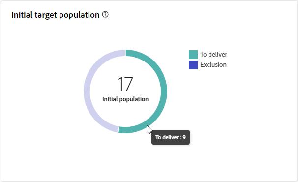

# Rapporto sulle consegne Direct mail {#direct-mail-report}

Il **report di consegna direct mail** offre informazioni complete e dati specifici per la consegna direct mail. Fornisce una panoramica completa con informazioni dettagliate su prestazioni, efficacia e risultati delle singole consegne.

## Riepilogo della consegna {#delivery-summary-direct-mail}

### Panoramica della consegna {#delivery-overview-direct-mail}

>[!CONTEXTUALHELP]
>id="acw_delivery_reporting_delivery_overview_direct_mail"
>title="Panoramica della consegna"
>abstract="La **Panoramica della consegna** presenta le metriche delle prestazioni chiave (KPI) che offrono informazioni approfondite sull’interazione dei visitatori con ogni consegna di direct maili. Le metriche sono descritte di seguito."

La **[!UICONTROL panoramica della consegna]** fornisce informazioni dettagliate su come i visitatori interagiscono con ciascuna consegna di direct mailing, mostrando metriche delle prestazioni chiave (KPI, Key Performance Metrics) essenziali.  Le metriche sono descritte di seguito.

{zoomable="yes"}{align="center"}

+++Ulteriori informazioni sulle metriche della panoramica della consegna.

* **[!UICONTROL Messaggi da consegnare]**: numero totale di messaggi elaborati durante la preparazione della consegna.

* **[!UICONTROL Destinati]**: numero di profili utente idonei come profili di destinazione per i messaggi di direct mailing.

* **[!UICONTROL Da escludere]**: numero di profili utente, esclusi dai profili target, che non riceveranno i messaggi di direct mailing.
+++

### Popolazione target iniziale {#direct-mail-delivery-targeted-population}

>[!CONTEXTUALHELP]
>id="acw_delivery_reporting_initial_target_direct_mail"
>title="Popolazione target iniziale"
>abstract="Il grafico della **Popolazione target iniziale** mostra i dati relativi ai destinatari e ai messaggi, in base ai risultati della preparazione della consegna."

Il grafico **[!UICONTROL Popolazione target iniziale]** mostra i dati relativi ai destinatari. Le metriche vengono calcolate durante la preparazione della consegna e mostrano: il pubblico iniziale, il numero di messaggi da inviare e il numero di destinatari esclusi.

{zoomable="yes"}

Passa il puntatore del mouse su una parte del grafico per visualizzare il numero esatto.

{zoomable="yes"}

+++Ulteriori informazioni sulle metriche dei rapporti di consegna Direct mail.

* **[!UICONTROL Pubblico iniziale]**: numero totale di destinatari target.

* **[!UICONTROL Da consegnare]**: numero totale di messaggi da consegnare dopo la preparazione della consegna.

* **[!UICONTROL Esclusione]**: numero totale di destinatari esclusi dalla popolazione target.
+++

### Statistiche consegna {#direct-mail-delivery-stats}

>[!CONTEXTUALHELP]
>id="acw_delivery_reporting_delivery_statistics_summary_direct_mail"
>title="Statistiche consegna"
>abstract="Il grafico **Statistiche di consegna** descrive il successo della consegna direct mail e gli errori che si sono verificati."

Il grafico **[!UICONTROL Statistiche di consegna]** fornisce una panoramica completa delle prestazioni di consegna, offrendo metriche dettagliate per misurare il successo e l&#39;efficacia.

{zoomable="yes"}

+++Ulteriori informazioni sulle metriche dei rapporti delle campagne direct mail.

* **[!UICONTROL Messaggio inviato]**: numero totale di messaggi da consegnare dopo la preparazione della consegna.

* **[!UICONTROL Completato]**: numero di messaggi elaborati correttamente rispetto al numero di messaggi da consegnare.

* **[!UICONTROL Errori]**: numero totale di errori accumulati durante le consegne e l’elaborazione automatica dei messaggi restituiti rispetto al numero di messaggi da consegnare.

* **[!UICONTROL Nuove quarantene]**: numero totale di indirizzi messi in quarantena a seguito di una consegna non riuscita (utente sconosciuto, dominio non valido) rispetto al numero di messaggi da consegnare.

+++

### Cause di esclusione {#direct-mail-delivery-exclusions}

>[!CONTEXTUALHELP]
>id="acw_delivery_reporting_causes_exclusion_direct_mail"
>title="Cause di esclusione della consegna"
>abstract="Il grafico **Cause di esclusione** illustra la distribuzione dei messaggi rifiutati durante la preparazione per la consegna, suddivisi per regola."

Il grafico **[!UICONTROL Cause di esclusione]** fornisce un&#39;analisi dettagliata dei motivi del rifiuto dei messaggi durante il processo di preparazione della consegna. Questa disaggregazione è organizzata in base a diverse regole, offrendo una visione completa dei fattori che contribuiscono all’esclusione dei messaggi. Le regole di esclusione sono descritte nella [Documentazione di Campaign v8 (console)](https://experienceleague.adobe.com/docs/campaign/campaign-v8/send/failures/delivery-failures.html?lang=it#email-error-types){_blank}.

{zoomable="yes"}{align="center" zoomable="yes"}

+++Ulteriori informazioni sulle metriche Cause di esclusione.

* **[!UICONTROL Indirizzo in quarantena]**: tipo di errore generato quando l&#39;indirizzo viene messo in quarantena.

* **[!UICONTROL Indirizzo non specificato]**: tipo di errore generato durante l&#39;invio di una consegna per indicare che l&#39;indirizzo non esiste.

* **[!UICONTROL Indirizzo di qualità non valido]**: tipo di errore generato quando la valutazione della qualità dell&#39;indirizzo postale è troppo bassa.

* inserire nell&#39;elenco Bloccati inserire nell&#39;elenco Bloccati **[!UICONTROL Indirizzo]**: tipo di errore generato quando il destinatario è stato al momento dell&#39;esecuzione della consegna.

* **[!UICONTROL Doppio]**: tipo di errore generato quando il destinatario è stato escluso perché i valori delle chiavi non sono univoci.

* **[!UICONTROL Gruppo di controllo]**: l&#39;indirizzo del destinatario fa parte del gruppo di controllo.

* **[!UICONTROL Destinazione con dimensione limitata]**: è stata raggiunta la dimensione massima di consegna per il destinatario.

+++

### Esclusioni {#direct-mail-exclusions}

>[!CONTEXTUALHELP]
>id="acw_delivery_reporting_exclusions_direct_mail"
>title="Esclusioni"
>abstract="La tabella **[!UICONTROL Esclusioni]** mostra una suddivisione dettagliata, per regola, dei messaggi rifiutati durante il processo di preparazione della consegna."

La tabella **[!UICONTROL Esclusioni]** fornisce una suddivisione approfondita, suddivisa per regole specifiche, dei messaggi rifiutati durante la fase di preparazione della consegna. Questa suddivisione completa consente di comprendere chiaramente i motivi dell’esclusione di tali messaggi dal processo di consegna.

{zoomable="yes"}{align="center" zoomable="yes"}

Le metriche disponibili sono le stesse delle [cause di esclusione](#direct-mail-delivery-exclusions) descritte in precedenza.
