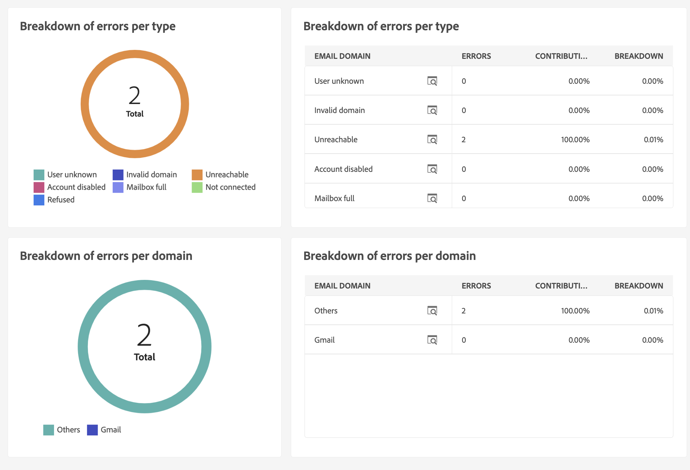

# Rapporto di consegna e-mail {#email-report}

## Invio

* **Riepilogo delle consegne**: questo rapporto fornisce tutte le informazioni principali sulla consegna. Popolazione target, cause di esclusione, statistiche sulla consegna.

   

* **Velocità di consegna**: questo rapporto contiene informazioni sulla velocità di consegna per un dato periodo. I criteri utilizzati per misurare la velocità con cui vengono consegnati i messaggi comprendono il numero di messaggi inviati all’ora e le dimensioni dei messaggi (in bit al secondo). Nell’esempio seguente, il primo grafico mostra le consegne riuscite in blu e il numero di consegne con errori in arancione.

   

* **Statistiche di trasmissione**: questo rapporto mostra la suddivisione per dominio Internet di tutti i messaggi elaborati e inviati, dei mancati recapiti permanenti o temporanei, delle aperture, dei clic e degli annullamenti dell’iscrizione.

   

* **Non consegnabili e mancati recapiti**: questo rapporto mostra il raggruppamento dei messaggi non consegnabili e un raggruppamento dei mancati recapiti per dominio Internet.

   

## Tracciamento

* **Indicatori di tracciamento**: questo rapporto combina gli indicatori chiave per tenere traccia del comportamento dei destinatari alla ricezione della consegna. Consente di accedere alle statistiche su consegna e ricezione, ai tassi di apertura e click-through, ai flussi clic generati, al tracciamento web e alle attività di condivisione sui social network.

   

* **URL e flussi di clic**: questo rapporto mostra l’elenco delle pagine visitate dopo una consegna.

   

* **Attività utente**: questo rapporto mostra il raggruppamento di aperture e clic per mezz’ora, ora o giorno, sotto forma di grafico.

   

* **Statistiche di tracciamento**: questo rapporto fornisce statistiche su aperture e clic.

   

* **Breakdown delle aperture**: questo rapporto mostra la suddivisione delle aperture per sistema operativo, dispositivo e browser per il periodo in questione. Per ogni categoria vengono utilizzati due grafici. Il primo visualizza le statistiche relative all’apertura su un computer e dispositivi mobili. Il secondo visualizza le statistiche relative solo all’apertura su dispositivi mobili.

   

## Hot click

Questo rapporto mostra il contenuto del messaggio (HTML e/o testo) e la percentuale di clic per ogni collegamento. I collegamenti presenti nei blocchi di personalizzazione per l’annullamento dell’iscrizione, per le pagine mirror e per le offerte vengono presi in considerazione nei clic totali cumulati, ma non vengono visualizzati nel rapporto.

