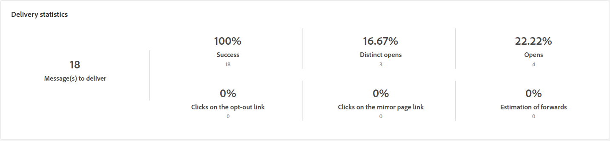

# Rapporto sulla consegna e-mail {#email-report}

Il **Rapporto sulle consegne e-mail** offre informazioni complete e dati specifici per il canale e-mail. Fornisce una panoramica completa con informazioni dettagliate su prestazioni, efficacia e risultati delle singole consegne.

## Riepilogo delle consegne {#delivery-summary-email}

* La tabella **[!UICONTROL Statistiche iniziali sul pubblico target]** mostra i dati relativi ai destinatari:

  {align="left" zoomable="yes"}

  +++Ulteriori informazioni sulle metriche del rapporto sulle consegne e-mail.

   * **[!UICONTROL Pubblico iniziale]**: numero totale di destinatari target.

   * **[!UICONTROL Da consegnare]**: numero totale di messaggi da consegnare dopo la preparazione della consegna.

   * **[!UICONTROL Esclusione]**: numero totale di messaggi esclusi dal target inviato.
+++

* La tabella **[!UICONTROL Statistiche consegna]** descrive il successo della consegna.

  {align="left"}

  +++Ulteriori informazioni sulle metriche del rapporto sulla campagna e-mail.

   * **[!UICONTROL Messaggio inviato]**: numero totale di messaggi da consegnare dopo la preparazione della consegna.

   * **[!UICONTROL Completato]**: numero di messaggi elaborati correttamente rispetto al numero di messaggi da consegnare.

   * **[!UICONTROL Errori]**: numero totale di errori accumulati durante le consegne e l’elaborazione automatica dei messaggi restituiti rispetto al numero di messaggi da consegnare.

   * **[!UICONTROL Nuove quarantene]**: numero totale di indirizzi messi in quarantena a seguito di una consegna non riuscita (utente sconosciuto, dominio non valido) in relazione al numero di messaggi da consegnare.

+++

* Il grafico e la tabella **[!UICONTROL Cause di esclusione]** mostrano il raggruppamento per regola dei messaggi rifiutati durante l’analisi.

  {align="center"}

  +++Ulteriori informazioni sulle metriche del rapporto sulle consegne e-mail.

   * **[!UICONTROL Utente sconosciuto]**: tipo di errore generato durante la consegna per indicare che l’indirizzo e-mail non è valido.

   * **[!UICONTROL Dominio non valido]**: tipo di errore generato durante l’invio di una consegna per indicare che il dominio dell’indirizzo e-mail è errato o non esiste.

   * **[!UICONTROL Cassetta postale piena]**: tipo di errore generato dopo cinque tentativi di consegna per indicare che la casella in entrata dei destinatari contiene troppi messaggi.

   * **[!UICONTROL Account disabilitato]**: tipo di errore generato durante l’invio di una consegna per indicare che l’indirizzo non esiste più.

   * **[!UICONTROL Rifiutato]**: tipo di errore generato quando un indirizzo viene rifiutato da IAP (Internet Access Provider), ad esempio in seguito all’applicazione di una regola di sicurezza (software anti-spam).

   * **[!UICONTROL Non raggiungibile]**: tipo di errore che si verifica nella stringa di distribuzione del messaggio: incidente sul relay SMTP, dominio temporaneamente non raggiungibile, ecc.

   * **[!UICONTROL Non connesso]**: tipo di errore per indicare che il telefono cellulare del destinatario è spento o disconnesso dalla rete al momento dell’invio.

+++

## Velocità effettiva di consegna {#delivery-throughtput}

Questo rapporto presenta informazioni dettagliate sulla velocità effettiva di consegna dell’intera piattaforma in un arco temporale specifico. La metrica primaria utilizzata per misurare la velocità di consegna dei messaggi è il numero di messaggi inviati all’ora.

## Statistiche di trasmissione {#broadcast-statistics}

* La tabella **[!UICONTROL Statistiche di trasmissione]** contiene i dati disponibili per i possibili errori rilevati in ciascun dominio.

  {align="center"}

  +++Ulteriori informazioni sulle metriche del rapporto sulle consegne e-mail.

   * **[!UICONTROL E-mail elaborate]**: numero totale di messaggi elaborati dal server di consegna.

   * **[!UICONTROL Consegnato]**: percentuale del numero di messaggi elaborati correttamente rispetto al numero totale di messaggi elaborati.

   * **[!UICONTROL Mancato recapito permanente]**: percentuale del numero di mancati recapiti &quot;permanenti&quot;, errori permanenti, ad esempio un indirizzo e-mail errato, rispetto al numero totale di messaggi elaborati.

   * **[!UICONTROL Mancati recapiti non permanenti]**: percentuale del numero di mancati recapiti &quot;non permanenti&quot;, errori temporanei come una casella in entrata completa, rispetto al numero totale di messaggi elaborati

   * **[!UICONTROL Aperture]**: percentuale del numero di destinatari che hanno aperto un messaggio almeno una volta rispetto al numero di messaggi elaborati correttamente.

   * **[!UICONTROL Clic]**: percentuale del numero di persone che hanno fatto clic su una consegna almeno una volta rispetto al numero di messaggi elaborati correttamente.

   * **[!UICONTROL Annullamenti iscrizione]**: percentuale del numero di clic su un collegamento di annullamento dell’iscrizione rispetto al numero di messaggi elaborati correttamente.
+++

## Messaggi non recapitabili e mancati recapiti {#non-deliverables-email}

* Le tabelle e i grafici **[!UICONTROL Raggruppamento degli errori per tipo]** e **[!UICONTROL Raggruppamento degli errori per dominio]** contengono i dati disponibili per i possibili errori riscontrati per ciascun dominio.

  Gli errori inclusi in questo rapporto attivano il processo di quarantena. Per ulteriori informazioni sulla gestione della quarantena, consulta [Documentazione di Campaign v8 (console client)](https://experienceleague.adobe.com/docs/campaign/campaign-v8/campaigns/send/failures/delivery-failures.html?lang=it){target="_blank"}.

  

  +++Ulteriori informazioni sulle metriche del rapporto sulle consegne e-mail.

   * **[!UICONTROL Utente sconosciuto]**: tipo di errore generato durante la consegna per indicare che l’indirizzo e-mail non è valido.

   * **[!UICONTROL Dominio non valido]**: tipo di errore generato durante l’invio di una consegna per indicare che il dominio dell’indirizzo e-mail è errato o non esiste.

   * **[!UICONTROL Cassetta postale piena]**: tipo di errore generato dopo cinque tentativi di consegna per indicare che la casella in entrata dei destinatari contiene troppi messaggi.

   * **[!UICONTROL Account disabilitato]**: tipo di errore generato durante l’invio di una consegna per indicare che l’indirizzo non esiste più.

   * **[!UICONTROL Rifiutato]**: tipo di errore generato quando un indirizzo viene rifiutato da IAP (Internet Access Provider), ad esempio in seguito all’applicazione di una regola di sicurezza (software anti-spam).

   * **[!UICONTROL Non raggiungibile]**: tipo di errore che si verifica nella stringa di distribuzione del messaggio: incidente sul relay SMTP, dominio temporaneamente non raggiungibile, ecc.

   * **[!UICONTROL Non connesso]**: tipo di errore per indicare che il telefono cellulare del destinatario è spento o disconnesso dalla rete al momento dell’invio.

+++

## Indicatori di tracciamento {#tracking-indicators-email}

* **[!UICONTROL Statistiche consegna]** fornisce indicatori di prestazioni chiave (KPI) e informazioni dettagliate sui dati disponibili per le e-mail inviate.

  {align="center"}

  +++Ulteriori informazioni sulle metriche del rapporto sulle consegne e-mail.

   * **[!UICONTROL Completato]**: numero di messaggi elaborati correttamente in relazione al numero di messaggi da consegnare.

   * **[!UICONTROL Aperture distinte]**: numero totale di destinatari target che hanno aperto un messaggio almeno una volta.

   * **[!UICONTROL Aperture]**: numero di destinatari target distinti per questo dominio che hanno aperto un messaggio almeno una volta.

   * **[!UICONTROL Clic sul collegamento di rinuncia]**: numero di clic sul collegamento di annullamento dell’iscrizione.

   * **[!UICONTROL Clic sul collegamento mirror]**: numero di clic sul collegamento alla pagina mirror.

   * **[!UICONTROL Stima degli inoltri]**: stima del numero di e-mail inoltrate dai destinatari target.
+++

* La tabella **[!UICONTROL Tasso di apertura e click-through]** visualizza i dati relativi ai destinatari.

  {align="center"}

  +++Ulteriori informazioni sulle metriche del rapporto sulle consegne e-mail.

   * **[!UICONTROL Inviati]**: numero totale di messaggi inviati.

   * **[!UICONTROL Reclami]**: numero di messaggi per questo dominio che sono stati segnalati come indesiderati dal destinatario.

   * **[!UICONTROL Aperture]**: numero di destinatari target distinti per questo dominio che hanno aperto un messaggio almeno una volta.

   * **[!UICONTROL Clic]**: numero di destinatari target distinti che hanno fatto clic almeno una volta nella stessa consegna.

   * **[!UICONTROL Reattività raw]**: percentuale del numero di destinatari che hanno fatto clic su una consegna almeno una volta rispetto al numero di destinatari che hanno aperto una consegna almeno una volta.
+++

## URL e flussi di clic {#url-email}

* **[!UICONTROL URL e flussi di clic]** fornisce indicatori chiave di performance (KPI) e informazioni dettagliate sugli URL più cliccati durante una consegna.

  {align="center"}

  +++Ulteriori informazioni sulle metriche del rapporto sulle consegne e-mail.

   * **[!UICONTROL Reattività]**: rapporto tra il numero di destinatari target che hanno fatto clic in una consegna e il numero stimato di destinatari target che hanno aperto una consegna.

   * **[!UICONTROL Clic distinti]**: numero totale di destinatari distinti che hanno fatto clic almeno una volta in una consegna.

   * **[!UICONTROL Clic]**: numero totale di clic sui collegamenti nelle consegne.

   * **[!UICONTROL Media piattaforma]**: questa media, visualizzata sotto ogni valore (reattività, clic distinti e clic cumulativi), è calcolata per le consegne inviate nei sei mesi precedenti. Vengono prese in considerazione solo le consegne con la stessa tipologia e sullo stesso canale. Le bozze sono escluse.

+++

* Il grafico e la tabella **[!UICONTROL 10 collegamenti più visitati]** contengono i dati disponibili per il comportamento dei destinatari in base al collegamento.

  {align="center"}

  +++Ulteriori informazioni sulle metriche del rapporto sulle consegne e-mail.

   * **[!UICONTROL Clic]**: numero totale di clic sui collegamenti nelle consegne.

   * **[!UICONTROL Percentuale]**: percentuale di utenti che hanno interagito con la consegna.

+++

* Il grafico **[!UICONTROL Raggruppamento dei clic nel tempo]** contiene i dati disponibili per il comportamento dei destinatari in base al collegamento.

  {align="center"}

## Attività degli utenti {#user-activities-email}

* **[!UICONTROL Attività degli utenti]** mostra il raggruppamento di aperture e clic sotto forma di grafico. Puoi scegliere il periodo di tempo in cui eseguire il targeting dei dati: ultimo giorno, ultima ora o ultimi 30 minuti.

  {align="center"}

  +++Ulteriori informazioni sulle metriche del rapporto sulle consegne e-mail.

   * **[!UICONTROL Clic]**: numero totale di clic sui collegamenti nelle consegne.

   * **[!UICONTROL Aperture]**: numero di destinatari target distinti per questo dominio che hanno aperto un messaggio almeno una volta.

+++

## Statistiche di tracciamento {#tracking-statistics}

* Il grafico **[!UICONTROL Statistiche di tracciamento]** fornisce statistiche su aperture e clic. Puoi selezionare l’arco temporale specifico per il targeting dei dati.

  {align="center"}

  +++Ulteriori informazioni sulle metriche del rapporto sulle consegne e-mail.

   * **[!UICONTROL Clic]**: numero totale di clic sui collegamenti nelle consegne.

   * **[!UICONTROL Aperture]**: numero di destinatari target distinti per questo dominio che hanno aperto un messaggio almeno una volta.

+++

## Raggruppamenti delle aperture {#breakdown-opens}

Raggruppamenti delle aperture: questo rapporto mostra le aperture raggruppate per sistema operativo, dispositivo e browser per il periodo in questione. Per ogni categoria vengono utilizzati due grafici. Il primo visualizza le statistiche relative all’apertura su un computer e dispositivi mobili. Il secondo visualizza le statistiche relative solo all’apertura su dispositivi mobili.
Puoi passare da **[!UICONTROL Fisso e mobile]** al targeting esclusivo e più preciso **[!UICONTROL Solo per dispositivi mobili]**.

{align="center"}

## Hot click {#hotclicks}

Questo rapporto mostra il contenuto del messaggio (HTML e/o testo) e la percentuale di clic per ogni collegamento. I collegamenti presenti nei blocchi di personalizzazione per l’annullamento dell’iscrizione, per le pagine mirror e per le offerte vengono presi in considerazione nei clic totali cumulati, ma non vengono visualizzati nel rapporto.

