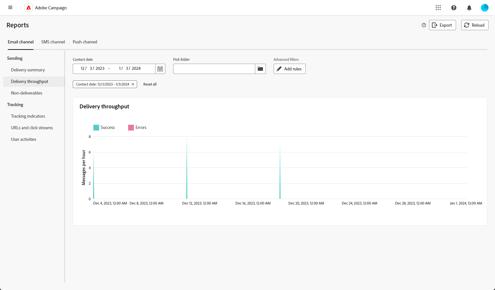
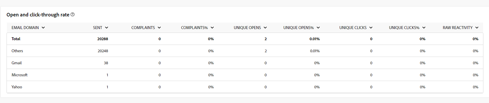

# Rapporti globali per il canale e-mail {#global-report-direct}

I rapporti globali forniscono agli utenti una panoramica completa delle metriche di traffico e coinvolgimento a livello di canale.

Accedi a **[!UICONTROL Rapporti]** menu all&#39;interno di **[!UICONTROL Generazione rapporti]** sezione. Puoi filtrare i dati in base alla data del rapporto, alla cartella o alle regole. [Ulteriori informazioni](global-reports.md)

## Riepilogo della consegna {#delivery-summary-email}

### Panoramica della consegna {#delivery-overview-email}

>[!CONTEXTUALHELP]
>id="acw_global_reporting_deliveries_overview_email"
>title="Panoramica della consegna"
>abstract="Il **Panoramica della consegna** presenta gli indicatori di prestazioni chiave (KPI, Key Performance Indicators) che offrono informazioni approfondite sul modo in cui il pubblico interagisce con le consegne e le campagne e-mail inviate."

Il **[!UICONTROL Panoramica della consegna]** presenta le metriche delle prestazioni chiave (KPI, Key Performance Metrics), con informazioni approfondite sull’interazione dei visitatori con ogni consegna di e-mail. Le metriche sono descritte di seguito.

{align="center"}

+++Ulteriori informazioni sulle metriche della panoramica della consegna.

* **[!UICONTROL Messaggi da consegnare]**: numero totale di messaggi elaborati durante la preparazione della consegna.

* **[!UICONTROL Consegnato]**: numero di messaggi inviati correttamente rispetto al numero totale di messaggi inviati.

* **[!UICONTROL Aperture totali]**: numero totale di destinatari target che hanno aperto un messaggio almeno una volta.

* **[!UICONTROL Clic totali]**: numero totale di destinatari che hanno fatto clic almeno una volta in una consegna.

* **[!UICONTROL Mancati recapiti ed errori]**: totale degli errori accumulati durante la consegna e l’elaborazione automatica della restituzione in relazione al numero totale di messaggi inviati.

* **[!UICONTROL Annulla iscrizione]**: numero di destinatari che hanno fatto clic sull’opzione per annullare l’abbonamento.
+++

### Pubblico target {#delivery-summary-email-initial-target}

>[!CONTEXTUALHELP]
>id="acw_global_reporting_target_audience_email"
>title="Statistiche iniziali sul pubblico target"
>abstract="Il **Pubblico di destinazione** la tabella e il grafico offrono informazioni sul coinvolgimento dei destinatari che consentono di valutare l’efficacia delle campagne e delle consegne."

Tabella e grafico per **[!UICONTROL Pubblico di destinazione]** mostra i dati relativi ai destinatari, con le metriche dettagliate fornite di seguito.

{align="center"}

+++Ulteriori informazioni sulle metriche del pubblico di destinazione.

* **[!UICONTROL Pubblico di destinazione]**: numero totale di destinatari target.

* **[!UICONTROL Messaggio da consegnare]**: numero totale di messaggi da consegnare dopo la preparazione della consegna.

* **[!UICONTROL Esclusione]**: numero totale di indirizzi ignorati durante l’analisi durante l’applicazione delle regole: indirizzo mancante, messo in quarantena, in fase di inserisce nell&#39;elenco Bloccati del, ecc.

+++

### Statistiche consegna {#delivery-summary-email-delivery-stats}

>[!CONTEXTUALHELP]
>id="acw_global_reporting_email_delivery_stats"
>title="Statistiche consegna"
>abstract="Il **Statistiche consegna** grafo e tabella descrivono le metriche chiave, tra cui consegne riuscite, errori e nuove quarantene, offrendo una panoramica concisa per valutare le prestazioni della consegna."

Il **[!UICONTROL Statistiche consegna]** La tabella fornisce una suddivisione del successo di ogni consegna e-mail, con metriche dettagliate descritte di seguito.

{align="center"}

+++Ulteriori informazioni sulle metriche delle statistiche di consegna.

* **[!UICONTROL Messaggio da consegnare]**: numero totale di messaggi da consegnare dopo la preparazione della consegna.

* **[!UICONTROL Completato]**: numero di messaggi elaborati correttamente in relazione al numero di messaggi da consegnare.

* **[!UICONTROL Errori/mancati recapiti]**: numero totale di errori accumulati durante le consegne ed elaborazione automatica del rimbalzo in relazione al numero di messaggi da consegnare.

* **[!UICONTROL Nuove quarantene]**: numero totale di indirizzi messi in quarantena a seguito di una consegna non riuscita (utente sconosciuto, dominio non valido) rispetto al numero di messaggi da consegnare.

+++

### Cause di esclusione {#causes-exclusion}

>[!CONTEXTUALHELP]
>id="acw_global_reporting_exclusion_email"
>title="Cause di esclusione"
>abstract="Il **Cause di esclusione** i grafici e le tabelle illustrano i motivi specifici del rifiuto dei messaggi durante la preparazione della consegna, offrendo un raggruppamento dettagliato per regola."

{align="center"}

Il grafico e la tabella Esclusioni illustrano i motivi che hanno impedito ai profili utente, esclusi dai profili target, di ricevere il messaggio.

I tipi di errore delle e-mail sono elencati nella [Documentazione di Adobe Campaign v8 (console client)](https://experienceleague.adobe.com/docs/campaign/campaign-v8/send/failures/delivery-failures.html?lang=it#email-error-types){target="_blank"}.

## Velocità di consegna {#delivery-throughput}

>[!CONTEXTUALHELP]
>id="acw_global_reporting_throughput_email"
>title="Velocità di consegna"
>abstract="Questo **Velocità effettiva di consegna** fornisce informazioni complete sulla velocità effettiva di consegna, evidenziando i tassi di successo e di errore in un arco temporale specificato."

{align="center"}

Il rapporto Throughput di consegna fornisce informazioni approfondite sull’efficienza del processo di consegna, presentando una panoramica dettagliata dei tassi di successo e di errore in un arco temporale specificato.

+++Ulteriori informazioni sulle metriche della velocità effettiva di consegna.

* **[!UICONTROL Completato]**: numero di messaggi elaborati correttamente rispetto al numero di messaggi da consegnare.

* **[!UICONTROL Errori]**: numero totale di errori accumulati durante le consegne e l’elaborazione automatica dei messaggi restituiti rispetto al numero di messaggi da consegnare.

+++

## Non consegnabili {#non-deliverables-email}

### Raggruppamento degli errori per tipo {#delivery-summary-email-breakdown-per-type}

>[!CONTEXTUALHELP]
>id="acw_global_reporting_error_type_email"
>title="Raggruppamento degli errori per tipo"
>abstract="La tabella e il grafico che descrivono **Raggruppamento degli errori per tipo** include informazioni sui vari tipi di errore riscontrati durante il processo, tra cui utente sconosciuto, cassetta postale piena, dominio non valido e altri."

{align="center"}

Il **[!UICONTROL Raggruppamento degli errori per tipo]** la tabella e il grafico presentano i dati relativi a potenziali errori riscontrati in vari domini, con le metriche specifiche fornite di seguito.

Gli errori inclusi in questo rapporto attivano il processo di quarantena. Per ulteriori informazioni sulla gestione della quarantena, consulta la [documentazione di Campaign v8 (console client)](https://experienceleague.adobe.com/docs/campaign/campaign-v8/campaigns/send/failures/delivery-failures.html?lang=it){target="_blank"}.

+++Ulteriori informazioni sulla suddivisione degli errori per metrica per tipo.

* **[!UICONTROL Utente sconosciuto]**: tipo di errore generato durante la consegna per indicare che l’indirizzo e-mail non è valido.

* **[!UICONTROL Dominio non valido]**: tipo di errore generato durante l’invio di una consegna per indicare che il dominio dell’indirizzo e-mail è errato o non esiste.

* **[!UICONTROL Cassetta postale piena]**: tipo di errore generato dopo cinque tentativi di consegna per indicare che la casella in entrata dei destinatari contiene troppi messaggi.

* **[!UICONTROL Account disabilitato]**: tipo di errore generato durante l’invio di una consegna per indicare che l’indirizzo non esiste più.

* **[!UICONTROL Rifiutato]**: tipo di errore generato quando un indirizzo viene rifiutato da IAP (Internet Access Provider), ad esempio in seguito all’applicazione di una regola di sicurezza (software anti-spam).

* **[!UICONTROL Non raggiungibile]**: tipo di errore che si verifica nella stringa di distribuzione del messaggio: incidente sul relay SMTP, dominio temporaneamente non raggiungibile, ecc.

* **[!UICONTROL Non connesso]**: tipo di errore per indicare che il telefono cellulare del destinatario è spento o disconnesso dalla rete al momento dell’invio.

+++

### Raggruppamento degli errori per dominio {#delivery-summary-email-breakdown-per-domain}

>[!CONTEXTUALHELP]
>id="acw_global_reporting_error_domain_email"
>title="Raggruppamento degli errori per dominio"
>abstract="Tabella e grafico che illustrano **Raggruppamento degli errori per dominio** presenta i dati corrispondenti a ciascun tipo di errore incontrato, suddivisi per domini specifici."

{align="center"}

Il **[!UICONTROL Raggruppamento degli errori per dominio]** la tabella e il grafico mostrano i dati relativi a potenziali errori all’interno di ciascun dominio. Le metriche sono comuni alla tabella e al grafico **[!UICONTROL Raggruppamento degli errori per tipo]** descritti in precedenza.

## Indicatori di tracciamento {#tracking-indicators-email}

### Statistiche consegna {#delivery-summary-email-statistics}

>[!CONTEXTUALHELP]
>id="acw_global_delivery_statistics_summary_email"
>title="Statistiche consegna"
>abstract="Il **Statistiche consegna** Gli indicatori di prestazioni chiave (KPI, Key Performance Indicators) forniscono una panoramica completa delle prestazioni delle consegne e delle campagne, fornendo informazioni approfondite sia sulle consegne riuscite che sugli errori riscontrati e sul coinvolgimento degli utenti."

Il **[!UICONTROL Statistiche consegna]** Le metriche offrono indicatori di prestazioni chiave (KPI, Key Performance Indicators) che forniscono informazioni dettagliate sui dati associati a ogni consegna e-mail. Ulteriori dettagli su queste metriche sono forniti di seguito.

{align="center"}

+++Ulteriori informazioni sulle metriche delle statistiche di consegna.

* **[!UICONTROL Messaggi da consegnare]**: numero totale di messaggi elaborati durante la preparazione della consegna.

* **[!UICONTROL Completato]**: numero di messaggi elaborati correttamente in relazione al numero di messaggi da consegnare.

* **[!UICONTROL Aperture univoche]**: numero totale di destinatari target che hanno aperto un messaggio almeno una volta.

* **[!UICONTROL Aperture totali]**: numero di destinatari target distinti per questo dominio che hanno aperto un messaggio almeno una volta.

* **[!UICONTROL Clic sul collegamento di rinuncia]**: numero di clic sul collegamento di annullamento dell’iscrizione.

* **[!UICONTROL Clic sul collegamento mirror]**: numero di clic sul collegamento alla pagina mirror.

* **[!UICONTROL Stima degli inoltri]**: stima del numero di e-mail inoltrate dai destinatari target.
+++

### Percentuale di apertura e click-through {#delivery-summary-open-rate}

>[!CONTEXTUALHELP]
>id="acw_global_reporting_open_clickthrough_email"
>title="Percentuale di apertura e click-through"
>abstract="Tabella per **Percentuali di apertura e click-through** rivela il coinvolgimento dei destinatari con la tua consegna, presentando i dati sui tassi di apertura e i tassi di click-through per una panoramica rapida e approfondita."

La tabella **[!UICONTROL Percentuale di apertura e click-through]** visualizza i dati relativi ai destinatari. Le metriche sono descritte di seguito.

{align="center"}

+++Ulteriori informazioni sulle metriche del tasso di apertura e click-through.

* **[!UICONTROL Inviati]**: numero totale di messaggi inviati.

* **[!UICONTROL Reclami]**: numero e percentuale di messaggi per questo dominio che sono stati segnalati come indesiderati dal destinatario.

* **[!UICONTROL Aperture univoche]**: numero e percentuale di destinatari target distinti per questo dominio che hanno aperto un messaggio almeno una volta.

* **[!UICONTROL Clic univoci]**: numero e percentuale di destinatari target distinti che hanno fatto clic almeno una volta nella stessa consegna.

* **[!UICONTROL Reattività raw]**: percentuale del numero di destinatari che hanno fatto clic su una consegna almeno una volta rispetto al numero di destinatari che hanno aperto una consegna almeno una volta.
+++

## URL e flussi di clic {#url-email}

### URL e KPI per flussi di clic {#url-email-kpis}

>[!CONTEXTUALHELP]
>id="acw_global_reporting_urls_clickstreams_email"
>title="URL e flussi di clic"
>abstract="Il **URL e flussi di clic** Il rapporto fornisce indicatori di prestazioni chiave (KPI, Key Performance Indicators) essenziali, con informazioni dettagliate sugli URL più utilizzati durante una consegna."

Il **[!UICONTROL URL e flussi di clic]** Il rapporto fornisce indicatori di prestazioni chiave (KPI, Key Performance Indicators) che forniscono informazioni dettagliate sugli URL che hanno ricevuto il maggior numero di clic durante una consegna. Le metriche sono descritte di seguito.

{align="center"}

+++Ulteriori informazioni sugli URL e sulle metriche di flusso di clic.

* **[!UICONTROL Reattività]**: rapporto tra il numero di destinatari target che hanno fatto clic in una consegna e il numero stimato di destinatari target che hanno aperto una consegna.

* **[!UICONTROL Clic univoci]**: numero totale di destinatari distinti che hanno fatto clic almeno una volta in una consegna.

* **[!UICONTROL Clic totali]**: numero totale di clic sui collegamenti nelle consegne.

* **[!UICONTROL Media piattaforma]**: questa media, visualizzata sotto ogni valore (reattività, clic distinti e clic cumulativi), è calcolata per le consegne inviate nei sei mesi precedenti. Vengono prese in considerazione solo le consegne con la stessa tipologia e sullo stesso canale. Le bozze sono escluse.
+++

### 10 collegamenti più visitati {#top10-global-report-email}

>[!CONTEXTUALHELP]
>id="acw_global_reporting_top10_email"
>title="10 collegamenti più visitati"
>abstract="Il **I 10 collegamenti più visitati**  grafico e tabella presentano dati completi sull’interazione del destinatario con ciascun collegamento."

Il grafico e la tabella **[!UICONTROL 10 collegamenti più visitati]** contengono i dati disponibili sul comportamento dei destinatari in base al collegamento. Le metriche sono descritte di seguito.

{align="center"}

+++Ulteriori informazioni sulle metriche dei 10 collegamenti più visitati.

* **[!UICONTROL Clic totali]**: numero totale di clic sui collegamenti nelle consegne.

* **[!UICONTROL Percentuale]**: percentuale di utenti che hanno interagito con la consegna.

+++

### Raggruppamento dei clic nel tempo {#global-report-email-breakdown-clicks}

>[!CONTEXTUALHELP]
>id="acw_global_reporting_urls_click_breakdown_email"
>title="Raggruppamento dei clic nel tempo"
>abstract="Il **Raggruppamento dei clic nel tempo** graph offre una visualizzazione completa del modo in cui i destinatari interagiscono con i collegamenti nell’arco temporale designato."

Il grafico **[!UICONTROL Raggruppamento dei clic nel tempo]** contiene i dati disponibili per il comportamento dei destinatari in base al collegamento.

{align="center"}

## Attività degli utenti {#user-activities-email}

>[!CONTEXTUALHELP]
>id="acw_global_reporting_user_activities_email"
>title="Attività degli utenti"
>abstract="La rappresentazione grafica di **Attività utente** offre un raggruppamento dettagliato delle interazioni dei destinatari, con un’immagine che mostra le aperture e i clic attraverso un formato grafico informativo."

Il rapporto **[!UICONTROL Attività degli utenti]** mostra il raggruppamento di aperture e clic sotto forma di grafico. Le metriche di questo rapporto sono descritte di seguito.

{align="center"}

+++Ulteriori informazioni sulle metriche delle attività utente.

* **[!UICONTROL Clic totali]**: numero totale di clic sui collegamenti nelle consegne.

* **[!UICONTROL Aperture totali]**: numero totale di destinatari di destinazione distinti per questo dominio che hanno aperto un messaggio almeno una volta.

+++
