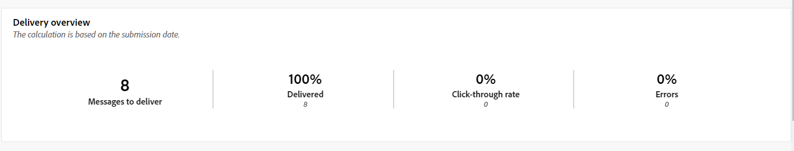
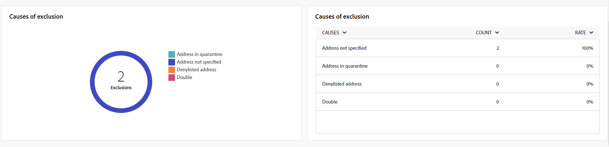

# Rapporti globali per il canale SMS {#campaign-reports-sms}

I rapporti globali forniscono agli utenti una panoramica completa delle metriche di traffico e coinvolgimento a livello di canale.

Accedi a **[!UICONTROL Rapporti]** menu all&#39;interno di **[!UICONTROL Generazione rapporti]** sezione. Puoi filtrare i dati in base alla data del rapporto, alla cartella o alle regole. [Ulteriori informazioni](global-reports.md)

## Riepilogo della consegna {#delivery-summary-sms}

### Panoramica della consegna {#delivery-overview-sms}

>[!CONTEXTUALHELP]
>id="acw_sms_global_report_overview"
>title="Panoramica della consegna SMS"
>abstract="Il **Panoramica della consegna SMS** I KPI forniscono un riepilogo completo della consegna SMS, con informazioni dettagliate e dati specifici. Fornisce informazioni complete sulle prestazioni, l’efficacia e i risultati della consegna."

Il **[!UICONTROL Panoramica della consegna]** Il rapporto offre indicatori di prestazioni chiave (KPI, Key Performance Indicators) completi con informazioni approfondite sui modelli di interazione dei visitatori con ogni consegna di SMS. Di seguito sono descritte le metriche seguenti.

{zoomable=&quot;yes&quot;}

+++Ulteriori informazioni sulle metriche della panoramica della consegna.

* **[!UICONTROL Messaggi da consegnare]**: numero totale di messaggi elaborati durante la preparazione della consegna.

* **[!UICONTROL Consegnato]**: percentuale di messaggi inviati correttamente, in relazione al numero totale di messaggi inviati.

* **[!UICONTROL Percentuale di click-through]**: percentuale di destinatari distinti che hanno fatto clic almeno una volta in una consegna.

* **[!UICONTROL Errori]**: percentuale di errori accumulati durante la consegna e l’elaborazione automatica della restituzione in relazione al numero totale di messaggi inviati.

+++

### Pubblico target {#delivery-summary-sms-initial-target}

>[!CONTEXTUALHELP]
>id="acw_global_reporting_sms_targeted_audience"
>title="Popolazione target degli SMS"
>abstract="Il grafico e la tabella per **Popolazione target** presentare i dati relativi al pubblico SMS, incluse informazioni sui messaggi da consegnare ed esclusioni."

Il **[!UICONTROL Pubblico di destinazione]** tabella e grafico presentano i dati relativi ai destinatari per ogni consegna SMS inviata. Le metriche sono descritte di seguito.

{zoomable=&quot;yes&quot;}

+++Ulteriori informazioni sulle metriche del pubblico di destinazione.

* **[!UICONTROL Pubblico di destinazione]**: numero totale di destinatari target.

* **[!UICONTROL Messaggio da consegnare]**: numero totale di messaggi da consegnare dopo la preparazione della consegna.

* **[!UICONTROL Esclusione]**: numero totale di indirizzi ignorati durante l’analisi durante l’applicazione delle regole: indirizzo mancante, messo in quarantena, in fase di inserisce nell&#39;elenco Bloccati del, ecc.

+++

### Statistiche consegna {#delivery-summary-sms-exec-stats}

>[!CONTEXTUALHELP]
>id="acw_global_reporting_sms_delivery_stats"
>title="Statistiche di consegna SMS"
>abstract="Il **Statistiche consegna** Il rapporto fornisce informazioni complete sull’SMS inviato, offrendo un raggruppamento di varie metriche quali tassi di successo, occorrenze di errori e pubblico messo in quarantena. Questa presentazione dettagliata consente di esaminare in modo approfondito le prestazioni complessive e i risultati del processo di consegna degli SMS."

Il **[!UICONTROL Statistiche consegna]** la tabella descrive il successo di ogni consegna SMS. Le metriche sono descritte di seguito.

{zoomable=&quot;yes&quot;}

+++Ulteriori informazioni sulle metriche delle statistiche di consegna.

* **[!UICONTROL Messaggi totali]**: numero totale di messaggi da consegnare dopo la preparazione della consegna.

* **[!UICONTROL Completato]**: numero di messaggi elaborati correttamente in relazione al numero di messaggi da consegnare.

* **[!UICONTROL Errori/mancati recapiti]**: numero totale di errori accumulati durante le consegne ed elaborazione automatica del rimbalzo in relazione al numero di messaggi da consegnare.

* **[!UICONTROL Nuove quarantene]**: numero totale di indirizzi messi in quarantena a seguito di una consegna non riuscita (utente sconosciuto, dominio non valido) rispetto al numero di messaggi da consegnare.

  I tipi di errore SMS sono elencati nella [Documentazione di Adobe Campaign v8 (console client)](https://experienceleague.adobe.com/docs/campaign/campaign-v8/send/failures/delivery-failures.html?lang=it#sms-quarantines){target="_blank"}.

+++

### Cause di esclusione {#causes-exclusion}

>[!CONTEXTUALHELP]
>id="acw_global_reporting_sms_exclusions"
>title="Cause di esclusione degli SMS"
>abstract="Il **Cause di esclusione** I grafici e le tabelle illustrano i diversi motivi che hanno impedito ai profili utente di ricevere i messaggi SMS."

Il **[!UICONTROL Cause di esclusione]** Il grafico e la tabella mostrano i motivi che hanno impedito ai profili utente, che erano stati esclusi dai profili target, di ricevere le consegne SMS.

I tipi di errore sono elencati in [Documentazione di Adobe Campaign v8 (console client)](https://experienceleague.adobe.com/docs/campaign/campaign-v8/send/failures/delivery-failures.html?lang=it#email-error-types){target="_blank"}.

{zoomable=&quot;yes&quot;}

## Velocità di consegna {#delivery-throughput-sms}

>[!CONTEXTUALHELP]
>id="acw_global_reporting_throughput_sms"
>title="Velocità di consegna SMS"
>abstract="Il **Velocità effettiva di consegna** Questo rapporto fornisce informazioni approfondite sull’efficienza del sistema di consegna dei messaggi SMS, presentando una panoramica dettagliata dei tassi di successo e di errore in un arco temporale specificato."

{zoomable=&quot;yes&quot;}

Il **[!UICONTROL Velocità effettiva di consegna]** Questo rapporto offre informazioni complete sull’efficacia del sistema di consegna dei messaggi SMS, offrendo un riepilogo dettagliato dei tassi di successo e di errore in un determinato periodo di tempo.
