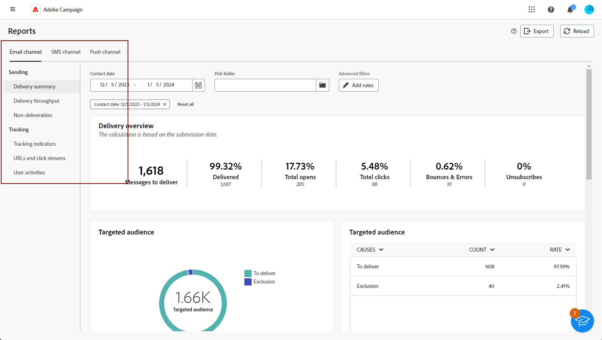
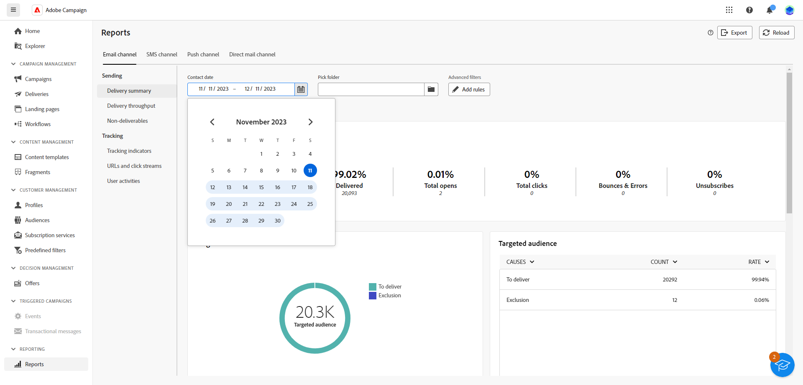
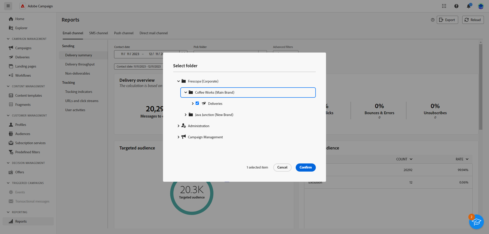

# Introduzione ai rapporti globali {#global-report-gs}

>[!CONTEXTUALHELP]
>id="acw_campaign_reporting_global_report"
>title="Rapporto globale"
>abstract="I rapporti globali offrono un modo potente ed efficiente di analizzare le prestazioni della campagna. Questi rapporti forniscono una visualizzazione consolidata del traffico chiave e delle metriche di coinvolgimento per ogni canale all’interno della campagna."

I **Rapporti globali** sono un valido strumento e offrono un riepilogo consolidato complessivo delle metriche di traffico e coinvolgimento per ogni canale all’interno di un’istanza Campaign. Questi rapporti sono costituiti da vari widget, ciascuno dei quali offre una prospettiva distinta sulle prestazioni della campagna o della consegna.

Gli indicatori prestazioni chiave (KPI, Key Performance Indicators) vengono aggiornati ogni ora, garantendo informazioni aggiornate. Per impostazione predefinita, i filtri dati coprono gli ultimi 30 giorni, offrendo una prospettiva corrente e rilevante sulle prestazioni delle campagne e delle consegne.

L’elenco completo dei rapporti e delle metriche associate a ciascun canale è disponibile nelle pagine seguenti:

* [Report globali e-mail](global-report-email.md)
* [Rapporti globali SMS](global-report-sms.md)
* [Rapporti globali push](global-report-push.md)
* [Report globali direct mail](global-report-direct.md)

## Gestire la dashboard dei report {#manage-reports}

Per accedere e gestire i rapporti globali, effettua le seguenti operazioni:

1. Passa al menu **[!UICONTROL Report]** nella sezione **[!UICONTROL Reporting]**.

1. Nel menu a sinistra, seleziona un rapporto dall’elenco e naviga attraverso la scheda per visualizzare i dati da ciascun canale.

   {zoomable="yes"}

1. Dal dashboard, scegli un **Inizio** e un **[!UICONTROL Ora di fine]** per eseguire il targeting di dati specifici.

   {zoomable="yes"}

1. Dal campo **[!UICONTROL Seleziona cartella]**, seleziona se eseguire il targeting di consegne o campagne da una cartella specifica.

   {zoomable="yes"}

1. Fai clic su **[!UICONTROL Aggiungi regole]** per iniziare a creare query per filtrare meglio i dati di reporting. [Scopri come utilizzare Query Modeler](../query/query-modeler-overview.md).

1. Dai **[!UICONTROL URL e dai flussi di clic]**, scegli i **[!UICONTROL Collegamenti più visitati]** o il **[!UICONTROL periodo di tempo]**.

   Le opzioni **[!UICONTROL Visualizza per]** consentono di filtrare URL, etichette o categorie.