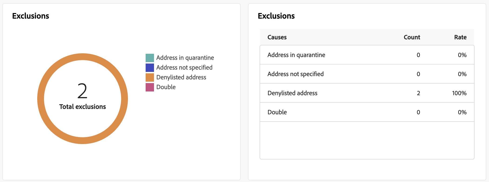

# Rapporti sulle consegne push {#push-report}

>[!CONTEXTUALHELP]
>id="acw_push_report_overview"
>title="Riepilogo report di consegna push"
>abstract="Il **Panoramica della consegna push** offre una panoramica completa della distribuzione push, con informazioni approfondite e dati specifici. Fornisce informazioni complete sulle prestazioni, l’efficacia e i risultati della consegna."

>[!CONTEXTUALHELP]
>id="acw_delivery_reporting_sending_push"
>title="Invio rapporti"
>abstract="lui **Invio** all’interno del rapporto fornisce informazioni approfondite sulle interazioni dei visitatori con le consegne e su eventuali errori potenziali riscontrati."

Il **Rapporto sulle consegne push** offre una panoramica completa del canale push con informazioni approfondite e dati specifici. Offre informazioni complete sulle prestazioni, l’efficacia e i risultati di ogni consegna.

## Riepilogo push {#push-summary}

### Panoramica della consegna {#push-delivery-overview}

Il **[!UICONTROL Panoramica della consegna]** Il rapporto fornisce indicatori di prestazioni chiave (KPI, Key Performance Indicators) che forniscono informazioni dettagliate sul modo in cui i visitatori si relazionano con i messaggi push.

+++Ulteriori informazioni sulle metriche del rapporto sulle consegne push.

* **[!UICONTROL Totale inviato]**: numero totale di messaggi elaborati durante la preparazione della consegna.

* **[!UICONTROL Consegnato]**: numero di messaggi inviati correttamente rispetto al numero totale di messaggi inviati.

* **[!UICONTROL Clic]**: numero totale di destinatari che hanno interagito con il messaggio push.

* **[!UICONTROL Errori]**: numero totale di errori che si sono verificati durante una consegna e che ne hanno impedito l’invio ai profili.

+++

### Popolazione target {#push-delivery-targeted-population}

>[!CONTEXTUALHELP]
>id="acw_delivery_reporting_push_targeted_population"
>title="Popolazione di destinazione push"
>abstract="Il **Popolazione target** grafico e tabella mostrano i dati relativi al pubblico dei messaggi push: messaggi da consegnare ed esclusioni."

Il **Popolazione target** grafico e tabella mostrano i dati relativi al pubblico: messaggi da consegnare ed esclusioni. Le metriche sono descritte di seguito.

+++Ulteriori informazioni sulle metriche del rapporto sulle consegne push.

* **[!UICONTROL Da consegnare]**: numero totale di messaggi elaborati durante la preparazione della consegna.

* **[!UICONTROL Esclusioni]**: numero di profili che sono stati esclusi dall’analisi.

+++

### Statistiche complessive {#push-delivery-overall}

>[!CONTEXTUALHELP]
>id="acw_delivery_reporting_push_overall_stats"
>title="Statistiche generali push"
>abstract="Il **Statistiche generali** Il rapporto presenta i dati per le notifiche push inviate: esito positivo, errori e quarantene."

Il **Statistiche generali** Il rapporto presenta i dati per le notifiche push inviate: esito positivo, errori e quarantene. Le metriche sono descritte di seguito.

+++Ulteriori informazioni sulle metriche del rapporto sulle consegne push.

* **[!UICONTROL Completato]**: numero di messaggi elaborati correttamente.

* **[!UICONTROL Errori]**: numero totale di errori che si sono verificati durante la consegna e che hanno impedito l’invio dei messaggi a determinati profili.

* **[!UICONTROL Nuova quarantena]**: numero di profili esclusi e aggiunti alla quarantena.

+++

### Esclusioni {#push-delivery-exclusions}

>[!CONTEXTUALHELP]
>id="acw_delivery_reporting_push_exclusions"
>title="Statistiche generali push"
>abstract="Il **Esclusioni** il grafico e la tabella mostrano i vari motivi che hanno impedito ai profili utente, che erano stati esclusi dai profili target, di ricevere il messaggio."

Il **[!UICONTROL Esclusioni]** il grafico e la tabella mostrano i vari motivi che hanno impedito ai profili utente, che erano stati esclusi dai profili target, di ricevere il messaggio.

## Velocità effettiva di consegna {#delivery-throughput}

>[!CONTEXTUALHELP]
>id="acw_delivery_reporting_throughput_push"
>title="Rapporto velocità effettiva di consegna"
>abstract="Il rapporto Velocità effettiva di consegna presenta informazioni dettagliate sulla velocità effettiva di consegna dell’intera piattaforma in un arco temporale specificato."

Il **Velocità effettiva di consegna** Questo rapporto presenta informazioni dettagliate sulla velocità effettiva di consegna dell’intera piattaforma in un determinato arco temporale. La metrica primaria utilizzata per misurare la velocità di consegna dei messaggi è il numero di messaggi inviati all’ora.

