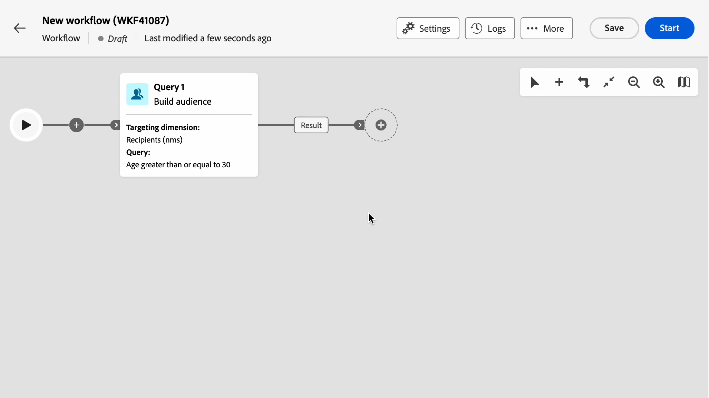

# Note sulla versione {#latest-release}

>[!CONTEXTUALHELP]
>id="acw_homepage_learning_card2"
>title="Note sulla versione"
>abstract="Le versioni dell’interfaccia utente web di Adobe Campaign funzionano secondo un modello di consegna continua che consente un approccio più scalabile e graduale alla distribuzione delle funzioni. Di conseguenza, le note sulla versione di Campaign vengono aggiornate diverse volte al mese, con le funzioni, i miglioramenti e le correzioni più recenti. Si consiglia di controllarle regolarmente."

Le versioni dell’interfaccia utente web di Adobe Campaign funzionano secondo un modello di consegna continua che consente un approccio più scalabile e graduale alla distribuzione delle funzioni. Di conseguenza, queste note sulla versione vengono aggiornate più volte al mese. Consultale regolarmente.

## Versione di aprile 2026 {#26-4-release}

_29 aprile, 2026_

### Miglioramento {#26-4-improvement}

La sezione **Dati di arricchimento** è ora disponibile nell’attività del flusso di lavoro **Crea pubblico** (tipo di query).Puoi visualizzare, aggiungere, modificare e rimuovere **dati aggiuntivi** direttamente dall’interfaccia utente web di Campaign.Come nell’attività **Arricchimento**, è possibile aggiungere attributi di arricchimento singoli, collegamenti alle raccolte ed espressioni.

[Ulteriori informazioni](../workflows/activities/build-audience.md)

## Versione di marzo 2026 {#26-3-release}

_Marzo_ 24, 2026_

### Nuove funzioni {#26-3-features}

<table>
<thead>
<tr>
<th><strong>Authoring dello schema (GA)</strong> </th> 
</tr>
</thead>
<tbody>
<tr>
<td>

La funzione di authoring dello schema è ora disponibile per tutta la clientela (GA). Questa funzionalità consente di creare e gestire gli schemi direttamente dall’interfaccia utente web di Campaign. Puoi creare nuove tabelle, estendere gli schemi esistenti e creare moduli personalizzati. Puoi definire strutture di dati personalizzate per supportare specifiche esigenze di business senza che sia necessario l’accesso alla console client.

Per ulteriori informazioni, consulta la <a href="../administration/schemas.md">documentazione dettagliata</a>.

</td>
</tr>
</tbody>
</table>

<table>
<thead>
<tr>
<th><strong>Temi in E-mail designer (LA)</strong> </th> 
</tr>
</thead>
<tbody>
<tr>
<td>

I temi forniscono una migliore esperienza di authoring per le e-mail consentendoti di definire stili di tema riutilizzabili che soddisfino le linee guida del tuo brand. Ora puoi utilizzare le variabili tema nei frammenti, garantendo così uno stile coerente nei diversi modelli e-mail. Questa funzione consente di creare e-mail più rapidamente con moduli preimpostati che riprendono elementi di contenuto quali titoli, descrizioni, immagini e collegamenti, mantenendo al contempo la coerenza del brand.

Nota: questa funzionalità è disponibile solo per un set di organizzazioni (disponibilità limitata) e verrà implementata globalmente in una versione futura.

Per ulteriori informazioni, consulta la <a href="../email/apply-email-themes.md">documentazione dettagliata</a>.

</td>
</tr>
</tbody>
</table>

<table>
<thead>
<tr>
<th><strong>Integrazione di modelli Firefly personalizzati e modelli di generazione di immagini di terze parti</strong> </th>
</tr>
</thead>
<tbody>
<tr>
<td>

Abilita l’integrazione diretta con modelli Firefly standard e personalizzati, nonché con modelli di immagini di terze parti approvati, per usufruire di maggiore flessibilità, controllo e allineamento al brand durante la generazione delle immagini.

Scegli il modello giusto per le tue esigenze:

<ul><li> <strong>Modello Adobe</strong> (basato su Firefly Image Model 4) per la generazione immediata di immagini senza configurazione aggiuntiva</li><li> <strong>Modello partner</strong> (basato su Gemini 2.5 Flash) per funzionalità specializzate</li><li><strong>Modelli personalizzati</strong> (modelli specifici del brand basati sulle tue risorse) per la generazione di prodotti in linea con il brand che sono allineati con precisione all’identità del brand, allo stile e alle linee guida visive.</li></ul>

Per ulteriori informazioni, consulta la <a href="../content/generative-models.md">documentazione dettagliata</a>.

</td>
</tr>
</tbody>
</table>

<table>
<thead>
<tr>
<th><strong>Attività di consegna automatizzata</strong> </th>
</tr>
</thead>
<tbody>
<tr>
<td>

L’attività del flusso di lavoro <strong>Consegna automatizzata</strong> è ora disponibile nella palette del flusso di lavoro. Puoi utilizzarla per creare o eseguire azioni di consegna (preparare, inviare una bozza, preparare e avviare, ecc.) direttamente all’interno del flusso di lavoro. Seleziona una consegna esistente creata all’esterno del flusso di lavoro per riutilizzarla a ogni esecuzione, oppure crea una nuova consegna da un modello a ogni esecuzione dell’attività.

Per ulteriori informazioni, consulta la <a href="../workflows/activities/automated-delivery.md">documentazione dettagliata.

</td>
</tr>
</tbody>
</table>

<table>
<thead>
<tr>
<th><strong>Più rami del flusso di lavoro e attività di unione</strong> </th>
</tr>
</thead>
<tbody>
<tr>
<td>

Ora sono supportati <strong>più rami</strong>. Invece di utilizzare un <strong>fork</strong>, puoi fare clic su <strong>Aggiungi ramo</strong> sulla barra degli strumenti. È stata migliorata anche l’attività <strong>AND-join</strong>. Si tratta ora di un’attività di <strong>unione</strong> generica che ti consente di scegliere tra le opzioni di unione AND e OR.

Per ulteriori informazioni, consulta la le pagine della documentazione <a href="../workflows/orchestrate-activities.md#toolbar">Orchestrare le attività</a> e <a href="../workflows/activities/join.md">Unione</a>.

</td>
</tr>
</tbody>
</table>

### Miglioramenti {#26-3-improvements}

* L’attività del flusso di lavoro **Avvia** è stata aggiunta per migliorare la compatibilità con Client Console. Questa attività è facoltativa e non viene inserita per impostazione predefinita nei nuovi flussi di lavoro. Tuttavia, viene aggiunta automaticamente ai flussi di lavoro esistenti.
  [Ulteriori informazioni](../workflows/activities/about-activities.md#flow-control)
* Nelle impostazioni **Pianificazione** di una consegna, il campo di selezione del fuso orario è stato spostato sotto il campo **Data di contatto**. [Ulteriori informazioni](../msg/create-deliveries.md#gs-schedule)