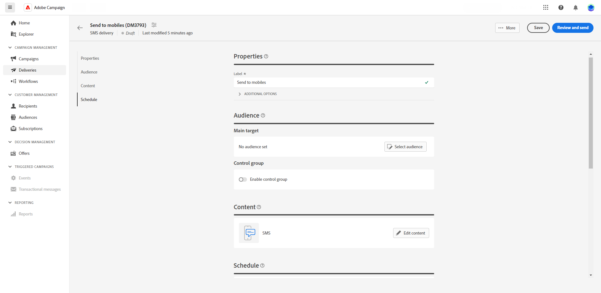

# Creare una consegna SMS {#create-sms}

>[!CONTEXTUALHELP]
>id="acw_deliveries_sms_properties"
>title="Proprietà di consegna SMS"
>abstract="Le proprietà includono i parametri di consegna comuni che consentono di denominarla e classificarla. Se la consegna utilizza uno schema esteso, sono disponibili campi specifici di opzioni personalizzate."

>[!CONTEXTUALHELP]
>id="acw_deliveries_sms_audience"
>title="Definisci il pubblico dell’SMS"
>abstract="Crea un nuovo pubblico o selezionane uno esistente facendo clic sul pulsante **Seleziona pubblico**. Se necessario, aggiungi un gruppo di controllo per misurare l’impatto della consegna."
>additional-url="https://experienceleague.adobe.com/docs/campaign-web/v8/audiences/target-audiences/control-group.html?lang=it" text="Impostare un gruppo di controllo"

>[!CONTEXTUALHELP]
>id="acw_deliveries_sms_template_selection"
>title="Selezione modello SMS"
>abstract="Seleziona un modello predefinito per avviare la consegna SMS. I modelli di consegna ti consentono di riutilizzare contenuti e impostazioni personalizzati in tutte le campagne e le consegne."
>additional-url="https://experienceleague.adobe.com/en/docs/campaign-web/v8/start/delivery-template" text="Utilizzare i modelli di consegna"

Puoi creare una consegna SMS indipendente o un SMS nel contesto di un flusso di lavoro della campagna. I passaggi seguenti illustrano la procedura per una consegna SMS indipendente (una tantum). Se lavori nel contesto di un flusso di lavoro della campagna, i passaggi di creazione sono illustrati in [questa sezione](../workflows/activities/channels.md#create-a-delivery-in-a-campaign-workflow).

Per creare una consegna SMS autonoma, segui i seguenti passaggi:

1. Passa al menu **[!UICONTROL Consegne]** nella barra a sinistra e fai clic sul pulsante **[!UICONTROL Crea consegna]**.

1. Nella sezione **[!UICONTROL Canale]**, scegli SMS come canale e seleziona un modello. [Ulteriori informazioni sui modelli](../msg/delivery-template.md)

1. Fai clic sul pulsante **[!UICONTROL Crea una consegna]** per confermare.

   {zoomable="yes"}

1. Immetti un’**[!UICONTROL etichetta]** per la consegna e accedi al menu a discesa **[!UICONTROL Opzioni aggiuntive]**. Se la consegna utilizza uno schema esteso, sono disponibili campi **Opzioni personalizzate** specifici.

   +++Configura le seguenti impostazioni in base alle tue esigenze.
   * **[!UICONTROL Nome interno]**: assegna un identificatore univoco alla consegna.
   * **[!UICONTROL Cartella]**: memorizza la consegna in una cartella specifica.
   * **[!UICONTROL Codice di consegna]**: organizza le consegne in base alla convenzione di denominazione.
   * **[!UICONTROL Descrizione]**: specifica una descrizione della consegna.
   * **[!UICONTROL Natura]**: specifica la natura della consegna a scopo di classificazione.
   +++

1. Fai clic sul pulsante **[!UICONTROL Seleziona pubblico]** per eseguire il targeting di un pubblico esistente o crearne uno tuo. [Ulteriori informazioni sui tipi di pubblico](../audience/about-recipients.md)

   {zoomable="yes"}

   Scopri come selezionare un pubblico esistente in [questa pagina](../audience/add-audience.md).

   Scopri come creare un nuovo pubblico in [questa pagina](../audience/one-time-audience.md).

1. Attiva l’opzione **[!UICONTROL Abilita gruppo di controllo]** per impostare un gruppo di controllo per misurare l’impatto della consegna. I messaggi non vengono inviati a tale gruppo di controllo, pertanto puoi confrontare il comportamento della popolazione che ha ricevuto il messaggio con quello dei contatti che non lo hanno fatto. [Ulteriori informazioni](../audience/control-group.md)

1. Puoi configurare la consegna SMS come consegna multilingue per inviare messaggi in base alla lingua preferita di un profilo. [Ulteriori informazioni](../msg/multilingual.md).

1. Fai clic su **[!UICONTROL Modifica contenuto]** per iniziare a progettare il contenuto del messaggio SMS. [Ulteriori informazioni](content-sms.md)

   {zoomable="yes"}

   Da questa schermata, è possibile anche [simulare i contenuti](../preview-test/preview-test.md) e [configurare le offerte](../msg/offers.md).

1. Per pianificare la consegna a una data e un’ora specifiche, attiva l’opzione **[!UICONTROL Abilita pianificazione]**. Dopo aver avviato la consegna, il messaggio viene inviato automaticamente nella data e nell’ora esatte definite per il destinatario. Per ulteriori informazioni sulla pianificazione della consegna, consulta [questa sezione](../msg/gs-deliveries.md#gs-schedule).

   >[!NOTE]
   >
   >Quando una consegna viene inviata nel contesto di un flusso di lavoro, utilizza l&#39;attività **Scheduler**. Per ulteriori informazioni, consulta [questa pagina](../workflows/activities/scheduler.md).

1. Fai clic su **[!UICONTROL Impostazioni]** per accedere alle opzioni avanzate relative al modello di consegna. [Ulteriori informazioni](../advanced-settings/delivery-settings.md)

   {zoomable="yes"}