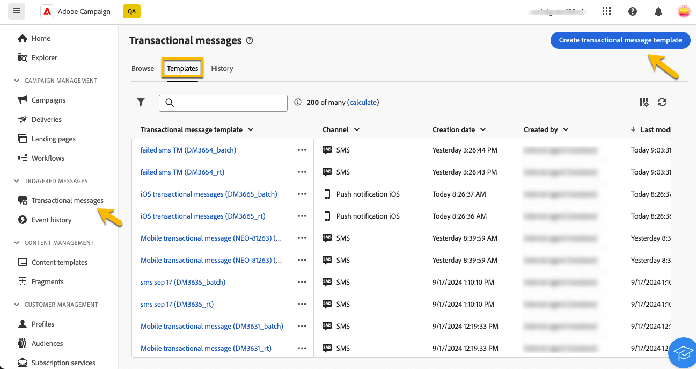
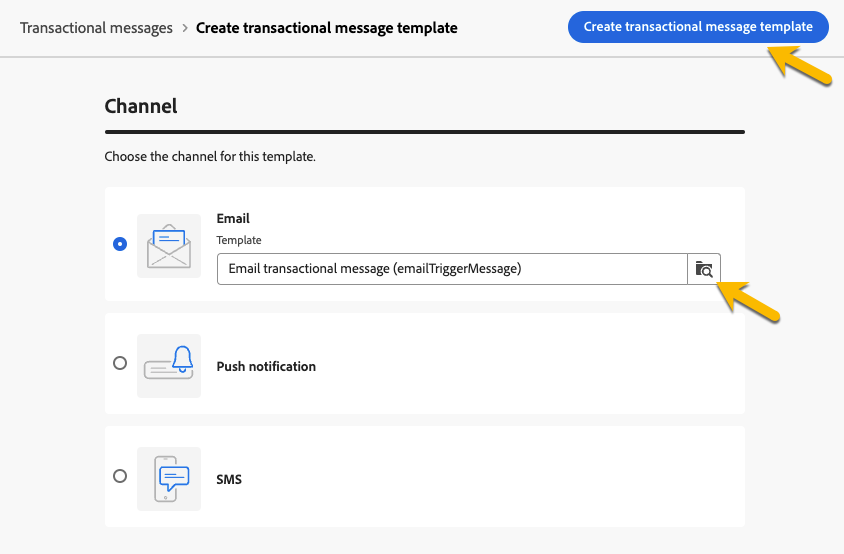
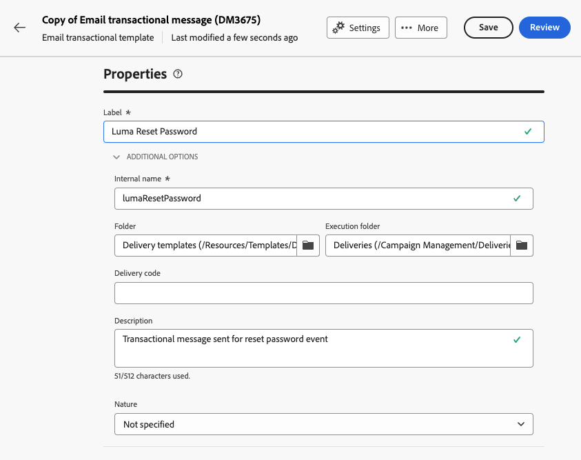
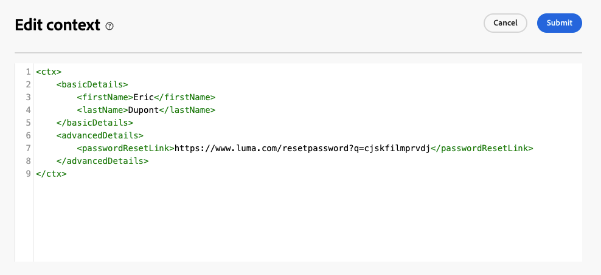

# Creare messaggi transazionali

Nella messaggistica transazionale, un evento attiva l’invio di un messaggio personalizzato. Per abilitare questa funzione, crea un modello di messaggio per ogni tipo di evento. Questi modelli contengono tutte le informazioni necessarie per personalizzare il messaggio transazionale.

## Creare un modello di messaggio transazionale {#transactional-template}

Nell’interfaccia utente di Campaign Web, il primo passaggio nella configurazione della messaggistica transazionale è la creazione del modello o la creazione diretta del messaggio. Differisce da [la configurazione dei messaggi transazionali nella console client](https://experienceleague.adobe.com/it/docs/campaign/campaign-v8/send/real-time/transactional).

Puoi utilizzare un modello di messaggio transazionale per visualizzare in anteprima il contenuto della consegna ricevuto dal profilo prima che raggiunga il pubblico finale. Ad esempio, un amministratore può impostare e configurare i modelli, rendendoli pronti per l’uso da parte degli utenti di marketing.

Per creare un modello per messaggi transazionali, effettua le seguenti operazioni:

* Nella sezione **[!UICONTROL Messaggi attivati]**, passa a **[!UICONTROL Messaggi transazionali]**. Nella scheda **[!UICONTROL Modelli]** puoi visualizzare tutti i modelli di consegna per i messaggi transazionali. Fai clic sul pulsante **[!UICONTROL Crea modello di messaggio transazionale]** per iniziare la creazione del modello.

  {zoomable="yes"}

* Nella nuova pagina visualizzata, scegli il canale del modello. Per questo esempio, seleziona il canale **[!UICONTROL E-mail]**. È inoltre possibile utilizzare un altro modello di messaggio e selezionarlo nell&#39;elenco dei modelli.

  {zoomable="yes"}

  Fai di nuovo clic sul pulsante **[!UICONTROL Crea messaggio transazionale]** per convalidare la creazione del modello nel canale selezionato.

* Accedi alla configurazione del modello di messaggio transazionale.

  {zoomable="yes"}

### Proprietà messaggio transazionale {#transactional-properties}

>[!CONTEXTUALHELP]
>id="acw_transacmessages_properties"
>title="Proprietà della messaggistica transazionale"
>abstract="Compila questo modulo per configurare le proprietà della messaggistica transazionale."

>[!CONTEXTUALHELP]
>id="acw_transacmessages_email_properties"
>title="Proprietà e-mail della messaggistica transazionale"
>abstract="Compila questo modulo per configurare le proprietà delle e-mail della messaggistica transazionale."

>[!CONTEXTUALHELP]
>id="acw_transacmessages_sms_properties"
>title="Proprietà SMS della messaggistica transazionale"
>abstract="Compila questo modulo per configurare le proprietà SMS della messaggistica transazionale."

>[!CONTEXTUALHELP]
>id="acw_transacmessages_push_properties"
>title="Proprietà push della messaggistica transazionale"
>abstract="Compila questo modulo per configurare le proprietà push della messaggistica transazionale."

La sezione **[!UICONTROL Proprietà]** di un messaggio transazionale ti aiuta a configurare:

* L&#39;**[!UICONTROL Etichetta]**, ovvero il nome visualizzato nell&#39;elenco dei messaggi transazionali. Chiarirlo per la ricerca e l&#39;uso futuro.
* **[!UICONTROL Nome interno]**, che è un nome univoco che distingue il messaggio dagli altri messaggi creati.
* **[!UICONTROL Cartella]**, in cui viene creato il modello di messaggio transazionale.
* **[!UICONTROL Cartella di esecuzione]**, in cui viene archiviato il messaggio dopo l&#39;esecuzione.
* Il **[!UICONTROL codice di consegna]**, che è un codice che aiuta a riconoscere il messaggio per il reporting, se necessario.
* La **[!UICONTROL Descrizione]**.
* La **[!UICONTROL Natura]**, che è la natura della consegna, come elencato nell&#39;enumerazione *deliveryNature*. [Ulteriori informazioni sulle enumerazioni](https://experienceleague.adobe.com/en/docs/campaign/campaign-v8/config/configuration/ui-settings#enumerations).

{zoomable="yes"}

### App mobile {#mobile-app}

>[!CONTEXTUALHELP]
>id="acw_transacmessages_mobileapp"
>title="App mobile di messaggistica transazionale"
>abstract="In questa sezione puoi selezionare l’applicazione su cui desideri inviare il messaggio push."

In questa sezione, seleziona l’applicazione in cui desideri inviare il messaggio push.

Facendo clic sull’icona di ricerca, accedi all’elenco delle app mobili nella tua istanza di Adobe Campaign.

{zoomable="yes"}

### Esempio di contesto {#context-sample}

>[!CONTEXTUALHELP]
>id="acw_transacmessages_context"
>title="Contesto della messaggistica transazionale"
>abstract="L’esempio di contesto ti consente di creare un evento di prova per visualizzare in anteprima il messaggio transazionale ricevuto con la personalizzazione del profilo."

>[!CONTEXTUALHELP]
>id="acw_transacmessages_addcontext"
>title="Contesto della messaggistica transazionale"
>abstract="L’esempio di contesto ti consente di creare un evento di prova per visualizzare in anteprima il messaggio transazionale ricevuto con la personalizzazione del profilo."

L’esempio di contesto ti consente di creare un evento di prova per visualizzare in anteprima il messaggio transazionale ricevuto con la personalizzazione del profilo.

Questo passaggio è facoltativo. Puoi utilizzare il modello senza l’esempio di contesto, ma il problema è che non puoi visualizzare in anteprima il contenuto personalizzato.

Nell’esempio di impostazione della password, l’evento invia il nome, il cognome e un collegamento personalizzato dell’utente per reimpostarne la password. Il contesto può essere configurato come mostrato di seguito.

Il contenuto del contesto dipende dalla personalizzazione necessaria.

{zoomable="yes"}

### Contenuto del modello per messaggi transazionali {#transactional-content}

>[!CONTEXTUALHELP]
>id="acw_transacmessages_content"
>title="Contenuto della messaggistica transazionale"
>abstract="Scopri come creare il contenuto della messaggistica transazionale."

>[!CONTEXTUALHELP]
>id="acw_transacmessages_personalization"
>title="Personalizzazione della messaggistica transazionale"
>abstract="Scopri come personalizzare il contenuto della messaggistica transazionale."

>[!CONTEXTUALHELP]
>id="acw_personalization_editor_event_context"
>title="Contesto dell’evento"
>abstract="Questo menu fornisce variabili dell’evento trigger che puoi sfruttare per personalizzare il contenuto dei messaggi transazionali."

L’utilizzo del contenuto di un messaggio transazionale è simile alla creazione di contenuto di una consegna. Fai clic su **[!UICONTROL Apri e-mail designer]** o **[!UICONTROL Modifica corpo e-mail]** e seleziona un contenuto modello o importa il codice HTML.

{zoomable="yes"}

Per aggiungere la personalizzazione al contenuto, fai clic sulla sezione in cui desideri aggiungerla e scegli l&#39;icona **[!UICONTROL Aggiungi Personalization]**.

{zoomable="yes"}

Accedi alla finestra **[!UICONTROL Modifica personalizzazione]**. Per aggiungere variabili dall&#39;evento trigger, fare clic sull&#39;icona **[!UICONTROL Contesto evento]**. Passa al contesto definito per il modello ([ulteriori informazioni sul contesto](#context-sample)) e fai clic sul pulsante **[!UICONTROL +]** per inserire la variabile richiesta.

L’immagine seguente mostra come aggiungere la personalizzazione per il nome.

{zoomable="yes"}

In questo esempio, aggiungi nome, cognome e personalizza il collegamento del pulsante **[!UICONTROL Reimposta la password]**.

{zoomable="yes"}

### Visualizzare l’anteprima del modello

In questa fase di creazione del modello, visualizza l’anteprima del contenuto del modello e controlla la personalizzazione.

Per farlo, compila il [esempio di contesto](#context-sample) e fai clic sul pulsante **[!UICONTROL Simula contenuto]**.

{zoomable="yes"}

## Creare un messaggio transazionale {#transactional-message}

Puoi creare un messaggio transazionale direttamente o utilizzando un modello di messaggio transazionale. [Scopri come creare un modello di messaggio transazionale](#transactional-template).

Per creare un messaggio sulle transazioni, effettua le seguenti operazioni:

* Nella sezione **[!UICONTROL Messaggi attivati]**, passa a **[!UICONTROL Messaggi transazionali]**. Nella scheda **[!UICONTROL Sfoglia]** puoi visualizzare tutti i messaggi transazionali creati. Fai clic sul pulsante **[!UICONTROL Crea messaggio transazionale]** per iniziare la creazione del messaggio.

  {zoomable="yes"}

* Nella nuova pagina visualizzata, scegli il canale del messaggio e seleziona il modello con cui desideri lavorare. In questo esempio, scegli [il modello creato in precedenza](#transactional-template).

  {zoomable="yes"}

  Fai di nuovo clic sul pulsante **[!UICONTROL Crea messaggio transazionale]** per convalidare la creazione del messaggio sul canale selezionato.

* Accedi alla configurazione del messaggio transazionale. Il messaggio eredita la configurazione del modello. Questa pagina è quasi identica alla pagina di configurazione del modello di messaggio sulle transazioni, tranne per il fatto che include anche la configurazione del tipo di evento.

  {zoomable="yes"}

  Inserisci la configurazione del messaggio come modello:
   * [Proprietà messaggio transazionale](#transactional-properties)
   * [Esempio di contesto](#context-sample)
   * [Contenuto messaggio](#transactional-content)
e [configurare il tipo di evento](#event-type) come descritto di seguito.

* Dopo [aver convalidato il messaggio transazionale](validate-transactional.md), fai clic sul pulsante **[!UICONTROL Rivedi e pubblica]** per creare e pubblicare il messaggio. Ora i trigger possono inviare in push il messaggio transazionale.

### Informazioni sul tipo di evento {#event-type}

>[!CONTEXTUALHELP]
>id="acw_transacmessages_event"
>title="Evento della messaggistica transazionale"
>abstract="La configurazione del tipo di evento collega il messaggio all’evento trigger."

La configurazione del tipo di evento collega il messaggio all’evento trigger.

Nell’interfaccia utente di Campaign Web, seleziona un tipo di evento già creato oppure crea il tipo di evento direttamente in questa pagina di configurazione.

{zoomable="yes"}

>[!CAUTION]
>
>Se selezioni un tipo di evento attualmente utilizzato da un altro messaggio sulle transazioni, verranno attivati entrambi i messaggi. Per le best practice, **collega un tipo di evento a un solo messaggio transazionale.**

## Aggiungere offerte ai messaggi transazionali {#transactional-offers}

Puoi includere le offerte nei messaggi transazionali, consentendoti di presentare proposte rilevanti agli utenti finali, anche quando il messaggio viene attivato da un evento.

Questa funzione è accessibile durante la fase di modifica del contenuto del messaggio transazionale. Fai clic sul pulsante **[!UICONTROL Configura offerte]** per configurarlo.

Il processo di configurazione è identico a quello della configurazione delle offerte per le consegne standard. [Scopri come aggiungere offerte al messaggio](../msg/offers.md).

{zoomable="yes"}