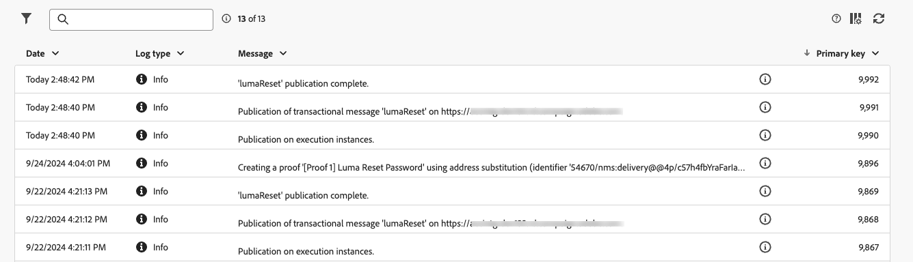
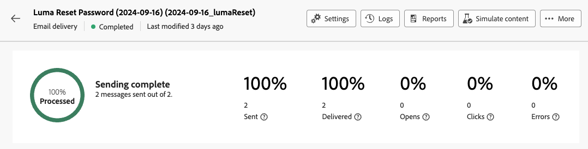
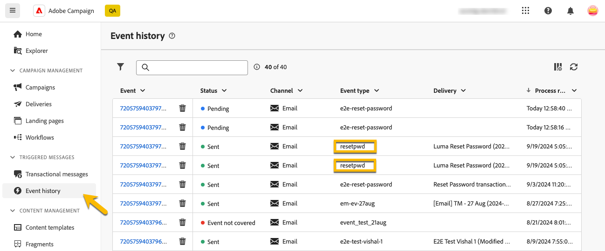
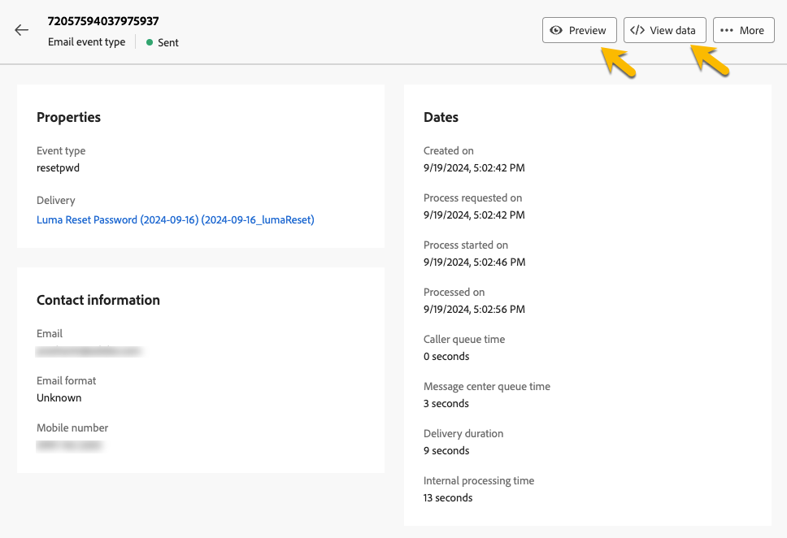

# Monitorare i messaggi transazionali

Dopo la pubblicazione e l’invio del messaggio sulle transazioni, puoi visualizzare rapporti e registri relativi.

## Registri dei messaggi transazionali {#transactional-logs}

Dopo la pubblicazione del messaggio, puoi rivederne l&#39;esecuzione facendo clic sul pulsante **[!UICONTROL Registri]**.

{zoomable="yes"}

In questo modo puoi accedere ai registri dettagliati sulla pubblicazione del messaggio nella scheda **[!UICONTROL log]**.

{zoomable="yes"}

Inoltre, puoi visualizzare l&#39;elenco di **[!UICONTROL bozze]** inviate con i relativi registri nella scheda corrispondente.

## Cronologia dei messaggi transazionali {#transactional-history}

Nella sezione **[!UICONTROL Messaggi attivati]** puoi visualizzare i dettagli di tutti i messaggi transazionali eseguiti. Per accedere a questo, passa a **[!UICONTROL Messaggi transazionali]**. Nella scheda **[!UICONTROL Cronologia]** puoi visualizzare l&#39;elenco dei messaggi transazionali eseguiti insieme al loro stato e alle informazioni aggiuntive.

{zoomable="yes"}

Fai una ricerca lì per trovare il messaggio e cliccarci sopra.
Puoi visualizzare i dettagli qui.

{zoomable="yes"}

## Cronologia degli eventi {#event-history}

>[!CONTEXTUALHELP]
>id="acw_transacmessages_eventhistory"
>title="Cronologia degli eventi di messaggistica transazionale"
>abstract="Puoi visualizzare gli eventi che attivano il messaggio sulle transazioni."

>[!CONTEXTUALHELP]
>id="acw_transacmessages_eventhistory_preview"
>title="Anteprima cronologia eventi di messaggistica transazionale"
>abstract="Puoi visualizzare gli eventi che attivano il messaggio sulle transazioni."

Puoi anche avere una visione degli eventi che attivano il messaggio sulle transazioni.
Per visualizzarli, vai alla sezione **[!UICONTROL Cronologia eventi]**.

Puoi visualizzarli con il nome del tipo di evento.

{zoomable="yes"}

Per ulteriori dettagli, fai clic sull&#39;ID **[!UICONTROL Evento]**:

* Le informazioni di contatto
* Informazioni sulle date del processo

Puoi anche ricevere un&#39;anteprima del messaggio inviato con il pulsante **[!UICONTROL Anteprima]** e visualizzare i dati ricevuti che attivano il messaggio con il pulsante **[!UICONTROL Visualizza dati]**.

{zoomable="yes"}

Il pulsante **[!UICONTROL Altro]** consente di eliminare la cronologia eventi.
