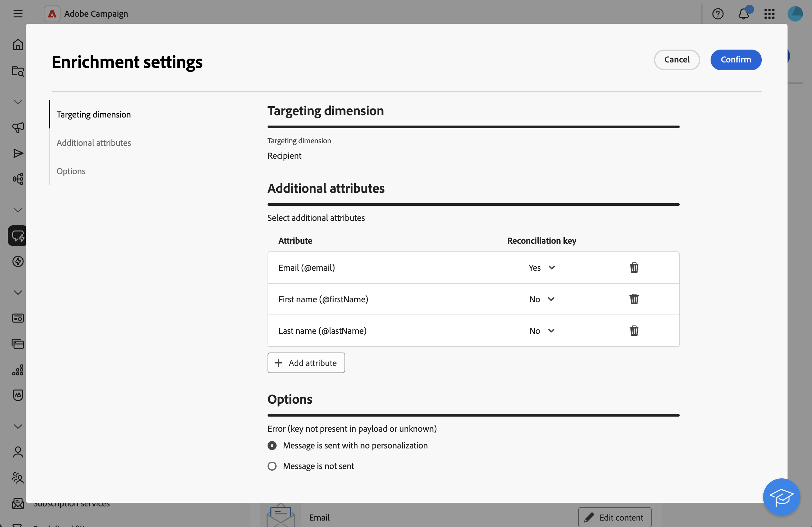
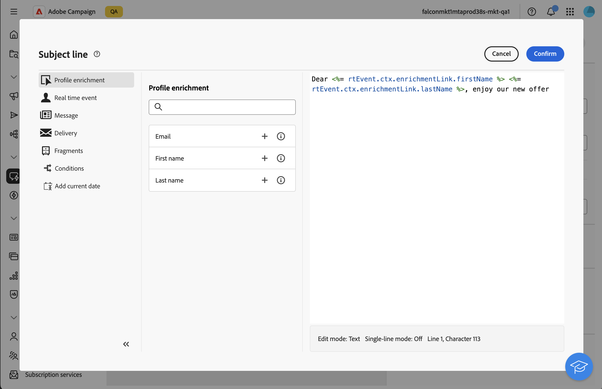

# Arricchire i messaggi transazionali con i dati del profilo{#profile-enrichment}

>[!CONTEXTUALHELP]
>id="acw_homepage_welcome_rn2"
>title="Arricchimento del profilo"
>abstract="Ora puoi personalizzare i messaggi transazionali collegando i campi del database di Campaign al contenuto. Seleziona le mappature di destinazione, le colonne di arricchimento e le chiavi di riconciliazione per una personalizzazione accurata in tempo reale."
>additional-url="https://experienceleague.adobe.com/docs/campaign-web/v8/release-notes/release-notes.html?lang=it" text="Consulta le note sulla versione"

Questa funzionalità ti consente di personalizzare i messaggi transazionali collegando i campi del database di Adobe Campaign al contenuto dei messaggi. Puoi selezionare mappature target, colonne di arricchimento e una chiave di riconciliazione per garantire una personalizzazione accurata e in tempo reale, mantenendo al contempo le soglie di prestazioni.

* I messaggi transazionali basati su eventi utilizzano i dati contenuti nell’evento stesso.
* I messaggi transazionali basati su profili utilizzano i dati contenuti nel database di Adobe Campaign.

Per impostare l’arricchimento del profilo, effettua le seguenti operazioni principali:

1. Crea il messaggio transazionale, [ulteriori informazioni](#create-enrichment)
1. Definisci il tipo di evento, [leggi tutto](#event-enrichment)
1. Impostare le impostazioni di arricchimento, [ulteriori informazioni](#settings-enrichment)
1. Definisci il contenuto, [ulteriori informazioni](#content-enrichment)
1. Convalida e invio, [ulteriori informazioni](#send-enrichment)

>[!NOTE]
>
>Il server deve essere aggiornato alla versione 8.8.2 o successiva.
>
>Questa funzione è attualmente disponibile solo per e-mail, SMS e notifiche push.

## Creare il messaggio transazionale{#create-enrichment}

Innanzitutto, devi creare un nuovo messaggio sulle transazioni.

1. Nella sezione **[!UICONTROL Messaggi attivati]**, passa a **[!UICONTROL Messaggi transazionali]** e crea un nuovo messaggio transazionale.

   {zoomable="yes"}

1. Scegli un modello e definisci le proprietà. Per ulteriori informazioni, consulta questa [pagina](create-transactional.md#transactional-message).

## Definire il tipo di evento{#event-enrichment}

Quindi, devi definire l’evento come basato su profili per eseguire il targeting dei dati contenuti nel database di Adobe Campaign.

1. Nella sezione **Tipo evento**, seleziona **Seleziona tipo evento**, quindi scegli se desideri utilizzare un tipo di evento esistente o crearne uno tuo.

   >[!NOTE]
   >
   >Non puoi scegliere un tipo di evento già utilizzato in un altro modello di messaggio transazionale.

   {zoomable="yes"}

1. Immettere le informazioni sul tipo di evento:

   * Per un tipo di evento esistente, selezionalo dall’elenco.
   * Per aggiungerne una nuova, aggiungi un’etichetta e un nome.

1. Quindi, scegli **Profilo RT** nel menu a discesa **Tipo evento**.

   {zoomable="yes"}

## Impostare le impostazioni di arricchimento{#settings-enrichment}

Ora aggiungiamo all’evento i campi che ti consentiranno di personalizzare il messaggio transazionale.

1. Nella sezione **Dati** fare clic su **Impostazioni di arricchimento**.

   {zoomable="yes"}

   >[!NOTE]
   >
   >Questo pulsante è disponibile solo quando definisci un evento basato su profilo.

1. Nella sezione **Attributi aggiuntivi**, fai clic su **aggiungi attributo** e seleziona i campi necessari.

   {zoomable="yes"}

1. Definisci quale attributo verrà utilizzato come chiave di riconciliazione.

1. Scegli cosa deve accadere se la chiave non è disponibile nel payload.

   * Il messaggio viene inviato senza personalizzazione
   * Messaggio non inviato

## Definire il contenuto{#content-enrichment}

Quindi, devi definire il contenuto del messaggio transazionale.

1. Nella sezione **Contenuto**, fai clic sul pulsante **Modifica contenuto** e definisci il contenuto del messaggio. Consulta [questa pagina](create-transactional.md#transactional-content).

   {zoomable="yes"}

1. Quando si utilizza la personalizzazione, ad esempio nella riga dell&#39;oggetto, utilizzare il menu **Arricchimento profilo** per aggiungere i campi basati sul profilo precedentemente definiti.

   {zoomable="yes"}

## Convalida e invio{#send-enrichment}

Infine, devi convalidare e inviare la consegna.

1. Convalida la consegna simulando il contenuto e inviando le bozze. Consulta [questa pagina](validate-transactional.md).

1. Fai clic sul pulsante **[!UICONTROL Rivedi e pubblica]** per creare e pubblicare il messaggio. I trigger possono ora avviare l’invio del messaggio transazionale.

<!--
When creating the event configuration, select the Profile event targeting dimension (see Creating an event).

Add fields to the event, in order to be able to personalize the transactional message (see Defining the event attributes). You must add at least one field to create an enrichment. You do not need to create other fields such as First name and Last name as you will be able to use personalization fields from the Adobe Campaign database.

Create an enrichment in order to link the event to the Profile resource (see Enriching the event) and select this enrichment as the Targeting enrichment.

IMPORTANT
This step is mandatory for profile-based events.
Preview and publish the event (see Previewing and publishing the event).

When previewing the event, the REST API does not contain an attribute specifying the email address, mobile phone, or push notification specific attributes, as it will be retrieved from the Profile resource.

Once the event has been published, a transactional message linked to the new event is automatically created. In order for the event to trigger sending a transactional message, you must modify and publish the message that was just created…

Integrate the event into your website (see Integrate the event triggering).
-->

