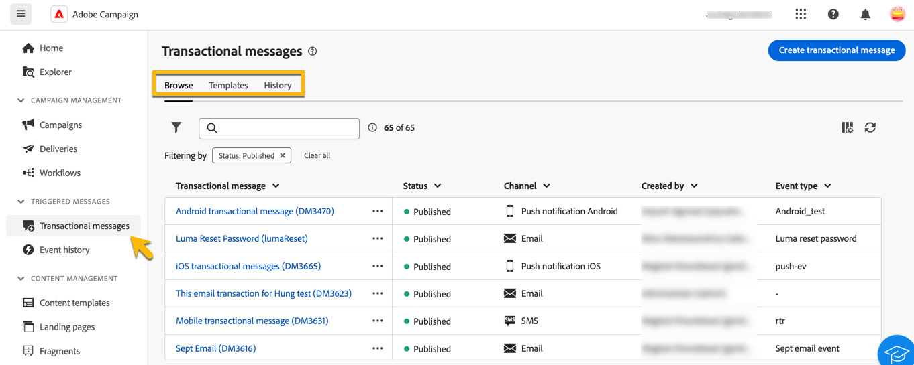

# Informazioni sulla messaggistica transazionale {#transactional-messaging}

>[!CONTEXTUALHELP]
>id="acw_transacmessages"
>title="Messaggistica transazionale"
>abstract="La messaggistica transazionale è un modulo specializzato di Adobe Campaign progettato per gestire i messaggi attivati."

>[!CONTEXTUALHELP]
>id="acw_homepage_welcome_rn1"
>title="Messaggistica transazionale"
>abstract="La messaggistica transazionale è un modulo specializzato di Adobe Campaign progettato per gestire i messaggi attivati. Questi messaggi vengono generati automaticamente in risposta a eventi provenienti da sistemi di informazione."
>additional-url="https://experienceleague.adobe.com/docs/campaign-web/v8/release-notes/release-notes.html?lang=it" text="Consulta le note sulla versione"

<!-- >>[!CONTEXTUALHELP]
>id="acw_transacmessages_exclusionlogs"
>title="Transactional messaging exclusion logs"
>abstract="Transactional messaging exclusion logs" -->

La messaggistica transazionale è un modulo specializzato di Adobe Campaign progettato per gestire i messaggi attivati. Questi messaggi vengono generati automaticamente in risposta a eventi provenienti da sistemi di informazione. Esempi comuni di tali eventi includono clic su pulsanti o collegamenti, abbandono del carrello, richiesta di avvisi sulla disponibilità del prodotto, creazione o modifica dell’account, ecc.

I messaggi transazionali vengono utilizzati per inviare:

* Notifiche importanti, come conferme d’ordine o reimpostazioni di password,
* risposte in tempo reale alle azioni dei clienti (ad esempio, creazione di conti, completamento di acquisti),
* Contenuti non promozionali critici per le interazioni dei clienti.

Il modulo di messaggistica transazionale si integra perfettamente con i sistemi informativi. Gli eventi, come le azioni dei clienti, vengono inviati ad Adobe Campaign che invia il messaggio personalizzato corrispondente. Questi messaggi possono essere inviati singolarmente o in batch tramite vari canali come e-mail, SMS o notifiche push.

Puoi trovare il modulo **[!UICONTROL Messaggio transazionale]** nella sezione **[!UICONTROL Messaggi attivati]**.

{zoomable="yes"}

Hai 3 schede nella pagina **[!UICONTROL Messaggio transazionale]**:

* **[!UICONTROL Sfoglia]** in cui è presente l&#39;elenco dei messaggi transazionali con il relativo stato,
* **[!UICONTROL Modelli]** in cui si trovano e si creano i modelli di messaggi transazionali,
* **[!UICONTROL Cronologia]** in cui si dispone dei dettagli su tutti i messaggi transazionali eseguiti.

Scopri in questa documentazione come:

* [Crea messaggi transazionali](create-transactional.md) con l&#39;aiuto di un modello e scopri le impostazioni necessarie,
* [Convalida il contenuto dei messaggi transazionali](validate-transactional.md) e simula una personalizzazione,
* [Monitora i messaggi transazionali](monitor-transactional.md).
