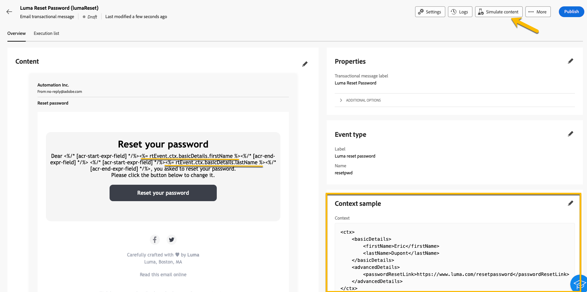
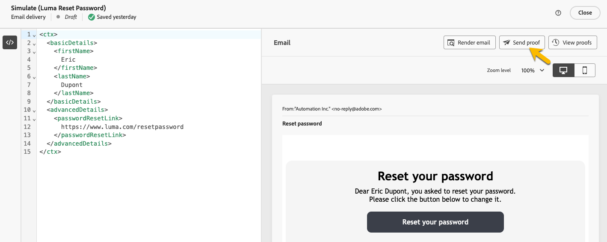
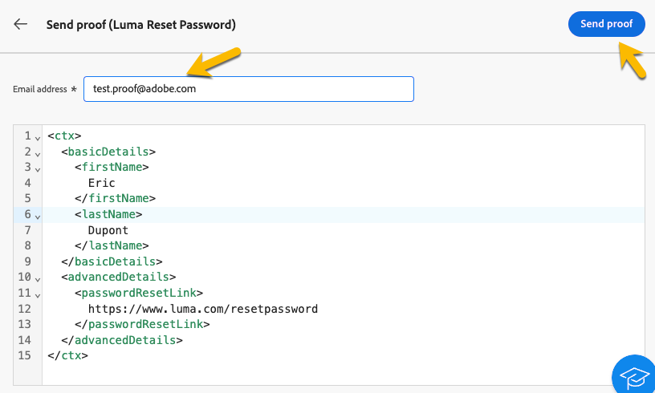

# Convalidare messaggi transazionali

Durante o dopo la creazione del messaggio transazionale, puoi convalidare il contenuto utilizzando un esempio di dati.

## Simula contenuto {#simulate-content}

Per simulare il contenuto del messaggio, segui la procedura riportata di seguito:

* Assicurati che il percorso di personalizzazione nel contenuto del messaggio corrisponda all’esempio di contesto. Nell&#39;esempio seguente, per visualizzare il nome del profilo di test, viene utilizzato il percorso *rtEvent.ctx.basicDetails.firstName*

  Puoi modificare il contenuto del messaggio o l’esempio di contesto per allinearli.

  {zoomable="yes"}

* Fai clic sul pulsante **[!UICONTROL Simula contenuto]** per visualizzare in anteprima il messaggio transazionale con i dati immessi nell&#39;esempio di contesto.

  {zoomable="yes"}

  Dopo aver verificato il contenuto, fai clic sul pulsante **[!UICONTROL Chiudi]**.

* Non dimenticare di fare clic sul pulsante **[!UICONTROL Ripubblica]** se sono state apportate modifiche al contenuto.

## Invia bozza

Se desideri testare e provare il messaggio transazionale così come verrebbe distribuito attraverso il canale scelto (ad esempio e-mail, SMS o notifiche push), puoi utilizzare la funzione bozza.

Nella finestra del contenuto della [simulazione](#simulate-content), fare clic sul pulsante **[!UICONTROL Invia bozza]**.

{zoomable="yes"}

Nella nuova finestra visualizzata, inserisci l’indirizzo e-mail (o il numero di telefono, a seconda del canale) dove desideri ricevere la bozza. Dopo aver inserito l&#39;indirizzo desiderato, fai clic su **[!UICONTROL Invia bozza]** e sui pulsanti **[!UICONTROL Conferma]**. Questa azione ti consente di inviare un esempio del messaggio transazionale, garantendo che tutte le personalizzazioni, il contenuto dinamico e la formattazione vengano visualizzati correttamente come farebbero per gli utenti finali.

{zoomable="yes"}

Si tratta di un passaggio essenziale per identificare potenziali problemi prima di pubblicare il messaggio sulle transazioni.
