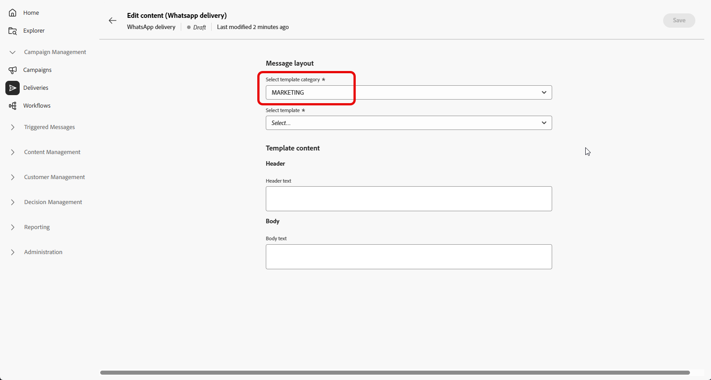
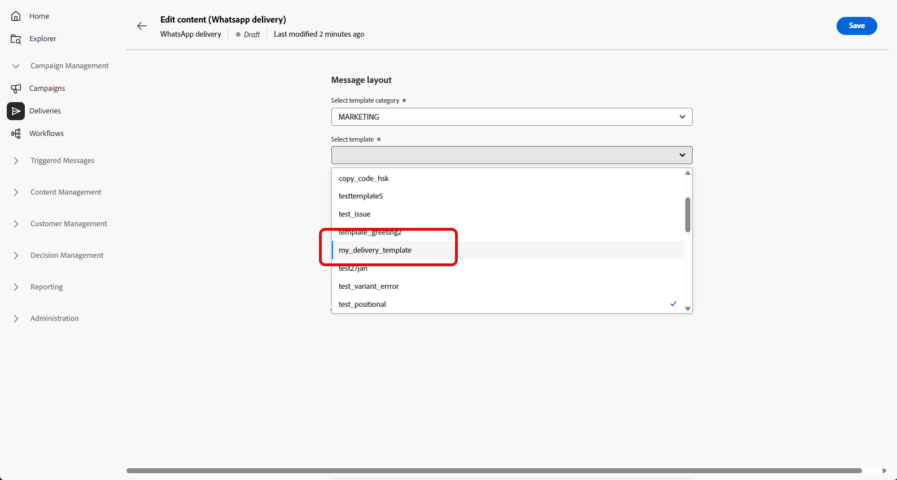
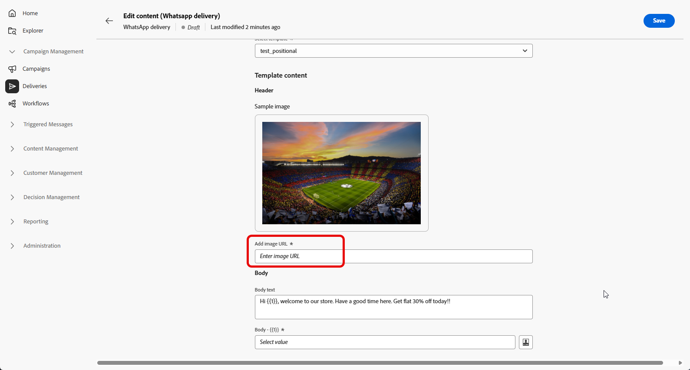

# Creare un messaggio WhatsApp {#create-whatsapp}

L&#39;**interfaccia utente Web di Adobe Campaign** consente di progettare messaggi WhatsApp che utilizzano modelli approvati da Meta, personalizzarli per ogni profilo e testarli prima dell&#39;invio.

+++ Ulteriori informazioni sugli elementi del messaggio supportati e sulle chiamate alle azioni

I seguenti tipi di messaggi sono supportati in WhatsApp:

| Funzione Messaggio | Descrizione |
|-|-|
| Intestazioni | Testo opzionale visualizzato sopra il corpo del messaggio. |
| Testo | Supporta il contenuto dinamico tramite parametri. |
| Immagine intestazione | Immagine opzionale visualizzata sopra il corpo del messaggio. |
| Corpo del testo | Supporta il contenuto dinamico tramite parametri. |
| Testo piè di pagina | Supporta il contenuto dinamico tramite parametri. |

+++

## Creare una consegna WhatsApp {#create-whatsapp-journey-campaign}

>[!IMPORTANT]
>
>Il feedback del messaggio WhatsApp non è al momento supportato.

Nell’interfaccia utente di Adobe Campaign Web, segui i passaggi seguenti per creare una consegna WhatsApp indipendente.

1. Passa al menu **[!UICONTROL Consegne]** e fai clic su **[!UICONTROL Crea consegna]**.

   

1. Scegliere **[!UICONTROL WhatsApp]** e selezionare un modello di consegna. [Ulteriori informazioni sui modelli](../msg/delivery-template.md).

   

1. Fai clic su **[!UICONTROL Crea consegna]** per confermare.

1. Fai clic su **[!UICONTROL Impostazioni]** per visualizzare le opzioni avanzate associate al modello. [Ulteriori informazioni](../advanced-settings/delivery-settings.md)

   

1. Immetti un’**[!UICONTROL etichetta]** per la consegna. Utilizza **[!UICONTROL Opzioni aggiuntive]** se hai bisogno di nome interno, cartella, codice di consegna, descrizione o natura, stesso pattern di altri canali.

1. Fai clic su **[!UICONTROL Seleziona pubblico]** per eseguire il targeting di un pubblico esistente o crearne uno. [Ulteriori informazioni sui tipi di pubblico](../audience/about-recipients.md)

1. Fai clic su **[!UICONTROL Modifica contenuto]** per aprire l&#39;editor di contenuti WhatsApp. Fai riferimento a [Definisci il contenuto WhatsApp](#whatsapp-content)).

   

1. È possibile abilitare **[!UICONTROL Abilitare la pianificazione]** per l&#39;invio in una data e un&#39;ora specifiche. [Ulteriori informazioni](../msg/gs-deliveries.md#gs-schedule).

## Definire il contenuto WhatsApp{#whatsapp-content}

>[!BEGINSHADEBOX]

Prima di progettare il messaggio WhatsApp nell’interfaccia utente di Adobe Campaign Web, crea e invia il modello in Meta. [Ulteriori informazioni](https://www.facebook.com/business/help/2055875911147364?id=2129163877102343)

Il modello WhatsApp deve essere approvato da Meta prima dell’uso. L’approvazione richiede spesso alcune ore, ma può richiedere fino a 24 ore. [Ulteriori informazioni](https://developers.facebook.com/docs/whatsapp/message-templates/guidelines/#approval-process)

>[!ENDSHADEBOX]

1. Dalla pagina di configurazione della consegna nell&#39;interfaccia utente di Adobe Campaign Web, fai clic su **[!UICONTROL Modifica contenuto]** per configurare il messaggio WhatsApp.

1. Scegli Marketing come **Categoria modello**:

   [Ulteriori informazioni sulle categorie dei modelli](https://developers.facebook.com/docs/whatsapp/updates-to-pricing/new-template-guidelines/#template-category-guidelines)

   

1. Dal menu a discesa **Modello WhatsApp**, seleziona il modello approvato da Meta.

   [Ulteriori informazioni sulla creazione di modelli WhatsApp](https://www.facebook.com/business/help/2055875911147364?id=2129163877102343)

   

1. Se il modello approvato da Meta include un&#39;immagine, fornisci l&#39;**[!UICONTROL URL immagine]**.

   

1. Nel campo **Segnaposto Personalization**, utilizza l&#39;editor di personalizzazione per mappare i campi e le espressioni del profilo ai parametri del modello. [Ulteriori informazioni](../personalization/personalize.md).

   

Quando il messaggio è pronto:

* **Consegna autonoma o della campagna**: utilizza **[!UICONTROL Verifica e invia]** e **[!UICONTROL Invia]** nel dashboard di consegna.

* **Flusso di lavoro**: apri la consegna dall&#39;attività del flusso di lavoro quando l&#39;esecuzione la rende disponibile, quindi utilizza il dashboard di consegna nello stesso modo. [Ulteriori informazioni](../workflows/start-monitor-workflows.md)

Puoi quindi tenere traccia dei risultati dai punti di ingresso **[!UICONTROL Rapporti]** e [rapporti sulla consegna](../reporting/delivery-reports.md).
