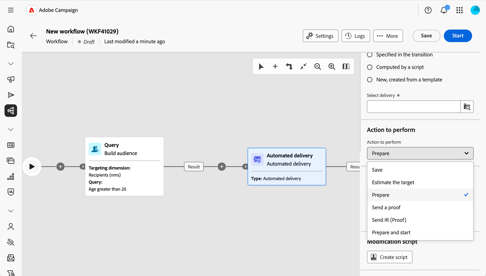

# Consegna automatizzata {#automated-delivery}

>[!CONTEXTUALHELP]
>id="acw_homepage_welcome_rn4"
>title="Attività di consegna automatizzata"
>abstract="L’attività del flusso di lavoro Consegna automatica è ora disponibile nella palette dei flussi di lavoro. Puoi utilizzarlo per creare o eseguire azioni di consegna (preparare, inviare una bozza, preparare e avviare, ecc.) direttamente all’interno del flusso di lavoro."
>additional-url="https://experienceleague.adobe.com/docs/campaign-web/v8/release-notes/release-notes.html?lang=it" text="Consulta le note sulla versione"

>[!CONTEXTUALHELP]
>id="acw_orchestration_automated-delivery"
>title="Attività di consegna automatizzata"
>abstract="L&#39;attività **Consegna automatica** viene utilizzata per l&#39;automazione: crea o riutilizza una consegna nel flusso di lavoro, quindi scegli l&#39;azione da eseguire (preparare, preparare e avviare, inviare bozze, ecc.). Puoi selezionare una consegna esplicita esistente creata al di fuori del flusso di lavoro, oppure creare una nuova consegna da un modello ogni volta che l’attività viene eseguita."

L&#39;attività **Consegna automatica** ti consente di creare, configurare ed eseguire azioni di consegna direttamente all&#39;interno del flusso di lavoro. Utilizzala quando desideri eseguire una consegna predefinita in un programma o come parte di un flusso automatico, oppure quando desideri generare una nuova consegna da un modello ogni volta che l’attività viene eseguita.

<!--
**[Continuous delivery](continuous-delivery.md)** always uses a template. The first run creates one delivery; later runs send to new recipients through that same delivery. **Automated delivery** is different: you either reuse one existing delivery every run, or you create a new delivery from a template each time—so each run can be its own delivery if you want. -->

Per configurare questa attività, effettua le seguenti operazioni:

1. Definisci le impostazioni di consegna, [ulteriori informazioni](#delivery-settings)
1. Selezionare l&#39;azione da eseguire, [ulteriori informazioni](#action-to-execute)
1. Configura la transizione, [leggi tutto](#transition-to-execute)
1. Definisci uno script di modifica, [leggi tutto](#script)

## Definire le impostazioni di consegna {#delivery-settings}

Quando configuri l’attività, scegli da dove proviene la consegna. In questa sezione sono disponibili due opzioni:

{zoomable="yes"}

* Seleziona **Consegna esplicita** quando desideri agire su una consegna esistente, ad esempio una consegna autonoma o creata da una campagna. Scegli la consegna utilizzando il pulsante **Seleziona consegna**. Ogni volta che il flusso di lavoro viene eseguito e raggiunge questa attività, agisce sulla **stessa** consegna. Non viene creata alcuna nuova consegna per ogni esecuzione. L’attività riutilizza la stessa consegna. Ciò è utile quando si dispone di una singola consegna che si desidera preparare o inviare ripetutamente, ad esempio su una pianificazione o dopo un passaggio di approvazione.

<!-- by default, the list shows unfinished deliveries in the Deliveries folder. You can browse other folders to select a delivery from another campaign. You choose the action to perform (prepare, prepare and start, send a proof, and so on).-->

* Seleziona **Nuovo, creato da un modello** quando desideri che venga creata una consegna **nuovo** ogni volta che l&#39;attività viene eseguita. Scegli il modello di consegna utilizzando il pulsante **Seleziona modello**. Ogni esecuzione genera una nuova consegna basata su tale modello. Utilizzalo quando ogni esecuzione del flusso di lavoro deve tradursi nella propria consegna distinta (ad esempio un’e-mail per esecuzione).

<!-- Unlike the Continuous delivery activity, there is no “append” to a previous execution—each run produces a separate delivery. -->

>[!NOTE]
>
>Le opzioni **Specificato nella transizione** e **Calcolato dallo script**, utilizzate per casi d&#39;uso avanzati, possono essere configurate solo nella console client. Consulta la [documentazione di Campaign v8](https://experienceleague.adobe.com/it/docs/campaign/automation/workflows/wf-activities/action-activities/delivery){target="_blank"}.

## Seleziona l’azione da eseguire {#action-to-execute}

In questa sezione, scegli il ruolo dell’attività con la consegna. Sono disponibili le seguenti opzioni:

{zoomable="yes"}

* **Salva**: crea e salva la consegna senza analizzarla o inviarla.
* **Stimare la destinazione**: calcola la destinazione della consegna per valutarne il potenziale (prima fase di analisi).
* **Prepara**: esegue l&#39;analisi completa (calcolo della destinazione e preparazione del contenuto). La consegna non viene inviata.
* **Invia una bozza**: invia una bozza della consegna.
* **Prepara e avvia**: esegue l&#39;analisi completa (calcolo di destinazione e preparazione del contenuto) e invia la consegna.

## Impostare la transizione {#transition-to-execute}

Questa sezione ti consente di scegliere se generare transizioni dopo l’attività. Sono disponibili le seguenti opzioni:

{zoomable="yes"}

* **Genera una transizione in uscita**: genera una transizione in uscita al termine dell&#39;attività.
* **Etichetta transizione**: consente di personalizzare l&#39;etichetta visualizzata nella transizione nell&#39;area di lavoro.
* **Errori di processo**: aggiunge una transizione aggiuntiva per la gestione degli errori.

## Definire uno script di modifica {#script}

Puoi utilizzare uno script per modificare il comportamento dell’attività, ad esempio parametri di consegna come l’etichetta dell’attività. Utilizza questa opzione quando hai bisogno di una logica personalizzata per questa attività.

Fai clic su **Crea script** e scrivi la logica di modifica nell&#39;editor.

## Argomenti correlati {#related}

* [Informazioni sulle attività dei flussi di lavoro](about-activities.md)
* [Consegna continua](continuous-delivery.md)
* [Attività di e-mail, SMS, push e direct mail](channels.md)
* [Modelli di consegna](../../msg/delivery-template.md)
