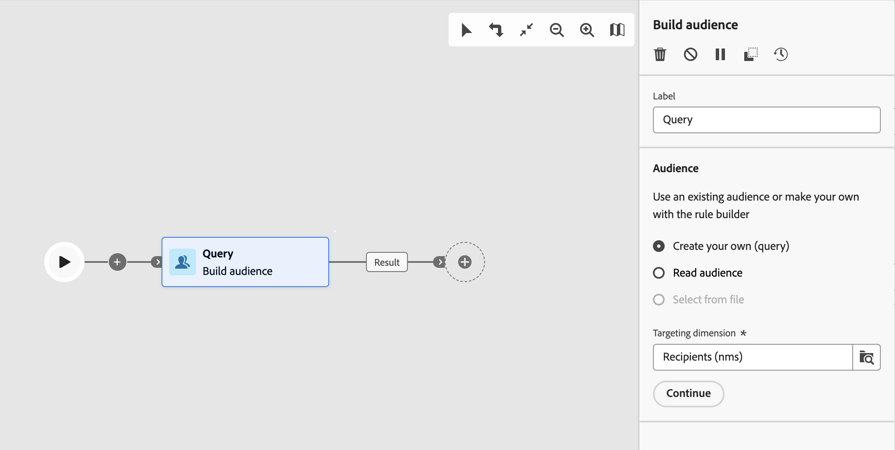

# Creazione del pubblico {#build-audience}

>[!CONTEXTUALHELP]
>id="acw_orchestration_build_audience"
>title="Attività Crea pubblico"
>abstract="L’attività **Creazione del pubblico** consente di definire il pubblico che sarà inserito nel flusso di lavoro. Quando si inviano messaggi nel contesto di un flusso di lavoro, il pubblico del messaggio non è definito nell’attività del canale, ma nell’attività **Creazione del pubblico**."

L’attività **Crea pubblico** è un’attività di **targeting**. Questa attività consente di definire il pubblico che sarà inserito nel flusso di lavoro. Quando si inviano messaggi nel contesto di un flusso di lavoro, il pubblico del messaggio non è definito nell’attività del canale, ma nell’attività **Creazione del pubblico**.

Per definire la popolazione del pubblico, puoi eseguire le seguenti operazioni:

* Seleziona un pubblico esistente, creato come elenco nella console client.
* Seleziona un pubblico di Adobe Experience Platform.
* Crea un nuovo pubblico con Query Modeler definendo e combinando criteri di filtro.

>[!NOTE]
>
>I tipi di pubblico caricati da un file non possono essere targetizzati utilizzando un’attività Genera pubblico. A tale scopo, è necessario utilizzare un&#39;attività **Load file** seguita da un&#39;attività **Reconciliation**. [Ulteriori informazioni](../../audience/about-recipients.md)

<!--
The **Build audience** activity can be placed at the beginning of the workflow or after any other activity. Any activity can be placed after the **Build audience**.
-->

## Configurare l’attività Creazione del pubblico {#build-audience-configuration}

>[!CONTEXTUALHELP]
>id="acw_orchestration_build_audience_audienceselector"
>title="Pubblico"
>abstract="Seleziona il pubblico nello stesso modo in cui utilizzi un pubblico durante la progettazione di una nuova consegna."

Per configurare l’attività **Crea pubblico**, segui questi passaggi:

1. Aggiungi un’attività **Crea pubblico**.
1. Definisci un’etichetta.
1. Definisci il tipo di pubblico: **Crea una query personalizzata** o **Leggi pubblico**.
1. Configura il pubblico seguendo i passaggi descritti nelle schede seguenti.

>[!BEGINTABS]

>[!TAB Crea il tuo (query)]

Per creare una query personalizzata, effettua le seguenti operazioni:

1. Seleziona **Crea una query personalizzata**.
1. Scegli la **Dimensione targeting**. La dimensione di targeting consente di definire la popolazione target dell’operazione, ad esempio destinatari, beneficiari del contratto, operatori o abbonati. Per impostazione predefinita, il target viene selezionato dai destinatari. [Ulteriori informazioni sulle dimensioni di targeting](../../audience/targeting-dimensions.md#targeting)
1. Scegliere la **dimensione filtro** facendo clic sull&#39;icona accanto alla dimensione di targeting. La dimensione di filtro consente di applicare filtri alla popolazione target facendo riferimento a criteri correlati senza modificare la dimensione di targeting principale. [Ulteriori informazioni sulle dimensioni di targeting](../../audience/targeting-dimensions.md#filtering)
1. Fai clic su **Continua**.
1. Utilizza il modellatore di query per definire la query, nello stesso modo in cui crei un pubblico durante la progettazione di una nuova e-mail. [Scopri come utilizzare Query Modeler](../../query/query-modeler-overview.md)
1. Utilizza la sezione **Dati di arricchimento** per migliorare i dati di destinazione con informazioni aggiuntive provenienti dal database, ad esempio riferimenti a contratti o abbonamenti a newsletter. I dati vengono memorizzati con il pubblico nella **tabella di lavoro** del flusso di lavoro e sono disponibili per le attività successive. Puoi aggiungere attributi di arricchimento singoli, collegamenti di raccolte o espressioni e accedere a opzioni avanzate. Per i passaggi dettagliati e gli esempi, vedi [Aggiungere dati di arricchimento](enrichment.md#enrichment-add).

>[!TAB Leggi pubblico]

Per selezionare un pubblico esistente, segui questi passaggi:

1. Seleziona **Leggi pubblico**.
1. Fai clic su **Continua**.
1. Seleziona il pubblico nello stesso modo in cui utilizzi un pubblico durante la progettazione di una nuova consegna. Consulta questa [sezione](../../audience/add-audience.md).

>[!ENDTABS]

## Esempi {#build-audience-examples}

Di seguito è riportato un esempio di un flusso di lavoro con due attività **Crea pubblico**. Il primo esegue il targeting di un pubblico di giocatori di poker, seguito da una consegna e-mail. Il secondo quello di un pubblico di clienti VIP, seguito da una consegna SMS.

