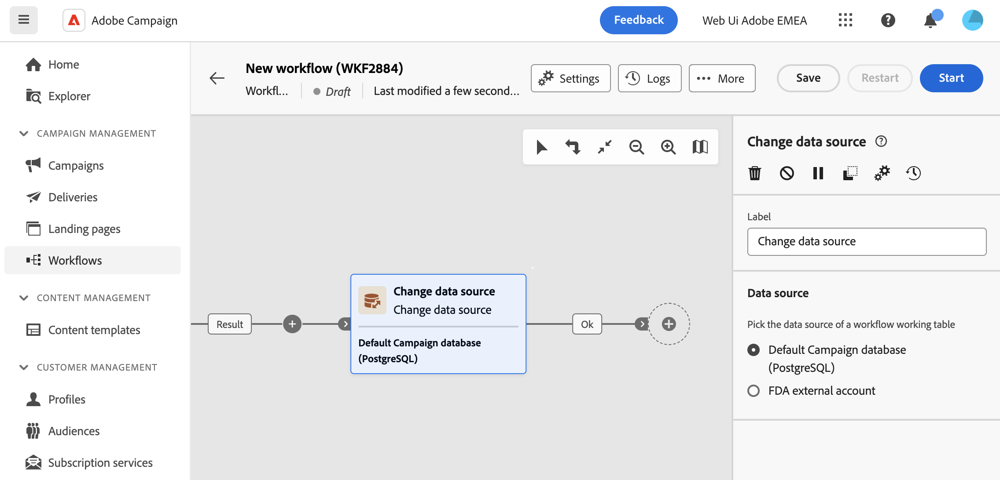

# Modificare l’origine dati {#change-data-source}

>[!CONTEXTUALHELP]
>id="acw_homepage_welcome_rn2"
>title="Modificare l’origine dati nei flussi di lavoro"
>abstract="L’attività Change data source targeting ti consente di modificare l’origine dati utilizzata dalla tabella di lavoro del flusso di lavoro. Questa attività offre maggiore flessibilità consentendo di gestire i dati tra i diversi database e migliorare le prestazioni."
>additional-url="https://experienceleague.adobe.com/en/docs/campaign-web/v8/release-notes/release-notes" text="Consulta le note sulla versione"

>[!CONTEXTUALHELP]
>id="acw_orchestration_change_data_source"
>title="Modificare l’origine dati"
>abstract="Il **Cambia origine dati** L’attività ti consente di selezionare un’origine dati diversa per la tabella di lavoro del flusso di lavoro."

Il **Cambia origine dati** l&#39;attività è un **targeting** attività. Questa attività ti consente di modificare l’origine dati utilizzata dalla tabella di lavoro del flusso di lavoro. Ciò offre maggiore flessibilità consentendo di gestire i dati tra i diversi database e migliorare le prestazioni.

Nei flussi di lavoro, i dati trasportati da un’attività all’altra tramite transizioni vengono memorizzati in un archivio temporaneo **Tavolo di lavoro**. Per impostazione predefinita, le tabelle di lavoro vengono create nello stesso database dell&#39;origine dei dati elaborati. Ad esempio, quando si esegue una query sulla tabella &quot;Profiles&quot; memorizzata nel database Cloud, viene creata una tabella di lavoro sullo stesso database Cloud.

In alcuni casi, i dati non sono disponibili nel database corrente o non sono abbastanza efficienti per eseguire operazioni unitarie. Potrebbe pertanto essere necessario forzare il flusso di lavoro a utilizzare un database diverso per eseguire tali operazioni aggiungendo un **[!UICONTROL Cambia origine dati]** attività.

Informazioni dettagliate sull’architettura di Campaign sono disponibili in [Documentazione di Campaign v8 (console client)](https://experienceleague.adobe.com/docs/campaign/campaign-v8/config/architecture/architecture.html)

<!--

Let's say you want to send to your  VIP customers a unique offer code that they can redeem on your online store. To do this, you need to:

1. Query VIP customers on the "Profiles" table located on the Cloud database,
1. Retrieve an offer code for each targeted profile through API calls,
1. Update each profile with the assigned offer code,
1. Send an email to the profiles with their offer code.

In this situation, it is recommended to execute the offer code assignment operation on the local database, which is better suited for unitary operations. To do this, you need to add a **[!UICONTROL Change data source]** activity before the operation in order to execute it on the Campaign local database.

Before executing the operation, the working table is copied to the local database so that the operation can run there. Once done, the system detects that the profiles that we want to update are on another location. The data is therefore automatically copied back to the Cloud database where the "Profiles" table is located.
-->

## Configurare l’attività Modifica origine dati {#configure}

Per configurare l’attività **Cambia dimensione** segui questi passaggi:

1. Aggiungi un **Cambia origine dati** al flusso di lavoro.

1. Definire l&#39;origine dati in cui spostare la tabella di lavoro:

   * **[!UICONTROL Database predefinito di Campaign (PostgreSQL)]**: utilizza il database locale predefinito di Campaign.
   * **[!UICONTROL Account esterno FDA]**: utilizza database cloud esterni collegati ad Adobe Campaign tramite la funzionalità Federated Data Access.

     >[!AVAILABILITY]
     >
     >La configurazione e la connessione di Campaign a sistemi esterni sono limitate agli utenti avanzati e sono disponibili solo dalla console client. [Ulteriori informazioni](https://experienceleague.adobe.com/docs/campaign/campaign-v8/connect/fda.html?lang=it){target="_blank"}

1. Configura il flusso di lavoro per eseguire le operazioni desiderate utilizzando la nuova origine dati.

<!--
## Example {#example}

The workflow belows illustrates the use case detailed earlier, i.e. sending VIP customers offer codes that they can redeem on our online store.

-->
