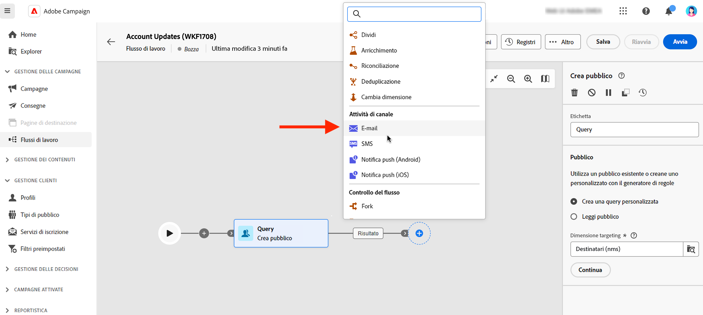

# Attività di e-mail, SMS, push e direct mail {#channel}

Adobe Campaign Web consente di automatizzare ed eseguire campagne di marketing su e-mail, SMS, direct mail e canali push. Puoi combinare le attività dei canali nell’area del flusso di lavoro per creare flussi di lavoro cross-channel che possono attivare specifiche azioni in base al comportamento della clientela.

Ad esempio, puoi creare una campagna e-mail di benvenuto che includa una serie di messaggi su diversi canali, come e-mail, SMS, push e direct mail. Puoi anche inviare un’e-mail di follow-up dopo che un cliente ha completato un acquisto o inviare un messaggio di auguri di compleanno personalizzato a un cliente tramite SMS.

Utilizzando le attività dei canali, puoi creare campagne complete e personalizzate che coinvolgono la clientela su più punti di contatto e danno impulso alle conversioni.

>[!NOTE]
>
>Puoi anche creare una consegna unica, al di fuori del contesto di un flusso di lavoro della campagna. Per ulteriori informazioni, consulta le sezioni seguenti:
>* [Creare una consegna e-mail autonoma](../../email/create-email.md)
>* [Creare una consegna SMS autonoma](../../sms/create-sms.md)
>* [Creare una consegna push autonoma](../../push/create-push.md)
>* [Creare una consegna direct mailing autonoma](../../direct-mail/create-direct-mail.md)

## Prerequisiti {#channel-activity-prereq}

Inizia a creare il flusso di lavoro con le attività pertinenti:

* Prima di inserire un’attività di canale, è necessario definire il pubblico. Il pubblico è il target principale della consegna: i profili che ricevono i messaggi. Quando si inviano messaggi nel contesto di un flusso di lavoro della campagna, il pubblico del messaggio non è definito nell’attività del canale, ma all’interno di un’attività dedicata, ad esempio:

   * A **Creare un pubblico** attività. [Ulteriori informazioni](build-audience.md).

     

   * A **Carica file** attività seguita da **Reconciliation** attività. [Ulteriori informazioni](load-file.md).

     

* Per inviare una consegna ricorrente, avvia il flusso di lavoro con una **Scheduler** attività. È inoltre possibile utilizzare un’ **Scheduler** attività per singole consegne singole per impostare la data di contatto per tale consegna. Tale data di contatto può essere impostata anche nelle impostazioni di consegna. Consulta [questa sezione](scheduler.md).

## Configurare l’attività Canale {#create-a-delivery-in-a-workflow}

>[!CONTEXTUALHELP]
>id="acw_orchestration_email"
>title="Attività e-mail"
>abstract="L’attività E-mail facilita l’invio di e-mail all’interno del flusso di lavoro, consentendo l’invio di messaggi sia una tantum che ricorrenti. Consente di automatizzare il processo di invio di e-mail a una destinazione calcolata all’interno dello stesso flusso di lavoro. Puoi combinare le attività dei canali nell’area del flusso di lavoro per creare flussi di lavoro cross-channel che possono attivare specifiche azioni in base al comportamento della clientela."

>[!CONTEXTUALHELP]
>id="acw_orchestration_sms"
>title="Attività SMS"
>abstract="L’attività SMS facilita l’invio di SMS all’interno del flusso di lavoro, consentendo l’invio di messaggi sia una tantum che ricorrenti. Consente di automatizzare il processo di invio di SMS a una destinazione calcolata all’interno dello stesso flusso di lavoro. Puoi combinare le attività dei canali nell’area del flusso di lavoro per creare flussi di lavoro cross-channel che possono attivare specifiche azioni in base al comportamento della clientela."

>[!CONTEXTUALHELP]
>id="acw_orchestration_push_ios"
>title="Attività push iOS"
>abstract="L’attività Push iOS semplifica il processo di invio delle notifiche push di iOS come parte del flusso di lavoro. Consente la consegna di messaggi sia una tantum che ricorrenti, automatizzando l’invio di notifiche push iOS a una destinazione predefinita all’interno dello stesso flusso di lavoro. Puoi combinare le attività dei canali nell’area del flusso di lavoro per creare flussi di lavoro cross-channel che possono attivare specifiche azioni in base al comportamento della clientela."

>[!CONTEXTUALHELP]
>id="acw_orchestration_push_android"
>title="Attività push Android"
>abstract="L’attività Push Android semplifica il processo di invio delle notifiche push Android come parte del flusso di lavoro. Consente la consegna di messaggi sia una tantum che ricorrenti, automatizzando l’invio di notifiche push Android a una destinazione predefinita all’interno dello stesso flusso di lavoro. Puoi combinare le attività dei canali nell’area del flusso di lavoro per creare flussi di lavoro cross-channel che possono attivare specifiche azioni in base al comportamento della clientela."

>[!CONTEXTUALHELP]
>id="acw_orchestration_directmail"
>title="Attività direct mail"
>abstract="L’attività di direct mailing facilita l’invio di direct mailing all’interno del flusso di lavoro, consentendo l’invio di messaggi sia una tantum che ricorrenti. Consente di automatizzare il processo di generazione del file di estrazione richiesto dai provider di direct mailing. Puoi combinare le attività dei canali nell’area del flusso di lavoro per creare flussi di lavoro cross-channel che possono attivare specifiche azioni in base al comportamento della clientela."

Per impostare una consegna nel contesto di un flusso di lavoro, segui i passaggi seguenti:

1. Aggiungi un’attività di canale: **[!UICONTROL E-mail]**, **[!UICONTROL SMS]**, **[!UICONTROL Notifica push (Android)]**, **[!UICONTROL Notifica push (iOS)]** o **[!UICONTROL Direct mail]**.

1. Seleziona il **Tipo di consegna**: singola o ricorrente.

   * A **Consegna singola** è una consegna in un’unica soluzione, inviata una sola volta, ad esempio un’e-mail del Black Friday.
   * A **Consegna ricorrente** viene inviato più volte in base alla frequenza di esecuzione definita in un [attività di pianificazione](scheduler.md). Ogni volta che viene eseguito il flusso di lavoro, il pubblico viene ricalcolato e la consegna al pubblico aggiornato viene inviata con il contenuto aggiornato. Ad esempio, una newsletter settimanale o un’e-mail di compleanno ricorrente.

1. Seleziona un **Modello** di consegna. I modelli sono impostazioni di consegna preconfigurate, specifiche per un canale. Per ogni canale è disponibile un modello incorporato, precompilato per impostazione predefinita. [Ulteriori informazioni](../../msg/delivery-template.md)

   

   Puoi selezionare il modello dal riquadro a sinistra della configurazione dell’attività del canale. Se il pubblico selezionato in precedenza non è compatibile con il canale, non puoi selezionare un modello. Per risolvere questo problema, aggiorna l’attività **Crea pubblico** per selezionare un pubblico con la mappatura target corretta. Ulteriori informazioni sulle mappature di destinazione in [questa sezione](../../audience/targeting-dimensions.md)

1. Fai clic su **Crea consegna**. Puoi quindi definire le impostazioni dei messaggi e il contenuto nello stesso modo in cui crei una consegna autonoma. Puoi anche testare e simulare il contenuto. [Ulteriori informazioni](../../msg/gs-messages.md)

1. Torna al flusso di lavoro. Se desideri continuare il flusso di lavoro, attiva **Generare una transizione in uscita** per aggiungere una transizione dopo l’attività del canale.

1. Fai clic su **Avvia** per avviare il flusso di lavoro.

   Per impostazione predefinita, l’avvio di un flusso di lavoro di consegna attiva la fase di preparazione dei messaggi, senza inviare immediatamente il messaggio.

1. Apri l’attività del canale per confermare l’invio da **Rivedi e invia** pulsante.

1. Nella dashboard della consegna, fai clic su **Invia**.

## Esempi {#cross-channel-workflow-sample}

Di seguito è riportato un esempio di flusso di lavoro cross-channel con una segmentazione e due consegne. Il flusso di lavoro esegue il targeting di tutti i clienti che vivono a Parigi e che sono interessati alle macchine da caffè. Tra questa popolazione, viene inviata un’e-mail ai clienti regolari e un SMS ai clienti VIP.

<!--
description, which use case you can perform (common other activities that you can link before of after the activity)

how to add and configure the activity

example of a configured activity within a workflow
The Email delivery activity allows you to configure the sending an email in a workflow. 

-->

Puoi anche creare un flusso di lavoro ricorrente per inviare un SMS personalizzato ogni primo giorno del mese alle 20 a tutta la clientela che vive a Parigi.

<!-- Scheduled emails available?

This can be a single send email and sent just once, or it can be a recurring email.
* Single send emails are standard emails, sent once.
* Recurring emails allow you to send the same email multiple times to different targets over a defined period. You can aggregate the deliveries per period in order to get reports that correspond to your needs.

When linked to a scheduler, you can define recurring emails.
Email recipients are defined upstream of the activity in the same workflow, via an Audience targeting activity.

-->

<!--The message preparation is triggered according to the workflow execution parameters. From the message dashboard, you can select whether to request or not a manual confirmation to send the message (required by default). You can start the workflow manually or place a scheduler activity in the workflow to automate execution.-->
