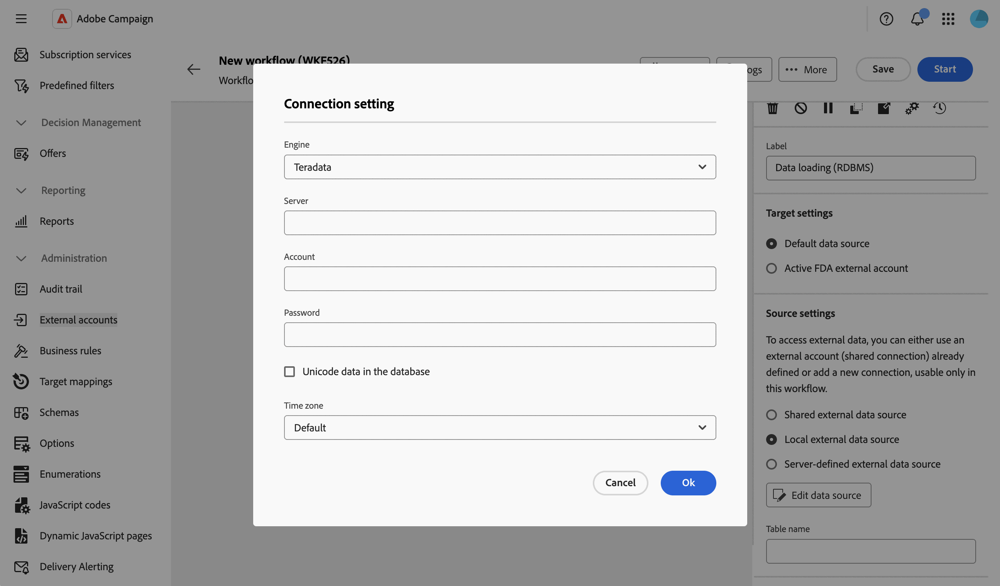
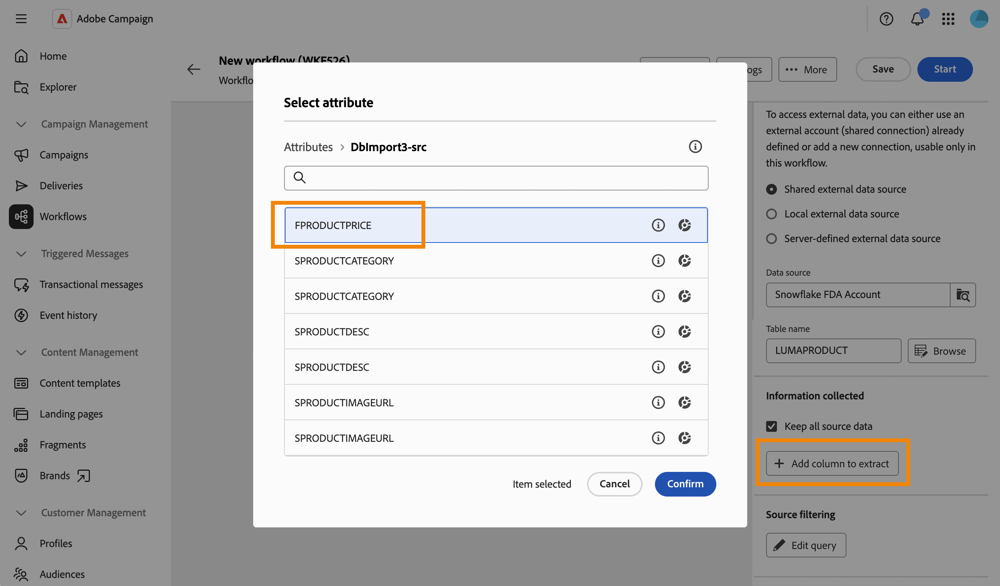

# Caricamento dati (RDBMS) {#data-loading-rdbms}

>[!CONTEXTUALHELP]
>id="acw_orchestration_data_loading_rdbms"
>title="Attività di caricamento dati (RDBMS)"
>abstract="L&#39;attività **Data loading (RDBMS)** è un&#39;attività **Data management**. Utilizza questa attività per caricare i dati direttamente da un database relazionale esterno nel flusso di lavoro. I dati estratti sono disponibili in tutto il flusso di lavoro e possono essere utilizzati per il targeting, l’arricchimento o l’ulteriore elaborazione dei dati."

L&#39;attività **Data loading (RDBMS)** è un&#39;attività **Data management**. Utilizza questa attività per caricare i dati direttamente da un database relazionale esterno nel flusso di lavoro. I dati estratti sono disponibili in tutto il flusso di lavoro e possono essere utilizzati per il targeting, l’arricchimento o l’ulteriore elaborazione dei dati.

<!--
This activity relies on the [Federated Data Access (FDA)](https://experienceleague.adobe.com/docs/campaign/campaign-v8/connect/fda.html?lang=it){target="_blank"} option, which lets Adobe Campaign process information stored in one or more external databases without changing the structure of the Adobe Campaign data.
-->

>[!NOTE]
>
>Per migliorare le prestazioni, è consigliabile utilizzare un&#39;attività **[!UICONTROL Genera pubblico]** (tipo di query) con dati esterni quando la quantità di dati da raccogliere dal database esterno lo consente.
>
>Un&#39;attività **[!UICONTROL Data loading (RDBMS)]** deve essere la prima attività di un ramo del flusso di lavoro. Non può essere aggiunto dopo un’altra attività nell’area di lavoro.

Innanzitutto, aggiungi un&#39;attività **Caricamento dati (RDBMS)** come prima attività di un ramo del flusso di lavoro.

L’attività è suddivisa in quattro sezioni:

* **[!UICONTROL Impostazioni destinazione]**: scegliere dove memorizzare i dati caricati. [Ulteriori informazioni](#target-settings)
* **[!UICONTROL Impostazioni Source]**: scegliere come accedere al database esterno contenente i dati da caricare. [Ulteriori informazioni](#source-settings)
* **[!UICONTROL Informazioni raccolte]**: definire le colonne raccolte dalla tabella esterna. [Ulteriori informazioni](#information-collected)
* **[!UICONTROL Filtro Source]**: definire un filtro per raccogliere solo una parte dei dati dalla tabella esterna. [Ulteriori informazioni](#filter)

Le ultime due sezioni vengono visualizzate solo quando sono definite le **[!UICONTROL impostazioni Source]**.

## Impostazioni target {#target-settings}

Nella sezione **[!UICONTROL Impostazioni destinazione]**, scegli la posizione in cui sono memorizzati i dati caricati. Sono disponibili due opzioni: **[!UICONTROL Origine dati predefinita]** e **[!UICONTROL Account esterno FDA attivo]**.

### Origine dati predefinita {#default-data-source}

Questa opzione è selezionata per impostazione predefinita. Ti consente di memorizzare i dati caricati nel database predefinito di Campaign. È sufficiente selezionare l’opzione.

### Account esterno FDA attivo {#active-fda-external-account}

Questa opzione consente di memorizzare i dati caricati in un account esterno.

1. Fare clic sul pulsante situato sul lato destro del campo **[!UICONTROL Origine dati]**.
1. Seleziona l’account da utilizzare.

   

## Impostazioni origine {#source-settings}

Nella sezione **[!UICONTROL Impostazioni Source]** scegliere la modalità di accesso al database esterno contenente i dati da caricare. Sono disponibili tre opzioni: **[!UICONTROL Origine dati esterna condivisa]**, **[!UICONTROL Origine dati esterna locale]** e **[!UICONTROL Origine dati esterna definita dal server]**.

### Origine dati esterna condivisa {#shared-data-source}

Questa opzione è selezionata per impostazione predefinita. Consente di utilizzare un account esterno già configurato da un amministratore Campaign. [Scopri come configurare un account esterno](../../administration/create-external-account.md).

1. Fare clic sul pulsante situato sul lato destro del campo **[!UICONTROL Origine dati]** e selezionare l&#39;account da utilizzare.

   

1. Fai clic sul pulsante **[!UICONTROL Sfoglia]** accanto al campo **[!UICONTROL Nome tabella]** e seleziona la tabella contenente i dati da caricare.

   

### Origine dati esterna locale {#local-external-data-source}

Questa opzione consente di definire una connessione a un database esterno direttamente nell’attività, solo per un utilizzo temporaneo all’interno di questo flusso di lavoro. La connessione non viene salvata come account esterno.

1. Fare clic sul pulsante **[!UICONTROL Definisci l&#39;origine dati]** e selezionare il modulo di gestione di database a cui connettersi.

   

1. Compila i campi di connessione visualizzati per il motore selezionato.

   

<!--
1. Click **[!UICONTROL Ok]** to confirm. The button is then relabeled **[!UICONTROL Edit data source]**, allowing you to open the dialog again to change the connection settings.
-->

1. Immettere il nome della tabella da caricare nel campo **[!UICONTROL Nome tabella]**.

### Origine dati esterna definita dal server {#server-defined-external-data-source}

Questa opzione consente di utilizzare una connessione al database già definita a livello di server.

1. Immettere il nome della connessione da utilizzare nel campo **[!UICONTROL Nome connessione]**.
1. Immettere il nome della tabella da caricare nel campo **[!UICONTROL Nome tabella]**.

   

## Informazioni raccolte {#information-collected}

Una volta impostata la tabella, la sezione **[!UICONTROL Informazioni raccolte]** ti consente di definire quali colonne vengono raccolte dalla tabella esterna:

1. Selezionare l&#39;opzione **[!UICONTROL Mantieni tutti i dati di origine]** (impostazione predefinita) se è necessario raccogliere ogni colonna della tabella selezionata.
1. Fai clic su **[!UICONTROL Aggiungi colonna per estrarre]** e raccogliere colonne specifiche.

   

<!--
In the **[!UICONTROL Select attribute]** dialog, scoped to the schema of the selected table, pick an attribute and confirm. [Learn how to select attributes and add them to favorites](../../get-started/attributes.md)
-->

1. Seleziona un attributo e conferma. L&#39;attributo viene aggiunto come riga con un campo **[!UICONTROL Column]** e un campo **[!UICONTROL Label]** modificabile. Utilizza l’icona Elimina per rimuoverla.

   

<!--
## Link to another table (optional) {#link}

NOT CONFIRMED — restore and verify before publishing.

Source: transcript of the ACC Web UI - Handsoff 12-06 demo (Herve Phulpin, ~20:49-21:04 mark). At the time of that demo, this part of the activity was explicitly described as unfinished: "the next part is not yet available", "this part is missing", "we are not able to add a link condition". No screenshot of a completed, working flow for this section has been captured since. Two related sub-bugs were still open against NEO-95826 at last check: NEO-97147 ("DBMS activity transition results not shown") and NEO-97148 ("local external data table name is not a picker").

If you need to reconcile the loaded data with an existing table, such as the Recipients table, add a link:

1. Click **Add link**.
1. Select the table to link to. You can browse tables from the Campaign database or from the external data source.
1. Define the join condition between the loaded table and the target table:
   * Simple join: Select the attributes to match between the two tables.
   * Advanced join: Use the query modeler to build the join condition.

[Learn more about link definitions in the Enrichment activity](enrichment.md#create-links).
-->

## Filtro Source (facoltativo) {#filter}

Per raccogliere solo una parte dei dati dalla tabella esterna, puoi definire un filtro:

1. Nella sezione **[!UICONTROL Filtro Source]**, fai clic su **[!UICONTROL Modifica query]**.

   

1. Il modellatore di query si apre su una schermata dedicata, con ambito dello schema della tabella selezionata. Utilizzala per creare una condizione sugli attributi della tabella. [Scopri come utilizzare Query Modeler](../../query/query-modeler-overview.md)

   

<!--
>[!NOTE]
>
>Some advanced options available for this activity in the client console, such as computing the table name from the inbound transition, are not yet exposed in the Campaign Web User Interface.
-->