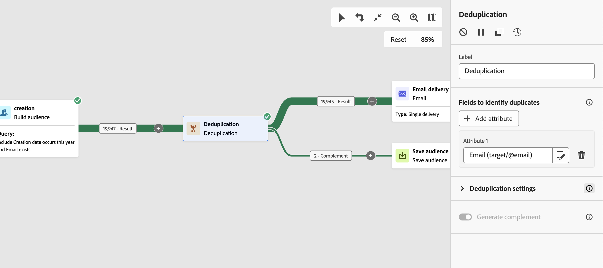

# Deduplica {#deduplication}

>[!CONTEXTUALHELP]
>id="acw_orchestration_deduplication_fields"
>title="Campi per identificare i duplicati"
>abstract="Nella sezione **Campi per identificare i duplicati**, fai clic sul pulsante **Aggiungi attributo** per specificare i campi per i quali i valori identici consentono l’identificazione dei duplicati, ad esempio: indirizzo e-mail, nome e cognome. L’ordine dei campi specifica quali elaborare per primi."

>[!CONTEXTUALHELP]
>id="acw_orchestration_deduplication"
>title="Attività Deduplica"
>abstract="L’attività **Deduplica** elimina i duplicati nei risultati delle attività in entrata. Viene utilizzata principalmente dopo le attività di targeting e prima delle attività che utilizzano dati target. Quando è disponibile più di una transizione in entrata, utilizza la sezione **Set da unire** per selezionare le transizioni da connettere all’attività."

>[!CONTEXTUALHELP]
>id="acw_orchestration_deduplication_sets"
>title="Set da unire"
>abstract="Seleziona le attività precedenti che desideri collegare come transizioni in entrata dell’attività **Deduplica**. Le attività selezionate vengono quindi collegate a **Deduplica**. Questa sezione viene visualizzata solo quando sono disponibili più transizioni in entrata da collegare all’attività."

>[!CONTEXTUALHELP]
>id="acw_orchestration_deduplication_complement"
>title="Generare un complemento"
>abstract="Puoi generare una transizione in uscita aggiuntiva con la popolazione rimanente, che è stata esclusa come duplicato. A tale scopo, attiva l’opzione **Genera complemento**."

>[!CONTEXTUALHELP]
>id="acw_orchestration_deduplication_settings"
>title="Impostazioni di deduplica"
>abstract="Per eliminare i duplicati nei dati in arrivo, definisci il metodo di deduplica nei campi seguenti. Per impostazione predefinita, viene mantenuto un solo record. Seleziona la modalità di deduplica in base a un’espressione o a un attributo. Per impostazione predefinita, il record da escludere dai duplicati viene selezionato in modo casuale."

L’attività **Deduplica** è un’attività di **targeting**. Questa attività elimina i duplicati nei risultati delle attività in entrata, ad esempio i profili duplicati nell’elenco dei destinatari. L&#39;attività **Deduplication** viene generalmente utilizzata dopo le attività di targeting e prima delle attività che utilizzano dati di destinazione.

L’attività supporta più transizioni in entrata. Quando è disponibile più di una transizione in entrata, utilizza la sezione **Set da unire** nelle proprietà dell&#39;attività per selezionare le transizioni da connettere all&#39;attività. Le transizioni selezionate sono quindi collegate alla **deduplicazione** nell&#39;area di lavoro del flusso di lavoro.

## Configurare l’attività Deduplica {#deduplication-configuration}

Per configurare l’attività **Deduplica** segui questi passaggi:

1. Aggiungi un’attività **Deduplica** al flusso di lavoro.

1. Nella sezione **Set da unire**, controlla le attività precedenti che desideri connettere come transizioni in entrata dell&#39;attività **Deduplicazione**. Le attività selezionate sono quindi collegate alla **deduplicazione** nell&#39;area di lavoro del flusso di lavoro. Utilizza il campo **Set primario** per definire la transizione in entrata di riferimento. I record degli altri set vengono confrontati con il set principale per identificare i duplicati.

   >[!NOTE]
   >
   >Questa sezione viene visualizzata solo quando sono disponibili più transizioni in entrata.

1. Nella sezione **Campi per identificare i duplicati**, fai clic sul pulsante **Aggiungi attributo** per specificare i campi per i quali i valori identici consentono l’identificazione dei duplicati, ad esempio: indirizzo e-mail, nome e cognome. L’ordine dei campi specifica quali elaborare per primi. [Scopri come selezionare gli attributi e aggiungerli ai preferiti](../../get-started/attributes.md).

1. Nella sezione **Impostazioni deduplicazione** selezionare il numero di **duplicati univoci da mantenere**. Il valore predefinito per questo campo è 1. Il valore 0 mantiene tutti i duplicati.

   Ad esempio, se i record A e B sono considerati duplicati del record Y e il record C è considerato un duplicato del record Z:

   * Se il valore del campo è 1: vengono conservati solo i record Y e Z.
   * Se il valore del campo è 0: vengono conservati tutti i record.
   * Se il valore del campo è 2: vengono conservati i record C e Z e due record da A, B e Y, per caso o a seconda del metodo di deduplicazione selezionato.

1. Seleziona il **Metodo di deduplica** da utilizzare:

   * **[!UICONTROL Selezione casuale]**: seleziona casualmente il record da escludere dai duplicati.
   * **[!UICONTROL Utilizzo di un&#39;espressione]**: mantiene i record per i quali l&#39;espressione specificata ha il valore più piccolo o più grande. Immetti l&#39;**[!UICONTROL espressione]**, quindi scegli l&#39;**[!UICONTROL ordinamento]**: **[!UICONTROL Crescente (prima i valori più piccoli)]** o **[!UICONTROL Decrescente (prima i valori più grandi)]**.
   * **[!UICONTROL Valore non vuoto]**: mantiene i record per i quali l&#39;espressione non è vuota.
   * **[!UICONTROL Seguendo un elenco di valori]**: definisce la priorità del record confrontando uno o più valori per un attributo o un&#39;espressione. Fare clic su **[!UICONTROL Aggiungi attributo]** per aggiungere un attributo. Per ogni attributo:

     * Nel campo **[!UICONTROL Attributo]**, selezionare l&#39;attributo o creare un&#39;espressione.
     * Fai clic su **[!UICONTROL Aggiungi valore]** per creare l&#39;elenco ordinato di valori da assegnare come priorità.
     * Utilizzare l&#39;elenco a discesa **[!UICONTROL Ordina per altri valori]** per scegliere come ordinare i valori non inclusi nell&#39;elenco, ad esempio **[!UICONTROL Indifferente (casuale)]**.

     Quando sono definiti più attributi, il primo viene utilizzato come criterio di ordinamento principale e i seguenti attributi agiscono come interrompenti, nell’ordine.

1. Selezionare l&#39;opzione **Genera complemento** per sfruttare il gruppo rimanente. Il complemento è costituito da tutti i duplicati. Viene quindi aggiunta una transizione aggiuntiva all’attività.

## Esempio {#deduplication-example}

Nell’esempio seguente, utilizza un’attività di deduplica per escludere i duplicati dal target prima di inviare una consegna. I profili duplicati identificati vengono aggiunti a un pubblico dedicato che può essere riutilizzato, se necessario. Scegli l’indirizzo **E-mail** per identificare i duplicati. Mantieni una voce e seleziona il metodo di deduplica **Casuale**.

