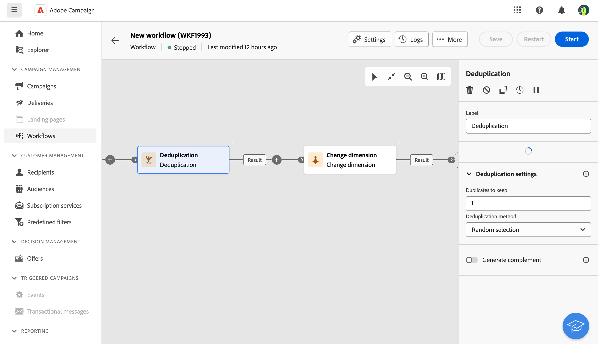

# Deduplica {#deduplication}

>[!CONTEXTUALHELP]
>id="acw_orchestration_deduplication_fields"
>title="Campi per identificare i duplicati"
>abstract="Nella sezione **Campi per identificare i duplicati** , fai clic sul pulsante **Aggiungi attributo** per specificare i campi per i quali i valori identici consentono l’identificazione dei duplicati, ad esempio: indirizzo e-mail, nome, cognome e così via. L’ordine dei campi consente di specificare quali elaborare per primi."

>[!CONTEXTUALHELP]
>id="acw_orchestration_deduplication"
>title="Attività Deduplica"
>abstract="L’attività **Deduplica** consente di eliminare i duplicati nei risultati delle attività in entrata. Viene utilizzato principalmente dopo le attività di targeting e prima delle attività che consentono l’utilizzo di dati mirati."

>[!CONTEXTUALHELP]
>id="acw_orchestration_deduplication_complement"
>title="Generare un complemento"
>abstract="Puoi generare una transizione in uscita aggiuntiva con la popolazione rimanente, che è stata esclusa come duplicato. A tale scopo, attiva l’opzione **Genera complemento**."

>[!CONTEXTUALHELP]
>id="acw_orchestration_deduplication_settings"
>title="Impostazioni di deduplica"
>abstract="Per eliminare i duplicati nei dati in arrivo, definisci il metodo di deduplica nei campi seguenti. Per impostazione predefinita, viene mantenuto un solo record. Devi anche selezionare la modalità di deduplica in base a un’espressione o a un attributo. Per impostazione predefinita, il record da escludere dai duplicati viene selezionato in modo casuale."

L’attività **Deduplica** è un’attività di **targeting**. Questa attività consente di eliminare i duplicati nei risultati delle attività in entrata, ad esempio i profili duplicati nell’elenco dei destinatari. L’attività **Deduplica** viene generalmente utilizzata dopo le attività di targeting e prima delle attività che consentono l’utilizzo di dati mirati.

## Configurare l’attività Deduplica{#deduplication-configuration}

Per configurare l’attività **Deduplica** segui questi passaggi:

1. Aggiungi un’attività **Deduplica** al flusso di lavoro.

1. Nella sezione **Campi per identificare i duplicati**, fai clic sul pulsante **Aggiungi attributo** per specificare i campi per i quali i valori identici consentono l’identificazione dei duplicati, ad esempio: indirizzo e-mail, nome, cognome e così via. L’ordine dei campi consente di specificare quali elaborare per primi.

1. In **Impostazioni di deduplicazione** , selezionare il numero di **Duplicati da mantenere**. Il valore predefinito per questo campo è 1. Il valore 0 ti consente di conservare tutti i duplicati.

   Ad esempio, se i record A e B sono considerati duplicati del record Y e il record C è considerato un duplicato del record Z:

   * Se il valore del campo è 1: vengono conservati solo i record Y e Z.
   * Se il valore del campo è 0: vengono conservati tutti i record.
   * Se il valore del campo è 2: vengono conservati i record C e Z e due record tra A, B e Y, per caso o a seconda del metodo di deduplicazione selezionato successivamente.

1. Seleziona il **Metodo di deduplica** da utilizzare:

   * **Selezione casuale**: seleziona in modo casuale il record da escludere dai duplicati.
   * **Utilizzo di un’espressione**: questo consente di conservare i record in cui il valore dell’espressione immessa corrisponde al valore minore o maggiore.
   * **In base a un elenco di valori**: consente di definire un valore di priorità per uno o più campi. Per definire i valori, fai clic su **Attributo** per selezionare un campo o creare un’espressione, quindi aggiungi i valori nella tabella appropriata. Per definire un nuovo campo, fai clic sul pulsante Aggiungi situato sopra l’elenco dei valori.

1. Se desideri sfruttare il gruppo rimanente, seleziona l’opzione **Genera complemento**. Il complemento è costituito da tutti i duplicati. Verrà quindi aggiunta all’attività un’ulteriore transizione.

## Esempio{#deduplication-example}

Nell’esempio seguente, utilizza un’attività di deduplica per escludere i duplicati dal target prima di inviare una consegna. I destinatari duplicati identificati vengono aggiunti a un pubblico dedicato che può essere riutilizzato, se necessario. Scegli l’indirizzo **E-mail** per identificare i duplicati. Mantieni una voce e seleziona il metodo di deduplica **Casuale**.

