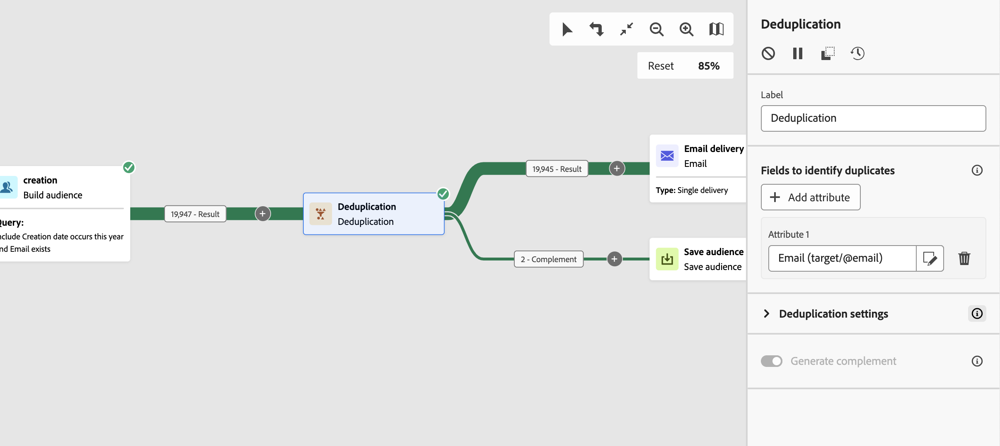

# Deduplica {#deduplication}

>[!CONTEXTUALHELP]
>id="acw_orchestration_deduplication_fields"
>title="Campi per identificare i duplicati"
>abstract="In **Campi per identificare i duplicati** , fare clic sul pulsante **Aggiungi attributo** per specificare i campi per i quali i valori identici consentono l’identificazione dei duplicati, ad esempio: indirizzo e-mail, nome, cognome e così via. L’ordine dei campi ti consente di specificare quali elaborare per primi."

>[!CONTEXTUALHELP]
>id="acw_orchestration_deduplication"
>title="Attività di deduplicazione"
>abstract="Il **Deduplicazione** attività ti consente di eliminare i duplicati nei risultati delle attività in entrata. Viene utilizzato principalmente dopo le attività di targeting e prima delle attività che consentono l’utilizzo di dati mirati."

>[!CONTEXTUALHELP]
>id="acw_orchestration_deduplication_complement"
>title="Generare un complemento"
>abstract="Puoi generare una transizione in uscita aggiuntiva con la popolazione rimanente, che è stata esclusa come duplicato. A tale scopo, attiva l’opzione **Genera complemento**"

>[!CONTEXTUALHELP]
>id="acw_orchestration_deduplication_settings"
>title="Impostazioni di deduplicazione"
>abstract="Per eliminare i duplicati nei dati in arrivo, definisci il metodo di deduplicazione nei campi seguenti. Per impostazione predefinita, viene mantenuto un solo record. Devi anche selezionare la modalità di deduplicazione in base a un’espressione o a un attributo. Per impostazione predefinita, il record da escludere dai duplicati viene selezionato in modo casuale."

Il **Deduplicazione** l&#39;attività è un **Targeting** attività. Questa attività ti consente di eliminare i duplicati nei risultati delle attività in entrata, ad esempio i profili duplicati nell’elenco dei destinatari. Il **Deduplicazione** L’attività viene generalmente utilizzata dopo le attività di targeting e prima delle attività che consentono l’utilizzo di dati mirati.

## Configurare l’attività Deduplication{#deduplication-configuration}

Per configurare il **Deduplicazione** attività:

1. Aggiungi un **Deduplicazione** al flusso di lavoro.

1. In **Campi per identificare i duplicati** , fare clic sul pulsante **Aggiungi attributo** per specificare i campi per i quali i valori identici consentono l’identificazione dei duplicati, ad esempio: indirizzo e-mail, nome, cognome e così via. L’ordine dei campi ti consente di specificare quali elaborare per primi.

1. Seleziona il numero di univoci **Duplicati da mantenere**. Il valore predefinito per questo campo è 1. Il valore 0 ti consente di conservare tutti i duplicati.

   Ad esempio, se i record A e B sono considerati duplicati del record Y e il record C è considerato un duplicato del record Z:

   * Se il valore del campo è 1: vengono conservati solo i record Y e Z.
   * Se il valore del campo è 0: vengono conservati tutti i record.
   * Se il valore del campo è 2: vengono conservati i record C e Z e due record tra A, B e Y, per caso o a seconda del metodo di deduplicazione selezionato successivamente.

1. Seleziona la **Metodo di deduplicazione** da utilizzare:

   * **Selezione casuale**: seleziona in modo casuale il record da escludere dai duplicati.
   * **Utilizzo di un’espressione**: questo ti consente di conservare i record in cui il valore dell’espressione immessa è il minore o il maggiore.
   * **Seguendo un elenco di valori**: ti consente di definire un valore di priorità per uno o più campi. Per definire i valori, fai clic su **Attributo** per selezionare un campo o creare un’espressione, aggiungi i valori nella tabella appropriata. Per definire un nuovo campo, fai clic sul pulsante Aggiungi situato sopra l’elenco dei valori.

1. Controlla la **Genera complemento** se desideri sfruttare il gruppo rimanente. Il complemento è costituito da tutti i duplicati. Verrà quindi aggiunta una transizione aggiuntiva all’attività.

## Esempio{#deduplication-example}

Nell’esempio seguente, utilizza un’attività di deduplicazione per escludere i duplicati dal target prima di inviare una consegna. I destinatari duplicati identificati vengono aggiunti a un pubblico dedicato che può essere riutilizzato, se necessario. Scegli la **E-mail** per identificare i duplicati. Mantieni 1 voce e seleziona la **Casuale** metodo di deduplicazione.

