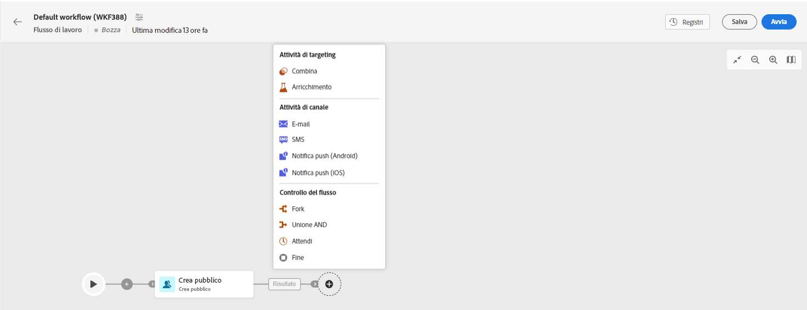

# E-mail, SMS e push {#channel}

Adobe Campaign Web consente di automatizzare ed eseguire campagne di marketing su più canali, ad esempio e-mail, SMS o push. Puoi combinare le attività dei canali nell’area di lavoro per creare flussi di lavoro cross-channel che possono attivare azioni in base al comportamento del cliente.

Ad esempio, puoi creare una campagna e-mail di benvenuto che include una serie di messaggi su diversi canali, come e-mail, SMS e push. Puoi anche inviare un’e-mail di follow-up dopo che un cliente ha completato un acquisto o inviare un messaggio di auguri di compleanno personalizzato a un cliente tramite SMS.

Utilizzando le attività di canale, puoi creare campagne complete e personalizzate che coinvolgono i clienti in più punti di contatto e favoriscono le conversioni.

Di seguito sono riportati i passaggi per aggiungere una **Canale** attività in un workflow:

1. Assicurati di aver aggiunto un **Creare un pubblico** attività. Il pubblico è il target principale della consegna: i destinatari che ricevono i messaggi. Quando si inviano messaggi nel contesto di un flusso di lavoro di una campagna, il pubblico del messaggio non è definito nell’attività del canale, ma nel **Creare un pubblico** attività. Vedi [questa sezione](build-audience.md).

   

1. Seleziona un’attività di consegna: **[!UICONTROL E-mail]**, **[!UICONTROL SMS]**, **[!UICONTROL Notifica push (Android)]** o **[!UICONTROL Notifica push (iOS)]**.

1. Seleziona un **Modello**. I modelli sono impostazioni di consegna preconfigurate e salvate per poter essere riutilizzate. [Ulteriori informazioni](../../msg/delivery-template.md)

1. Clic **Creare una consegna** e definisci il messaggio nello stesso modo in cui crei una consegna autonoma. Qui puoi anche definire le impostazioni di consegna, pianificare e simulare il contenuto. [Ulteriori informazioni](../../msg/gs-messages.md)

1. Torna al workflow e fai clic su **Inizio** per avviare il workflow.

   Per impostazione predefinita, l’avvio di un flusso di lavoro di consegna attiva la fase di preparazione dei messaggi, senza inviare immediatamente il messaggio.

1. Clic **Rivedi e invia** dall’attività del canale per confermare l’invio.

1. Dal dashboard di consegna, fai clic su **Invia**.

## Esempio

Di seguito è riportato un esempio di flusso di lavoro cross-channel con una segmentazione e due consegne. Il flusso di lavoro è destinato a tutti i clienti che vivono a Parigi e che sono interessati alle macchine da caffè. Tra questa popolazione, viene inviata un’e-mail ai clienti regolari e un SMS ai clienti VIP.

<!--
description, which use case you can perform (common other activities that you can link before of after the activity)

how to add and configure the activity

example of a configured activity within a workflow
The Email delivery activity allows you to configure the sending an email in a workflow. 

-->

<!-- Scheduled emails available?

This can be a single send email and sent just once, or it can be a recurring email.
* Single send emails are standard emails, sent once.
* Recurring emails allow you to send the same email multiple times to different targets over a defined period. You can aggregate the deliveries per period in order to get reports that correspond to your needs.

When linked to a scheduler, you can define recurring emails.
Email recipients are defined upstream of the activity in the same workflow, via an Audience targeting activity.

-->

<!--The message preparation is triggered according to the workflow execution parameters. From the message dashboard, you can select whether to request or not a manual confirmation to send the message (required by default). You can start the workflow manually or place a scheduler activity in the workflow to automate execution.-->
