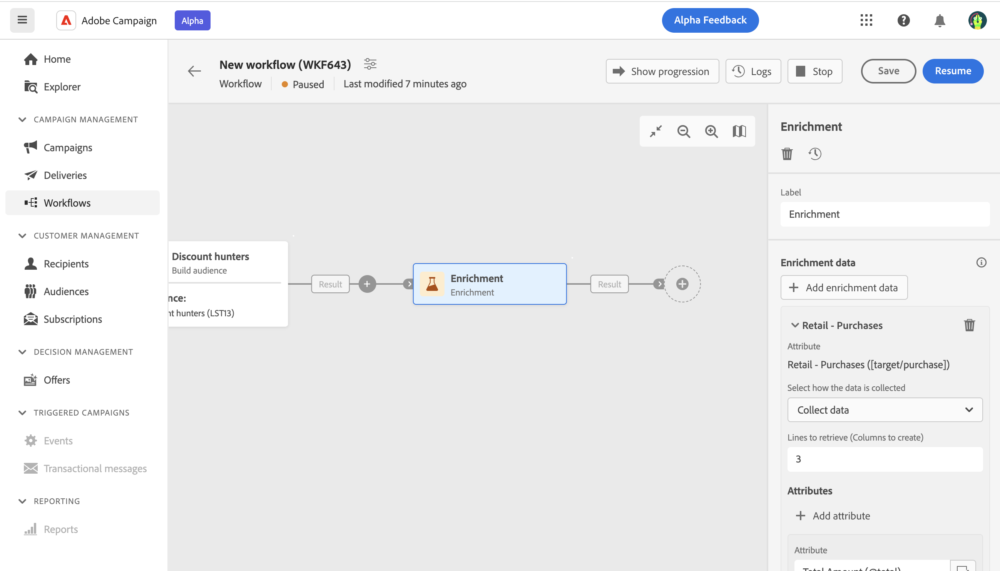

# Arricchimento {#enrichment}

>[!CONTEXTUALHELP]
>id="acw_orchestration_enrichment"
>title="Attività Arricchimento"
>abstract="L’attività di **Arricchimento** consente di migliorare i dati mirati con informazioni aggiuntive provenienti dal database. Viene comunemente utilizzata in un flusso di lavoro dopo le attività di segmentazione."

>[!CONTEXTUALHELP]
>id="acw_orchestration_enrichment_data"
>title="Attività di Arricchimento"
>abstract="Una volta aggiunti al flusso di lavoro, i dati di arricchimento possono essere utilizzati nelle attività aggiunte dopo l’attività di Arricchimento per segmentare la clientela in gruppi distinti in base ai comportamenti, preferenze e esigenze, o per creare messaggi e campagne di marketing personalizzati che hanno maggiori probabilità di risonanza nel pubblico target."

>[!CONTEXTUALHELP]
>id="acw_orchestration_enrichment_simplejoin"
>title="Definizione dei collegamenti"
>abstract="Crea un collegamento tra i dati della tabella di lavoro e il database di Adobe Campaign. Ad esempio, se carichi i dati da un file che contiene il numero di account, il paese e l’e-mail dei destinatari, ora puoi creare un collegamento alla tabella dei paesi per aggiornare queste informazioni nei rispettivi profili."

>[!CONTEXTUALHELP]
>id="acw_orchestration_enrichment_reconciliation"
>title="Riconciliazione dell’arricchimento"
>abstract="riconciliazione dell’arricchimento"

>[!CONTEXTUALHELP]
>id="acw_targetdata_personalization_enrichmentdata"
>title="Dati di arricchimento"
>abstract="Seleziona i dati da utilizzare per arricchire il flusso di lavoro. Puoi selezionare due tipi di dati di arricchimento: un attributo di arricchimento singolo dalla dimensione target oppure un collegamento raccolta, che è un collegamento con cardinalità 1-N tra le tabelle."

L’attività **Arricchimento** è un’attività di **targeting**. Consente di migliorare i dati target con informazioni aggiuntive provenienti dal database. Viene comunemente utilizzata in un flusso di lavoro dopo le attività di segmentazione.

I dati di arricchimento possono provenire:

* **Dalla stessa tabella di lavoro** definita come target nel flusso di lavoro:

  *Eseguire il targeting di un gruppo di clienti e aggiungere il campo &quot;Data di nascita&quot; alla tabella di lavoro corrente*.

* **Da un’altra tabella di lavoro**:

  *Esegui il targeting di un gruppo di clienti e aggiungere i campi “Importo” e “Tipo di prodotto” provenienti dalla tabella “Acquisto”*.

Una volta aggiunti i dati di arricchimento al flusso di lavoro, questi possono essere utilizzati nelle attività aggiunte dopo **Arricchimento** attività per segmentare i clienti in gruppi distinti in base a comportamenti, preferenze e esigenze, oppure per creare messaggi di marketing e campagne personalizzati che hanno maggiori probabilità di risuonare con il pubblico di destinazione.

Ad esempio, è possibile aggiungere alla tabella di lavoro del flusso di lavoro le informazioni relative agli acquisti dei clienti e utilizzare questi dati per personalizzare le e-mail con il loro acquisto più recente o con l’importo speso per tali acquisti.

## Aggiungere un’attività Enrichment {#enrichment-configuration}

Per configurare l’attività **Arricchimento** segui questi passaggi:

1. Aggiungi attività come **Crea pubblico** e **Combina**.
1. Aggiungi un’attività **Arricchimento**.
1. Se nel flusso di lavoro sono state configurate più transizioni, puoi utilizzare **[!UICONTROL Set primario]** per definire quale transizione deve essere utilizzata come set principale da arricchire con i dati.

## Aggiungi dati di arricchimento {#enrichment-add}

1. Clic **Aggiungere dati di arricchimento** e seleziona l’attributo da utilizzare per arricchire i dati.

   Puoi selezionare due tipi di dati di arricchimento: un singolo attributo di arricchimento dalla dimensione di destinazione o un collegamento di raccolta. Ciascuno di questi tipi è descritto negli esempi seguenti:
   * [Attributo di arricchimento singolo](#single-attribute)
   * [Collegamento raccolta](#collection-link)

   >[!NOTE]
   >
   >Il **Pulsante espressione Modifica** nella schermata di selezione degli attributi consente di creare espressioni avanzate per selezionare l’attributo. [Scopri come utilizzare l’editor di espressioni](../../query/expression-editor.md)

   

## Creare collegamenti tra tabelle {#create-links}

Il **[!UICONTROL Definizione collegamento]** consente di creare un collegamento tra i dati della tabella di lavoro e il database di Adobe Campaign. Ad esempio, se carichi i dati da un file che contiene il numero di account, il paese e l’e-mail dei destinatari, ora puoi creare un collegamento alla tabella dei paesi per aggiornare queste informazioni nei rispettivi profili.

Sono disponibili diversi tipi di collegamenti:

* **[!UICONTROL Collegamento semplice con cardinalità 1]**: ogni record del set principale può essere associato a un solo record dei dati collegati.
* **[!UICONTROL Collegamento semplice con cardinalità 0 o 1]**: ogni record del set principale può essere associato a 0 o 1 record dei dati collegati, ma non a più di uno.
* **[!UICONTROL Collegamento raccolta con cardinalità N]**: ogni record del set principale può essere associato a 0, 1 o più record (N) dei dati collegati.

Per creare un collegamento, effettua le seguenti operazioni:

1. In **[!UICONTROL Definizione collegamento]** , fare clic sul pulsante **[!UICONTROL Aggiungi collegamento]** pulsante.

   

1. In **Tipo di relazione** scegliere il tipo di collegamento che si desidera creare.

1. Identifica la destinazione a cui vuoi collegare il set principale:

   * Per collegare una tabella esistente nel database, scegliere **[!UICONTROL Schema del database]** e seleziona la tabella desiderata da **[!UICONTROL Schema di destinazione]** campo.
   * Per collegare i dati della transizione di input, scegli **Schema temporaneo** e seleziona la transizione di cui desideri utilizzare i dati.

1. Definisci i criteri di riconciliazione per far corrispondere i dati del set principale con lo schema collegato. Sono disponibili due tipi di join:

   * **Unione semplice**: seleziona un attributo specifico per far corrispondere i dati dei due schemi. Clic **Aggiungi join** e seleziona la **Source** e **Destinazione** attributi da utilizzare come criteri di riconciliazione.
   * **Unione avanzata**: crea un join utilizzando condizioni avanzate. Clic **Aggiungi join** e fai clic su **Crea condizione** per aprire Query Modeler.

Un esempio di flusso di lavoro che utilizza i collegamenti è disponibile nella sezione [Esempi](#link-example) sezione.

## Riconciliazione dei dati {#reconciliation}

>[!CONTEXTUALHELP]
>id="acw_homepage_welcome_rn3"
>title="Riconciliazione dei dati"
>abstract="L’attività di arricchimento del flusso di lavoro può ora essere utilizzata per riconciliare i dati dello schema del database di Campaign con i dati di un altro schema o con i dati provenienti da uno schema temporaneo, ad esempio i dati caricati tramite un’attività Carica file."
>additional-url="https://experienceleague.adobe.com/docs/campaign-web/v8/release-notes/release-notes.html?lang=it" text="Consulta le note sulla versione"

Il **Arricchimento** L’attività può essere utilizzata per riconciliare i dati dello schema del database Campaign con i dati di un altro schema o con i dati provenienti da uno schema temporaneo, ad esempio i dati caricati utilizzando un’attività Load file. Questo tipo di collegamento definisce una riconciliazione verso un record univoco. Adobe Campaign crea un collegamento a una tabella di destinazione aggiungendo una chiave esterna per la memorizzazione di un riferimento al record univoco.

Ad esempio, puoi utilizzare questa opzione per riconciliare il paese di un profilo, specificato in un file caricato, con uno dei paesi disponibili nella tabella dedicata del database di Campaign.

Segui i passaggi per configurare una **Arricchimento** attività con un collegamento di riconciliazione:

1. Fai clic su **Aggiungi collegamento** pulsante in **Reconciliation** sezione.
1. Identifica i dati con cui desideri creare un collegamento di riconciliazione.

   * Per creare un collegamento di riconciliazione con i dati del database di Campaign, seleziona **Schema del database** e scegli lo schema in cui è memorizzata la destinazione.
   * Per creare un collegamento di riconciliazione con i dati provenienti dalla transizione di input, seleziona **Schema temporaneo** e scegli la transizione del flusso di lavoro in cui vengono memorizzati i dati di destinazione.

1. Il **Etichetta** e **Nome** I campi vengono compilati automaticamente in base allo schema di destinazione selezionato. Se necessario, è possibile modificarne i valori.

1. In **Criteri di riconciliazione** , specificare la modalità di riconciliazione dei dati delle tabelle di origine e di destinazione:

   * **Unione semplice**: riconcilia un campo specifico della tabella di origine con un altro campo della tabella di destinazione. A questo scopo, fai clic su **Aggiungi join** e specificare **Source** e **Destinazione** campi da utilizzare per la riconciliazione.

     >[!NOTE]
     >
     >Puoi utilizzare uno o più **Unione semplice** criteri, nel qual caso devono essere tutti verificati in modo che i dati possano essere collegati tra loro.

   * **Unione avanzata**: utilizza Query Modeler per configurare i criteri di riconciliazione. A questo scopo, fai clic su **Crea condizione** quindi definisci i criteri di riconciliazione creando una regola personalizzata utilizzando le operazioni AND e OR.

L’esempio seguente mostra un flusso di lavoro configurato per creare un collegamento tra la tabella Destinatari del database di Adobe Campaign e una tabella temporanea generata da **Carica file** attività. In questo esempio, l’attività Enrichment esegue la riconciliazione di entrambe le tabelle utilizzando l’indirizzo e-mail come criterio di riconciliazione.

## Esempi {#example}

### Attributo di arricchimento singolo {#single-attribute}

In questo caso, viene semplicemente aggiunto un attributo di arricchimento singolo, ad esempio, la data di nascita. Segui questi passaggi:

1. Fai clic all’interno del campo **Attributo**.
1. Seleziona un campo semplice dalla dimensione di targeting, nel nostro esempio la data di nascita.
1. Fai clic su **Conferma**.

### Collegamento di raccolta {#collection-link}

In questo caso d’uso più complesso, selezioneremo un collegamento di raccolta che è un collegamento con cardinalità 1-N tra le tabelle. Recuperiamo i tre ultimi acquisti che sono inferiori a 100 $. A questo scopo è necessario definire:

* un attributo di arricchimento: il campo **Importo totale**
* il numero di righe da recuperare: 3
* un filtro: per escludere gli articoli superiori a 100 $
* un ordinamento: ordine decrescente sul campo **Data ordine**.

#### Aggiungere l’attributo {#add-attribute}

Qui puoi selezionare il collegamento di raccolta da utilizzare come dati di arricchimento.

1. Fai clic all’interno del campo **Attributo**.
1. Fai clic su **Visualizza gli attributi avanzati**.
1. Seleziona il campo **Importo totale** dalla tabella **Acquisti**.

#### Definire le impostazioni di raccolta{#collection-settings}

A questo punto, definisci come vengono raccolti i dati e quanti record recuperare.

1. Seleziona **Raccogli dati** nel menu a discesa **Seleziona la modalità di raccolta dei dati**.
1. Digita “3” nel campo **Righe da recuperare (colonne da creare)**.

Se, ad esempio, desideri ottenere l’importo medio degli acquisti per un cliente, seleziona **Dati aggregati** e seleziona **Media** nel menu a discesa **Funzione di aggregazione**.

#### Definire i filtri{#collection-filters}

Ora puoi definire il valore massimo per l’attributo di arricchimento. Gli elementi superiori a 100$ vengono filtrati. [Scopri come utilizzare Query Modeler](../../query/query-modeler-overview.md)

1. Fai clic su **Modifica filtri**.
1. Aggiungi i due filtri seguenti: **Importo totale** esiste E **Importo totale** è minore di 100. Il primo filtra i valori NULL, in quanto apparirebbero come il valore maggiore.
1. Fai clic su **Conferma**.

#### Definire l’ordinamento{#collection-sorting}

Ora è necessario applicare l’ordinamento per recuperare i tre acquisti **più recenti**.

1. Attiva l’opzione **Abilita ordinamento**.
1. Fai clic all’interno del campo **Attributo**.
1. Seleziona il campo **Data ordine**.
1. Fai clic su **Conferma**.
1. Seleziona **Decrescente** nel menu a discesa **Ordina**.

### Arricchimento con dati collegati {#link-example}

L’esempio seguente mostra un flusso di lavoro configurato per creare un collegamento tra due transizioni. Le prime transizioni eseguono il targeting dei dati di profilo utilizzando un **Query** mentre la seconda transizione include i dati di acquisto memorizzati in un file caricato tramite un’attività Load file.

* Il primo **Arricchimento** l’attività collega il set principale (dati provenienti dalla sezione **Query** con lo schema da **Carica file** attività. Questo ci consente di far corrispondere ogni profilo target della query con i dati di acquisto corrispondenti.

  

* Un secondo **Arricchimento** per arricchire i dati dalla tabella del flusso di lavoro con i dati di acquisto provenienti dal **Carica file** attività. Questo ci consente di utilizzare tali dati in ulteriori attività, ad esempio per personalizzare i messaggi inviati ai clienti con le informazioni sul loro acquisto.

  

