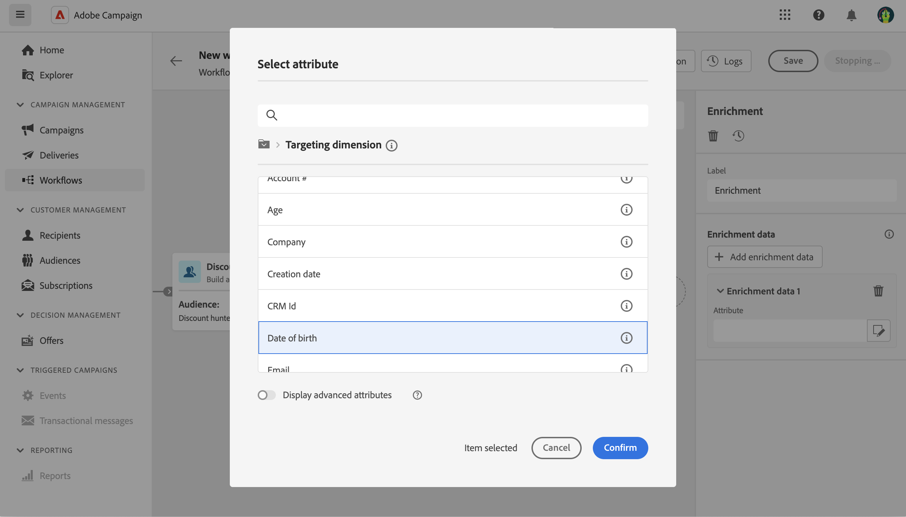

# Arricchimento {#enrichment}

>[!CONTEXTUALHELP]
>id="acw_orchestration_enrichment"
>title="Attività Arricchimento"
>abstract="Il **Arricchimento** attività ti consente di migliorare i dati di destinazione con informazioni aggiuntive dal database. Viene comunemente utilizzata in un flusso di lavoro dopo le attività di segmentazione."

>[!CONTEXTUALHELP]
>id="acw_orchestration_enrichment_data"
>title="Attività Arricchimento"
>abstract="Una volta aggiunti al flusso di lavoro, i dati di arricchimento possono essere utilizzati nelle attività aggiunte dopo l’attività di arricchimento per segmentare i clienti in gruppi distinti in base ai loro comportamenti, preferenze e esigenze, o per creare messaggi e campagne di marketing personalizzati che hanno maggiori probabilità di risonanza nel pubblico target."

>[!CONTEXTUALHELP]
>id="acw_targetdata_personalization_enrichmentdata"
>title="Dati di arricchimento"
>abstract="Seleziona i dati da utilizzare per arricchire il flusso di lavoro. Puoi selezionare due tipi di dati di arricchimento: un singolo attributo di arricchimento dalla dimensione di destinazione oppure un collegamento di raccolta, che è un collegamento con cardinalità 1-N tra le tabelle."

L’attività **Arricchimento** è un’attività di **targeting**. Consente di migliorare i dati target con informazioni aggiuntive provenienti dal database. Viene comunemente utilizzata in un flusso di lavoro dopo le attività di segmentazione.

I dati di arricchimento possono provenire:

* **Dalla stessa tabella di lavoro** definita come target nel flusso di lavoro:

  *Eseguire il targeting di un gruppo di clienti e aggiungere il campo “Data di nascita” alla tabella di lavoro corrente*

* **Da un’altra tabella di lavoro**:

  *Esegui il targeting di un gruppo di clienti e aggiungere i campi “Importo” e “Tipo di prodotto” provenienti dalla tabella “Acquisto”*.

Una volta aggiunti al flusso di lavoro, i dati di arricchimento possono essere utilizzati nelle attività aggiunte dopo l’attività **Arricchimento** per segmentare i clienti in gruppi distinti in base ai loro comportamenti, preferenze e esigenze o per creare messaggi e campagne di marketing personalizzati che hanno maggiori probabilità di risonanza nel pubblico target.

Ad esempio, è possibile aggiungere alla tabella di lavoro del flusso di lavoro le informazioni relative agli acquisti dei clienti e utilizzare questi dati per personalizzare le e-mail con il loro acquisto più recente o con l’importo speso per tali acquisti.

## Configurare l’attività Enrichment {#enrichment-configuration}

Per configurare l’attività **Arricchimento** segui questi passaggi:

1. Aggiungi attività come **Crea pubblico** e **Combina**.
1. Aggiungi un’attività **Arricchimento**.
1. Fai clic su **Aggiungi dati di arricchimento**.

È possibile selezionare due tipi di dati di arricchimento: un [attributo di arricchimento singolo](#single-attribute) dalla dimensione target, oppure un [collegamento di raccolta](#collection-link).

## Attributo di arricchimento singolo {#single-attribute}

In questo caso, viene semplicemente aggiunto un attributo di arricchimento singolo, ad esempio, la data di nascita. Segui questi passaggi:

1. Fai clic all’interno del campo **Attributo**.
1. Seleziona un campo semplice dalla dimensione di targeting, nel nostro esempio la data di nascita.
1. Fai clic su **Conferma**.

## Collegamento di raccolta {#collection-link}

In questo caso d’uso più complesso, selezioneremo un collegamento di raccolta che è un collegamento con cardinalità 1-N tra le tabelle. Recuperiamo i tre ultimi acquisti che sono inferiori a 100 $. A questo scopo è necessario definire:

* un attributo di arricchimento: il campo **Importo totale**
* il numero di righe da recuperare: 3
* un filtro: per escludere gli articoli superiori a 100 $
* un ordinamento: ordine decrescente sul campo **Data ordine**.

### Aggiungere l’attributo {#add-attribute}

Qui puoi selezionare il collegamento di raccolta da utilizzare come dati di arricchimento.

1. Fai clic all’interno del campo **Attributo**.
1. Fai clic su **Visualizza gli attributi avanzati**.
1. Seleziona il campo **Importo totale** dalla tabella **Acquisti**.

### Definire le impostazioni di raccolta{#collection-settings}

A questo punto, definisci come vengono raccolti i dati e quanti record recuperare.

1. Seleziona **Raccogli dati** nel menu a discesa **Seleziona la modalità di raccolta dei dati**.
1. Digita “3” nel campo **Righe da recuperare (colonne da creare)**.

Se, ad esempio, desideri ottenere l’importo medio degli acquisti per un cliente, seleziona **Dati aggregati** e seleziona **Media** nel menu a discesa **Funzione di aggregazione**.

### Definire i filtri{#collection-filters}

Ora puoi definire il valore massimo per l’attributo di arricchimento. In questo esmpio, vogliamo escludere gli articoli superiori a 100 $.

1. Fai clic su **Modifica filtri**.
1. Aggiungi i due filtri seguenti: **Importo totale** esiste E **Importo totale** è minore di 100. Il primo filtra i valori NULL, in quanto apparirebbero come il valore maggiore.
1. Fai clic su **Conferma**.

### Definire l’ordinamento{#collection-sorting}

Ora è necessario applicare l’ordinamento per recuperare i tre acquisti **più recenti**.

1. Attiva l’opzione **Abilita ordinamento**.
1. Fai clic all’interno del campo **Attributo**.
1. Seleziona il campo **Data ordine**.
1. Fai clic su **Conferma**.
1. Seleziona **Decrescente** nel menu a discesa **Ordina**.

<!--

Add other fields
use it in delivery

cardinality between the tables (1-N)
1. select attribute to use as enrichment data

    display advanced fields option
    i button

    note: attributes from the target dimension

1. Select how the data is collected
1. number of records to retrieve if want to retrieve a collection of multiple records
1. Apply filters and build rule

    select an existing filter
    save the filter for reuse
    view results of the filter visually or in code view

1. sort records using an attribute

leverage enrichment data in campaign

where we can use the enrichment data: personalize email, other use cases?

## Example

-->