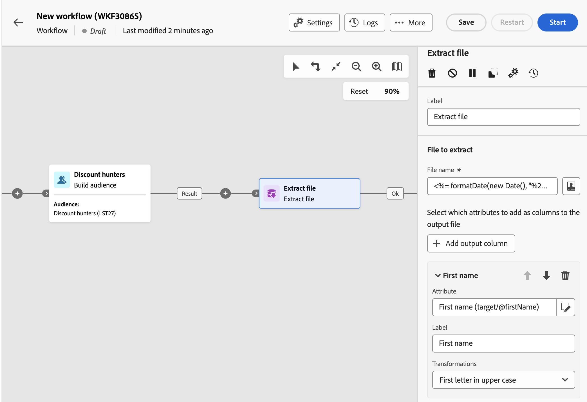
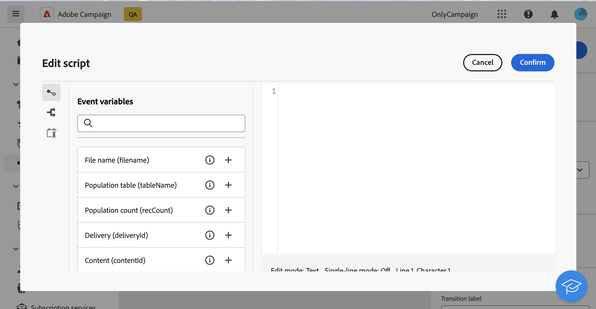

# Estrai file {#extract-file}

>[!CONTEXTUALHELP]
>id="acw_orchestration_extractfile"
>title="Estrai file"
>abstract="L’attività **Estrai file** ti consente di esportare dati da Adobe Campaign come file esterno. I dati possono quindi essere esportati in una posizione server come SFTP, archiviazione cloud o server di Campaign utilizzando un’attività di trasferimento file."

L&#39;attività **Extract file** è un&#39;attività **Data management**. Utilizza questa attività per esportare dati da Adobe Campaign sotto forma di un file esterno. I dati possono quindi essere esportati in una posizione server come SFTP, archiviazione cloud o server di Campaign utilizzando un’attività di trasferimento file.

Per configurare l&#39;attività **Estrai file**, aggiungi un&#39;attività **Estrai file** nel flusso di lavoro, quindi segui la procedura riportata di seguito.

## Configurare il file da estrarre {#extract-configuration}

>[!CONTEXTUALHELP]
>id="acw_orchestration_extractfile_file"
>title="File da estrarre"
>abstract="Seleziona il file da estrarre."

La sezione **[!UICONTROL File da estrarre]** consente di configurare le proprietà del file e i dati da includere.

1. Nel campo **[!UICONTROL Nome file]** immettere il nome desiderato per il file da estrarre.

   Puoi personalizzare il nome del file utilizzando variabili evento, condizioni e funzioni data/ora. A questo scopo, fai clic sull&#39;icona **[!UICONTROL Apri finestra di dialogo per personalizzazione]** per aprire l&#39;editor espressioni. [Scopri come utilizzare le variabili evento e l&#39;editor di espressioni](../event-variables.md)

1. Specificare le colonne da presentare nel file estratto. Per farlo, segui questi passaggi:

   1. Fare clic sulla **[!UICONTROL colonna di output Aggiungi]**.
   1. Scegli l’attributo da visualizzare nella colonna, quindi conferma. Gli attributi disponibili dipendono dalla dimensione di targeting del flusso di lavoro. [Scopri come selezionare gli attributi e aggiungerli ai preferiti](../../get-started/attributes.md)
   1. Una volta aggiunta la colonna, è possibile modificarne **[!UICONTROL Label]** e modificare l&#39;**[!UICONTROL Attribute]** associato.
   1. Per applicare una trasformazione ai valori della colonna, selezionarla dall&#39;elenco a discesa. Ad esempio, è possibile convertire tutti i valori nella colonna selezionata in maiuscolo.

1. Ripeti questi passaggi per aggiungere tutte le colonne necessarie nel file di estrazione. Per modificare la posizione di una colonna, utilizzare le frecce su e giù.

1. Per rimuovere tutte le righe duplicate dal file estratto, attivare l&#39;opzione **[!UICONTROL Rimuovi righe duplicate(Elenco)]**.

1. Per ordinare il file estratto in base a un attributo, attivare l&#39;opzione **[!UICONTROL Abilita ordinamento]**, quindi scegliere l&#39;attributo in base al quale si desidera ordinare il file, insieme al metodo di ordinamento desiderato (crescente o decrescente). Puoi ordinare in base a qualsiasi attributo della dimensione di targeting corrente, indipendentemente dal fatto che sia stato aggiunto o meno alle colonne del file.

## Configurare il formato del file estratto {#file}

>[!CONTEXTUALHELP]
>id="acw_orchestration_extractfile_destinationformat"
>title="Formato di destinazione"
>abstract="Seleziona le diverse opzioni per configurare la formattazione del file estratto."

La sezione relativa al formato **[!UICONTROL Destinazione]** consente di configurare la formattazione del file estratto.

1. Scegli il **[!UICONTROL formato di output]** per il file estratto: **Testo**, **Testo con colonne fisse**, **CSV (Excel)** o **XML**.

1. Fare clic sul pulsante **[!UICONTROL Formato estrazione]** per accedere alle opzioni specifiche relative al formato selezionato. Per ulteriori informazioni, espandi la sezione seguente.

+++ Opzioni di formato di estrazione disponibili

   * **[!UICONTROL Utilizza la prima riga come intestazione di colonna]** (formato Testo/CSV (Excel)): attiva questa opzione per utilizzare la prima colonna come intestazione.
   * **[!UICONTROL Separatore colonne]** (formato testo): specificare il carattere da utilizzare come separatore colonne nel file di output.
   * **[!UICONTROL Delimitatore stringa]** (formato testo): specificare come delimitare le stringhe nel file di output.
   * **[!UICONTROL Fine riga]** (formato testo): specificare come delimitare la fine delle righe nel file di output.
   * **[!UICONTROL Codifica]**: scegliere la codifica del file di output.
   * **[!UICONTROL Formato data e separatori]**: specificare la formattazione delle date nel file di output.
   * **[!UICONTROL Formato numero]**: specificare la formattazione dei numeri nel file di output.
   * **[!UICONTROL Esporta etichette invece dei valori interni delle enumerazioni]**: attiva questa opzione se esporti valori di enumerazione e desideri recuperare le etichette delle colonne, che sono più facili da comprendere, piuttosto che gli ID interni.

+++

   

## Aggiungere una fase di post-elaborazione {#script}

>[!CONTEXTUALHELP]
>id="acw_orchestration_extractfile_postprocessing"
>title="Post-elaborazione"
>abstract="Definisci un passaggio di post-elaborazione da applicare, ad esempio compressione o crittografia."

Lo script di modifica **[!UICONTROL Esporta]** consente di applicare una fase di elaborazione da eseguire durante l&#39;estrazione dei dati, ad esempio la compressione o la crittografia. A tale scopo, fare clic sul pulsante **[!UICONTROL Modifica script]**.

Viene aperto l’editor espressioni, che consente di immettere il comando da applicare al file. Il riquadro a sinistra fornisce sintassi predefinite che è possibile utilizzare per creare lo script. [Scopri come utilizzare le variabili evento e l&#39;editor di espressioni](../event-variables.md)

## Opzioni aggiuntive {#additiona-options}

>[!CONTEXTUALHELP]
>id="acw_orchestration_extractfile_outbound"
>title="Transizione in uscita"
>abstract="Attiva/disattiva l’opzione **Genera una transizione in uscita** per aggiungere una transizione in uscita dopo l’attività corrente."

>[!CONTEXTUALHELP]
>id="acw_orchestration_extractfile_error"
>title="Errori del processo"
>abstract="Attiva/disattiva l’opzione **Errori di processo** per aggiungere una transizione in uscita contenente errori."

Una volta configurata l’estrazione del file di output, sono disponibili opzioni aggiuntive relative alle transizioni e alla gestione degli errori:

* **[!UICONTROL Genera transizione in uscita]**: attiva questa opzione per aggiungere una transizione in uscita e configurarne l&#39;etichetta.
* **[!UICONTROL Non generare un file se la transizione in entrata è vuota]**: attivare questa opzione per ignorare l&#39;estrazione del file se la transizione in entrata non contiene dati.
* **[!UICONTROL Errore di processo]**: attivare questa opzione per aggiungere una transizione in uscita se si verifica un errore durante l&#39;estrazione del file.

## Esempio {#example}

Nell&#39;esempio seguente viene utilizzata un&#39;attività **Genera pubblico** seguita da un&#39;attività **Estrai file** per estrarre tutti i profili target in un file CSV.

* Il campo **[!UICONTROL Nome file]** è configurato per includere la data dell&#39;estrazione.

  

* Vengono aggiunte colonne per visualizzare nel database il nome e il cognome dei profili, gli ID cliente e le date di creazione.

  
