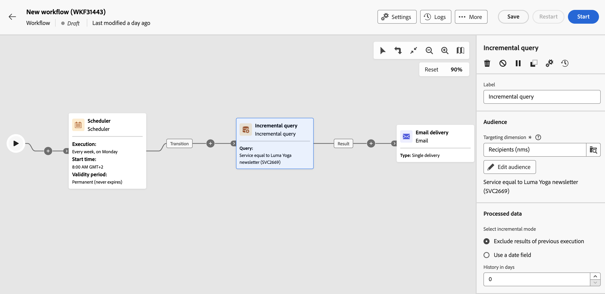

# Query incrementale {#incremental-query}

>[!CONTEXTUALHELP]
>id="acw_orchestration_incrementalquery"
>title="Query incrementale"
>abstract="La **Query incrementale** è un’attività di **Targeting** che consente di eseguire query sul database utilizzando il query modeler. Ogni volta che questa attività viene eseguita, i risultati delle esecuzioni precedenti sono esclusi. Ciò ti consente di eseguire il targeting solo per nuovi elementi."

>[!CONTEXTUALHELP]
>id="acw_orchestration_incrementalquery_history"
>title="Cronologia della query incrementale"
>abstract="Cronologia della query incrementale"

>[!CONTEXTUALHELP]
>id="acw_orchestration_incrementalquery_processeddata"
>title="Dati elaborati della query incrementale"
>abstract="Dati elaborati della query incrementale"

L&#39;attività **Incremental query** è un&#39;attività **Targeting** che consente di eseguire query sul database su base pianificata. Ogni volta che questa attività viene eseguita, i risultati delle esecuzioni precedenti sono esclusi. Questo consente di eseguire il targeting solo dei nuovi elementi.

>[!NOTE]
>
>Mentre la console del client Campaign integra l&#39;attività **[!UICONTROL Incremental query]** con una pianificazione integrata, l&#39;interfaccia utente di Campaign Web tratta questa funzionalità separatamente. Per pianificare le esecuzioni di query incrementali, aggiungere un&#39;attività **[!UICONTROL Scheduler]** nel flusso di lavoro prima dell&#39;attività **[!UICONTROL Incremental query]**. [Scopri come configurare un&#39;attività Scheduler](scheduler.md)

L&#39;attività **[!UICONTROL Incremental query]** può essere utilizzata per vari scopi:

* Segmentazione di singoli utenti per definire il target di un messaggio, un pubblico o altre operazioni.
* Esportazione dei dati. Ad esempio, utilizza l’attività per esportare regolarmente i nuovi registri in file. Questa funzione è utile per la generazione di rapporti esterni o per gli strumenti di business intelligence.

La popolazione già interessata dalle esecuzioni precedenti viene memorizzata nel flusso di lavoro. Due flussi di lavoro avviati dallo stesso modello non condividono lo stesso registro. Tuttavia, due attività basate sulla stessa query incrementale nello stesso flusso di lavoro utilizzano lo stesso registro.

Se il risultato di una query incrementale è uguale a 0 durante una delle esecuzioni, il flusso di lavoro viene sospeso fino alla successiva esecuzione programmata della query. Le transizioni e le attività che seguono la query incrementale non vengono elaborate prima dell’esecuzione successiva.

## Configurare l’attività Incremental query {#incremental-query-configuration}

Segui questi passaggi per configurare l&#39;attività **Incremental query**:

[Descrizione: schermata che mostra l&#39;interfaccia di configurazione per l&#39;attività Incremental query in Adobe Campaign.]\

1. Aggiungi un&#39;attività **Incremental query** al flusso di lavoro.

1. Nella sezione **[!UICONTROL Pubblico]**, scegli la **dimensione di targeting**, quindi fai clic su **[!UICONTROL Continua]**.

   La dimensione di targeting definisce la popolazione target dell’operazione, ad esempio destinatari, beneficiari del contratto, operatori o abbonati. Per impostazione predefinita, il target viene selezionato dai destinatari. [Ulteriori informazioni sulle dimensioni di targeting](../../audience/about-recipients.md#targeting-dimensions)

1. Utilizza il modellatore di query per definire la query, in modo analogo a come si crea un pubblico durante la progettazione di una nuova e-mail. [Scopri come utilizzare Query Modeler](../../query/query-modeler-overview.md)

1. Nella sezione **[!UICONTROL Dati elaborati]**, selezionare la modalità incrementale da utilizzare:

   * **[!UICONTROL Escludi risultati dell&#39;esecuzione precedente]**: ogni volta che l&#39;attività viene eseguita, i risultati delle esecuzioni precedenti vengono esclusi.

     I record già oggetto di targeting nelle esecuzioni precedenti possono essere registrati per un numero massimo di giorni dal giorno in cui sono stati oggetto di targeting. Utilizza il campo **[!UICONTROL Cronologia in giorni]** per impostare questo valore. Se questo valore è zero, i destinatari non vengono mai eliminati dal registro.

   * **[!UICONTROL Utilizza un campo data]**: questa opzione esclude i risultati delle esecuzioni precedenti in base a un campo data specifico. Scegli il campo data desiderato dall’elenco di attributi disponibili per la dimensione di targeting selezionata. Nelle esecuzioni successive del flusso di lavoro, verranno recuperati solo i dati modificati o creati dopo l’ultima data di esecuzione.

     Dopo la prima esecuzione del flusso di lavoro, diventa disponibile il campo **[!UICONTROL Data ultima esecuzione]**. Specifica la data utilizzata per l’esecuzione successiva e viene aggiornata automaticamente ogni volta che il flusso di lavoro viene eseguito. Puoi modificare manualmente questo valore in base alle tue esigenze.

   >[!NOTE]
   >
   >La modalità **[!UICONTROL Utilizza un campo data]** offre maggiore flessibilità a seconda del campo data selezionato. Ad esempio, se il campo specificato corrisponde a una data di modifica, la modalità campo data recupera i dati aggiornati di recente. L&#39;altra modalità esclude le registrazioni già incluse in un&#39;esecuzione precedente, anche se sono state modificate dopo l&#39;ultima esecuzione del flusso di lavoro.

## Esempio {#incremental-query-example}

L’esempio seguente mostra la configurazione di un flusso di lavoro che filtra i profili nel database di Adobe Campaign ogni settimana. Si rivolge alle persone abbonate al servizio newsletter Yoga e invia loro un’e-mail di benvenuto.

Il flusso di lavoro include i seguenti elementi:

* Un&#39;attività **[!UICONTROL Scheduler]**, che esegue il flusso di lavoro ogni lunedì alle 6.
* Un&#39;attività **[!UICONTROL Incremental query]**, che esegue il targeting per tutti i sottoscrittori correnti durante la prima esecuzione e solo per i nuovi sottoscrittori durante le esecuzioni successive.
* Un&#39;attività **[!UICONTROL Email delivery]**.