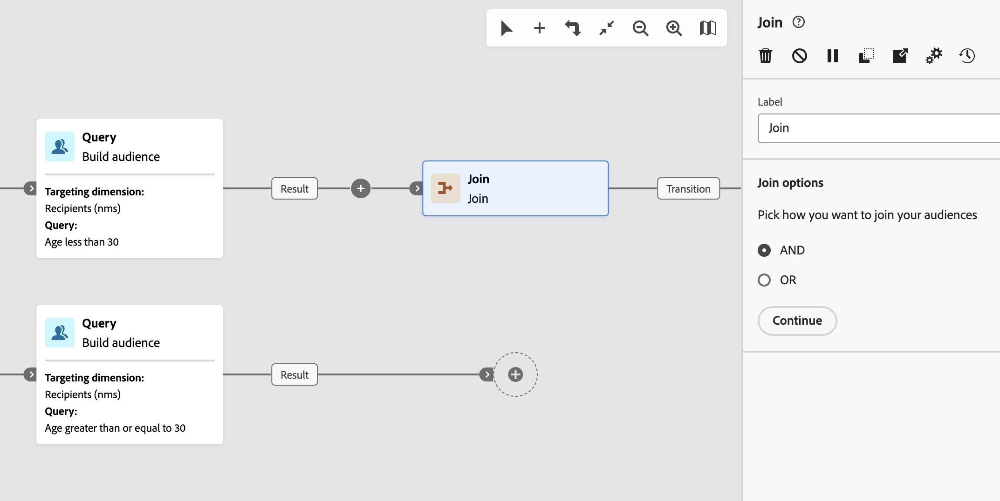
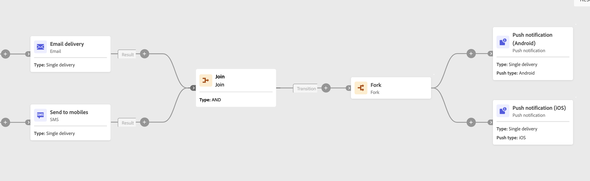

# Elemento “join” {#join}

>[!CONTEXTUALHELP]
>id="acw_homepage_welcome_rn5"
>title="Più rami del flusso di lavoro e attività di unione"
>abstract="Il supporto per più rami è ora disponibile. Invece di utilizzare un’attività Fork, puoi fare clic su Aggiungi ramo nella barra degli strumenti. Anche l’attività AND-join è stata migliorata. Ora è un’attività di unione generica che ti consente di scegliere tra le opzioni di unione AND e OR."
>additional-url="https://experienceleague.adobe.com/docs/campaign-web/v8/release-notes/release-notes.html?lang=it" text="Consulta le note sulla versione"

>[!CONTEXTUALHELP]
>id="acw_orchestration_and-join"
>title="Attività AND-join"
>abstract="L’attività **And-join** consente di sincronizzare più rami di esecuzione di un flusso di lavoro. Viene attivata al termine di tutte le attività precedenti. Questo garantisce che determinate attività vengano completate prima di continuare a eseguire il flusso di lavoro."

>[!CONTEXTUALHELP]
>id="acw_orchestration_join"
>title="Attività di unione"
>abstract="L’attività **Unione** consente di unire più transizioni in entrata. Scegli se continuare quando tutte le transizioni in entrata sono complete (AND) o quando una qualsiasi transizione in entrata è completa (OR)."

L&#39;attività **Partecipa** è un&#39;attività **Controllo flusso**. Sincronizza più rami di esecuzione di un flusso di lavoro.
Puoi scegliere come valutare le transizioni in entrata:

* **AND**: continua solo dopo l&#39;attivazione di tutte le transizioni in entrata selezionate.
* **OR**: continua non appena viene attivata una transizione in entrata selezionata.

Quando **AND** è selezionato, questa attività attiva la relativa transizione in uscita solo dopo l&#39;attivazione di tutte le transizioni in entrata. In altre parole, si attiva una volta completate tutte le attività precedenti. In questo modo, determinate attività vengono completate prima di continuare a eseguire il flusso di lavoro.

Quando è selezionato **OR**, l&#39;esecuzione continua non appena viene attivata una delle transizioni in entrata selezionate. Non attende tutti i rami.

## Configurare l’attività Unione {#join-configuration}

>[!CONTEXTUALHELP]
>id="acw_orchestration_and-join_merging"
>title="Opzioni di unione"
>abstract="Seleziona le attività che vuoi unire. Nel menu a discesa **Set primario**, scegli la popolazione di transizione in entrata da mantenere."

Segui questi passaggi per configurare l&#39;attività **Partecipa**:

1. Aggiungi più attività, ad esempio attività canale, per formare almeno due rami di esecuzione diversi. Puoi utilizzare un **Fork** o aggiungere un ramo separato utilizzando il pulsante **Aggiungi ramo** (+) della barra degli strumenti. Consulta [Orchestrare le attività](../orchestrate-activities.md#toolbar).

   

1. Aggiungi un&#39;attività **Partecipa** a uno qualsiasi dei rami.

   

1. Nelle opzioni di unione, scegli **AND** o **OR** e fai clic su **Continua**.
1. Nella sezione **Opzioni di unione**, seleziona tutte le attività precedenti a cui desideri partecipare.
1. Nell&#39;elenco a discesa **Set primario**, scegliere il gruppo di transizione in entrata da mantenere. La transizione in uscita può contenere solo una delle popolazioni di transizione in entrata.

   >[!NOTE]
   >
   >Il campo **Set primario** è disponibile solo per l&#39;opzione di unione **AND**.

   

## Esempio {#join-example}

L’esempio seguente mostra due rami del flusso di lavoro con consegna e-mail e SMS. L&#39;attività **Join**, impostata su **AND**, viene attivata quando entrambe le transizioni in entrata sono abilitate. Le notifiche push vengono inviate solo dopo il completamento di entrambe le consegne. Se imposti l&#39;opzione di unione su **OR**, i messaggi push vengono inviati non appena viene completata la prima attività di consegna in entrata.

{zoomable="yes"}