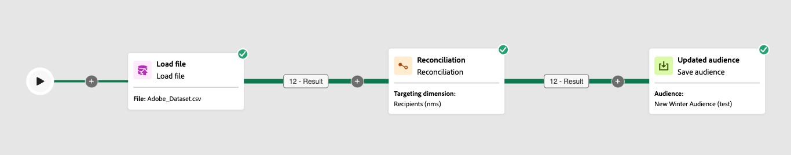

# Riconciliazione {#reconciliation}

>[!CONTEXTUALHELP]
>id="acw_orchestration_reconciliation"
>title="Attività di riconciliazione"
>abstract="Il **Reconciliation** l&#39;attività è un **Targeting** attività che ti consente di collegare dati non identificati a dati di Campaign esistenti. Ad esempio, il **Reconciliation** l’attività può essere inserita dopo un **Carica pubblico** attività per importare dati non standard nel database. In questo caso, il **Reconciliation** attività ti consente di definire il collegamento tra i dati nel database di Adobe Campaign e i dati nella tabella esterna."


>[!CONTEXTUALHELP]
>id="acw_orchestration_reconciliation_field"
>title="Campo di selezione riconciliazione"
>abstract="Campo di selezione riconciliazione"


>[!CONTEXTUALHELP]
>id="acw_orchestration_reconciliation_condition"
>title="Condizione di creazione riconciliazione"
>abstract="Condizione di creazione riconciliazione"

>[!CONTEXTUALHELP]
>id="acw_orchestration_reconciliation_complement"
>title="Complemento generato da riconciliazione"
>abstract="Complemento generato da riconciliazione"


Il **Reconciliation** l&#39;attività è un **Targeting** attività che ti consente di collegare dati non identificati a risorse esistenti. Ad esempio, il **Reconciliation** l’attività può essere inserita dopo un **Carica pubblico** attività per importare dati non standard nel database. In questo caso, il **Reconciliation** attività consente di definire il collegamento tra i dati nel database di Adobe Campaign e i dati nella tabella di lavoro.


## Best practice {#reconciliation-best-practices}

Mentre il **Arricchimento** attività ti consente di definire i dati aggiuntivi da elaborare nel flusso di lavoro (puoi utilizzare un’ **Arricchimento** attività (per combinare dati provenienti da più set o per creare collegamenti a una risorsa temporanea), **Reconciliation** L’attività ti consente di collegare dati non identificati a risorse esistenti.

>[!NOTE]
>L&#39;operazione Reconciliation implica che i dati delle dimensioni collegate siano già presenti nel database.  Ad esempio, se importi un file di acquisti che mostra quale prodotto è stato acquistato in un determinato momento da uno specifico cliente, ecc., il prodotto e il cliente devono già esistere nel database.
>

## Configurare l’attività Reconciliation {#reconciliation-configuration}


>[!CONTEXTUALHELP]
>id="acw_orchestration_reconciliation_targeting"
>title="Dimensione targeting"
>abstract="Seleziona la nuova dimensione di targeting. Una dimensione ti consente di definire la popolazione target: destinatari, abbonati all’app, operatori, abbonati, ecc. Per impostazione predefinita, è selezionata la dimensione di targeting corrente."

>[!CONTEXTUALHELP]
>id="acw_orchestration_reconciliation_rules"
>title="Regole di riconciliazione"
>abstract="Seleziona i campi di riconciliazione da utilizzare per la deduplicazione. Puoi utilizzare uno o più criteri di riconciliazione."

>[!CONTEXTUALHELP]
>id="acw_orchestration_reconciliation_targeting_selection"
>title="Selezionare una dimensione targeting"
>abstract="Seleziona la dimensione di targeting per i dati in entrata con cui eseguire la riconciliazione."
>additional-url="https://experienceleague.adobe.com/docs/campaign-web/v8/audiences/about-recipients.html?lang=en#targeting-dimensions" text="Dimensioni di targeting"

>[!CONTEXTUALHELP]
>id="acw_orchestration_keep_unreconciled_data"
>title="Mantieni dati non riconciliati"
>abstract="Per impostazione predefinita, i dati non riconciliati vengono conservati nella transizione in uscita e sono disponibili nella tabella di lavoro per utilizzi futuri. Per rimuovere i dati non riconciliati, disattivare **Mantieni dati non riconciliati** opzione."


>[!CONTEXTUALHELP]
>id="acw_orchestration_reconciliation_attribute"
>title="Attributo Reconciliation"
>abstract="Selezionare l&#39;attributo da utilizzare per riconciliare i dati e fare clic su Conferma."

Per configurare il **Reconciliation** attività:

1. Trascina una **Reconciliation** attività nel flusso di lavoro. Questa attività deve essere aggiunta dopo una transizione contenente un gruppo la cui dimensione di targeting non proviene direttamente da Adobe Campaign.

1. Seleziona la nuova dimensione di targeting. Una dimensione ti consente di definire la popolazione target: destinatari, abbonati all’app, operatori, abbonati, ecc. Ulteriori informazioni sulle dimensioni di targeting in [questa pagina](../../audience/about-recipients.md#targeting-dimensions).

1. Seleziona i campi di riconciliazione da utilizzare per la deduplicazione. Puoi utilizzare uno o più criteri di riconciliazione.

   1. Per utilizzare gli attributi per riconciliare i dati, selezionare **Attributi semplici** opzione. Il **Sorgente** campo elenca i campi disponibili nella transizione di input, che devono essere riconciliati. Il **Destinazione** corrisponde ai campi della dimensione di targeting selezionata. I dati vengono riconciliati quando l’origine e la destinazione sono uguali. Ad esempio, seleziona la **E-mail** per deduplicare i profili in base al loro indirizzo e-mail.

      Per aggiungere un altro criterio di riconciliazione, fai clic su **Aggiungi regola** pulsante. Se sono specificate più condizioni di unione, è necessario verificarle TUTTE in modo che i dati possano essere collegati tra loro.

      

   1. Per utilizzare altri attributi per riconciliare i dati, selezionare **Condizioni di riconciliazione avanzate** opzione. Puoi quindi creare una condizione di riconciliazione personalizzata utilizzando Query Modeler. Scopri come utilizzare Query Modeler in [questa sezione](../../query/query-modeler-overview.md).

1. È possibile filtrare i dati da riconciliare utilizzando **Crea filtro** pulsante. Questo consente di creare una condizione personalizzata utilizzando [query modeler](../../query/query-modeler-overview.md).

Per impostazione predefinita, i dati non riconciliati vengono conservati nella transizione in uscita e sono disponibili nella tabella di lavoro per utilizzi futuri. Per rimuovere i dati non riconciliati, disattivare **Mantieni dati non riconciliati** opzione.

## Esempio {#reconciliation-example}

L’esempio seguente illustra un flusso di lavoro che crea un pubblico di profili direttamente da un file importato contenente nuovi clienti. È costituito dalle seguenti attività:

Il flusso di lavoro è progettato come segue:




Viene generato con le seguenti attività:

* L’attività [Load file](load-file.md) carica un file contenente i dati di profili estratti da uno strumento esterno.

  Ad esempio:

  ```
  lastname;firstname;email;birthdate;
  JACKMAN;Megan;megan.jackman@testmail.com;07/08/1975;
  PHILLIPS;Edward;phillips@testmail.com;09/03/1986;
  WEAVER;Justin;justin_w@testmail.com;11/15/1990;
  MARTIN;Babe;babeth_martin@testmail.net;11/25/1964;
  REESE;Richard;rreese@testmail.com;02/08/1987;
  ```

* A **Reconciliation** attività che identifica i dati in arrivo come profili, utilizzando **email** e **Data di nascita** come criteri di riconciliazione.

  

* A [Salva pubblico](save-audience.md) per creare un nuovo pubblico in base a questi aggiornamenti. È inoltre possibile sostituire il **Salva pubblico** attività di un **Fine** attività se non è necessario creare o aggiornare un pubblico specifico. I profili dei destinatari vengono aggiornati in ogni caso quando esegui il flusso di lavoro.


## Compatibilità {#reconciliation-compat}

Il **Reconciliation** L&#39;attività non esiste nella console Client. Tutti **Arricchimenti** Le attività create nella console client con le opzioni di riconciliazione abilitate vengono visualizzate come **Reconciliation** attività nell’interfaccia utente di Campaign Web.
