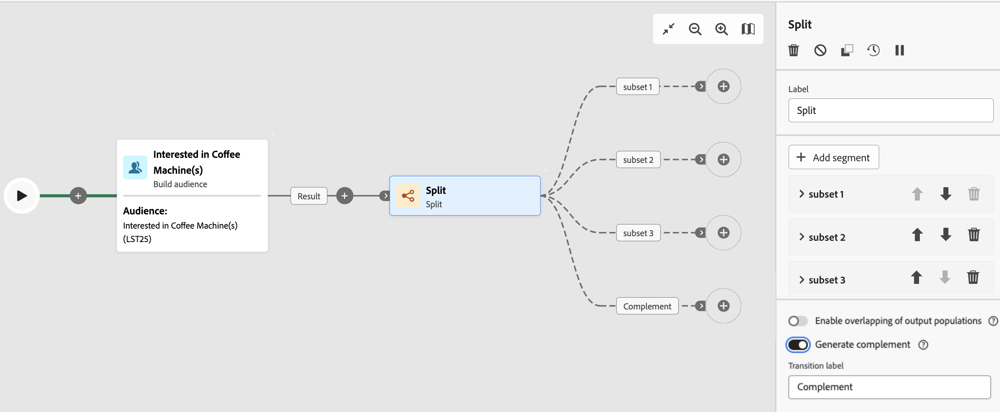

# Divisione {#split}

Il **Dividi** l&#39;attività è un **Targeting** attività che consente di segmentare le popolazioni in ingresso in più sottoinsiemi in base a criteri di selezione diversi, ad esempio regole di filtro o dimensioni della popolazione.

## Configurazione {#general}

Per configurare il **Dividi** attività:

1. Aggiungi un **Dividi** al flusso di lavoro.

1. Il riquadro di configurazione dell’attività si apre con un sottoinsieme predefinito. Fai clic su **Aggiungi segmento** per aggiungere tutti i sottoinsiemi desiderati per segmentare la popolazione in ingresso.

   

   >[!IMPORTANT]
   >
   >Quando viene eseguita l’attività Split, la popolazione viene segmentata tra i diversi sottoinsiemi nell’ordine in cui vengono aggiunti all’attività. Ad esempio, se il primo sottoinsieme recupera il 70% della popolazione iniziale, il sottoinsieme aggiunto successivo applicherà i propri criteri di selezione solo al restante 30% e così via.
   >
   > Prima di configurare i sottoinsiemi, accertati di averli aggiunti nell’ordine corretto, in quanto non è possibile modificarne la posizione.

1. Una volta aggiunti i sottoinsiemi, l’attività mostra tante transizioni di output quanti sono i sottoinsiemi. Si consiglia vivamente di modificare l’etichetta di ciascun sottoinsieme per identificarlo facilmente nell’area di lavoro del flusso di lavoro.

1. Configura in che modo ogni sottoinsieme deve filtrare la popolazione in ingresso. Per farlo, esegui questi passaggi:

   1. Aprite il sottoinsieme per visualizzarne le proprietà.

   1. Per applicare una condizione di filtro al sottoinsieme, fare clic su **[!UICONTROL Crea filtro]** e configura la regola di filtro desiderata. Ad esempio, includi i profili della popolazione in ingresso il cui indirizzo e-mail esiste nel database.

   1. Per limitare il numero di profili selezionati dal sottoinsieme, attiva **[!UICONTROL Abilita limite]** e specificare il numero o le percentuali della popolazione da includere.

      >[!NOTE]
      >
      >Quando imposti un limite di popolazione per un sottoinsieme, puoi classificare i profili selezionati in base a un attributo di profilo specifico, in ordine crescente o decrescente. Per eseguire questa operazione, attiva **[!UICONTROL Abilita ordinamento]** opzione. Ad esempio, puoi limitare un sottoinsieme in modo da includere solo i primi 50 profili con l’importo di acquisto più alto.

   

1. Dopo aver configurato tutti i sottoinsiemi, puoi selezionare la popolazione rimanente che non corrisponde a nessuno dei sottoinsiemi e includerli in un’ulteriore transizione in uscita. Per eseguire questa operazione, attiva **[!UICONTROL Genera complemento]** opzione.

   

L’attività è ora configurata. All’esecuzione del flusso di lavoro, la popolazione verrà segmentata in diversi sottoinsiemi, nell’ordine in cui sono stati aggiunti all’attività.

## Esempio

Nell&#39;esempio seguente, il **[!UICONTROL Dividi]** L’attività viene utilizzata per segmentare un pubblico in sottoinsiemi distinti in base al canale di comunicazione che vogliamo utilizzare:

* **Sottoinsieme 1 &quot;push&quot;**: questo sottoinsieme comprende tutti i profili che hanno installato la nostra app mobile.
* **Sottoinsieme 2 &quot;sms&quot;**: utenti di telefoni cellulari: per la popolazione rimanente che non rientrava nel sottoinsieme 1, il sottoinsieme 2 applica una regola di filtro per selezionare i profili con i telefoni cellulari nel database.
* **Transizione del complemento**: questa transizione acquisisce tutti i profili rimanenti che non corrispondono al sottoinsieme 1 o al sottoinsieme 2. In particolare, include i profili che non hanno installato l’app mobile e non dispongono di un telefono cellulare, ad esempio gli utenti che non hanno installato l’app mobile o non dispongono di un numero di cellulare registrato.

